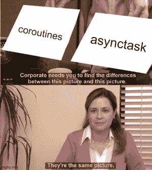
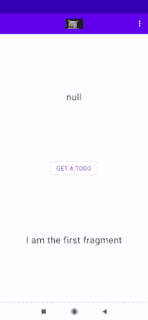

# 状态流、共享流和秘密总线🚌

> 原文：<https://levelup.gitconnected.com/stateflow-sharedflow-and-the-secret-bus-ba9978ad8453>

Kotlin Coroutines 1.4 来了，这是另一个打发无聊的机会。

## 状态流

假设我们有一个片段对经典的 [JsonPlaceHolder](https://jsonplaceholder.typicode.com/) API 中的 *todo* 任务感兴趣。

由于我们正在使用[流](https://kotlinlang.org/docs/reference/coroutines/flow.html)，我们需要启动一个协程来收集它。

一个小按钮将告诉 *viewmodel* 获取一个 *todo，*更新流并让我们收集更新，以便它可以显示在屏幕上。

viewmodel 本身将归活动所有，而不是片段，以便稍后运行实验。

视图模型:

*   通知`value = null`。这是最初的更新，将给予第一次收集这个流量的人。
*   其余的都是相当标准的东西。去存储库请求一个 *todo* ，然后用最新的值更新`*todoStateFlow*` 。
*   收集流的片段将获得更新并显示在屏幕上。
*   旋转将再次运行`collect`方法，并接收最后一个已知值。(或者你可以说，最后一个已知的状态😅)

有人可能会说，有了 StateFlow，LiveData 就没什么用了。但话说回来，这种类型的短语每隔一个周末就能听到，所以谁知道呢。

回到手头的任务:

delectus aut em？💭

## 共享流

片段(几乎)保持不变，但是视图模型现在已经改变:

*   `replay = 0`表示一旦从流中收集到更新，就再也看不到了(例如旋转设备时)。
*   将`replay`更改为 1 会将它转换为 StateFlow，因为最后一个已知的值将被发送给任何开始收集的人。进一步增加这个数字也将增加任何“新”集合分别获得的更新的数量。

任何使用 MVVM 超过 5 分钟的人都需要发出一个动作，这个动作不会在旋转中重复。于是[single live data](https://github.com/android/architecture-samples/blob/dev-todo-mvvm-live/todoapp/app/src/main/java/com/example/android/architecture/blueprints/todoapp/SingleLiveEvent.java)/[single live event](https://proandroiddev.com/singleliveevent-to-help-you-work-with-livedata-and-events-5ac519989c70)的“黑客”就诞生了。

带有 0 replay 的 shared flow 似乎可以解决这个问题，但也带来了一个问题:

如果集合在将值发布到共享流时不是活动的，该值将永远不会被片段收集。看来我们将不得不满足于再等一会儿。

## 同一共享流上的多个集合

当两个独立的片段在同一个 SharedFlow 变量上运行一个集合时会发生什么？

`replay = 0`

我从来没有在尝试之前阅读过文档(就像任何专业键盘用户一样)，所以我不知道会发生什么，但这是一个很好的惊喜！两个片段都获得更新，如果它们旋转，将永远不会再次获得更新。

老校车鉴赏家会注意到这看起来像是经典 [EventBus](https://github.com/greenrobot/EventBus) / [Otto](https://square.github.io/otto/) 的 Kotlin-y 替代品，如果你觉得你已经受够了它们的话。

在 r/mAndroidDev 上花太多时间会对人产生奇怪的影响

## 好了

虽然这个简单的测试很有趣，但我还没有在同一时间用更多的收集器测试过。

如果你**做了**尝试，然后给我发消息/发表评论，告诉我你的发现。另外，如果你喜欢这些迷因，为什么不用这个小按钮呢？

该项目的完整源代码可以在[这里](https://github.com/CostaFot/flow)找到。

以后再说。