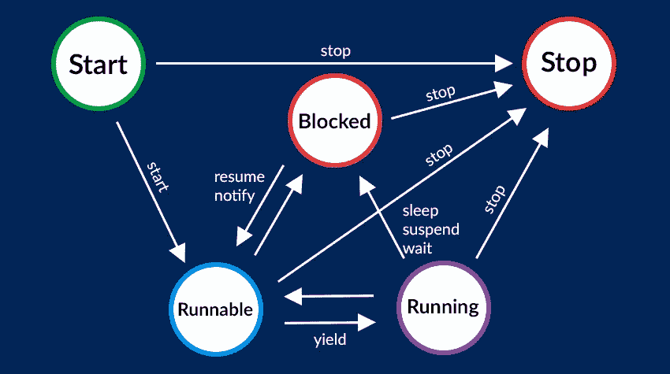
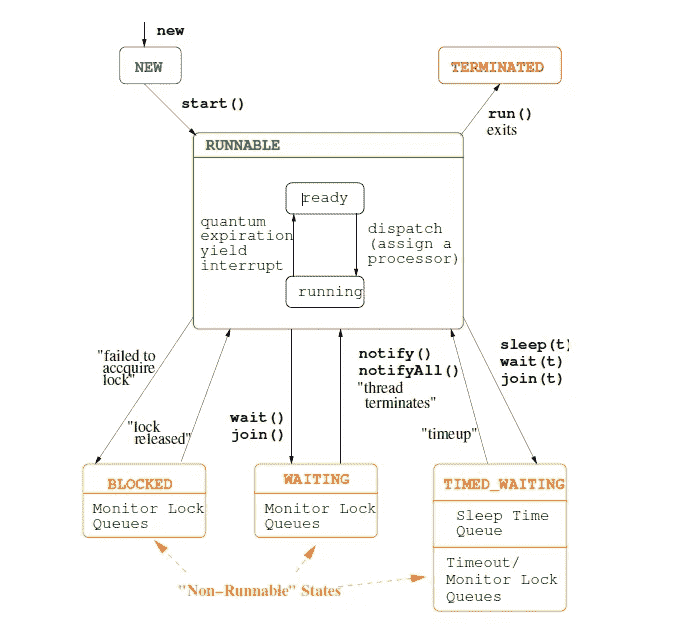

# Java 中线程的状态

> 原文：<https://levelup.gitconnected.com/states-of-thread-in-java-6f7bc1c628b9>

## "设计一个线程安全的类要比以后为了线程安全而改造它容易得多。"布瑞恩·戈茨

codeGym 的线程状态

在并发编程中，Java 线程扮演着重要的角色。一个 java 线程在任何时候都应该处于下列状态中的任何一点。一个线程在任何时候都只能处于下列状态之一。

线程生命周期

在我们深入讨论线程状态之前，先了解一下我之前的博客 [**中的并发编程基础知识。**](/world-of-concurrent-be30b5a269c1)

## 1.新的

当一个新线程被创建时，它将处于新状态，而线程还没有开始运行。当线程处于新状态时，它的代码还没有运行，还没有开始执行。

示例:创建了一个新线程，但没有启动，所以让它像这样，

线程对象为空，资源不可用于该线程。如果用户调用 start()以外的任何方法，将会出现 IllegalThreadStateExecption 错误。

## 2.可追捕的

准备运行的线程被移入可运行状态。

在这种状态下，线程可能正在运行，或者随时准备运行。线程调度器负责给出运行线程的时间。在大多数操作系统中，每个线程都有少量的处理器时间。当这种情况发生时，所有准备运行的线程，等待 CPU 和当前正在运行的线程都处于可运行状态。

## 3.堵塞的

当一个可运行线程试图执行一个在给定时间内无法完成的任务时，它可以转换到阻塞状态。它应该暂时等待，直到任务完成。

例如，当一个线程正在等待 I/O 完成时，它就处于阻塞状态。线程调度器负责重新激活和调度一个阻塞/等待的线程。处于这种状态的线程不能继续执行，直到它被转移到 runnable 状态。处于这些状态的任何线程都不会消耗任何 CPU 周期。

## 4.等待

快速线程正在等待线程

当一个线程在等待另一个线程时处于等待状态。当这个条件被满足时，调度器被通知，(当 **notify ()** 或 **notifyAll()** 方法被调用时)，等待线程被转移到可运行状态。

如果当前运行的线程被转移到阻塞/等待状态，线程调度器将调度另一个处于可运行状态的线程运行。确定运行哪个线程是线程调度器的责任。

## 5.等待时间

线程处于可运行状态，然后调用方法 **sleep(t)** 、 **wait(t)** 或 **join(t)** ，以持续时间作为参数，线程进入时间等待状态。线程处于这种状态，直到超时结束或收到通知。例如，当一个线程调用 sleep 或条件等待时，它将进入定时等待状态。一旦时间到了，线程将回到可运行状态。

## 6.结束的

由于下列原因之一，线程终止。

线程正常存在。当线程的代码完全由程序执行时，就会发生这种情况。

当线程发生异常错误事件时，如分段错误或未处理的异常。

# 线程调度。

当我们谈论 java 线程和线程状态时，我们不应该忘记线程调度。

线程调度用于调度线程间的**优先级**。当线程启动时，它继承的优先级为 **MAX_PRIORITY= 10** 和 **MIN_PRIORITY = 1** 。

正常优先级为 5 ( **正常优先级=5** )。

根据线程调度规则，它总是将其访问权给予高优先级线程。如果在那种情况下，如果当前有低优先级线程运行，就会进入线程等待状态。

如果线程具有相同的优先级，那么它将按照进程选择的循环方法运行。

在给定的场景中，racer[0]和 racer[1]设置为优先级 7，racer[3]设置为优先级 3。

因此，在这种情况下，racer[0]和 racer[1]将作为第一个线程运行，因为它在处于可运行状态的线程中具有最高的优先级。

至于循环法，如果 racer[0]选择先运行，其他人将在其让步后等待，racer[1]将开始执行。它们将一直运行，直到它们的进程终止，并且在具有最低优先级的 racer[3]线程运行之后，没有任何中断地执行它的进程。

希望您对 Java 线程状态和调度有了清晰的理解。

*快乐编码！！！*