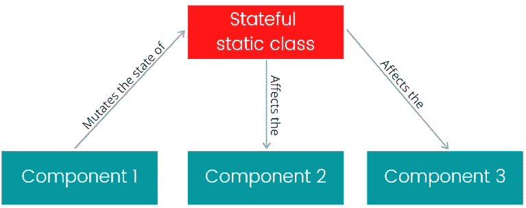

# 静态类和方法——它们很糟糕吗？

> 原文：<https://levelup.gitconnected.com/static-classes-and-methods-are-they-terrible-c9c611a921b3>

## 从设计角度探索 C#静态类和方法。


阿诺德·弗朗西斯卡在 [Unsplash](https://unsplash.com?utm_source=medium&utm_medium=referral) 上拍摄的照片

静态类和方法是有争议的编程工具之一。

*   静态类和方法是糟糕的设计和编码实践吗？
*   使用静态类会使单元测试变得复杂吗？
*   什么时候静态方法是唯一可行的选择？
*   一个类什么时候应该是静态的，什么时候应该是非静态的？

我们将解决这个问题和其他问题。

# 静态类和状态突变

使用静态类，耦合应用程序的多个部分变得非常容易。

当应用程序的不同部分使用的静态类没有状态并且总是返回确定的结果时，这没有什么错。

下面是一个静态类`Math`的例子:

```
public static class Math
{
   public static double Sum(double x, double y)
   {
       return x + y;
   } 
}
```

这个类是无状态的，它的输出总是可预测的。`Math`类可以直接用于应用程序的许多部分，没有副作用的风险。

然而，当一个静态类有状态时，事情变得复杂得多。

> 有状态静态类与全局变量相同。



在应用程序的一部分中更改静态类的状态会影响依赖于该状态的应用程序的其他部分的行为。这被称为副作用，会显著降低应用程序的可维护性。因此，静态类应该**设计成无状态**以避免副作用。

# 静态类和紧密耦合

静态类依赖总是编译时依赖。换句话说，静态依赖与使用它的类紧密耦合。

```
public class Calculator
{
   public int CalculateValue()
   {
       **//Math dependency is tightly coupled to Calculator object**
       var max = **Math**.Max(1, 2); 

       ...
   }
}
```

使用紧耦合，不可能实现多态行为，因为没有办法在运行时用静态类 B 替换静态类 A。

紧密耦合不一定是开发人员应该不惜一切代价避免的坏事。每个现有的类。NET 应用程序与许多静态类和方法紧密耦合，这里仅举几个常见的例子:

*   `string.IsNullOrEmpty(value);`
*   `TimeSpan.FromSeconds(value);`
*   `Math.Sqrt(value);`

然而，开发人员通常不会试图以这样的方式将这些类型从它们的类中分离出来:

```
public class Service
{
   private readonly IString _string;
   private readonly ITimeSpan _timeSpan;
   private readonly IMath _math; public Test(IString string, ITimeSpan timeSpan, IMath math)
   {
      _string = string;
      _timeSpan = timeSpan;
      _math = math;
   } //...
}
```

出于单元测试或其他目的，开发人员不关心从`string`、`TimeSpan`、`Math`等依赖关系中抽象出他们的代码的主要原因之一是因为它们是稳定的。

下面是**稳定依赖**的主要特征:

*   稳定依赖是无状态的。
*   稳定的依赖总是产生确定性的结果(包含[纯函数](https://en.wikipedia.org/wiki/Pure_function))。
*   开发者不需要为另一个改变稳定依赖的实现。
*   稳定依赖关系的新版本与旧版本向后兼容。

与稳定依赖相比，还有**易变依赖**，以下是它们的主要特征:

*   易变依赖项的行为可能依赖于外部世界，如文件系统、数据库、外部服务。
*   易变依赖可能返回不确定的结果(`DateTime.Now`是易变依赖的一个简单例子，这就是为什么开发人员通过包装类从代码中抽象出它)。
*   将来可以用新的实现替换易变的依赖关系。
*   易变的依赖关系会改变状态。

> 开发人员在考虑创建一个静态类时应该回答的主要问题是，它将包含稳定行为还是不稳定行为。

易变依赖应该设计成非静态类，并使用接口注入构造函数。

稳定依赖项可以被设计成静态类，因为不需要用其他实现来替换它们，也不需要从稳定依赖项中单独测试应用程序逻辑。

# 静态依赖是隐式依赖

通常，除了非常简单的类之外，所有的类都需要依赖。这些依赖项可以是非静态的或静态的类。

非静态依赖的实例通常被注入到类构造函数中。这样的依赖被称为**显式**。

```
public class DocumentBuilder 
{
    private IFileParser _fileParser; public DocumentBuilder(IFileParser fileParser) **//Explicit dep.**
    {
        _fileParser = fileParser;
    }
}
```

在分析和维护类时，显式依赖对于开发人员来说非常方便。为了理解一个类使用了什么依赖关系，开发人员只需要看看这个类的构造函数。

但是，静态类没有实例，所以没有办法将静态类注入构造函数。静态依赖总是隐式的。

```
public class DocumentBuilder 
{
    public DocumentBuilder() 
    {
    } public Document Build()
    {
        var file = FileParser.Parse(); **//Implicit dep.** //...
    }
}
```

为了理解一个类使用什么样的静态依赖，开发人员需要查看该类的整个实现。

你可能认为显式的非静态依赖总是比静态隐式依赖好，但事实上它取决于。

对于开发人员来说，隐式使用静态依赖比将非静态依赖注入构造函数更容易。不需要在依赖注入容器中设置静态依赖，也不需要在单元测试期间模仿静态依赖(这是稳定的)。

## **使静态依赖显式化**

对于总是试图避免隐式依赖的开发人员来说，有几种方法可以实现这个目标。

第一种也是最明显的方法是将静态类转换为非静态类，并将它的一个实例注入构造函数中。如果开发人员能够完全控制定义静态类的源代码，这种解决方案将会奏效。

第二种解决方案适用于开发人员需要利用单独库中的静态类，而源代码不能被修改的情况。解决方案是在静态类上创建一个非静态包装器/代理。

除了将静态依赖转换为非静态依赖，开发人员还从第三方库代码中抽象出应用程序代码，这允许在不大量重构应用程序的情况下更改第三方库。

# 对象实例化的构造函数与静态工厂方法

构造函数是有特殊用途的函数，即创建对象。

为了实例化一个类，开发人员通常调用它的公共构造函数。

构造函数和常规函数的区别之一是，开发人员不能随心所欲地命名构造函数。构造函数的名称必须与定义它的类的名称相匹配。当有多个重载构造函数从不同的参数集实例化一个类时，这种细微差别会使代码变得复杂。

在这种情况下，任何想要创建对象的人都需要阅读构造函数体，可能还有类实现的其余部分，以选择调用哪个构造函数重载。

还有一个例子，重载的构造函数根本不能使用，客户端需要另一个选项。

假设开发人员正在设计一个时间跨度结构，他们想让客户能够在几秒钟、几分钟或几小时内实例化一个对象。

```
public struct TimeSpan
{
    public TimeSpan(double seconds)
    { } public TimeSpan(double minutes)
    { }
}
```

由于相同的构造函数签名，这样的代码甚至无法编译。

上述两个问题都可以通过将公共构造函数私有并公开公共静态方法来很好地解决，客户端可以使用这些方法来获取该类的实例。

`ProposalStatus`类的实例现在只能通过调用静态方法`Accepted`或`Rejected`来实例化。方法名清楚地声明了客户端代码实例的用途。在这里，静态工厂方法是比公共重载构造函数更好的选择。

# 静态类和面向对象

与非静态类相比，静态类有几个限制:

*   静态类不能从另一个类继承。
*   静态类不能是另一个静态或非静态类的基类。
*   静态类不支持虚方法。
*   静态类不能实现接口。

所有这些限制使得静态类在需要多态行为的地方不可用。

# 结论

使用静态类和方法没有问题。它只是一个工具，像其他任何工具一样，可以被滥用。

如果您知道如何在代码库中正确应用静态类和方法，您将从中受益。如果您对声明一个静态类还没有信心，您总是可以选择只使用非静态类。

在静态类更好的地方使用非静态类，几乎总是会使代码更麻烦。然而，过多地使用静态类会影响应用程序的可维护性。

## 我的其他文章:

[](/how-to-fix-bugs-and-not-introduce-new-ones-9f35e625673a) [## 如何在不破坏应用程序的情况下修复 Bug

### 更改源代码时更自信的步骤。

levelup.gitconnected.com](/how-to-fix-bugs-and-not-introduce-new-ones-9f35e625673a) [](https://medium.datadriveninvestor.com/estimation-hell-or-what-can-developers-do-better-with-their-estimates-614f9e71f43d) [## 评估地狱，或者开发人员如何利用他们的评估做得更好？

### 估计过程很难，但没那么难。

medium.datadriveninvestor.com](https://medium.datadriveninvestor.com/estimation-hell-or-what-can-developers-do-better-with-their-estimates-614f9e71f43d) [](/7-outstanding-practical-tips-with-examples-for-oop-software-developers-44f0d11b23df) [## 7 面向对象编程和设计实用技巧(附例子)

### 改进软件应用程序设计的实践。

levelup.gitconnected.com](/7-outstanding-practical-tips-with-examples-for-oop-software-developers-44f0d11b23df)