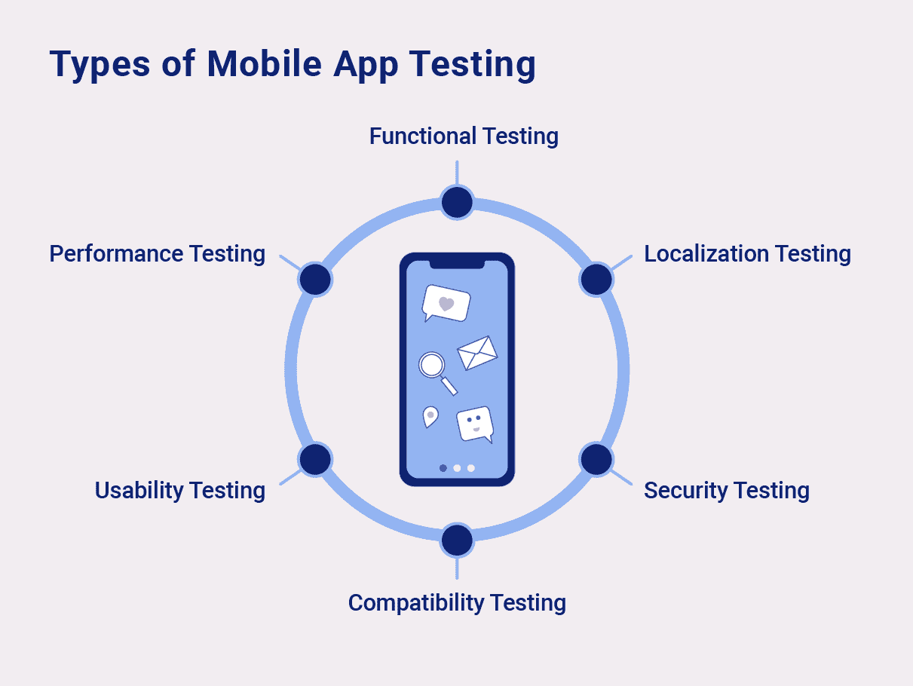
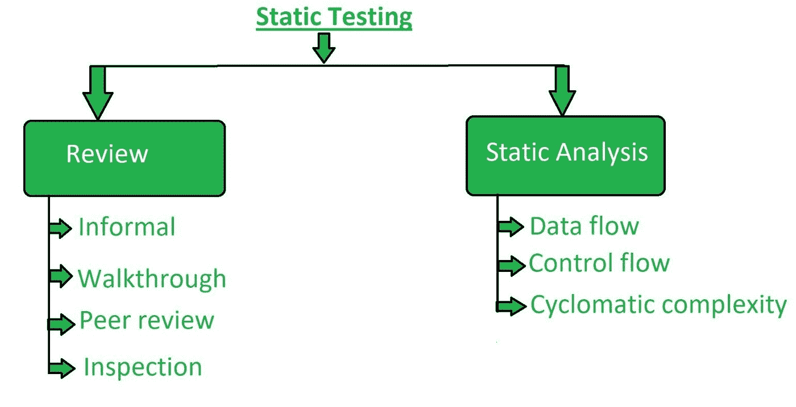

# 用于设备测试的静态代码分析

> 原文：<https://levelup.gitconnected.com/static-code-analysis-for-device-testing-dda6f654c4fb>

**照片由** [**威廉钩住**](https://unsplash.com/@williamtm?utm_source=unsplash&utm_medium=referral&utm_content=creditCopyText)**[**Unsplash**](https://unsplash.com/s/photos/mobile-device?utm_source=unsplash&utm_medium=referral&utm_content=creditCopyText)**

**移动设备测试是用来描述评估移动应用程序的操作性、可用性和一致性的过程的术语。有几种测试方法可以在移动设备上进行——业务测试、用户界面测试和功能测试。此外，这些测试可以手动或自动进行。**

**在本文中，我们将更深入地研究不同类型的移动设备测试及其特性。**

# **有哪些不同类型的测试**

**以下是在移动设备上进行的[设备测试](https://www.perfecto.io/blog/mobile-testing)的各种方法的基本概述:**

****

**[**来源**](https://www.sam-solutions.com/blog/mobile-app-testing/)**

# ****黑盒测试:****

**在黑盒测试中，测试人员在测试时不知道任何关于被测试应用程序的信息。在这个场景中，测试人员扮演一个真正的攻击者的角色。他们利用开源信息来进行 T21，并利用测试期间收集的信息来实现系统的实际开发。**

# ****白盒测试:****

**在白盒测试中，为测试人员提供完整的网络和系统信息，包括网络图和登录凭证，以便他们执行测试。如果提前做好准备，可以在更短的时间内以更低的价格完成交易。当您在特定系统上执行白盒测试时，建议您使用尽可能多的攻击媒介来复制目标攻击。**

# ****什么是设备测试中的静态代码分析****

****

**[**来源**](https://www.geeksforgeeks.org/software-testing-static-testing/)**

**在静态分析过程中，对移动应用程序的源代码进行评估，以确保安全控制的适当实施。在大多数情况下，自动扫描仅捕获低级问题。因此，测试人员需要在特定使用场景的上下文中调查代码库。现在让我们转向代码分析过程。**

# ****手工代码审查:****

**手动代码审查是通过手动研究移动应用程序的源代码来识别安全问题。这些审查采用各种方法来寻找缺陷——源代码中敏感令牌的泄漏、硬编码的凭证——或逻辑问题— [SQL 注入](https://portswigger.net/web-security/sql-injection)。**

**手动代码审查需要专业审查人员的参与，他们在检查代码和识别潜在漏洞方面很有经验。由于人工测试人员负责大部分的测试，使用这种方法执行的测试结果是绝对准确的；假阳性的数量非常低。**

# ****自动化源代码分析:****

**自动化的[漏洞扫描器](https://owasp.org/www-community/Vulnerability_Scanning_Tools)可以用来扫描代码的漏洞。它们的实现有两个目的:第一，加速漏洞扫描，第二，确保源代码符合一组预定义的标准或行业最佳实践。**

**扫描程序会自动搜索漏洞，对其进行分类，并就如何缓解漏洞提出建议。这些通常在原始源代码上执行，尽管它们也可以在应用程序上执行。**

**由于使用了自动化工具，产生了更多的假阳性，因此需要使用手动渗透测试仪来检查报告并消除假阳性。**

# ****动态分析:****

**动态分析或动态应用程序安全测试( [DAST](https://www.microfocus.com/en-us/what-is/dast) )侧重于通过使用实时任务(如登录和注册)对应用程序进行测试和评估。当执行动态分析时，主要目标是在应用程序仍在运行时识别其安全缺陷或薄弱区域。**

**例如，如果应用程序由于无效输入或在执行时崩溃，可以识别并缓解访问控制漏洞。通过在移动平台层对后端服务和 API 进行动态分析，可以评估移动应用程序的请求和响应模式。**

**进行这种类型的测试通常是为了评估安全技术是否能够提供足够的保护来抵御最常见类型的攻击。这一切都归结为:一个应用程序安装在手机上，一个拦截代理用于寻找流量和修改通过应用程序向服务器发出的请求。实时使用允许测试人员识别漏洞，检查漏洞的代码，并进行补救。**

# **结论**

**出于各种目的，需要在移动设备上进行测试。由于源代码审查是在 SDLC 的开发阶段进行的，因此它们有助于在部署过程的开始阶段减少漏洞。**

**建议进行手动测试，因为这样会大大降低误报率。它提供了出色的结果，同时还解决了应用程序初始开发阶段存在的任何漏洞。然而，代价是它比自动化测试要慢。如果速度对你来说是一个重要的因素，你应该使用自动化测试。**