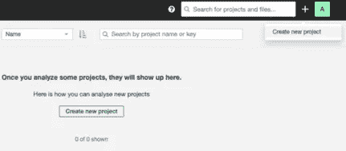
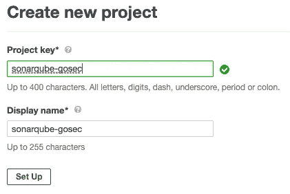
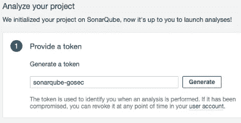
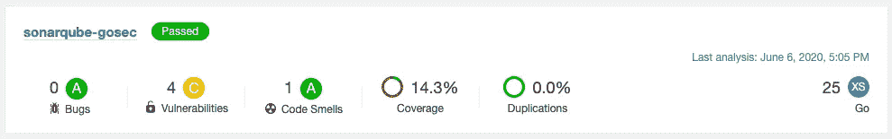
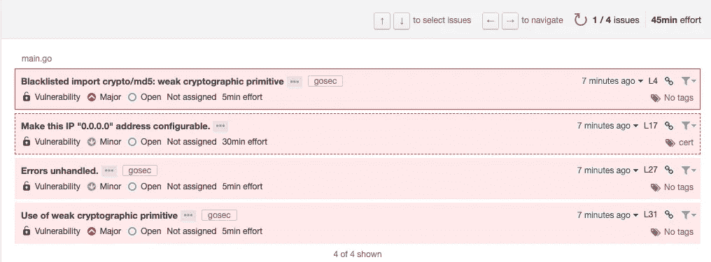
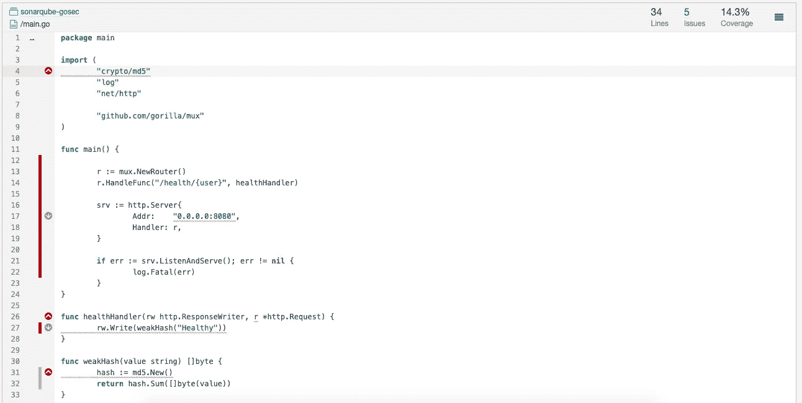

# golang 的静态代码分析

> 原文：<https://levelup.gitconnected.com/static-code-analysis-for-golang-5f24b555d227>

## 结合 SonarQube 和 gosec 从源代码中获取更多信息


在 [Unsplash](https://unsplash.com?utm_source=medium&utm_medium=referral) 上由 [Carlos Muza](https://unsplash.com/@kmuza?utm_source=medium&utm_medium=referral) 拍摄的照片

静态分析(或静态代码分析)是一种很好的技术，可以在不运行应用程序的情况下发现与安全性、性能、覆盖范围、编码风格甚至逻辑相关的问题。通常这种类型的分析只针对应用程序的源代码运行。不需要执行。

对于正在集成的新代码，这是一种非常简单而强大的分析。因此，大多数工具都被设计为作为持续集成管道的一部分运行。您可以比较新代码的结果，并在此基础上创建验收规则。这将有助于代码审查过程。例如，如果引入了新的主要安全问题，或者测试覆盖率不令人满意，您可能希望自动拒绝一个 pull 请求。非常酷的东西。

在本文中，我们将看看 golang 的两个静态代码分析工具: [SonarQube](https://www.sonarqube.org/) 和 [gosec](https://github.com/securego/gosec) 。SonarQube 为代码库和[集成上的所有问题提供了一个非常有用的 UI，以根据拉请求](https://docs.sonarqube.org/latest/analysis/pr-decoration/)分析代码，以及生成徽章以便于可视化和比较的能力。另一方面，Gosec 专注于安全问题，并对 SonarQube 扫描工具进行了补充。gosec 生成的报告可以很容易地集成到 SonarQube 中，所有问题都以相同的方式出现在 UI 上。我们将使用一个非常简单的例子来展示集成，以及在您的本地机器上安装这两个工具。您可以在我的 [GitHub 库](https://github.com/RicardoLinck/sonarqube-gosec)中找到用于集成的示例代码和基本命令。

## 在 docker 上安装和配置 SonarQube

对于不熟悉 SonarQube 的人来说，一个很好的起点是使用 docker 在本地安装它。有一个警告，如果你没有对容器使用适当的持久性，每次你停止运行它们，你的数据都会被删除。如果你只是在测试一个新项目的集成，这没什么。但很可能你不想在生产中这样做。

要在 docker 中本地运行 SonarQube，您只需运行以下命令(如果您以前从未提取过映像，可能需要一段时间):

```
docker run -d --name sonarqube -p 9000:9000 sonarqube
```

在本例中，配置 SonarQube 服务器的步骤如下:

*   使用用户名和密码`admin`登录[http://localhost:9000/sessions/new](http://localhost:9000/sessions/new)
*   点击`+`，然后点击`Create new project`。



SonarQube 的新项目

*   将项目调设定为任意值。



新项目设置

*   在新页面上生成一个具有任意名称的令牌。复制这个令牌并将其粘贴到某个地方，下一步将需要它。



令牌生成

*   在项目的根文件夹中创建一个名为`sonar-project.properties`的文件，如下图所示，替换您创建的文件的键和项目名(如果您使用我的 [GitHub 库](https://github.com/RicardoLinck/sonarqube-gosec)作为基础，该文件已经在那里了)。

最后一行是配置将由 gosec 工具生成的报告的内容。确保两端使用相同的名称。倒数第二行也在配置覆盖文件，确保在创建覆盖文件时使用相同的名称(不要担心，我将共享创建所有内容的命令😉).

*   从这里安装 sonar-scanner[https://docs . sonar qube . org/latest/analysis/scan/sonar scanner/](https://docs.sonarqube.org/latest/analysis/scan/sonarscanner/)
*   记得从安装文件夹中添加文件夹`/bin`到你的路径中。

## 安装和配置 gosec

您可以使用以下工具将 gosec 作为 go 工具安装:

```
go get github.com/securego/gosec/cmd/gosec
```

请记住，如果您想将它作为 CI/CD 管道的一部分，您可能会希望按照他们在 [GitHub](https://github.com/securego/gosec#install) 页面上的指示来做(在那里您可以指定版本等等)。这是开始使用 gosec 唯一需要做的事情。

## 示例应用程序

出于测试的目的，我们将创建一个简单的 web 应用程序，带有一个端点和一个单元测试(出于覆盖率的考虑)，您可以在这个 [GitHub 库](https://github.com/RicardoLinck/sonarqube-gosec)上找到完整的源代码。下面是`main`文件:

## 运行工具并检查结果

一旦我们安装并配置好了所有的东西，我们就可以在项目的根文件夹中运行下面的脚本，使用`sonar-project.properties`文件中提供的配置来生成所有的报告并将它们发送到 SonarQube 服务器。

```
# generate coverage file
**go test -short -coverprofile=./cov.out ./...**

# generate gosec report in sonarqube format
**gosec -fmt=sonarqube -out report.json ./... **   

# run sonar-scanner
**sonar-scanner**
```

这就是你真正需要做的。结果应该很快就可以在您的 SonarQube 服务器上获得。

## 正在 SonarQube 上检查结果

现在你只需要访问[http://localhost:9000/projects](http://localhost:9000/projects)并点击你的项目来查看分析。下面是我们的测试应用程序的样子:



项目页面中的项目信息

在“项目”页面上，我们可以看到关于项目主要信息的摘要。让我们跳到每一部分，调查一下我们通过快速简单的集成获得了哪些信息。

## 脆弱点



SonarQube 上的漏洞页面

在这里，我们将能够看到 **gosec** 和 **SonarQube** 之间的整合。在 gosec 中发现的所有漏洞都应该出现在本部分中，并在问题标题后加上标签`gosec`。现在我们可以用同样的方式回顾和处理来自 gosec 和声纳扫描仪的问题。这真是太棒了。非常方便。

## 新闻报道

我们还使用以下命令生成覆盖信息:

```
go test -short -coverprofile=./cov.out ./…
```

这些信息对于找到未测试的代码非常有用，如果我们导航到一个文件，我们可以很容易地看到代码库的哪些部分被覆盖。它看起来是这样的:



main.go 文件的覆盖率概述

我们可以通过左侧面板上的红色条和行号轻松识别哪些部件缺少测试。测试覆盖的部分显示为绿色条。所有这些都非常直观，信息量也很大。您还可以在带有严重性图标(主要为红色，次要为绿色)的小圆圈上看到文件中的问题，所有这些都在一个视图中。同样，当你分析你的代码并寻找改进的方法时，这些都非常方便。

## 最后的想法

只需很少的努力，我们就可以集成优秀的工具，并从 golang 项目中提取最有价值的信息。只需几个命令和一些手动配置，我们就成功地将两个伟大的静态代码分析工具**sonar cube**和 **gosec** 集成到一个 golang 应用程序中。这些工具提供的信息量和质量令人惊叹。它们之间的融合和互补也令人印象深刻。

如果我们利用这些工具的潜力，它们可以帮助我们识别问题，以及未测试的代码。SonarQube 提供的漂亮 UI 上的所有可用信息。所有这些信息都非常丰富，易于分析、理解和使用。这种类型的努力可以极大地提高您交付的软件的质量。这是值得的。

[](https://skilled.dev) [## 编写面试问题

### 一个完整的平台，在这里我会教你找到下一份工作所需的一切，以及…

技术开发](https://skilled.dev)