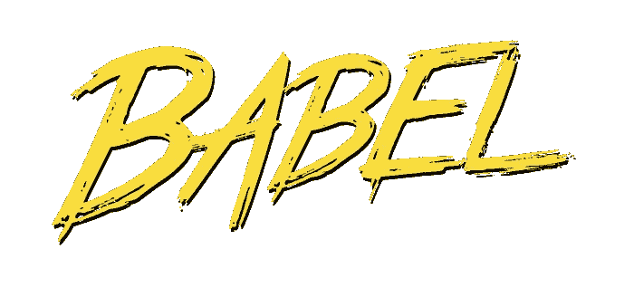
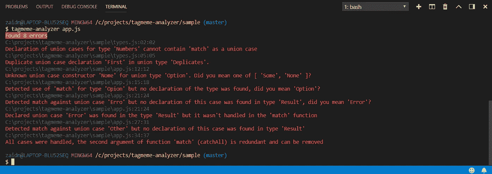

# Javascript 中的静态代码分析:验证模式匹配的正确性

> 原文：<https://levelup.gitconnected.com/static-code-analysis-in-javascript-verifying-correctness-of-pattern-matching-4bd16d42ec27>



# 目录

*   函数式语言中的求和类型
*   tagmeme:Javascript 中 Sum 类型的实现
*   使用标签模因的问题
*   标签词分析器:标签词的静态类型检查器和分析器
*   分析仪的工作原理
*   关于令人敬畏的 Javascript 生态系统

## 函数式语言中的求和类型

许多函数式编程语言，尤其是静态类型的语言，如 F#、Elm、Haskell 等。有联合的概念，也称为和类型:这些是用于建模值的类型定义，这些值可以是一组不相交的事物中的一个。例如，您可以将`Shape`建模为圆形、三角形或矩形，或者您可以定义一个只能是红色、绿色或蓝色的`Color`。

在某种意义上，它们类似于 C 风格语言中的枚举(enum ),但有一个很大的区别:它们可以用数据参数化。圆形有半径，而矩形既有高度又有宽度。确切的数据类型可以在定义中进行编码，这是它在 F#中的样子:

本例中的不同形状(圆形、矩形和三角形)被称为`Shape`类型的“联合案例”。每个联合用例被认为是一个`Shape`的构造器:

一旦构造了一个并集的值，就可以匹配该值的不同模式。例如，要确定某个值是否为圆形，需要匹配该值的所有情况:

函数式语言的现代编译器的一个最好的特性是它们可以检测出详尽的模式匹配。你的代码是否真的考虑到了所有可能的情况，如果没有，它会给你警告，这是非常令人惊讶的。

## tagmeme:Javascript 中 Sum 类型的实现

当然，在我的工作场所，我不能奢侈地使用 F#或 Elm，因为我们主要使用 Javascript 进行前端开发。不要误解我，我认为 Javascript 是可以的，我也有点喜欢它，但我仍然怀念使用表达类型系统进行领域建模的能力，或者至少是使用 sum 类型。

幸运的是，Javascript 中有一些库可以弥补这种情况，其中一个我最近发现的被称为 [tagmeme](https://github.com/andrejewski/tagmeme) 的隐藏瑰宝:一个由 [Chris Andrejewski](https://github.com/andrejewski) 编写的用于简单标记联合的库。我非常喜欢这个库，因为它非常简单，让我们看看前面展示的例子是如何用 Javascript 和 tagmeme 编写的:

如您所见，我们将形状的联合“类型”定义为联合案例列表。然后每个 case 都变成了`Shape`的构造函数，之后我们就可以根据`Shape`的某些值进行模式匹配。

对我来说，这看起来很漂亮，非常类似于用实现联合用例的语言(如 F#或 Elm)编写的代码。

## 使用标签模因的问题

因为这是我们正在讨论的 Javascript，它可能非常容易出错，因为我们肯定会犯以下错误之一，这将导致 tagmeme 在运行时出现异常:

*   当忘记处理一个案例(或拼错案例名称)时
*   处理未申报的案件时(处理太多案件)
*   当处理所有情况时，仍然提供永远不会匹配的冗余通配符参数(参见文档)
*   当使用单词“match”作为联合用例时
*   复制 union case 声明时
*   在值构造函数中拼错联合事例名称时

即使我们有一个 linter 来检查编写的 Javascript 代码的语法是否正确，如果我们没有正确地编写针对 sum 类型的详尽模式匹配，我们仍然会遇到运行时错误。静态分析到救援！

## 标签词分析器:标签词的静态类型检查器和分析器

因为这些是在“编译”时可能出错的已知变量，所以我问自己是否有可能编写一个程序，在实际运行应用程序之前检查我们是否犯了一个愚蠢的错误？这是我上周的一个小实验，当我深入巴别塔解析器的未知领域，以检测哪里可能会发生错误，同时提供有意义的替代方案，如果是这样的话:介绍 [tagmeme-analyzer](https://github.com/Zaid-Ajaj/tagmeme-analyzer) ！

[](https://github.com/Zaid-Ajaj/tagmeme-analyzer) [## Zaid-Ajaj/tagmeme 分析器

### 静态代码分析器，检查详尽的模式匹配，联合大小写错别字和标签中的冗余参数…

github.com](https://github.com/Zaid-Ajaj/tagmeme-analyzer) 

作为一个 CLI 工具实现，这个分析器针对一个 javascript 文件运行，解析 AST 并检测库在哪里被错误地使用！让我们通过编写一些在运行时会失败的代码来看看这一点，首先我们将在一个单独的文件中定义联合“类型”:

`Option`和`Result`声明正确，但是`Numbers`和`Duplicates`声明不正确，前者有“匹配”作为联合案例，后者有重复的联合案例。下面是消费代码:

在评论中你可以看到什么是不正确的，现在我们需要运行`tagmeme-analyzer`来对抗`app.js`，让我们先安装它(现在作为一个全局工具)

```
npm install -g tagmeme-analyzer
```

然后运行分析器并使用该文件作为参数，您将得到:



正如您所看到的，分析器检测到了我们之前讨论过的所有问题，如果您从 visual studio 代码内部运行它，您可以导航到出现问题的行。

## 分析仪的工作原理

粗略地说，分析器经历以下步骤

*   解析代码并获得代码的抽象语法树表示
*   从当前和导入的文件中查找联合类型声明
*   遍历树，找到使用了一个声明的联合类型的`match`函数的地方
*   开始将声明的联合事例与在`match`函数中使用的事例进行匹配
*   创建一个错误列表，并从声明中模糊搜索可能的替代项
*   将错误记录到控制台

使用了 Babel 的两个组件，生成 AST 的[解析器](https://babeljs.io/docs/en/babel-parser)和通过 AST 寻找`match`函数用法的[树访问者](https://github.com/jamiebuilds/babel-handbook/blob/master/translations/en/plugin-handbook.md#babel-traverse)(又名 babel/traverse)。

解析器接收需要分析的代码，并返回带有标记节点的代码树结构，例如:

零件`Option.Some('value')`被转换为

注意，代码变成了数据，分析器遍历这个 JSON 树。例如，这是分析器的一个片段，它检测到了在哪里使用了`match`函数:

这段代码寻找“调用表达式”,其属性作为对象的成员(成员表达式)被调用，其中属性的名称是“match ”,并具有两个或三个参数，等等。对于程序的其余部分，请参见此处的所有代码。

## 关于令人敬畏的 Javascript 生态系统

尽管我不是 Javascript 这种语言的最大粉丝，但当谈到生态系统中可用的工具时，没有什么能打败它！构建分析器是一种愉快的体验，在编写、测试和发布作为 CLI 工具的代码时，摩擦非常小。添加代码覆盖就像在测试脚本前添加`nyc`一样简单。不要忘记从 VS 代码中调试是多么容易。

## 结束了

我可能暂时不会构建更多的分析器，但这是一个很好的体验，很高兴当谈到 Javascript 和生态系统时，它都是可接近的。