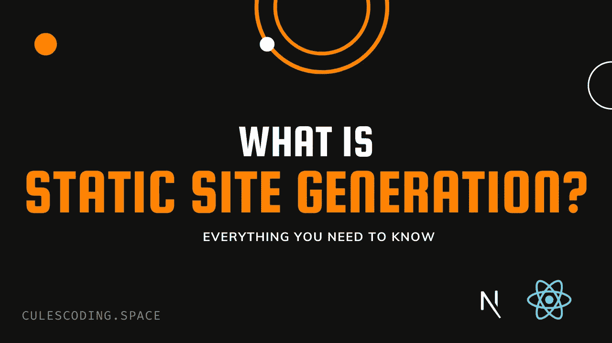
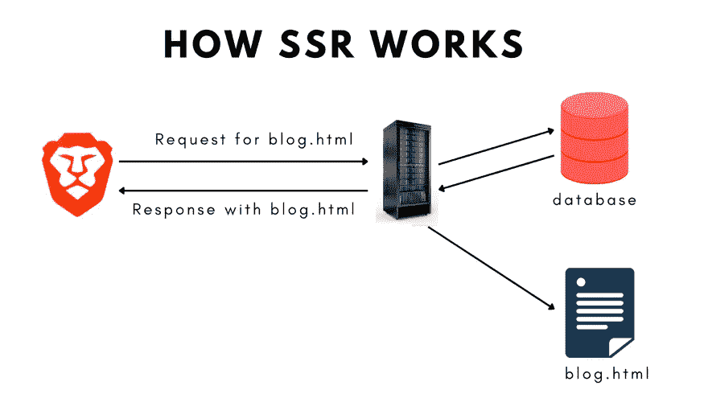
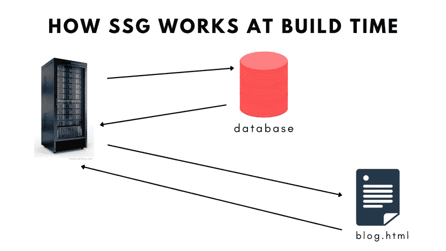
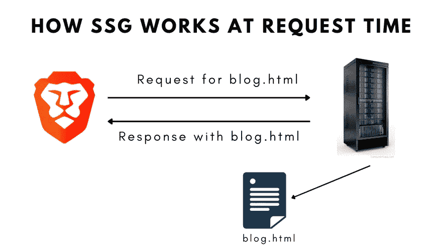

# 静态站点生成简单解释|星期五解释者

> 原文：<https://levelup.gitconnected.com/static-site-generation-explained-simply-friday-explainer-d46d448f788f>

在这篇博客中，我将解释什么是静态站点生成以及它是如何工作的。

# 视频教程

# 静态是什么意思？

静态意味着事物不会改变。静态网站的内容不会改变。例如，如果你有一个博客，你不会改变博客的内容。所以，网站的内容不会改变。这就是为什么它将是一个静态的网站。

如果内容发生变化，它将是一个像社交媒体网站一样的动态网站。

# 我们的网络是如何工作的？

我们必须了解我们的网络是如何工作的。请看下图。

*   我们有一个客户端(通常是浏览器)和一个服务器。
*   客户端发送一个对 HTML 页面的请求，例如`blog.html`。
*   服务器创建 blog.html 文件。
*   现在`blog.html`文件可能需要一些来自数据库或 API 的外部数据。因此，服务器从数据源获取数据，并用获取的数据构建 HTML 文件。
*   然后，服务器将其作为响应发送回客户端。

这就是我们所说的服务器端渲染。如果你想了解更多关于服务器端渲染的知识，可以看下面的视频。

此外，您可以从下面的视频中了解客户端渲染。

# 服务器端呈现的问题

每次客户端向服务器发送请求，整个过程都要重新开始。这是有道理的。
但在一种情况下可能会很慢。假设，需要在请求时获取的数据很少改变。
比如你写博客，对博客内容改动不大。所以，网站的内容不会改变。
没有必要每次客户端发送请求时都从数据库获取相同的数据。

# 静态站点生成如何解决这个问题？

我们可以在构建时获取数据并将数据放入 HTML 文件中，而不是在请求时获取数据。
所以，现在如果客户端发送请求，服务器会立即将 HTML 文件发送回客户端。因为已经用所需的数据创建了 HTML 文件。因此，你不需要做额外的过程，使网站超快。

# 什么是静态站点生成？

因此，静态站点生成是在构建时生成静态网页的过程。静态网站越来越受欢迎。

# 如何使用静态站点生成？

可以使用类似 Gatsby、Next.js、Jekyll 等某种前端框架。你可以查看[链接](https://jamstack.org/generators/)了解更多详情。

# 静态站点生成的优点

*   它很快。
*   不需要后端。
*   它是搜索引擎友好的。
*   易于扩展。
*   免费托管 GitHub 页面，netlify，vercel 等。

# 何时使用静态站点生成？

当内容不变时，静态网站是很棒的。如果你的内容经常变化，那么静态站点生成就不是最好的选择。

这个博客到此为止。我试图简单地解释事情。如果你卡住了，你可以问我问题。

顺便说一下，我正在一家公司寻找一个新的机会，在那里我可以用我的技能提供巨大的价值。如果你是一名招聘人员，正在寻找一个精通全栈网络开发并对改变世界充满热情的人，请随时联系我。此外，我愿意谈论任何自由职业者的项目。