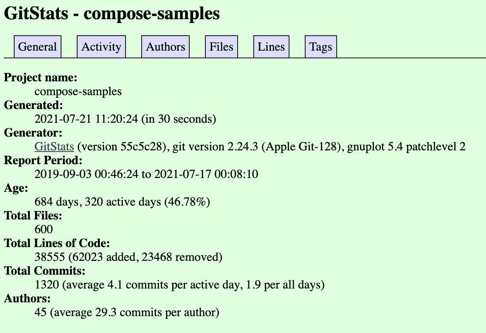
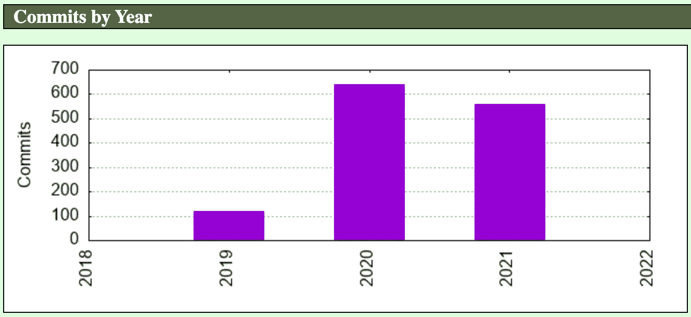
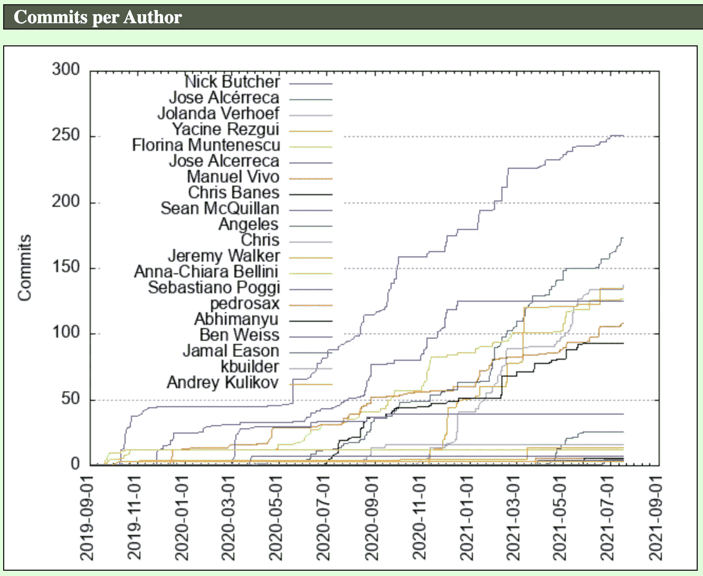
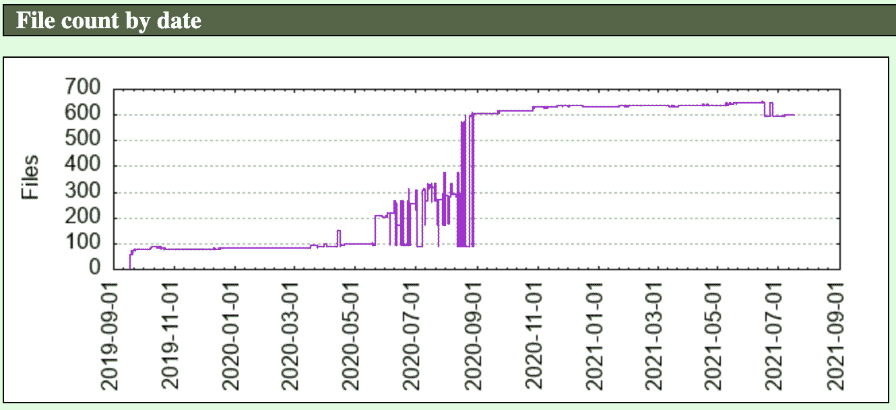
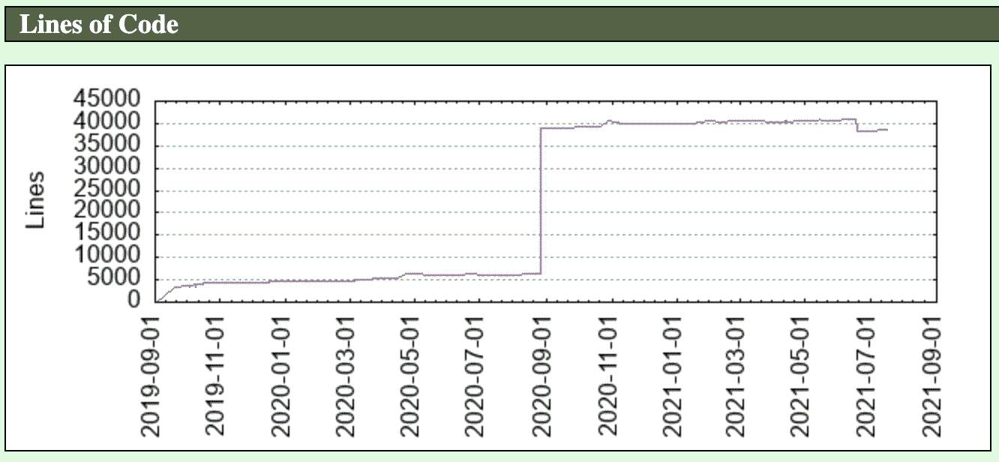
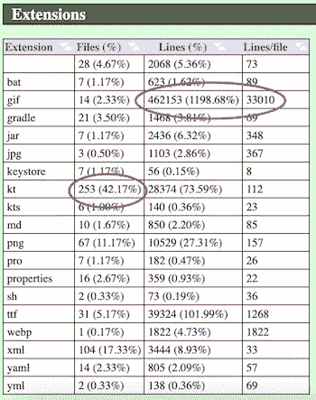

# Git 报告的统计图表

> 原文：<https://levelup.gitconnected.com/statistic-graphing-a-git-repo-5b29fcfbc094>

## 软件开发

## 更好地了解 git 回购的历史


克里斯·利维拉尼在 [Unsplash](https://unsplash.com?utm_source=medium&utm_medium=referral) 上的照片

当一个团队在 git repo 上工作一段时间时，有时查看 Git Repo 随着时间的推移在规模、参与者等方面的变化可能会很方便。

如果我们想快速找到一个回购有多少行，下面是一个简单的命令。

```
git ls-files | xargs cat | wc -l
```

但是要获得历史数据，我们必须在不同的时间取出数据，并且运行命令，将花费太多的时间。

# 使用 GitStats

幸运的是，已经有了这样的工具。

[](http://gitstats.sourceforge.net/) [## GitStats - git 历史统计生成器

### GitStats 是 git(分布式修订控制系统)仓库的统计生成器。它检查了…

gitstats.sourceforge.net](http://gitstats.sourceforge.net/) 

使用这个工具，当然需要有`git`、`python`和`Gnuplot`(可以使用`brew install gnuplot`安装)。

要使用它，只需运行

```
git clone git://github.com/hoxu/gitstats.git
```

之后，只需运行如下命令

```
./gitstats <cloned local repo> <stat location>
```

我们可以让它进来

```
 ./gitstats /Users/elye/Development/spike/compose-samples ~/Development/stats/compose-samples
```

运行之后，它会在最后转储下面的一些东西。在浏览器中打开它。

```
You may now run: sensible-browser '/Users/elye/Development/stats/compose-samples/index.html'
```

# GitStats 提供了什么

为了展示 GitStat 提供了什么，我将它们全部存储在

[https://github.com/elye/demo_git_gitstat_result/tree/main](https://github.com/elye/demo_git_gitstat_result/tree/main)

你可以看到他们在

[https://elye.github.io/demo_git_gitstat_result/index.html](https://elye.github.io/demo_git_gitstat_result/index.html)

> 为了在 Git 中显示 html，我从[https://stackoverflow.com/q/8446218/3286489](https://stackoverflow.com/q/8446218/3286489)找到了方法，按照下面的命令

```
git checkout --orphan gh-pages
git commit -m "Init"  // Needed for the first push of gh-pages
git push -u origin gh-pages
```

## 基本概要

从那里你可以得到 git 回购的基本概要



## 按年提交



## 作者历年提交



## 按日期排列的文件计数



## 代码行



## 文件扩展名类型

从这里，你会注意到它是基于 Kotlin 的项目(最高的`kt`扩展名文件)。但是最大的尺寸是所有的`gif`



还有更多统计图表。下面都可以看到。

[https://elye.github.io/demo_git_gitstat_result/index.html](https://elye.github.io/demo_git_gitstat_result/index.html)

快乐分析你的 git 回购！