# 轻松显示 Seaborn 图上的统计显著性

> 原文：<https://levelup.gitconnected.com/statistics-on-seaborn-plots-with-statannotations-2bfce0394c00>

## 为您的美丽情节添加文本、星星或 p 值！


NOAA 在 [Unsplash](https://unsplash.com/s/photos/research-results?utm_source=unsplash&utm_medium=referral&utm_content=creditCopyText) 上拍摄的照片

## 介绍

Python 中有许多库可用于清理、分析和绘制数据。使用 Python 还可以获得免费的健壮的统计软件包，这些软件包被成千上万的其他项目所使用。仅在 Github 上，`statsmodels`就被 44，000 多个开源项目使用，`scipy`被 350，000 多个开源项目使用！(当然，可能不全是为了`scipy.stats`。

`Seaborn`是一个有效且非常受欢迎的可视化数据库，但如果您希望将 p 值添加到您的图中，使用漂亮的括号以及您在论文中看到的所有使用 R 或其他统计软件的工具，则没有太多选项可用。您可以在网上找到一些，但是它们确实需要您编写相当多的代码来绘制每一行并添加每个文本标签。

本教程将介绍`statannotations`的主要特性，这是一个使用户能够在`seaborn`分类图上添加统计显著性注释的包。
在前两节中，我们将设置所需的工具，并快速描述我们将处理的数据集。然后，我们将学习如何像这样转换情节:

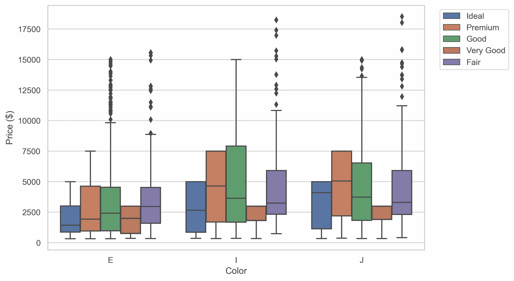

变成这样的剧情↓！

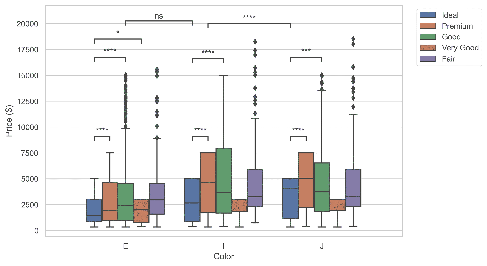

具体来说，在展示了如何安装和导入最新版本的`statannotations`(目前为 v0.4.1)之后，我们将回答以下问题:

*   如何给`seaborn`图添加自定义注释？
*   如何以多种方式自动格式化先前计算的 p 值，然后在单个函数调用中将这些值添加到图中？
*   如何执行统计测试并将其结果添加到图中，可选地应用多重比较校正方法？

后续教程将涵盖更高级的功能，如接口其他统计测试，多重比较校正方法，以及格式选项的详细审查。

本教程的 Jupyter 笔记本版本(只是稍欠润色)可从 Github [这里](https://github.com/trevismd/statannotations-tutorials)获得。

**免责声明**:本教程旨在描述*如何使用一个图标注库，而非教授统计学*。这些例子只是为了说明这些图，而不是统计方法，我们不会对所研究的数据集下任何结论。正确的方法需要仔细定义研究问题，最终可能需要不同的组比较和/或测试，当然，p 值也不是所有问题的正确答案。这是许多其他资源的主题。

## 先决条件

知识—为了从本教程中获得最大收益，读者应该熟悉 Python 3(最好是 3.6 以上)。之前在`pandas`、`matplotlib`和`seaborn`方面的一些经验将有助于理解`statannotations`的价值主张。

物理—按照教程，您将需要一些库和数据，其来源如下所述。为了减少这篇文章的篇幅，我们使用了一些辅助函数，但这里不再赘述。你可以在教程的[库](https://github.com/trevismd/statannotations-tutorials)中找到它们。

## 准备工具

我们导入`pyplot`、`pandas`和`seaborn`来操作数据和绘制图表。`scipy`和`numpy`仅用于说明一种可能的用例。

进口

只为本教程实现的一些额外功能是从 github [库](https://github.com/trevismd/statannotations-tutorials)上的`utils`模块导入的，包括:

1.漂亮打印功能:`print_n_projects`和`describe_array`

2.与绘图相关的避免重复功能:`get_log_ax`、`label_plot_for_subcats`、`label_plot_for_states`、`add_legend`

## 准备数据

对于本教程，我们将使用 Kickstarter 数据集“*2009-2017 年超过 375，000 个 Kickstarter 项目的数据”*，其中包括从[https://www.mavenanalytics.io/data-playground](https://www.mavenanalytics.io/data-playground,)下载的 374，853 条活动记录。

让我们来看一个快速峰值:

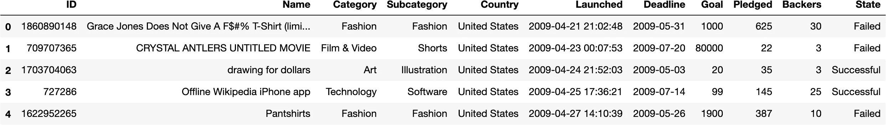

我们将考虑`Category`、`Subcategory`、`Goal`和`State`列。

活动被分配到“类别”:

Kickstarter 活动类别

我们将探索“技术”类别，首先是项目数量:

技术项目

```
There are 32562 projects in Technology. 1\. Technology         6,930
 2\. Apps               6,340
 3\. Web                3,910
 4\. Hardware           3,660
 5\. Software           3,050
 6\. Gadgets            2,960
 7\. Wearables          1,230
 8\. DIY Electronics      902
 9\. 3D Printing          682
10\. Sound                669
11\. Robots               572
12\. Flight               426
13\. Camera Equipment     416
14\. Space Exploration    323
15\. Fabrication Tools    250
16\. Makerspaces          238
```

然后，我们将探索`Goal`列，该列以美元表示营销活动的融资目标。

技术子类别中项目的总目标金额:

```
 1\. Technology          1.11 B
 2\. Apps                 449 M
 3\. Web                  400 M
 4\. Hardware             343 M
 5\. Software             285 M
 6\. Space Exploration    186 M
 7\. Gadgets              155 M
 8\. Robots               107 M
 9\. Wearables           74.7 M
10\. Flight              59.3 M
11\. 3D Printing         31.8 M
12\. Sound               31.2 M
13\. Makerspaces         31.1 M
14\. Fabrication Tools   29.0 M
15\. DIY Electronics     18.1 M
16\. Camera Equipment    16.6 M
```

我们看到，`Sound` (#10)、`Robots` (#11)和`Flight` (#12)相对于项目总数的顺序与它们考虑总目标金额的顺序不同，总目标金额是`Robots` (#8，+3 位)、`Flight` (#10，+2 位)和`Sound` (#12，-2 位)。

**在本教程中，我们将对** `**Robots**` **、** `**Flight**` **和** `**Sound**` **子类别**进行一些分析

为简单起见，我们将数据集的子集定义为名为`rfs`的新数据帧，只保留属于三个子类别的行。

机器人、飞行和声音项目

# 第一次绘图

我们为`seaborn`图的子类别定义了一些颜色和顺序。

颜色和顺序

## 参考图 1

我们将注释的第一个情节将根据`Subcategory`(机器人、飞行或声音)显示战役`Goal`。

**重要—** *除非另有说明，否则此处的第 1 — 3 行和第 8 — 10 行必须用于本教程的所有绘图，即使在某些示例中没有显示。*

制作参考图 1

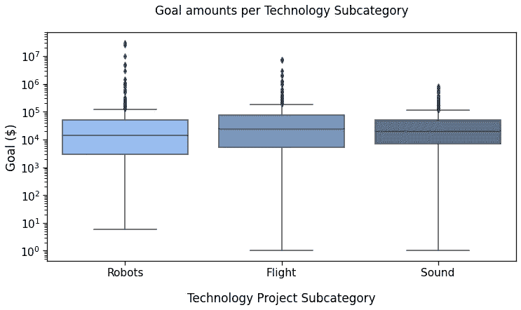

参考图 1

## 参考图 2

现在，我们绘制每个项目状态的目标金额，即，如果活动是`Successful`，如果`Failed,`是`Live`、`Suspended`或`Canceled`(截至 2018 年 1 月)。

首先，定义颜色和顺序:

然后制作剧情:

制作参考图 2

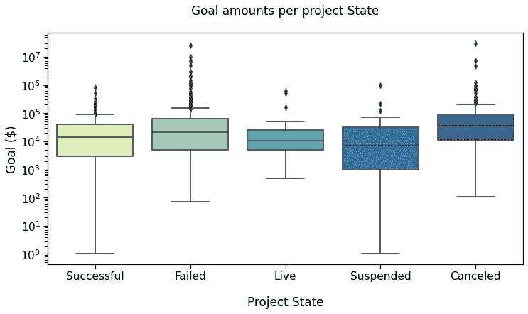

参考图 2

# **统计第一**

此时，您可能需要向绘图添加注释。Statannotations 允许添加任意文本。但是为了展示特别是统计结果带来的好处，我们将计算一些统计测试，然后展示如何将它们添加到图表中。

我们的第一张图显示了`Subcategory`的目标金额。我们首先创建每个子类别目标的数组，以及它们的对数，来测试对数正态性。

用 scipy 提取要分析的数组

**测试正常性**

(对数)正态性测试几乎都是非常重要的(如果你想知道我们在这里做了什么，请查看笔记本)。

因此，我们将对独立样本使用非参数检验:Mann-Whitney-Wilcoxon。

“手动”测试

哪些输出

```
Robots vs Flight:  
MannwhitneyuResult(statistic=104646.0, pvalue=0.0001348514046808899)Flight vs Sound:  
MannwhitneyuResult(statistic=148294.5, pvalue=0.2557331102364572)robots vs Sound:  
MannwhitneyuResult(statistic=168156.0, pvalue=0.0002298546492900512)
```

在下一节中，我们将把这些结果添加到我们制作的第一个盒图中。


参考图 1

# 统计符号

Statannotations 是一个[开源](https://github.com/trevismd/statannotations)包，用户可以在`seaborn`分类图上添加统计显著性注释(`barplot`、`boxplot`、`stripplot`、`swarmplot`和`violinplot`)。

它基于`[statannot](https://github.com/webermarcolivier/statannot)`，但是有额外的特性，现在使用不同的 API。

## 装置

您可以从您喜欢的命令行界面安装带有 pip 的`statannotations`:

```
pip install statannotations
```

可选地，要使用本教程中进一步描述的多重比较校正，您还需要`statsmodels`。

```
pip install statsmodels
```

**导入主类**

这是本教程中描述的材料所需的唯一导入。

```
from statannotations.Annotator import Annotator
```

准备注释并将它们添加到图中通常是一个 5 步程序，我们将详细介绍:

**步骤 1——决定注释哪些数据对** ,例如，箱线图中的哪些方框，条形图中的哪些条形，等等。

**步骤 2——创建一个** `**Annotator**`
也可以在制作几个图时准备一个先前使用的注释器，以便使用相同的配置。

**步骤 3—配置注释器**
这包括文本格式化、要应用的统计测试、多重比较校正方法…

**第 4 步——做注解**
这可以通过三种不同的*模式*来完成，我们将按以下顺序进行:

a——提供完全自定义的注释
B——在添加到图中之前提供要格式化的 p 值
C——应用在步骤 3 中配置的统计测试

**第 5 步——注释！**

我们将看到，在许多情况下，步骤 4 和 5 可以在同一个函数调用中执行。

## a-添加任何文本，如先前计算的结果

这种情况下，我们已经有了统计结果，或者我们想要在`seaborn`图上显示的任何其他文本(及其相关的`ax`)。

**第一步—** 比较什么

要注释这个图，我们必须在一个`pairs`参数中传递要注释的数据组(用方框、条、小提琴等表示)。

在我们的演示中，它相当于`'Robots vs Flight'`和其他。

`pairs`是一个类似`('Robots', 'Flight')`的元组列表，所以在本例中:

地块 1 的配对

**步骤 2 —** 创建注释者

第一个参数是 seaborn plot 的`ax`，第二个是要注释的`pairs`。剩下的参数是*确切地说是*和*所有*那些首先用于生成 seaborn 图的参数。

我们将在示例中看到，使包含参数的`dict`传递给两个函数是避免丢失参数和代码重复的最安全的方式

**步骤 3 —** 配置注释器

对于第一个例子，我们不做任何配置。

**第 4 步—** 做注解

在这种情况下，使用 scipy 返回值中的 p 值，并进行一些“手动”格式化(使用 F 字符串、数字格式化和列表理解)。

手动测试结果

并将它们提供给注释者

`annotator.set_custom_annotations(formatted_pvalues)`。

注意:确保提供的`pairs`和注释(此处为`formatted_pvalues`)遵循相同的顺序，即第一对对应于列表中的第一个注释，等等。

**第五步—** 批注！

简单的叫`annotator.annotate()`。

一起:

注释图 1

瞧！

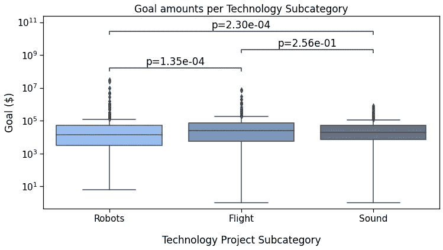

带有自定义注释的参考图 1

引用带有自定义注释的图 1。注意，我们可以很容易地以这种方式添加任何其他文本，例如`***`、`NS`和`***`。

## b-自动格式化 p 值

为了从格式化选项中获益，我们使用方法`set_pvalues`而不是`set_custom_annotations`。

因为我们正在制作同一个 seaborn 地块的副本，所以`plotting_parameters`不需要改变，上面定义的`pairs`也不需要改变。

**用星号标注(默认)**

用星形符号标注

输出

```
p-value annotation legend:
      ns: p <= 1.00e+00
       *: 1.00e-02 < p <= 5.00e-02
      **: 1.00e-03 < p <= 1.00e-02
     ***: 1.00e-04 < p <= 1.00e-03
    ****: p <= 1.00e-04

Sound v.s. Flight: Custom statistical test, P_val:2.557e-01
Robots v.s. Sound: Custom statistical test, P_val:2.299e-04
Robots v.s. Flight: Custom statistical test, P_val:1.349e-04
```

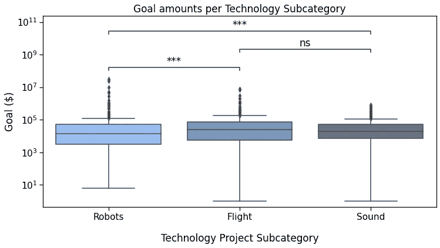

p 值用星形符号表示的参考图 1

**用“简单”的格式来显示意义**

简单地配置`text_format`到`"simple"`，以这种方式显示 p 值。这是通过改变前面代码片段中与`annotator`相关的行而获得的，而其他的不变。

使用简单格式

如您所见，语法非常简洁。我们通过调用`annotator.configure()`添加了注释过程的**步骤 3** 部分。

您可能还注意到了将`set_pvalues(pvalues)`和`annotate()`替换成一个函数调用`set_pvalues_and_annotate(pvalues)`。

`text_format`还有一个`"full"`选项。如果你在阅读时积极地编码，请随意尝试。不然以后再看。

此代码输出:

```
Sound v.s. Flight: Custom statistical test, P_val:2.557e-01
Robots v.s. Sound: Custom statistical test, P_val:2.299e-04
Robots v.s. Flight: Custom statistical test, P_val:1.349e-04
```

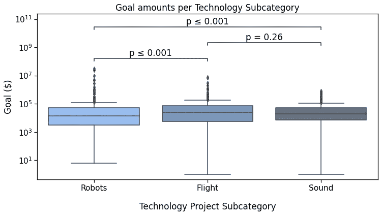

p 值简单格式化的参考图 1

仍然在**步骤 2** 中，我们还可以提供一个`test_short_name`参数，显示在 p 值之前。

在这个代码片段中，您还可以看到如何通过重用注释器实例来减少所需的代码，因为我们没有更改数据和对。这是通过调用`new_plot`完成的，它仍然需要新的`ax`和 seaborn 参数。这也允许记住我们已经配置的`text_format`选项。

为简单格式配置测试简称

输出

```
Sound v.s. Flight: Custom statistical test, P_val:2.557e-01
Robots v.s. Sound: Custom statistical test, P_val:2.299e-04
Robots v.s. Flight: Custom statistical test, P_val:1.349e-04
```

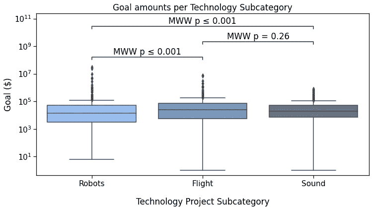

带注释的参考图 1，包括执行的测试

## 调整布局

`configure`和`annotate`方法的参数允许修改注释布局，大部分内容将在下一个教程中介绍。

但是，我们已经可以看到如何扩大行和注释之间的间距:

这导致了

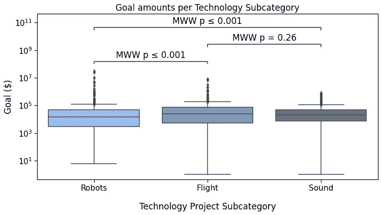

参考图 1，带有轻微移动的注释

它可能很微妙，但它确实存在。

## C —应用带有统计符号的 scipy 测试

最后，`statannotations`可以在指定的对上直接调用`scipy.stats`测试。现成的选项有:

*   曼-惠特尼公司
*   t 检验(独立和配对)
*   韦尔奇 t 检验
*   勒文试验
*   威尔科克森试验
*   克鲁斯卡尔-沃利斯试验

在下一个教程中，我们将会看到如何使用一个不在`statannotations`中的测试。如果你好奇的话，还可以看看包库中[笔记本](https://github.com/trevismd/statannotations/blob/master/usage/example.ipynb)的用法。

执行统计测试

对于`set_pvalues_and_annotate`，有一种快捷方式`apply_and_annotate`。您还可以注意到，`configure()`返回了注释器对象，因此*不需要*在下一行写`annotator.apply_and_annotate()`。你当然还可以。

输出:

```
Sound v.s. Flight: Mann-Whitney-Wilcoxon test two-sided, P_val:2.557e-01 U_stat=1.367e+05
Robots v.s. Sound: Mann-Whitney-Wilcoxon test two-sided, P_val:2.299e-04 U_stat=1.682e+05
Robots v.s. Flight: Mann-Whitney-Wilcoxon test two-sided, P_val:1.349e-04 U_stat=1.046e+05
```


参考图 1，带有由 statannotations 调用的统计测试产生的注释

最后一个可能的`text_format`选项是`full`:

输出


带文本格式“完整”注释的参考图 1

现在，回到`State`的那个情节:


参考图 2

在该图中，我们将比较`Successful`、`Failed`、`Live`和`Canceled`状态。

我们将需要定义新的对来进行比较，然后应用相同的方法来配置、获取测试结果并注释该图。

输出

```
p-value annotation legend:
      ns: p <= 1.00e+00
       *: 1.00e-02 < p <= 5.00e-02
      **: 1.00e-03 < p <= 1.00e-02
     ***: 1.00e-04 < p <= 1.00e-03
    ****: p <= 1.00e-04

Successful v.s. Failed: Mann-Whitney-Wilcoxon test two-sided, P_val:2.813e-08 U_stat=1.962e+05
Failed v.s. Canceled: Mann-Whitney-Wilcoxon test two-sided, P_val:1.423e-05 U_stat=7.239e+04
Successful v.s. Canceled: Mann-Whitney-Wilcoxon test two-sided, P_val:4.054e-16 U_stat=3.910e+04
Canceled v.s. Live: Mann-Whitney-Wilcoxon test two-sided, P_val:6.641e-03 U_stat=3.096e+03
Failed v.s. Live: Mann-Whitney-Wilcoxon test two-sided, P_val:2.511e-01 U_stat=9.932e+03
Successful v.s. Live: Mann-Whitney-Wilcoxon test two-sided, P_val:9.215e-01 U_stat=5.971e+03
```

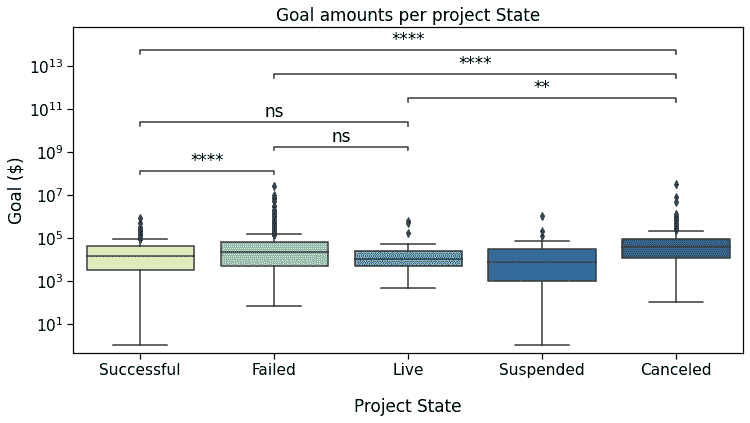

参考图 2 已标注

让我们在这里暂停几秒钟，我们已经走了很长一段路。

基本上，我们定义了要比较的对，再用 2 行代码，我们就得到了这个漂亮的图！

如果您担心多种测试和校正方法，请继续阅读！但是首先，让我们看看如何在“带色调的方框图”中处理两个层次的分类。

## 带色调的方框图

我们现在将处理同一数据集的这两个图

## 参考图 3

开始绘图代码:

制作参考图 3

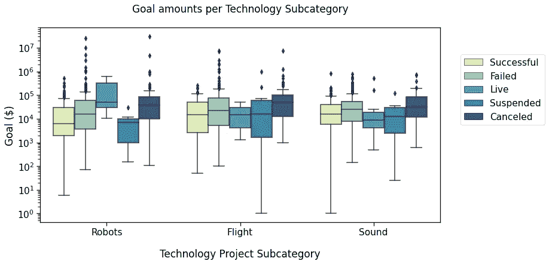

参考图 3

这里，我们将比较三个子类别中的`Successful`、`Failed`和`Live`状态，这三个子类别我们已经查看过`Robots`、`Flight`和`Sound`。

这些对必须包含关于子类别**和状态**的信息。我们将它们定义为元组列表，例如

`[(subcat_1, state_1), (subcat_1, state_2)]`

在这种情况下，这使得它

绘制 3 对

同样，我们将绘图参数放在字典中。我们将在`boxplot`和`Annotator`通话中使用它。

注释图 3

输出

```
p-value annotation legend:
      ns: p <= 1.00e+00
       *: 1.00e-02 < p <= 5.00e-02
      **: 1.00e-03 < p <= 1.00e-02
     ***: 1.00e-04 < p <= 1.00e-03
    ****: p <= 1.00e-04

Sound_Failed v.s. Sound_Live: 
Mann-Whitney-Wilcoxon test two-sided, 
P_val:5.311e-02 U_stat=2.534e+03Robots_Successful v.s. Robots_Failed: 
Mann-Whitney-Wilcoxon test two-sided, P_val:1.435e-04 U_stat=2.447e+04Robots_Failed v.s. Robots_Live: 
Mann-Whitney-Wilcoxon test two-sided, 
P_val:2.393e-01 U_stat=2.445e+02Flight_Successful v.s. Flight_Failed: 
Mann-Whitney-Wilcoxon test two-sided, 
P_val:4.658e-02 U_stat=8.990e+03Flight_Failed v.s. Flight_Live:
 Mann-Whitney-Wilcoxon test two-sided, 
P_val:4.185e-01 U_stat=6.875e+02Sound_Successful v.s. Sound_Failed:
Mann-Whitney-Wilcoxon test two-sided,
P_val:1.222e-03 U_stat=3.191e+04Robots_Successful v.s. Robots_Live:
Mann-Whitney-Wilcoxon test two-sided,
P_val:8.216e-02 U_stat=1.405e+02Flight_Successful v.s. Flight_Live:
Mann-Whitney-Wilcoxon test two-sided,
P_val:7.825e-01 U_stat=1.650e+02Sound_Successful v.s. Sound_Live:
Mann-Whitney-Wilcoxon test two-sided,
P_val:2.220e-01 U_stat=2.290e+03
```

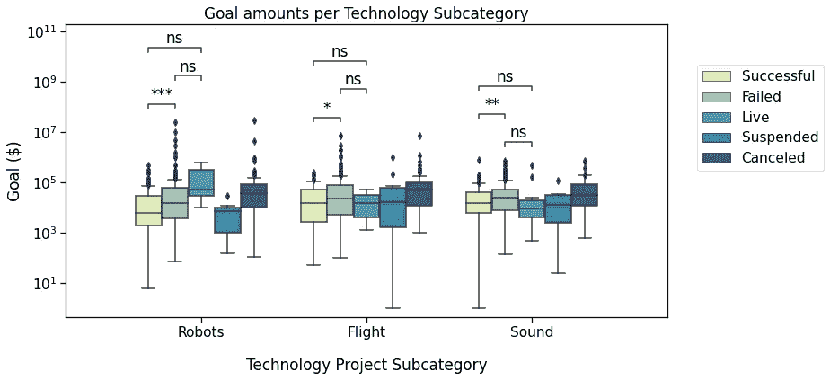

参考图 3 已标注

## 情节 4

为了比较不同类别的状态，我们将绘制不同的图表:

制作参考图 4

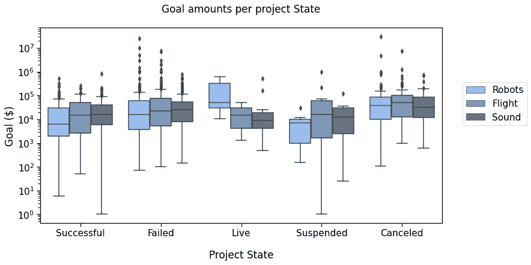

参考图 4

现在，您已经了解了让 statannotations 调用统计测试并注释绘图的所有基础知识:

注释参考图 4 并保存结果

输出

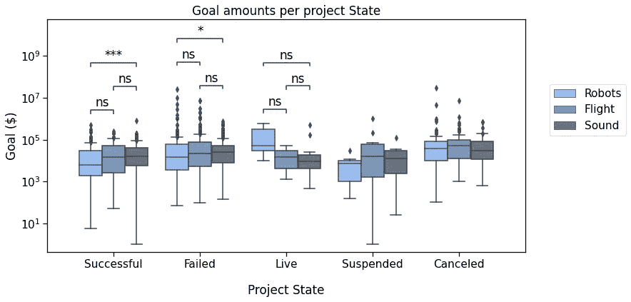

参考图 4 已标注

这又是一次大量的测试。如果有人想应用多重测试校正方法，我们现在就介绍它。

## 校正多重测试

在这一节中，我将快速演示如何使用一个现成的接口。更高级的用法将在下面的教程中描述。

基本上，你可以使用`configure`方法的`comparisons_correction`参数，有以下几种修正方法(由`statsmodels`实现)

*   Bonferroni ( `"bonf"`或`"bonferroni"`)
*   本杰明·霍克伯格(`"BH"`
*   霍尔姆-邦费罗尼(`"HB"`)
*   本杰明-叶库铁力(`"BY"`)

应用多重测试校正方法

输出

```
p-value annotation legend:
      ns: p <= 1.00e+00
       *: 1.00e-02 < p <= 5.00e-02
      **: 1.00e-03 < p <= 1.00e-02
     ***: 1.00e-04 < p <= 1.00e-03
    ****: p <= 1.00e-04

Failed_Flight v.s. Failed_Sound: 
Mann-Whitney-Wilcoxon test two-sided with Bonferroni correction, P_val:1.000e+00 U_stat=3.803e+04Live_Robots v.s. Live_Flight: 
Mann-Whitney-Wilcoxon test two-sided with Bonferroni correction, P_val:1.000e+00 U_stat=9.500e+00
Live_Flight v.s. Live_Sound: 
Mann-Whitney-Wilcoxon test two-sided with Bonferroni correction, P_val:1.000e+00 U_stat=2.900e+01Successful_Robots v.s. Successful_Flight: 
Mann-Whitney-Wilcoxon test two-sided with Bonferroni correction, P_val:8.862e-01 U_stat=7.500e+03Successful_Flight v.s. Successful_Sound: 
Mann-Whitney-Wilcoxon test two-sided with Bonferroni correction, P_val:1.000e+00 U_stat=1.013e+04Failed_Robots v.s. Failed_Flight: 
Mann-Whitney-Wilcoxon test two-sided with Bonferroni correction, P_val:8.298e-01 U_stat=3.441e+04Live_Robots v.s. Live_Sound: 
Mann-Whitney-Wilcoxon test two-sided with Bonferroni correction, P_val:1.000e+00 U_stat=3.400e+01Failed_Robots v.s. Failed_Sound: 
Mann-Whitney-Wilcoxon test two-sided with Bonferroni correction, P_val:3.771e-01 U_stat=3.364e+04Successful_Robots v.s. Successful_Sound: 
Mann-Whitney-Wilcoxon test two-sided with Bonferroni correction, P_val:1.504e-03 U_stat=2.491e+04
```


带注释的图 4，相同的测试，带 Bonferroni 校正。请查看成功和失败的机器人和声音项目与之前情节的差异。

注意，`annotate`函数返回数据。第二个值允许检索 p 值。正如我们在这里看到的，它们确实被调整了:

```
8.04e-01 => 1.00e+00
2.85e-01 => 1.00e+00
9.58e-01 => 1.00e+00
9.85e-02 => 8.86e-01
7.23e-01 => 1.00e+00
9.22e-02 => 8.30e-01
1.15e-01 => 1.00e+00
**4.19e-02 => 3.77e-01**
1.67e-04 => 1.50e-03
```

`Robots`和`Sound` `Failed`项目的总目标金额差异的 p 值从大约`0.04`变为大约`0.4`(上一列表中的倒数第二个项目)，并且不再被认为具有统计显著性(默认 alpha 为`0.05`)。

## 奖金

支持其他类型的图。这里是与`boxplot`相同的数据，以及其他调整的参数。

水平条形图

输出

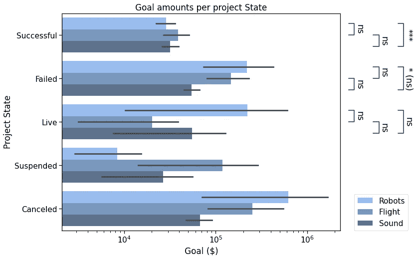

带有外部统计注释的水平条形图

# 结论

祝贺您完成本教程。在这篇文章中，我们讨论了`Annotator`的几个用例，从使用定制标签到让包应用统计测试，所有这些都有几个格式选项。

这已经涵盖了许多用例，但是您可能希望等待下一部分来发现更多的特性。

## 下一步是什么？

在以下部分中，我们将了解如何做到:

*   注释不同种类的情节
*   使用库中尚未提供的其他函数进行统计测试和多重比较校正，只需最少的额外代码(技术性更强)
*   在注释`text_format`选项中进一步定制 p 值格式
*   调整注释之间的间距和/或将其放置在绘图区域之外
*   使用`annotate`的输出值

## 承认

Statannotations 甚至在存在之前就是一项合作工作。两年前，在我第一次为 stat anot 做贡献之前，stat anot[已经做了很多工作，能成为其中的一员我感到非常高兴。](https://github.com/webermarcolivier/statannot)

[Jupyter to Medium](https://github.com/dexplo/jupyter_to_medium) 和 [Junix](https://github.com/damienmarlier51/JupyterNotebookImageExporter) 包是非常有用的资源，可以减少本文的工作量。如果您需要导出您的笔记本，您应该查看它们。

## 资源

*   Kickstarter [数据集](https://www.mavenanalytics.io/data-playground)"*2009 年至 2017 年超过 375，000 个 Kickstarter 项目的数据"*
*   本教程的 Jupyter [笔记本](https://github.com/trevismd/statannotations-tutorials)
*   [统计符号](https://github.com/trevismd/statannotations)储存库

**感谢您的阅读！如果您有任何问题或意见，请随时回复。**