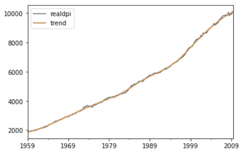
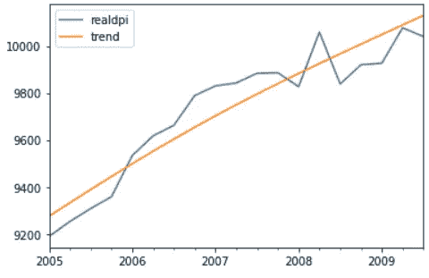

# 时序数据的统计模型

> 原文：<https://levelup.gitconnected.com/statsmodels-for-time-series-data-72ddab409fdc>

## 简要介绍有助于处理时间序列数据的 statsmodel。


卢卡斯·布拉塞克的照片

在 python 中，在处理时序数据时会用到一个非常广泛使用的名为 statsmodel 的库。它基于统计编程语言 r。该模块有助于分析数据、执行统计功能以及创建统计模型。它还具有绘图功能。

所以，让我们开始吧！

# →安装

statsmodel 已经包含在 python 环境文件中。如果使用不同的环境，如 Anaconda，则使用下面的命令进行安装:

> 康达安装统计模型

# →导入包

像 NumPy 和 pandas 这样用来帮助处理数据的基本包是和 matplotlib 一起导入的，用来帮助绘图。

```
**>>> import** pandas **as** pd
**>>> import** numpy **as** np
**>>> import** matplotlib.pyplot **as** plt
**>>> %**matplotlib inline
```

然后也导入 statsmodel。

```
**>>> import** statsmodels.api **as** sm
```

# →获取数据

statsmodels 提供了获取数据集的方法。有如下所示的各种数据集:


将使用的是宏数据，因为它是时间序列数据。使用 load_pandas()方法，数据将被加载。

```
>>> data **=** sm.datasets.macrodata.load_pandas().data
>>> data.head()
```


```
>>> data.tail()
```


为了理解列标题的含义，我们可以使用 NOTE 属性打印详细信息。

```
>>> print(sm.datasets.macrodata.NOTE)
::
    Number of Observations - 203 Number of Variables - 14 Variable name definitions:: year      - 1959q1 - 2009q3
        quarter   - 1-4
        realgdp   - Real gross domestic product (Bil. of chained 2005 US$,
                    seasonally adjusted annual rate)
        realcons  - Real personal consumption expenditures (Bil. of chained
                    2005 US$, seasonally adjusted annual rate)
        realinv   - Real gross private domestic investment (Bil. of chained
                    2005 US$, seasonally adjusted annual rate)
        realgovt  - Real federal consumption expenditures & gross investment
                    (Bil. of chained 2005 US$, seasonally adjusted annual rate)
        realdpi   - Real private disposable income (Bil. of chained 2005
                    US$, seasonally adjusted annual rate)
        cpi       - End of the quarter consumer price index for all urban
                    consumers: all items (1982-84 = 100, seasonally adjusted).
        m1        - End of the quarter M1 nominal money stock (Seasonally
                    adjusted)
        tbilrate  - Quarterly monthly average of the monthly 3-month
                    treasury bill: secondary market rate
        unemp     - Seasonally adjusted unemployment rate (%)
        pop       - End of the quarter total population: all ages incl. armed
                    forces over seas
        infl      - Inflation rate (ln(cpi_{t}/cpi_{t-1}) * 400)
        realint   - Real interest rate (tbilrate - infl)
```

现在要处理时间序列，将 year 列作为索引是很重要的。因此，可以使用 statsmodels 的时间序列分析(tsa)模块对其进行相应的更改。它有一个名为 dates_from_range 的方法，其中可以提到范围。我们以 1959 年第一季度(Q1)为起点，以 2009 年第三季度(Q3)为终点。使用熊猫将为此创建一个索引。

```
>>> idx **=** pd.Index(sm.tsa.datetools.dates_from_range('1959Q1','2009Q3'))
```

既然已经创建了索引，我们可以将它分配给数据帧。

```
>>> data.index **=** idx
>>> data.head()
```


# →可视化

绘制 DPI 的线性图来观察趋势。

```
>>> data['realdpi'].plot()
```


统计模型有助于获得估计的趋势。使用一种称为 Hodrick-Prescott 滤波器的滤波器。该过滤器将时间序列数据区分为趋势和周期成分。应用此过滤器时，它会返回一个由估计周期和趋势组成的元组。

```
>>> dpi **=** sm.tsa.filters.hpfilter(data['realdpi'])
>>> dpi
(1959-03-31     32.611738
 1959-06-30     45.961546
 1959-09-30     23.190972
 1959-12-31     18.550907
 1960-03-31     23.077748
                  ...    
 2008-09-30   -128.596455
 2008-12-31    -87.557288
 2009-03-31   -122.358968
 2009-06-30    -11.941350
 2009-09-30    -89.467814
 Name: realdpi_cycle, Length: 203, dtype: float64,
 1959-03-31     1854.288262
 1959-06-30     1873.738454
 1959-09-30     1893.209028
 1959-12-31     1912.749093
 1960-03-31     1932.422252
                   ...     
 2008-09-30     9966.896455
 2008-12-31    10007.957288
 2009-03-31    10048.758968
 2009-06-30    10089.441350
 2009-09-30    10130.067814
 Name: realdpi_trend, Length: 203, dtype: float64)
```

现在使用元组解包，趋势被提取，然后被绘制。

```
>>> dpi_cycle,dpi_trend **=** sm.tsa.filters.hpfilter(data['realdpi'])
>>> data['trend'] **=** dpi_trend
>>> data[['realdpi','trend']].plot()
```



让我们放大来更好地了解这个情节。

```
>>> data[['realdpi','trend']]['2005-01-01':].plot()
```



至此，您对使用 statsmodels 库有了基本的了解。有关更多详细信息，请查看下面的官方文档。

 [## 简介-统计模型

### statsmodels 是一个 Python 模块，它为许多不同的统计数据的估计提供了类和函数

www.statsmodels.org](https://www.statsmodels.org/stable/index.html) 

> *参见笔记本此处代号*[](https://github.com/jayashree8/Finance_Trading_In_Python/blob/main/Statsmodels%20for%20time%20series%20data/Statsmodel%20for%20time%20series%20data.ipynb)**。**

> **联系我:* [*LinkedIn*](https://www.linkedin.com/in/jayashree-domala8/)*
> 
> **查看我的其他作品:* [*GitHub*](https://github.com/jayashree8)*