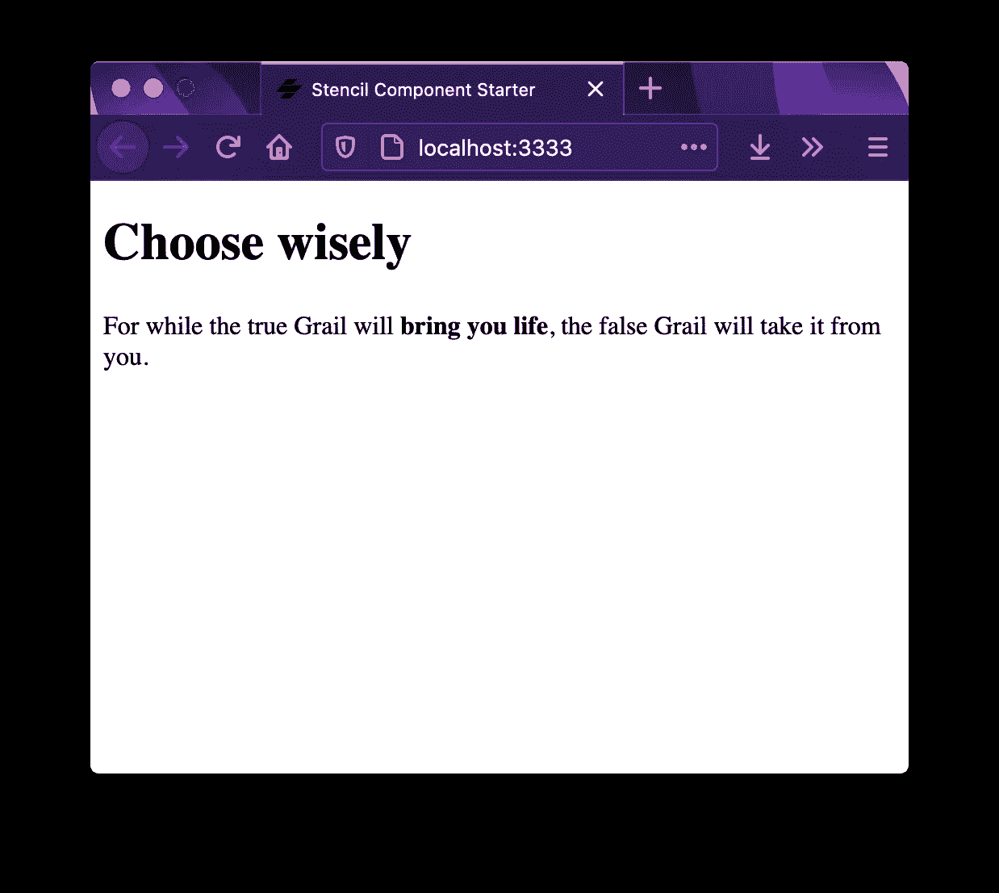
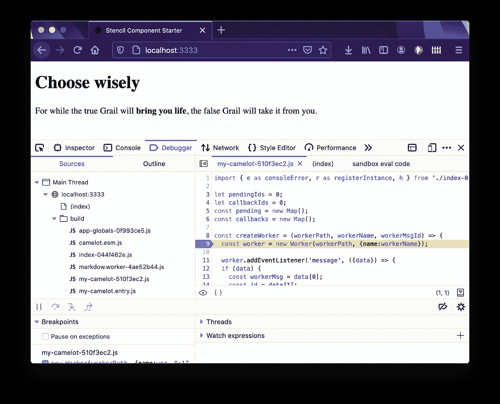

# StencilJS & Web Worker:一个童话

> 原文：<https://levelup.gitconnected.com/stenciljs-web-worker-a-fairy-tale-ec48343fce17>

## 模板编译器的故事和它对 Web Worker API 的神奇集成。


从前，有一个生成 web 组件并构建高性能 Web 应用的编译器，叫做 [StencilJS](https://stenciljs.com) 。在所有创建的构建时工具中，它的目标是构建更快、更强大的组件，这些组件可以跨所有主要框架工作。

在隔壁的互联网上，住着一个男孩(我😉).男孩看着编译器变得越来越有效，越来越对开发者友好。

一天，当他在他心爱的项目 [DeckDeckGo](https://deckdeckgo.com) 中开发新的东西时，这个男孩有了一个想法，要试验一个他至今从未尝试过的编译器特性，集成 [Web Workers](https://stenciljs.com/docs/web-workers) 。

他被结果震惊了，不得不分享那次神奇的遭遇。

# 第一章:胡言乱语

一个男孩发表了一篇博文，但不愿透露任何未知的秘密咒语。同时，没有神奇的词语就没有好的童话。

幸运的是，编译器在一本名为“ [documentation](https://stenciljs.com/docs/web-workers) ”的记录良好的魔法书中向任何人公开分享了它的魔法。

勇敢的骑士们寻求在技术上击败这样的实现，让我建议你看看这些法术，但是，如果相反，你是来这里寻找一个任务，留在我身边，让我告诉你剩下的故事。

# 第二章:初始化卡梅洛特

亚瑟王和圆桌有卡梅洛特，我们，开发者，有 Web 组件和影子 DOM，可以比喻成城堡。这就是为什么我们在尝试新的魔术之前要初始化一个新的模板操场。

```
npm init stencil
```

此外，为了复制男孩尝试过的精确公式，我们使用了 [Marked.js](https://marked.js.org/) 来增强我们的防御工事，以便我们给组件一个目标，从 Markdown 到 HTML 呈现一个神奇的句子。

```
npm i marked @types/marked
```

已经找到了一些迫击炮，我们正在创建一个组件，旨在通过在生命周期`componentWillLoad`时将 markdown 转换为 HTML，并通过使用本地状态来应用它，从而再现渲染咒语。

```
import { Component, h, State } from '@stencil/core';

import { parseMarkdown } from './markdow';

@Component({
  tag: 'my-camelot',
  shadow: true,
})
export class MyCamelot {

  @State()
  private markdownHtml: string;

  async componentWillLoad() {
    this.markdownHtml = await parseMarkdown(`# Choose wisely

For while the true Grail will **bring you life**, the false Grail will take it from you.`
    );
  }

  render() {
    return <div innerHTML={this.markdownHtml}></div>;
  }
}
```

此外，我们将这个神奇的功能外化到一个单独的文件中，我们可以称之为`markdown.ts`。

```
import marked from 'marked';

export const parseMarkdown = async (text: string) => {
  const renderer = new marked.Renderer();

  return marked(text, {
    renderer,
    xhtml: true,
  });
};
```

有些人可能什么都不怕，可能在他们的本地计算机`npm run start`上运行上面的代码，他们可能会观察到下面的结果。



# 第三章:咒语召唤

这个男孩已经发表了关于 Web Workers 的文章，一篇是关于他们在 React 应用中的原生 [JavaScript 集成，另一篇展示了他们与 Angular](/react-and-web-workers-c9b60b4b6ae8) 的[集成。](https://medium.com/swlh/angular-and-web-workers-17cd3bf9acca)

从在 Javascript 版本中为工作人员提供可用的库，到在这两个版本中使用侦听器和创建对象来加载这些库，即使从某个角度来看需要很少的工作，但仍然需要更多的工作和代码。

与此相反，让这个男孩惊奇的是，Stencil 通过简单地调用一个独特的咒语使所有这些步骤变得神奇:`mv markdown.ts markdown.worker.ts`

事实上，正如你在下面的截图中注意到的，任何在以`.worker.ts`结尾的`src`目录中的 TypeScript 文件都将自动使用模板编译器的一个 worker，据这个男孩所知，这是他尝试过的最神奇的 Web Worker 配方🔥。



# 收场白

简化了这种集成的 [Stencil 的](https://stenciljs.com)编译器再次展示了它的全部潜力。和网络工作者一起，他们有希望会有许多孩子，许多令人惊奇的网络组件和应用程序。

到无限和更远的地方！

大卫

你可以在推特上联系我，为什么不试着在 [DeckDeckGo](https://deckdeckgo.com/) 上发表你的下一次演讲。