# 步步姜戈频道

> 原文：<https://levelup.gitconnected.com/step-by-step-django-channels-b17a58141de1>

## 用 Django 频道构建实时应用


沃洛季米尔·赫里先科在 [Unsplash](https://unsplash.com/s/photos/chat?utm_source=unsplash&utm_medium=referral&utm_content=creditCopyText) 上的照片

Django 通常以同步方式处理 HTTP 响应。我们使用 Django 通道来开发实时、动态更新的应用程序，这些应用程序可以通过扩展 Django 的 HTTP 能力来异步工作。例如，您想使用 Django 开发一个聊天应用程序或一个处理来自物联网传感器的实时数据的应用程序，或者一个可以与 WebSocket 一起工作以实现任何目的的应用程序。在这种情况下，您应该参考的扩展是 Django Channels。

## 同步与异步

让我们先来看看 Django 的同步和异步工作是什么。

Django 同步工作。也就是说，HTTP 请求是完全同步处理的。发送请求，等待，然后返回响应。

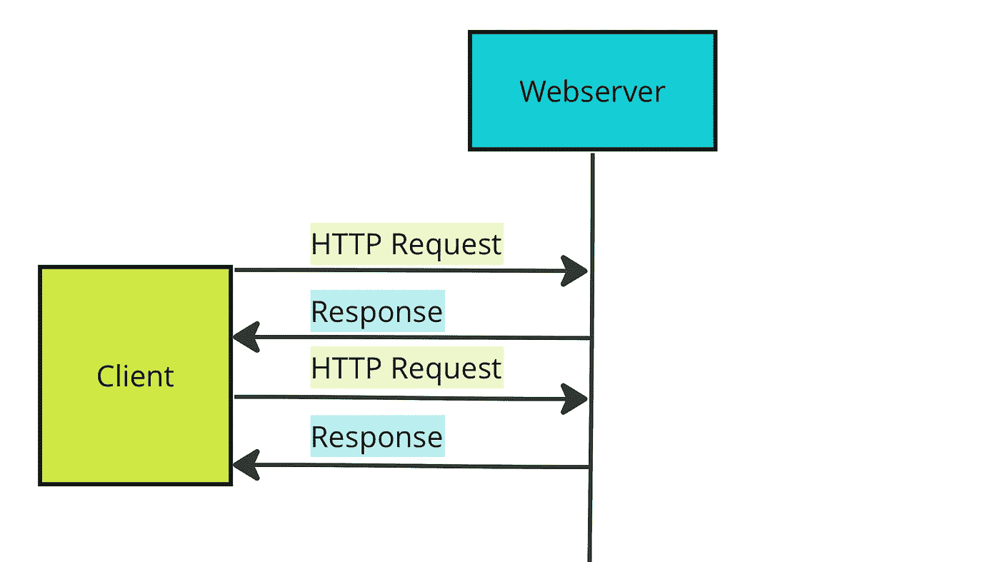

同步。图片由作者提供。

服务器无法向客户端发送一条消息。在同步操作中，应该有请求才能得到响应。

在异步操作中，我们发起一个请求。没有等待响应，应用程序继续为用户服务并执行任务。

## Websockets

Websockets 是一种可以在浏览器和服务器之间建立双向通信的协议(HTTP 是一种单向协议)。客户端可以向服务器发送消息并接收关于相关事件的消息，而不必等待响应。双方可以同时相互独立通信。

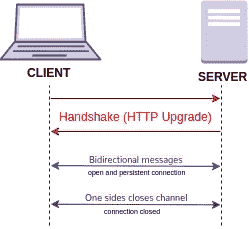

描述使用 WebSocket 的连接的图表。来源:[维基百科](https://en.wikipedia.org/wiki/WebSocket)

Websocket 是一个有状态协议，这意味着客户端和服务器之间的连接保持活动状态，直到被其中一方(客户端或服务器)终止。在客户端或服务器关闭连接后，连接从两端终止。

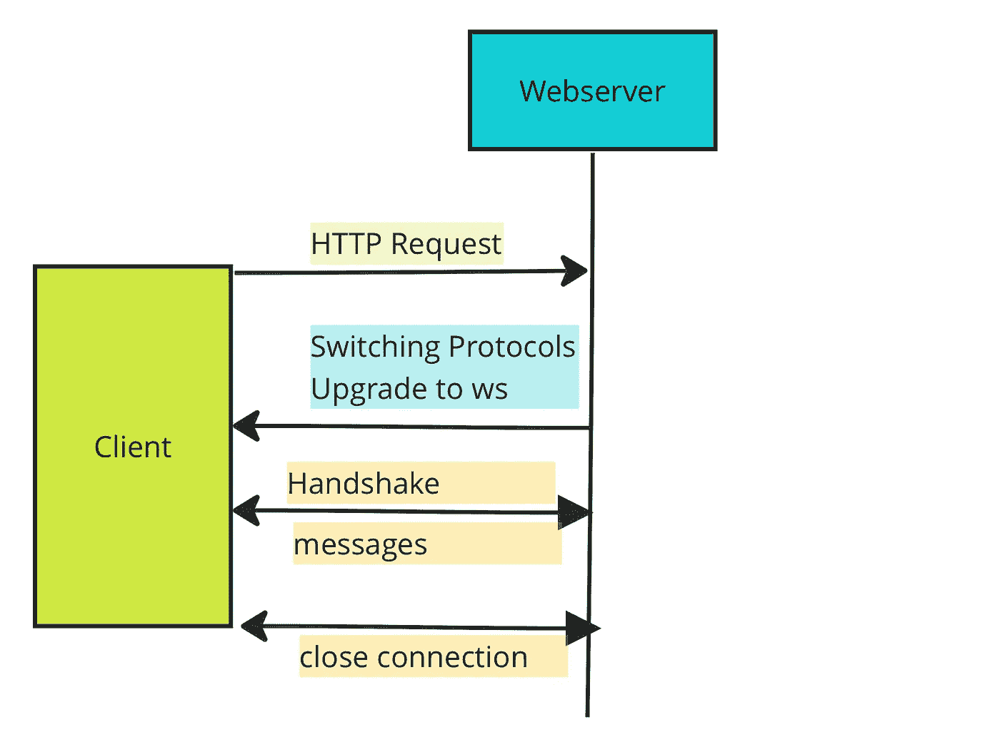

Websocket 连接。图片由作者提供。

在第一步中，客户端向服务器发送一个 HTTP 请求。它要求服务器打开一个 WebSocket 连接。服务器接受它并返回 101 交换协议响应。至此，握手完成。TCP/IP 连接保持开放，双方都可以发送消息。连接保持打开，直到其中一个断开。这个过程通常被称为全双工。

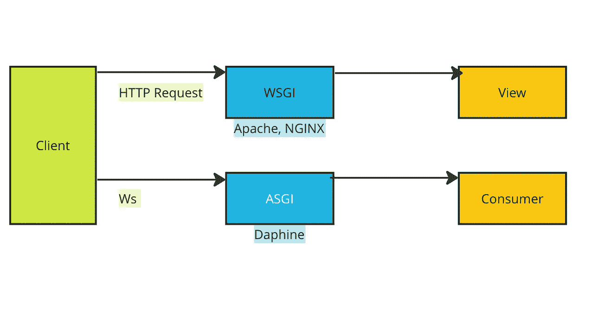

Django App 中 HTTP 和 Websockets 的比较。图片由作者提供。

当客户端发送 HTTP 请求时，Django 应用程序会通过 WSGI (web 服务器网关接口)接收该请求。它在 Django 的 URL 中结束，并被路由到 Django 的视图。

对于 WebSockets，负责的是 ASGI(异步服务器网关接口)而不是 WSGI。并且它被路由到消费者而不是视图。

你可以在这里得到项目代码[。](https://github.com/okanyenigun/django-channel-example)

[渠道包文档。](https://channels.readthedocs.io/en/stable/)

*pip 安装频道*

# 示例 1

在这个例子中，我们将构建一个实时系统来更新一个 *div* HTML 元素中的计数器。这个应用程序将只为一个用户工作。因此，这不是渠道的最佳用例，而是一个简单的开始。

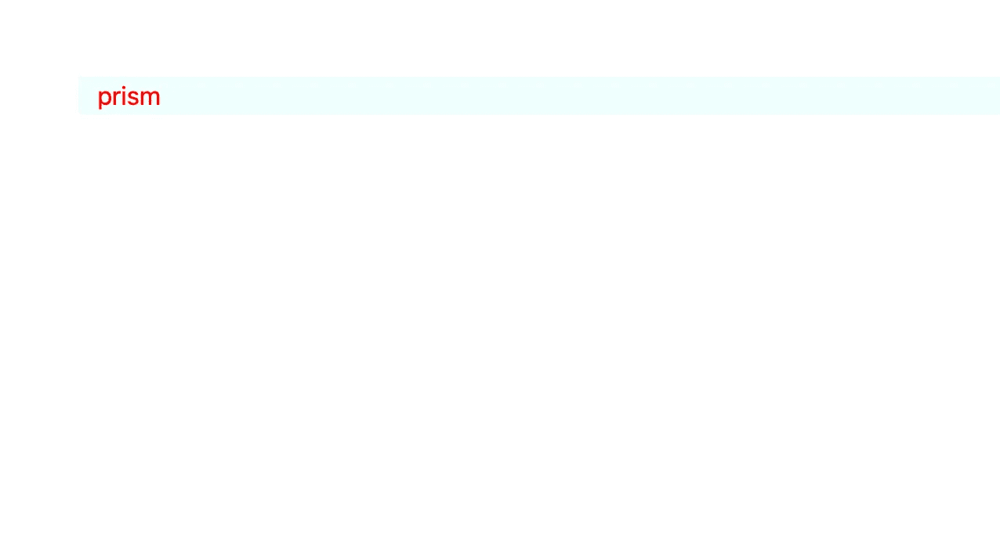

例 1 页。图片由作者提供。

业务逻辑是一个随机的单词生成器。它会在页面上显示一个实时生成的随机单词，无需刷新页面。

```
#business.py

import json
#pip install random_word
from random_word import RandomWords

class Domain:

    def __init__(self):
        self.R = RandomWords()

    def do(self):
        word = self.R.get_random_word()
        return json.dumps({"message": word})
```

```
#urls.py

from django.urls import path
from one.views import one

urlpatterns = [
    path('one/', one),
]
```

```
#views.py
from django.shortcuts import render

def one(request):
    return render(request, './templates/one.html', context={'one_text': "ASD"})
```

我们有一个简单的页面来显示传递的单词。

```
  
<div class="container">
  <p id="one">{{ one_text }}</p>
</div>

<script>
  var socket = new WebSocket("ws://localhost:8000/ws/any_url/");
  socket.onmessage = function (event) {
    var data = JSON.parse(event.data);
    console.log(data);
    document.querySelector("#one").innerText = data.message;
  };
</script>

```

不要忘记将频道(和您的应用)添加到已安装的应用中。

```
#settings.py

INSTALLED_APPS = [
    'django.contrib.admin',
    'django.contrib.auth',
    'django.contrib.contenttypes',
    'django.contrib.sessions',
    'django.contrib.messages',
    'django.contrib.staticfiles',

    'channels',
    'one',
]
```

我们需要更新 asgi 文件，因为我们正在使用 WebSockets。我们将应用程序变量设置为一个*协议类型路由器*类型。它检查连接类型和协议。

如果协议类型是正确的，那么它被提供给 *AuthMiddlewareStack* 来检查用户的认证。一个 *URLRouter* 将我们的消费者路由作为参数传递给中间件。

```
#asgi.py

import os

from django.core.asgi import get_asgi_application

from channels.routing import ProtocolTypeRouter, URLRouter
from channels.auth import AuthMiddlewareStack

from one.routing import ws_urlpatterns

os.environ.setdefault('DJANGO_SETTINGS_MODULE', 'examplechannels.settings')

application = ProtocolTypeRouter(
    {
        'http': get_asgi_application(),
        'websocket': AuthMiddlewareStack(URLRouter(ws_urlpatterns)),
    }
) 
```

要使用 asgi，我们必须在 *settings.py* 中定义它(只需复制并编辑默认的 *WSGI_APPLICATION* 变量)。

```
#settings.py

WSGI_APPLICATION = 'examplechannels.wsgi.application'

ASGI_APPLICATION = 'examplechannels.asgi.application'
```

让我们创建一个消费者(~view for WebSockets)。对于这个例子，我们只需要覆盖父类的 *connect* 方法( *WebsocketConsumer* )。

它将简单地从域对象中获取数据一百次，每次它将休眠两秒钟。

```
import time
from channels.generic.websocket import WebsocketConsumer
from one.bussiness import Domain

class OneConsumer(WebsocketConsumer):

    def connect(self):
        self.accept()
        D = Domain()
        for i in range(100):
            data = D.do()
            self.send(data)
            time.sleep(2)
```

我们需要为消费者创建路由，就像我们创建 URL 一样。

```
#routing.py

from django.urls import path
from one.consumers import OneConsumer

ws_urlpatterns = [
    path('ws/any_url/', OneConsumer.as_asgi())
]
```

让我们通过简单地输入命令来启动服务器:*python manage . py runserver*

```
System check identified no issues (0 silenced).
November 28, 2022 - 19:17:33
Django version 4.0, using settings 'examplechannels.settings'
**Starting ASGI/Channels version** 3.0.4 development server at http://127.0.0.1:8000/
Quit the server with CONTROL-C.
```

我们到页面:*http://127 . 0 . 0 . 1:8000/one/*

```
HTTP GET /one/ 200 [0.03, 127.0.0.1:50603]
HTTP GET /static/css/one-style.css?1669663076 200 [0.01, 127.0.0.1:50603]
WebSocket HANDSHAKING /ws/any_url/ [127.0.0.1:50605]
WebSocket CONNECT /ws/any_url/ [127.0.0.1:50605]
```

让我们在浏览器中检查控制台:

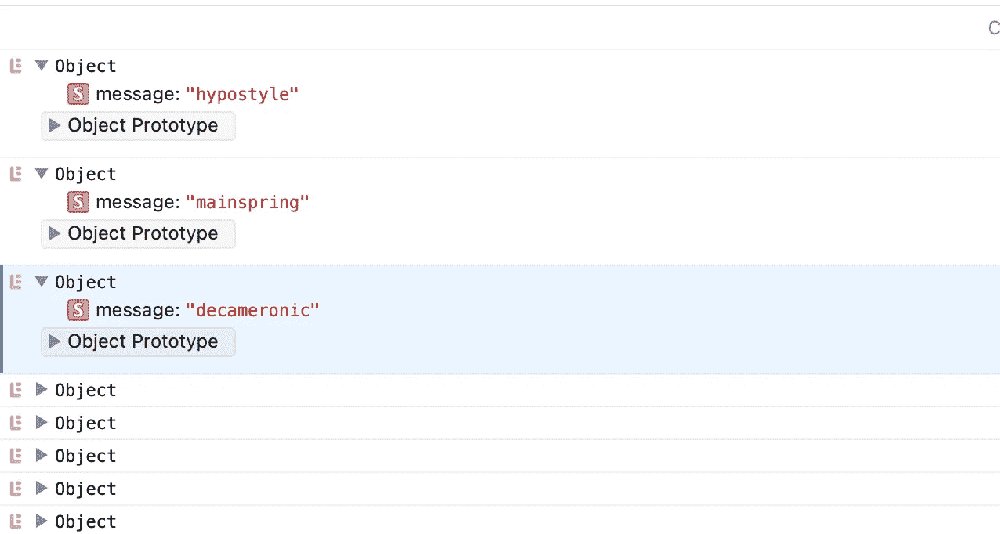

一个应用程序页面的控制台。图片由作者提供。

每两秒钟发送一个携带单词的新对象。

# 示例 2

这次让我们像模拟物联网机制一样实时更新图形。创建了一个名为 *two* 的新应用程序。

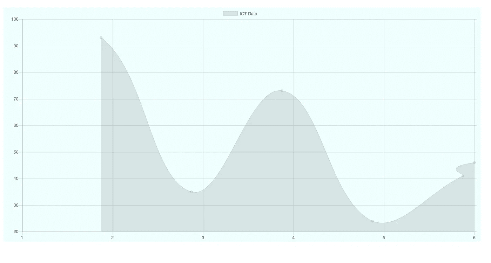

第二个应用程序的页面。图片由作者提供。

我们将使用 [Chartjs](https://www.chartjs.org/docs/latest/getting-started/) 来显示我们的物联网数据。所以，我们有一个*画布*标签。并且，我们需要使用 Chartjs cdn 来使用它。我们还有另一个名为 *two.js* 的 JavaScript 文件。它将处理图表操作。

```
  
<link rel="stylesheet" href="?" />

<div class="container">
  <div class="chart">
    <canvas id="iot-chart" width="800" height="400"></canvas>
  </div>
</div>
<script src="https://cdnjs.cloudflare.com/ajax/libs/Chart.js/2.4.0/Chart.min.js"></script>
<script src=""></script>

```

我们的域类只是返回一个随机整数。

```
#business.py

import json
import random

class DomainTwo:

    def do(self):
        value = random.randint(0,100)
        return json.dumps({'data': value})
```

我们有相似的路由、URL 和视图:

```
#routing.py

from django.urls import path
from two.consumers import TwoConsumer

ws_urlpatterns = [
    path('ws/two_url/', TwoConsumer.as_asgi())
]
```

```
 #urls.py

from django.urls import path
from two.views import two

urlpatterns = [
    path('two/', two),
]
```

```
#views.py

from django.shortcuts import render

def two(request):
    return render(request, './templates/two.html')
```

这次我们正在构建一个异步工作通道。因此，我们使用了 AsyncWebsocketConsumer 和 async-await 结构。

```
#consumers.py

import time
from channels.generic.websocket import AsyncWebsocketConsumer
from asyncio import sleep
from two.business import DomainTwo

class TwoConsumer(AsyncWebsocketConsumer):

    async def connect(self):
        await self.accept()
        D = DomainTwo()
        for i in range(100):
            data = D.do()
            await self.send(data)
            await sleep(2)
```

为了让应用程序异步工作，每个客户端都必须获得一个新的消费者实例。为了实现它，我们将使用**通道层。**这些层是 FIFO(先进先出)数据结构。它们在队列数据结构中传送从客户端接收的消息。在这种情况下我们需要安装 [Redis](https://redis.io/download/) 。Redis 是内存中的数据存储。

对于 MACOS: *brew 安装 redis*

安装完成后，在命令提示符下键入 *redis-server* :

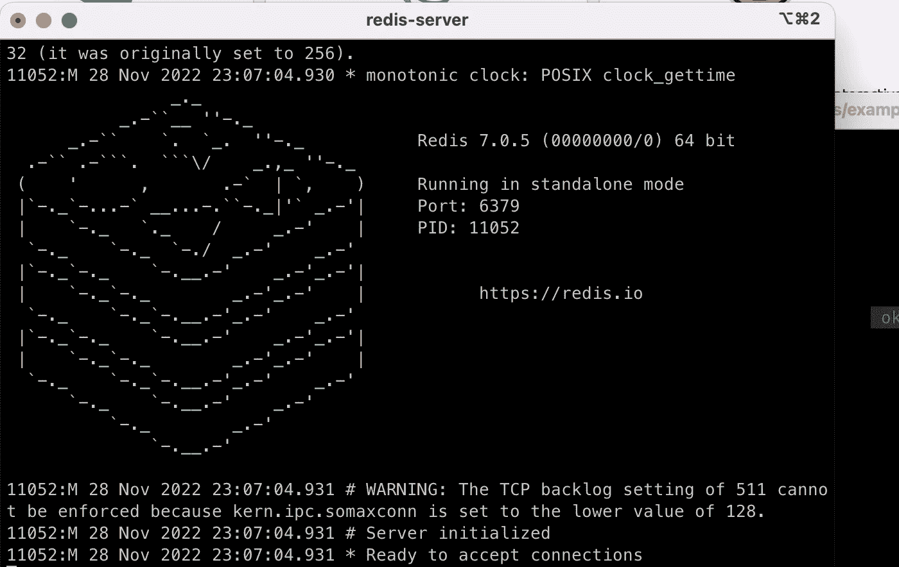

运行 redis-server。图片由作者提供。

为了能够正确使用它，我们还需要安装 channels-redis:

*pip 安装通道-redis*

我们在设置文件中定义通道层:

```
#settings.py

CHANNEL_LAYERS = {
    'default' : {
        'BACKEND' : 'channels_redis.core.RedisChannelLayer',
        'CONFIG': {
            'hosts':[('127.0.0.1', 6739)]
        }
    }
}
```

6739 是 Redis 服务器使用的端口。

当我们运行服务器并转到第二个应用程序的 URL 时:

```
System check identified no issues (0 silenced).
November 28, 2022 - 21:07:30
Django version 4.0, using settings 'examplechannels.settings'
Starting ASGI/Channels version 3.0.4 development server at http://127.0.0.1:8000/
Quit the server with CONTROL-C.
HTTP GET /two/ 200 [0.03, 127.0.0.1:51340]
HTTP GET /static/css/one-style.css?1669669655 200 [0.01, 127.0.0.1:51340]
HTTP GET /static/js/two.js 200 [0.02, 127.0.0.1:51341]
WebSocket HANDSHAKING /ws/two_url/ [127.0.0.1:51343]
WebSocket CONNECT /ws/two_url/ [127.0.0.1:51343]
```

WebSocket 正在运行。每两秒钟就有新数据进来。

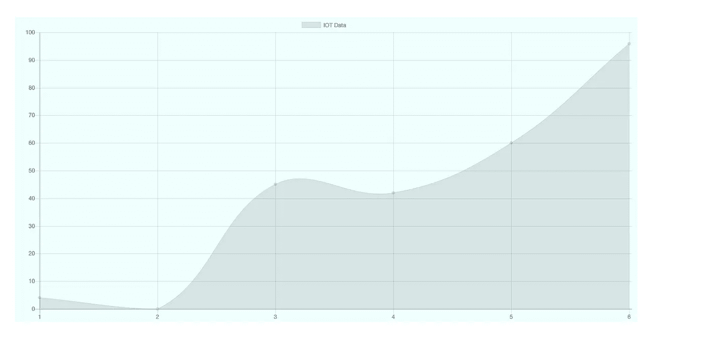

图表。图片由作者提供。

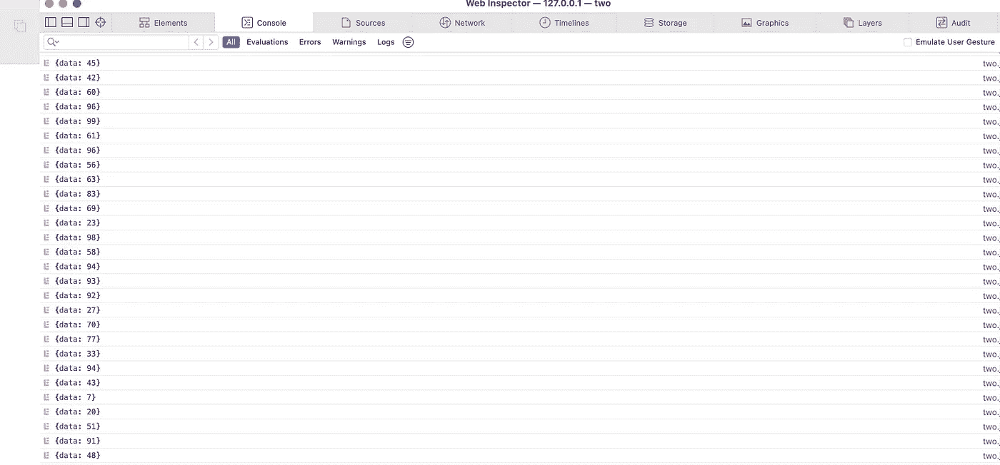

控制台。图片由作者提供。

# 示例 3

这次我们来搭建一个聊天 app。

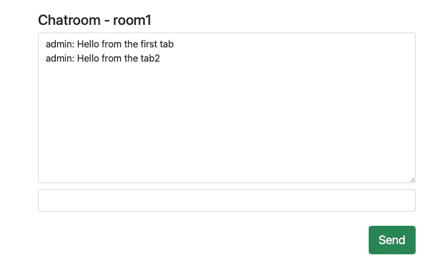

聊天室页面。图片由作者提供。

在本例中，我们需要创建用户组，以便在聊天室中找到他们。这样，在聊天室里，我们将向哪些用户发送消息就一目了然了。


消息传输。图片由作者提供。

我们有聊天应用程序的主页和每个聊天室的页面。

```
#urls.py

from django.urls import path
from threechat.views import chat, room

urlpatterns = [
    path('chat/', chat, name='chat_index'),
    path('chat/<str:room_name>/', room, name="chat_room"),
]
```

```
#views.py

from django.shortcuts import render

# Create your views here.
def chat(request):
    return render(request, './templates/threechat.html', context={})

def room(request, room_name):
    return render(request, './templates/threeroom.html', context={'room_name': room_name})
```

我们在 *re_path* 中使用 *w+* ，因为它基本上与 *chat/* 之后出现的任何内容相匹配，它将被识别并传递给消费者。

```
#routing.py

from django.urls import re_path
from threechat.consumers import RoomConsumer

ws_urlpatterns = [
    re_path(r'ws/chat/(?P<room_name>\w+)/$', RoomConsumer.as_asgi())
]
```

```
  
<link rel="stylesheet" href="?" />
<div>
  <div class="container">
    <div class="row d-flex justify-content-center">
      <div class="col-6">
        <form>
          <div class="form-group">
            <label for="textarea1" class="h4 pt-5"
              >Chatroom - {{room_name}}</label
            >
            <textarea class="form-control" id="chat-text" rows="10"></textarea>
          </div>
          <div class="form-group">
            <input class="form-control" id="input" type="text" /><br />
          </div>
          <input
            class="btn btn-success btn-lg btn-block"
            id="submit"
            type="button"
            value="Send"
          />
        </form>
      </div>
    </div>
  </div>
</div>
{{room_name|json_script:"room-name"}}
{{request.user.username|json_script:"username"}}
<script>
  const userName = JSON.parse(document.getElementById("username").textContent);
  const roomName = JSON.parse(document.getElementById("room-name").textContent);
  document.querySelector("#submit").onclick = function (e) {
    const msgInput = document.querySelector("#input");
    const message = msgInput.value;
    chatSocket.send(JSON.stringify({ message: message, username: userName }));
    msgInput.value = "";
  };

  const chatSocket = new WebSocket(
    "ws://" + window.location.host + "/ws/chat/" + roomName + "/"
  );

  chatSocket.onmessage = function (event) {
    const data = JSON.parse(event.data);
    document.querySelector("#chat-text").value +=
      data.username + ": " + data.message + "\n";
  };
</script>
<script
  src="https://code.jquery.com/jquery-3.5.1.slim.min.js"
  integrity="sha384-DfXdz2htPH0lsSSs5nCTpuj/zy4C+OGpamoFVy38MVBnE+IbbVYUew+OrCXaRkfj"
  crossorigin="anonymous"
></script>
<script
  src="https://cdn.jsdelivr.net/npm/popper.js@1.16.1/dist/umd/popper.min.js"
  integrity="sha384-9/reFTGAW83EW2RDu2S0VKaIzap3H66lZH81PoYlFhbGU+6BZp6G7niu735Sk7lN"
  crossorigin="anonymous"
></script>
<script
  src="https://stackpath.bootstrapcdn.com/bootstrap/4.5.2/js/bootstrap.min.js"
  integrity="sha384-B4gt1jrGC7Jh4AgTPSdUtOBvfO8shuf57BaghqFfPlYxofvL8/KUEfYiJOMMV+rV"
  crossorigin="anonymous"
></script>

```

我们使用这种符号(如下)将数据从 Django 端传输到 JavaScript 端。我们需要来自路由( *w+* )的*房间名*和来自请求的用户名。

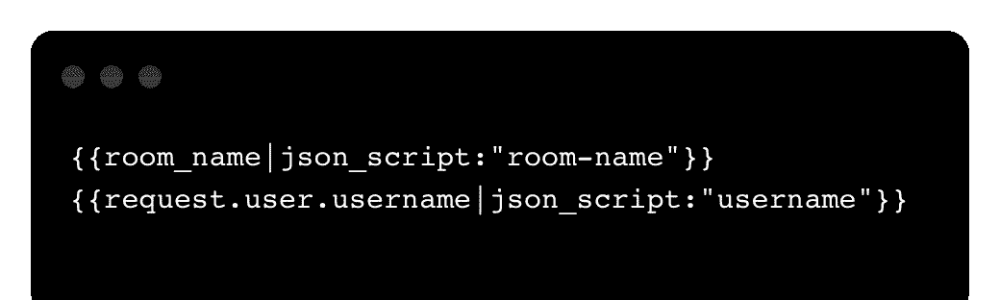

在这里，我们解析从 Django(用户名)获得的数据，并将其与用户输入的输入消息一起发送到 WebSocket。

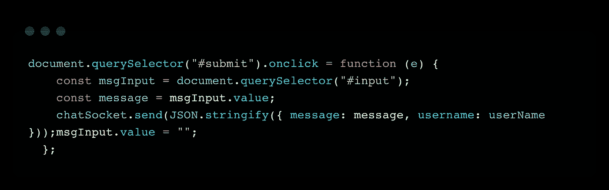

我们定义一个 WebSocket，类似于我们在上面的例子中所做的。当一个消息被传送给它时，它解析数据并把它们传递给屏幕。

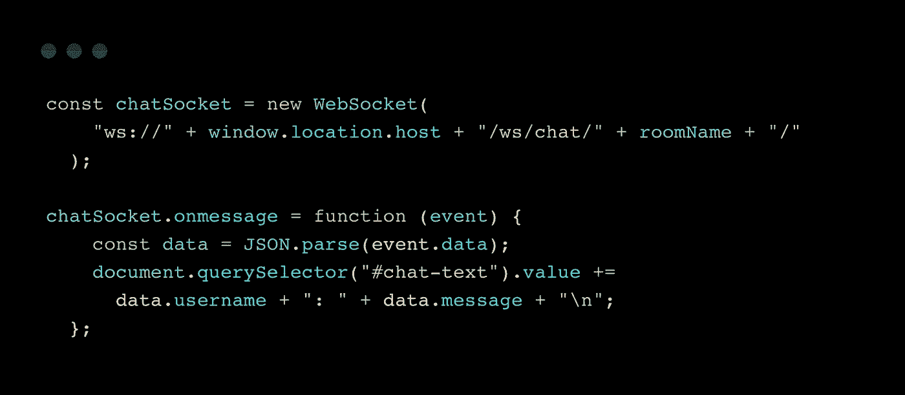

我们定义了异步消费者。

```
#consumers.py

import json
from channels.generic.websocket import AsyncWebsocketConsumer

class RoomConsumer(AsyncWebsocketConsumer):
    async def connect(self):
        self.room_name = self.scope['url_route']['kwargs']['room_name']
        self.room_group_name = 'chat_%s' % self.room_name

        await self.channel_layer.group_add(self.room_group_name, self.channel_name)

        await self.accept()

    async def disconnect(self, code):
        await self.channel_layer.group_discard(self.room_group_name, self.channel_name)

    async def receive(self, text_data):
        text_data_json = json.loads(text_data)
        message = text_data_json['message']
        username = text_data_json['username']

        await self.channel_layer.group_send(self.room_group_name, {'type':'chatroom_message','message':message, 'username':username})

    async def chatroom_message(self, event):
        message = event['message']
        username = event['username']
        await self.send(text_data=json.dumps({'message':message, 'username':username}))
```

首先我们覆盖*连接*方法。

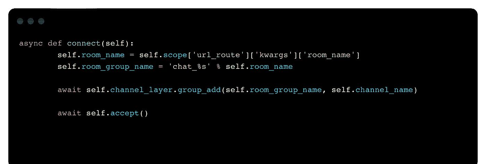

让我们打印 *self.scope* 来看看它发送了什么:

```
{'type': 'websocket', 'path': '/ws/chat/asd/', 'raw_path': b'/ws/chat/asd/', 
'headers': [(b'host', b'127.0.0.1:8000'), (b'pragma', b'no-cache'), 
            (b'accept', b'*/*'), (b'sec-websocket-key', 
             (b'DtE1JGLUF0e8X2DLld6l6g=='), (b'sec-websocket-version', b'13'), 
             (b'accept-language', b'en-US,en;q=0.9'), 
(b'sec-websocket-extensions', b'permessage-deflate'), 
(b'cache-control', b'no-cache'), (b'accept-encoding', b'gzip, deflate'), 
(b'origin', b'http://127.0.0.1:8000'), 
(b'user-agent', 
b'Mozilla/5.0 (Macintosh; Intel Mac OS X 10_15_7) AppleWebKit/605.1.15 (KHTML, like Gecko) Version/16.1 Safari/605.1.15'), (b'connection', b'Upgrade'), 
(b'upgrade', b'websocket'), (b'cookie', b'csrftoken=qNTynYDGkiIdYsAZEHlqZwuqv98D3EBMZopHw87eOENNOavGczQyX286og7GFCHQ; sessionid=nwxc4zfv1lnq515wdqhxzcqfzln7bev6')], 
'query_string': b'', 
'client': ['127.0.0.1', 49417], 
'server': ['127.0.0.1', 8000], 
'subprotocols': [], 'asgi': {'version': '3.0'}, 
'cookies': {'csrftoken': 'qNTynYDGkiIdYsAZEHlqZwuqv98D3EBMZopHw87eOENNOavGczQyX286og7GFCHQ', 'sessionid': 'nwxc4zfv1lnq515wdqhxzcqfzln7bev6'}, 
'session': <django.utils.functional.LazyObject object at 0x7f9a68617d00>, 
'user': <channels.auth.UserLazyObject object at 0x7f9a483da370>, 
'path_remaining': '', 'url_route': {'args': (), 
'kwargs': {'room_name': 'asd'}}}
```

最后，我们有了 *kwargs* ，我们可以得到用户输入的聊天室名称。

我们把*‘chat _’*前缀放在它前面，创建一个群组，把它们添加到通道层。因此，将会有不同的聊天室分享相同的信息。用户将加入这些不同的房间。

然后，请求被接受，握手完成。

我们可以覆盖 *disconnect* 方法，以便在聊天组断开时将其从层中丢弃。

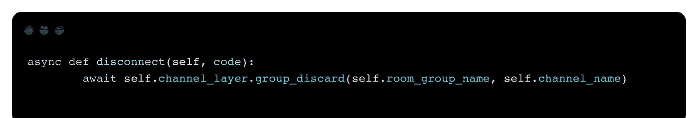

除此之外，我们需要覆盖*接收*方法。

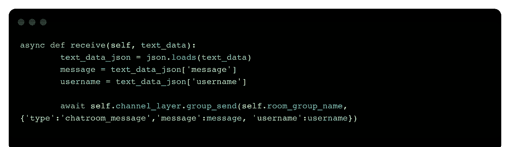

它接收一个*文本数据*:

```
text_data:  {"message":"adsasd","username":"admin"}
```

记住，它是从 JavaScript 发布的:

```
chatSocket.send(JSON.stringify({ message: message, username: userName }));
```

我们解析数据并将其发送到聊天室。我们将类型声明为 chatroom_message，因此我们创建了一个同名的方法。我们转储消息和用户名。

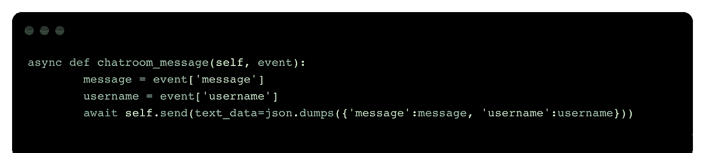

所以，现在就来试试吧。 *python manage.py runserver*

```
System check identified no issues (0 silenced).
November 29, 2022 - 06:55:23
Django version 4.0, using settings 'examplechannels.settings'
Starting ASGI/Channels version 3.0.4 development server at http://127.0.0.1:8000/
Quit the server with CONTROL-C.
```

*http://127 . 0 . 0 . 1:8000/chat/room 1/*

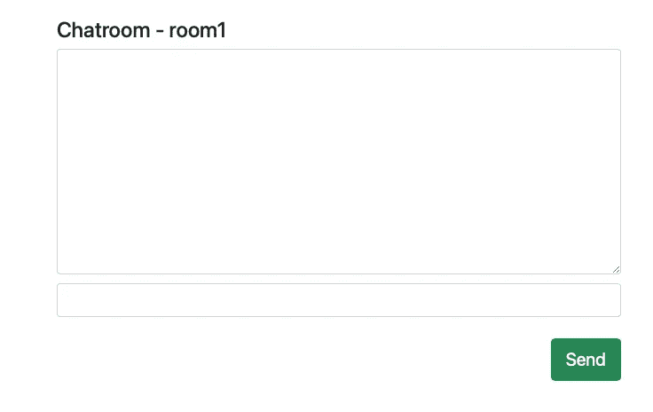

聊天室页面。图片由作者提供。

第一条消息:

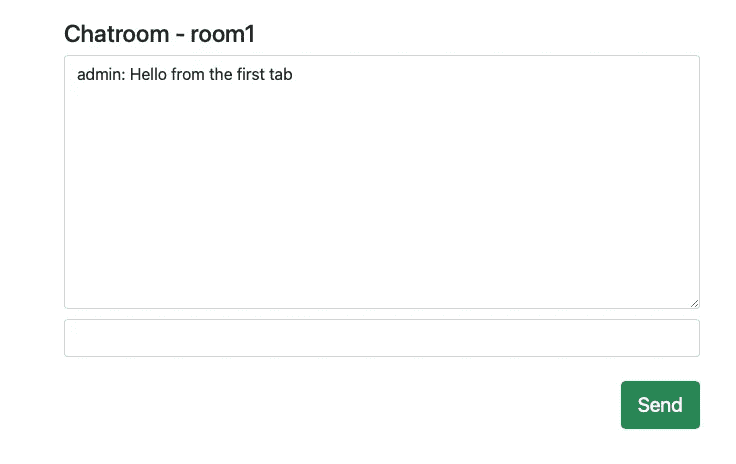

聊天室页面。图片由作者提供。

让我们打开一个具有相同地址的新选项卡，并输入一条消息。

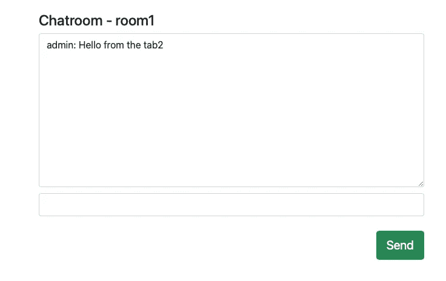

聊天室页面。图片由作者提供。

如果我们返回到第一个选项卡，我们将看到来自第二个选项卡的消息。页面未刷新。


聊天室。图片由作者提供。

# 结论

Django 通道允许我们开发实时异步的 Django 应用程序。这是一个允许我们绕过 Django 的同步 HTTP 请求限制的杠杆。

我试图用从简单到复杂的不同例子来解释这个问题。我希望它是清楚的。谢谢你。

# 阅读更多

[](https://awstip.com/discovering-django-forms-dc4b4d9970d9) [## 发现 Django 表单

### 在 Django 中使用表单

awstip.com](https://awstip.com/discovering-django-forms-dc4b4d9970d9) [](https://blog.devgenius.io/writing-django-views-8835ff4c7166) [## 编写 Django 视图

### Django 观点解释

blog.devgenius.io](https://blog.devgenius.io/writing-django-views-8835ff4c7166) [](/restful-django-django-rest-framework-8b62bed31dd8) [## RESTful Django — Django REST 框架

### 让我们开发一个 RESTful Django 项目

levelup.gitconnected.com](/restful-django-django-rest-framework-8b62bed31dd8) [](https://faun.pub/concurrency-parallelism-in-python-59ea61e34ae0) [## Python 中的并发和并行

### 多线程、多处理、异步和等待

faun.pub](https://faun.pub/concurrency-parallelism-in-python-59ea61e34ae0) [](https://python.plainenglish.io/how-to-use-python-decorators-8e861f03007b) [## Python Decorators 的内部

### 用简单的例子解释装饰者

python .平原英语. io](https://python.plainenglish.io/how-to-use-python-decorators-8e861f03007b) [](https://medium.com/mlearning-ai/about-the-importance-of-data-in-machine-learning-ffa66657ee77) [## 关于数据在机器学习中的重要性

### 你一直想知道但不敢问的关于数据的一切

medium.com](https://medium.com/mlearning-ai/about-the-importance-of-data-in-machine-learning-ffa66657ee77) [](https://python.plainenglish.io/smart-aspects-of-catboost-algorithm-2720a6de4da6) [## CatBoost 算法的智能方面

### Yandex 的 CatBoost ML 模型的介绍与实现

python .平原英语. io](https://python.plainenglish.io/smart-aspects-of-catboost-algorithm-2720a6de4da6) 

# 来源

[https://channels.readthedocs.io/en/stable/](https://channels.readthedocs.io/en/stable/)

[https://developer . Mozilla . org/en-US/docs/Web/API/Web sockets _ API](https://developer.mozilla.org/en-US/docs/Web/API/WebSockets_API)

[https://www.youtube.com/watch?v=F4nwRQPXD8w](https://www.youtube.com/watch?v=F4nwRQPXD8w)

[https://www.youtube.com/watch?v=1BfCnjr_Vjg](https://www.youtube.com/watch?v=1BfCnjr_Vjg)

[https://www.youtube.com/watch?v=R4-XRK6NqMA](https://www.youtube.com/watch?v=R4-XRK6NqMA)

[https://www.youtube.com/watch?v=tZY260UyAiE](https://www.youtube.com/watch?v=tZY260UyAiE)

[https://www.chartjs.org/docs/latest/getting-started/](https://www.chartjs.org/docs/latest/getting-started/)

[https://redis.io/](https://redis.io/)

[https://real python . com/getting-started-with-django-channels/](https://realpython.com/getting-started-with-django-channels/)

https://testdriven.io/blog/django-channels/

# 分级编码

感谢您成为我们社区的一员！在你离开之前:

*   👏为故事鼓掌，跟着作者走👉
*   📰查看更多内容请参见[升级编码刊物](https://levelup.gitconnected.com/?utm_source=pub&utm_medium=post)
*   🔔关注我们:[Twitter](https://twitter.com/gitconnected)|[LinkedIn](https://www.linkedin.com/company/gitconnected)|[时事通讯](https://newsletter.levelup.dev)

🚀👉 [**加入升级人才集体，找到一份神奇的工作**](https://jobs.levelup.dev/talent/welcome?referral=true)