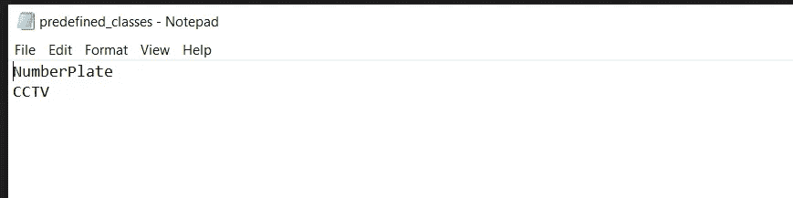
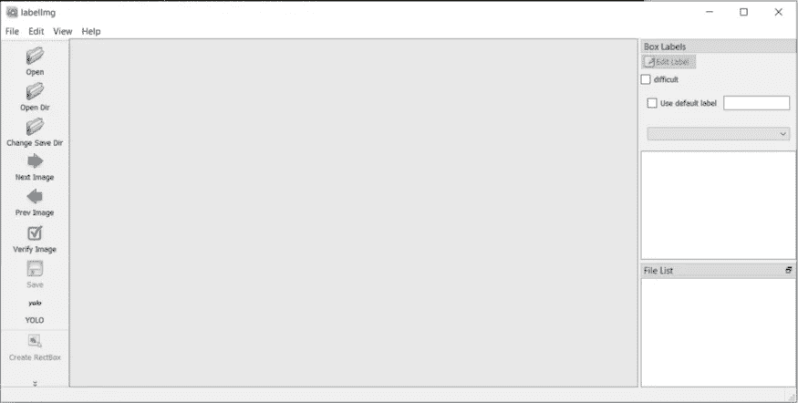
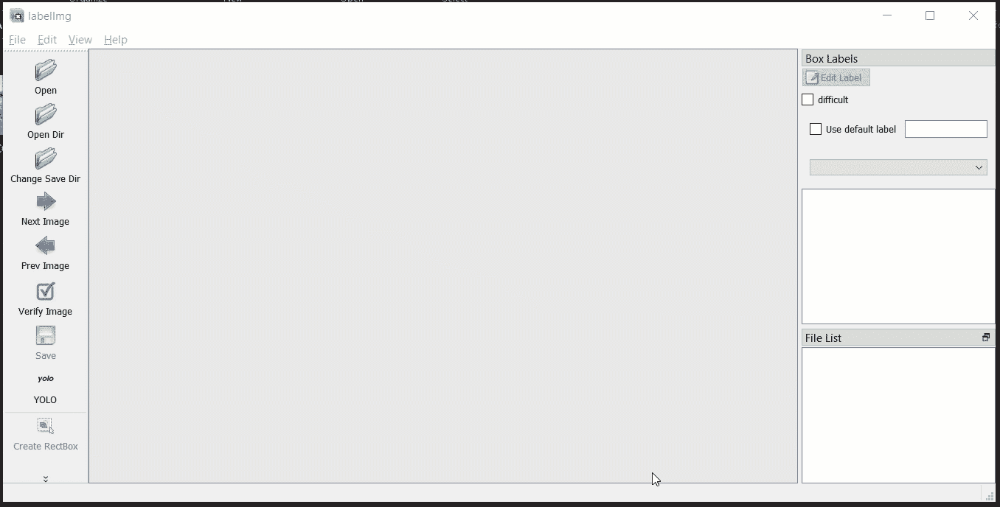
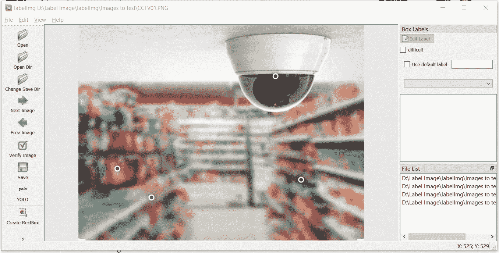
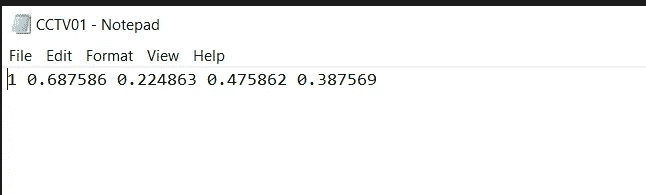

# 使用 Python 标记对象检测训练图像的分步指南

> 原文：<https://levelup.gitconnected.com/step-by-step-guide-for-labeling-object-detection-training-images-using-python-f339d73ba464>

## 使用 Python 进行图像标注


汤姆·克鲁在 [Unsplash](https://unsplash.com?utm_source=medium&utm_medium=referral) 上拍摄的照片

目标检测是当前计算机视觉最热门的领域之一。对象检测简单地说就是为任何图像、视频或直播流中出现的每个项目提供一个标签。

今天，我们有许多算法可以为我们提供实时的对象检测结果。当我们谈论实时时，这意味着使用任何闭路电视摄像机，我们都可以从算法中获得实时结果。并且，根据结果，我们可以根据我们的需求执行某些活动。

对象检测是一种监督学习，我们必须向我们的算法传授任何图像的不同属性。在开始对象检测算法的学习阶段之前，我们必须准备图像数据，它们各自的对象标签存在于图像中。

假设我们正在构建一个对象检测模型，可以检测保险项目，如闭路电视摄像机、灭火器和许多其他项目。这些项目是任何保险行业最常见的检查。您可以选择您感兴趣的任何对象。

第一步是以某种方式标记我们的图像，以便模型可以了解图像的属性。为此，我们需要标记我们的图像数据。这种标记有助于我们的模型定位图像中物体的坐标。

本文将一步一步地介绍为目标检测任务标记图像的过程。标签的格式将适用于一组非常流行的对象检测算法，称为 YOLO(你只看一次)。

让我们开始标记我们的图像吧！

# 1.设置所需的包

我们应该在我们的机器上安装 python。在这个练习中，我们将使用开源 python 包“LabelImg”。“LabelImg”是一个 python 包，它可以帮助我们标记我们的图像数据。

我们可以使用下面的 Git 命令安装这个包，或者我们也可以直接下载它[这里](https://github.com/tzutalin/labelImg)

```
git clone [https://github.com/pranjalAI/labelImg.git](https://github.com/pranjalAI/labelImg.git)
```

一旦我们运行该命令，我们将得到一个可以在任何位置提取的 zip 文件。

# 2.安装助手依赖项

LabelImg 使用“pyqt5”库调用 UI 屏幕来执行图像标记任务。要安装该库，请按照下列步骤操作:

*   打开命令提示符。
*   移动到名为“labelImg”的文件夹——您已经使用 Git 命令从源代码中下载了该文件夹，或者直接从这里的链接[下载了该文件夹。](https://github.com/pranjalAI/labelImg.git)
*   现在，运行下面的命令安装 pyqt5

```
pip install pyqt5
```

如果命令运行正常，没有错误，这意味着我们可以开始下一步了。

# 3.定义对象的标签

由于这是监督学习，我们必须定义要学习的类。这些类表示我们希望使用对象检测模型检测的不同项目的名称。

要定义模型类，我们需要移动到“labelImg\data”文件夹；在那里，你会发现`predefined_classes.txt`

您可以键入图像中的对象名称列表。每个新对象都应该在新的一行。



作者截图

我将“NumberPlate”和“CCTV”定义为两个类名，因为我希望我的模型只检测这两种对象。您可以根据您的用例需求定义不同的类。

# 4.图像标签在行动

移动到我们提取的文件夹，并在那里打开命令提示符。运行以下命令调用该工具的 UI。

```
python labelImg.py
```

运行上述命令后，您将弹出以下屏幕。



通过运行“labelImg.py”文件，我们可以根据需要多次启动该工具。工具启动后，我们可以在左侧找到不同的按钮。这些按钮将帮助您选择图像文件夹位置，设置标签信息的路径等。

*   此过程的第一步是选择需要标记图像的路径。为此，我们可以单击“打开目录”按钮。



*   现在，您需要设置保存图像标签信息文件的路径。点击“更改保存目录”并选择一个文件夹来保存您的标签文件。

一旦我们这样做，我们将看到一些图像显示在窗口上。

要标记显示的图像，首先需要设置标签格式。如果您使用的是 YOLO 算法，那么您需要选择 YOLO 作为图像格式。你可以通过用户界面左下方的按钮来实现(如下图所示)。



使用这个工具，你可以用 YOLO 格式或者 Pascal-VOC 格式来标记图像。还有一些其他算法使用 Pascal-VOC 格式的标签文件；在这种情况下，您可以选择 Pascal-VOC 格式来相应地标记图像。

现在，点击创建矩形框按钮开始绘制边界框，如上图所示。

在绘制边界框时，您可以选择适当的类，这是我们之前定义的。

标记过程完成后，您可以转到对象详细信息文件夹，在那里您会找到一个单独的图像文本文件。



现在，我们可以按照相同的步骤来标记即将到来的图像。最后，我们将得到关于图像数量的标签文件。这些图像及其各自的标签文件现在已经准备好训练您的第一个实时自定义对象检测模型。

# 结论

在本文中，我们逐步介绍了为图像数据生成标签并为对象检测模型做好准备的指南。我们利用了开源 Python 包 labelImg。

注释图像通常是一个手动且耗时的过程。但是你在这个过程中花费的时间越多，你的模型就越好。

# 分级编码

感谢您成为我们社区的一员！更多内容见[级编码出版物](https://levelup.gitconnected.com/)。
跟随:[推特](https://twitter.com/gitconnected)，[领英](https://www.linkedin.com/company/gitconnected)，[通迅](https://newsletter.levelup.dev/)
**升一级正在改造理工大招聘➡️** [**加入我们的人才集体**](https://jobs.levelup.dev/talent/welcome?referral=true)