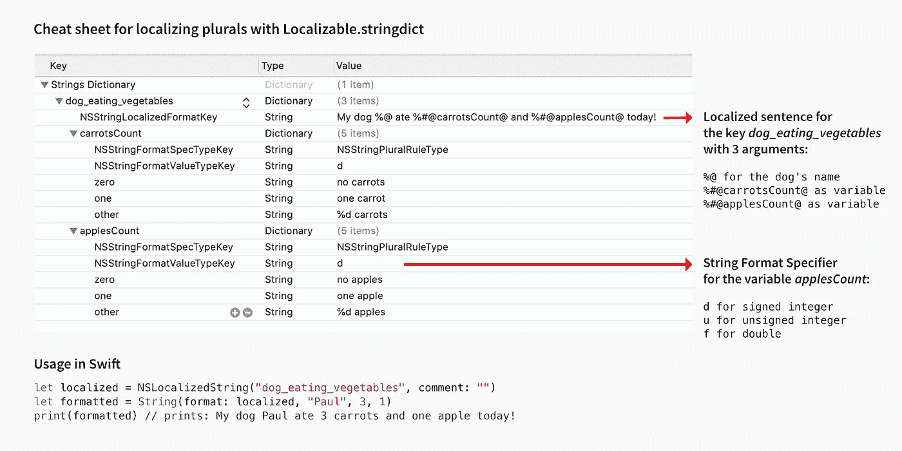
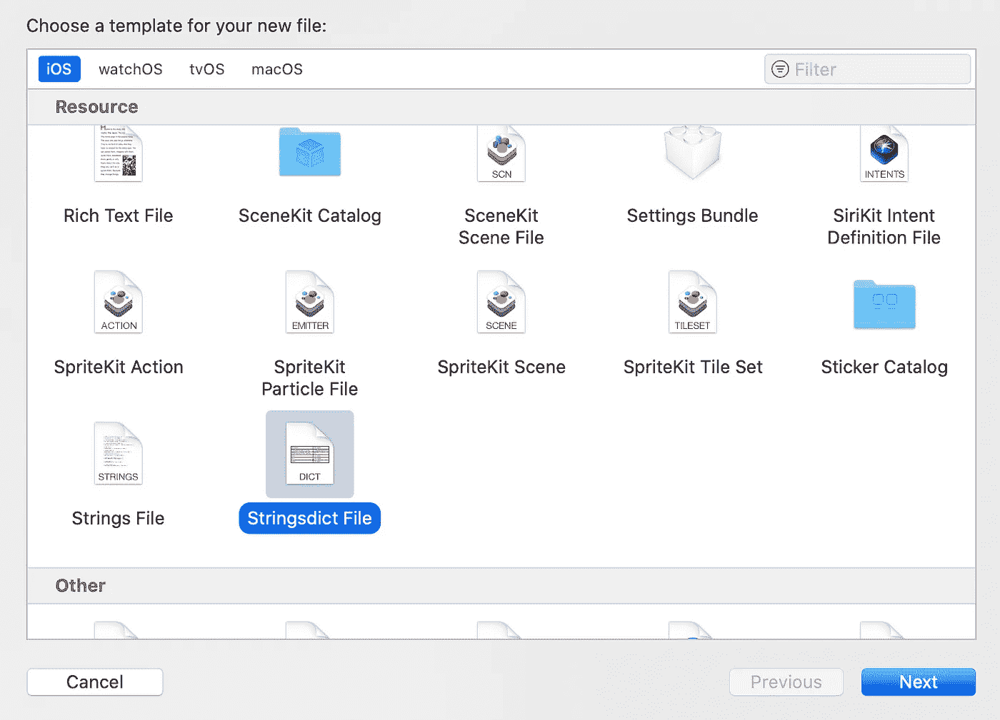
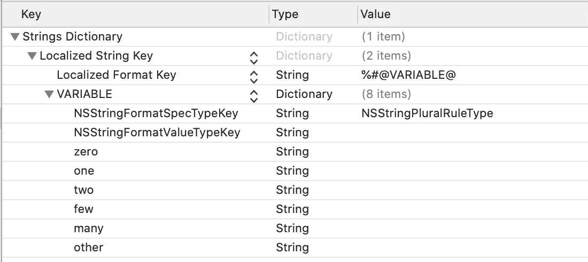
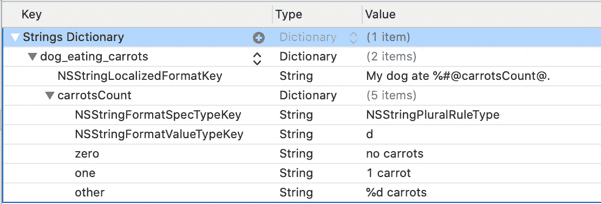

# 在 iOS 中本地化复数的分步指南

> 原文：<https://levelup.gitconnected.com/step-by-step-guide-for-localizing-plurals-in-ios-57f9deaade3e>

## 了解如何使用 Localizable.stringsdict 文件在 iOS 中本地化多种语言的复数

如果你已经熟悉在 iOS 中本地化复数，并且你只是想记住细节，下面的备忘单会帮助你。

如果你是新手，现在跳过备忘单，阅读下面的基础知识。

# 小抄



# 基础

每当您想要本地化像`My dog ate 2 carrots`这样胡萝卜数量是动态的文本时，一个本地化字符串是不够的。比如用`My dog ate %i carrots`定位，传入`1`会产生`My dog ate 1 carrots`。

您想到的第一个解决方案可能是为一个胡萝卜创建另一个本地化字符串，并在代码中添加一些逻辑，如:

```
if carrotCount == 1 { 
   label.text = NSLocalizedString("dog_eating_carrots_one") 
} else { 
   label.text = String(format:       NSLocalizedString("dog_eating_carrots_multiple"), carrotCount) 
}
```

这种解决方案可能适用于某些语言，但是不同的语言在处理复数的方式上有所不同。例如，在俄语中，你必须处理更多的情况。单词*狗*的复数规则如下:

*   `собака`为`1, 21, 31, 41, 51, 61`等。例子:`1 собака, 21 собака`
*   `собаки`为`2-4, 22-24, 32-34`等。例子:`2 собаки, 22 собаки`
*   `собак`为`5-20, 25-30, 35-40`等。示例:`5 собак, 20 собак`

用代码处理这种逻辑会很复杂。所以`Localizable.strigsdict`来救援了。

与`Localizable.strings`文件不同的是，`Localizable.strigsdict`文件提供了额外的功能来处理不同的语言，例如定义多个规则。`Localizable.strigsdict`能够解释您传入的参数，并基于它选择正确的本地化字符串。

# 创建并本地化一个`Localizable.stringdict`文件

要创建一个`Localizable.stringdict`文件，在创建新文件时从 Xcode 的对话框中选择一个`.stringdict`模板。



本地化过程与`Localizable.strings`文件完全相同。如果你是 iOS 本地化的新手，你可以通过阅读 Paul Hudson 的文章来了解这个话题。

# 添加复数配置

现在，您可以为特定语言添加复数配置。该模板为您提供了一个很好的起点。



我们示例的配置如下所示:



让我们一步一步来。

*   该值是带有参数的本地化文本。在我们的例子中是`My dog ate %#@carrotsCount@.`
*   你定义的每一个变量都应该在`%#@`之前，在`@`之后
*   您只需要为应该应用复数规则的参数定义变量
*   如果你只是想传递像狗的名字这样的东西，你可以简单地使用你已经知道的字符串格式说明符，比如`%@`、`%d`等等。为了传递狗的名字，我们的格式字符串应该是这样的:`My dog %@ ate %#@carrotsCount@.`

# 在属性列表和源代码之间切换

Xcode 提供了一个用户界面来处理属性列表文件。根据您的喜好，您也可以直接使用源代码。要进行切换，右击`Localizable.stringdict`文件并选择`Open as -> Source Code`。切换回来同`Open as -> Property List`。

下面是上面例子的代码:

```
<?xml version="1.0" encoding="UTF-8"?> 
<!DOCTYPE plist PUBLIC "-//Apple <plist version="1.0"> 
<dict> 
  <key>dog_eating_carrots</key> 
  <dict> 
     <key>NSStringLocalizedFormatKey</key> 
     <string>My dog ate %#@carrotsCount@.</string> 
     <key>carrotsCount</key>
     <dict> 
         <key>NSStringFormatSpecTypeKey</key>  
         <string>NSStringPluralRuleType</string> 
         <key>NSStringFormatValueTypeKey</key> 
         <string>d</string> 
         <key>zero</key> 
         <string>no carrots</string> 
         <key>one</key> 
         <string>1 carrot</string> 
         <key>other</key> 
         <string>%d carrots</string> 
     </dict> 
  </dict> 
</dict> 
</plist>
```

# 结论

既然您已经熟悉了复数本地化，那么您可以跳回到本文顶部的备忘单，看看另一个包含两个变量的示例。为了快速得到结果，你可以复制源代码并粘贴到你的。stringsdict 文件作为起点。

*最初发表于*[*https://www.tanaschita.com*](https://www.tanaschita.com/posts/20200801-plurals-localization-in-ios/)*。*