# 在您的 Express 应用程序中使用 LinkedIn 验证用户身份的分步指南

> 原文：<https://levelup.gitconnected.com/step-by-step-guide-to-authenticate-users-with-linkedin-in-your-express-app-10af68b91b13>

在您的 Express 应用程序中使用 LinkedIn 验证用户身份的分步指南

几天前，我想使用 LinkedIn 测试身份验证，但没有直接的文章可以帮助我。所以我决定记下这篇文章中的步骤，我希望它会有所帮助。

LinkedIn 可以是你的应用程序的身份提供者之一。我们在很多网站上都看到了这种情况，这些网站允许我们用谷歌账户、脸书账户或者 Github 和 LinkedIn 登录。我们也想这样做，让用户用他/她的 LinkedIn 帐户登录。

## 使用 LinkedIn 认证用户的步骤

*   创建 LinkedIn 应用程序
*   创建一个可以使用 LinkedIn 验证用户身份的应用程序

# 1 -创建 LinkedIn 应用程序

你需要做的第一件事就是访问这个地址:[https://www.linkedin.com/developers/](https://www.linkedin.com/developers/)

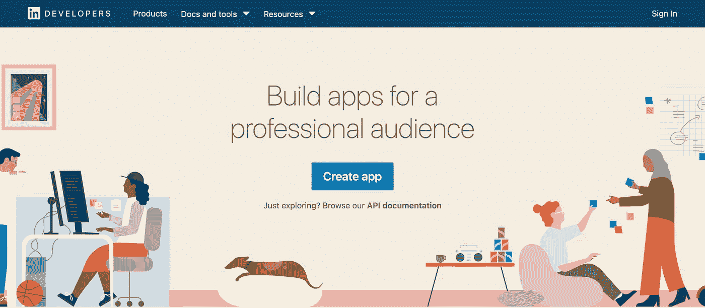

LinkedIn 创建应用程序

**使用您的 LinkedIn 帐户登录**
之后，您需要使用您的 LinkedIn 帐户登录才能创建您的应用程序。

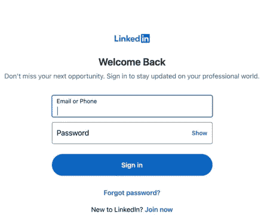

创建应用程序前登录

**创建应用程序**
现在填写应用程序的字段，并按下“创建应用程序”按钮:

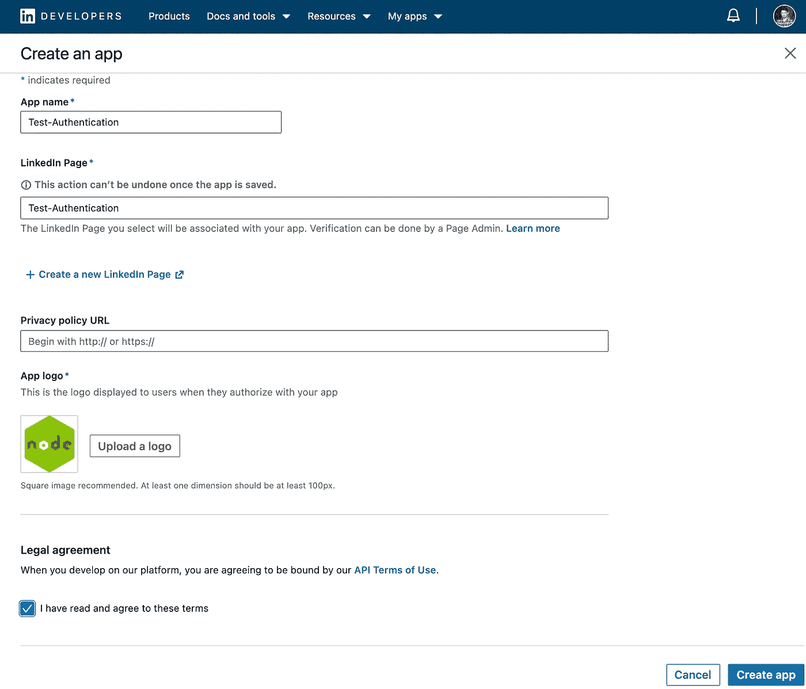

创建 LinkedIn 应用程序

为了创建应用程序，你需要该公司的 LinkedIn 页面。如果您没有，请按按钮: ***+创建一个新的 LinkedIn 页面***

如果您没有输入有效的 LinkedIn 页面，您会得到如下错误:

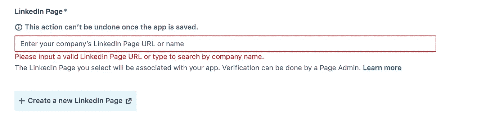

LinkedIn 页面无效

**LinkedIn 应用仪表板可用** 完成此步骤后，您现在可以看到仪表板:

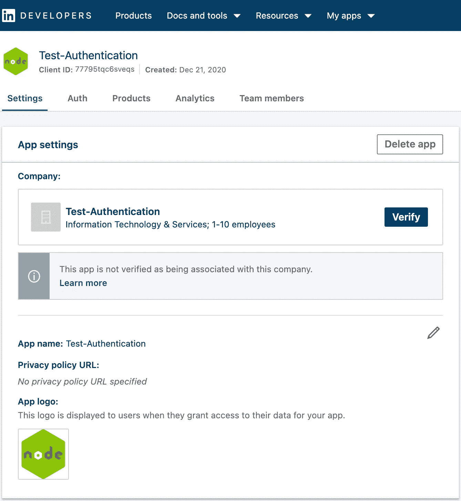

LinkedIn 应用仪表板

**验证你的 app** 现在你要验证你的 app 了。LinkedIn 希望确保此应用属于您在创建此应用时选择的公司页面。按下此按钮后，您将获得一个验证 URL，通过访问该 URL，您可以验证此应用程序:

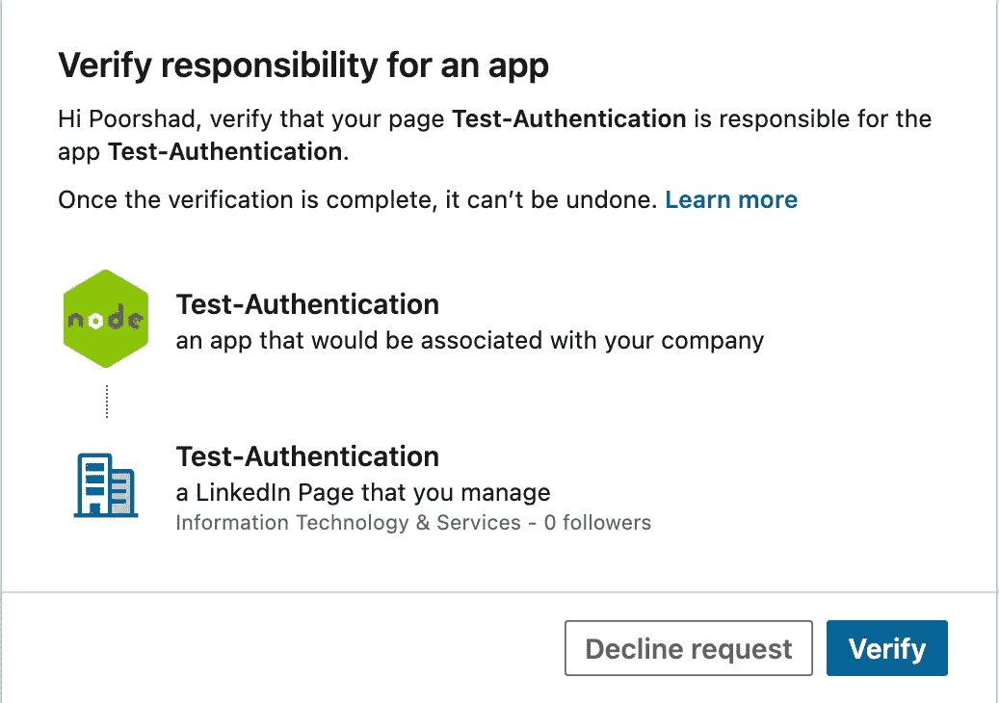

验证 LinkedIn 应用

**将 LinkedIn 登录添加到您的应用程序** 在仪表板中，转到**产品**选项卡，选择**LinkedIn 登录产品。接受法律协议后，您可以添加本产品。**

**等待 LinkedIn 批准** 如果你完成了这些步骤，你可以在你的产品标签中看到:

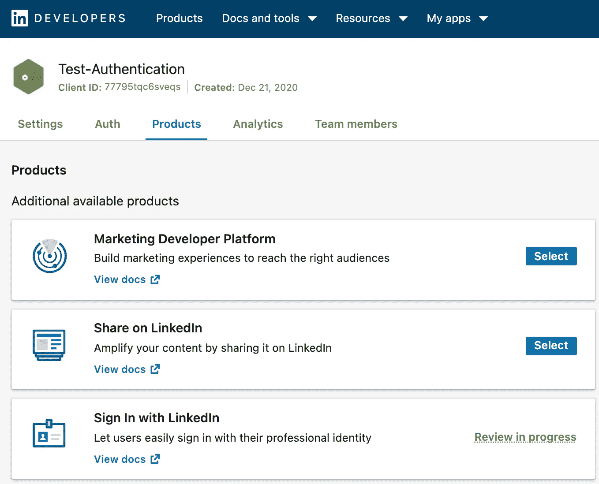

使用 LinkedIn 登录

如您所见，该产品的状态为`review in progress`，因此您必须等待。应该不会超过几分钟。
获得批准后，您应该会在您的产品列表中看到该产品:

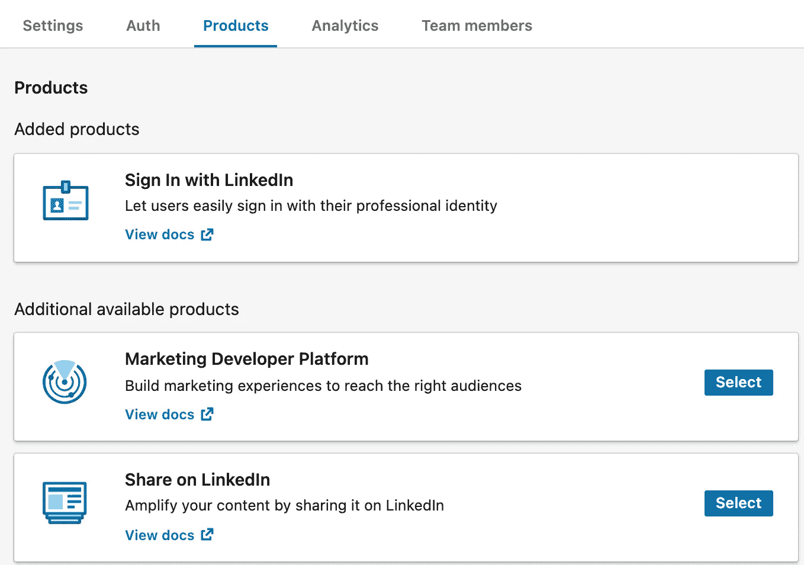

添加了使用 LinkedIn 产品登录

**获取客户端 ID 和密码，并添加直接 URI**

在 **Auth** 选项卡中，您可以访问您的客户 ID 和密码，我们需要这两个来验证 LinkedIn 用户的身份。
此外， ***您必须向重定向 URL 列表添加一个重定向 URL:***

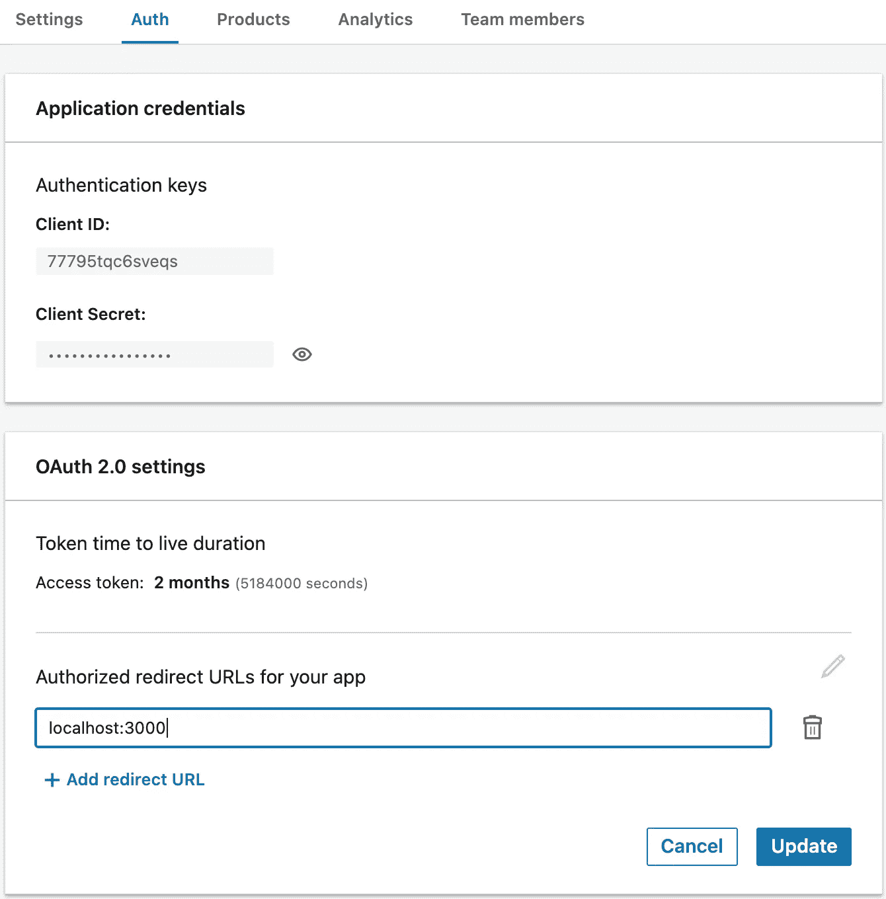

添加重定向 URL(此应用已删除)

我想在端口 3000 的机器上开发我的应用程序，所以我添加了这个地址。在制作中，你需要在这里添加你的网站地址。

**范围**

范围是身份验证的另一个重要部分。请确保您有权访问这些范围:

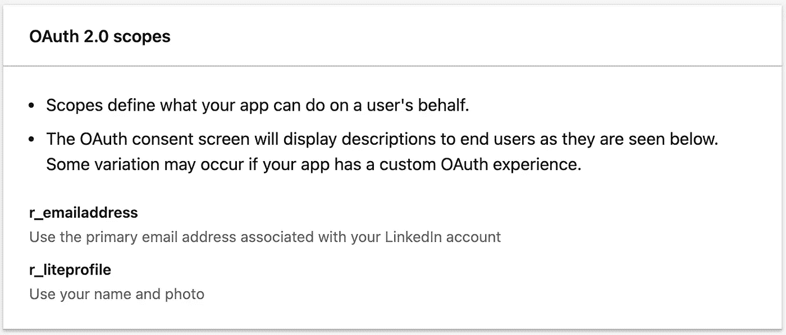

使用 LinkedIn Scopes 登录

# 2-创建一个 Express 应用程序，可以使用 LinkedIn 验证用户

## 创建快速应用程序:

创建快速应用程序

## 启动 Passport 和快速会话进行身份验证

[PassportJS](http://www.passportjs.org/) 是一个著名的处理认证的库。Express-Session 是另一个通过使用 cookies 帮助我们跟踪用户的库。如果你不熟悉这些库没有问题你可以只看实现和描述实现很容易。

启动通行证 js

为了使用`passport`，我们需要实现`serializeUser`和`deserializeUser`函数。我们在这里什么也没做，只是传递给了用户，但是你可以加密这些数据或者做任何你想做的事情。
在这个 Github gist 的第 12 行，我们传递了`express-session`中间件，并将唯一需要的选项传递给了这个中间件。之后，我们可以初始化`passport`并使用`passport.session`。

## 实施领英护照战略

Passport 让我们可以实施身份验证策略，您可以在他们的网站上找到 500 多种策略。这里我使用了`passport-linkedin-oauth2`策略。

`linkedin passport strategy`

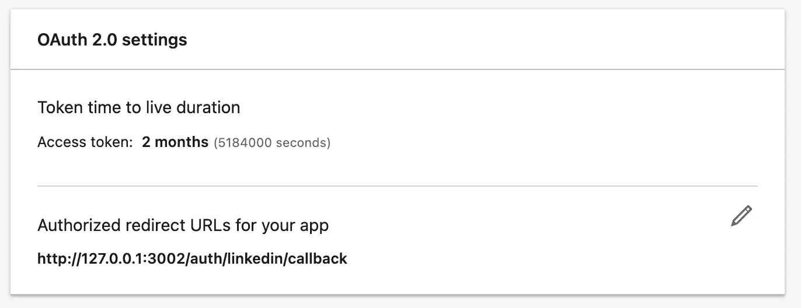

应用程序面板中的重定向 URL

`clientID`可在您的 LinkedIn 应用仪表板的**验证**选项卡中找到。

`clientSecret`可在您的 LinkedIn 应用仪表板的**验证**选项卡中找到。

`callbackURL`我们必须实现这个端点，它也应该在你的 **LinkedIn 应用程序**的**重定向 URL 列表**的 Auth 标签中。

`scope`是您要访问的范围。您可以在 **Auth** 选项卡下看到您的权限。

领域

认证成功后，它返回这个函数的参数。我们将 LinkedIn 配置文件传递给了`done`函数，因此它将成为用户对象。

## 实现身份验证路由和回调路由

认证路由和回叫路由

创建 LinkedIn 策略后，我们可以通过传递`passport.authenticate(desiredStrategy)`来保护快速路线。
当用户点击`Sign in With LinkedIn`时，我们将用户重定向到第一条路径，并根据我们提供给 LinkedIn 的重定向 URL 将请求结果重定向到这条路径。(这里是`/auth/linkedin/callback`)如果认证成功，它会将它们重定向到`/`。

## 实现一个简单的页面，看看**用 LinkedIn** 登录是否有效

实现一个简单的页面，看看**用 LinkedIn** 登录是否有效

当用户登录时，passport 将用户附加到请求中，因此我们可以通过检查`req.user`来检查用户是否登录。当`user`存在时，我从他/她的 LinkedIn 个人资料中提取一些字段，用户可以看到这些数据。如果用户没有登录，我向他/她显示`Sign In with LinkedIn`的图像。

## 结果呢

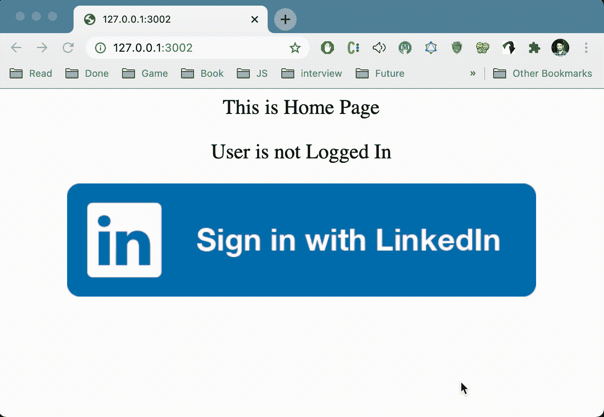

在快速应用程序中登录 LinkedIn

app.js 文件

app.js 文件中的所有部分