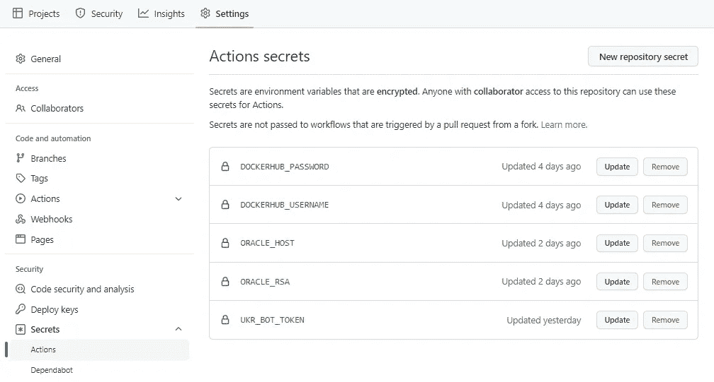

# 使用 GitHub 操作和 Oracle 实例设置简单配置项的分步指南。

> 原文：<https://levelup.gitconnected.com/step-by-step-guide-to-set-up-simple-ci-with-github-actions-and-oracle-instance-906832f30796>

罗曼·辛克维奇·🇺🇦在 [Unsplash](https://unsplash.com/s/photos/github?utm_source=unsplash&utm_medium=referral&utm_content=creditCopyText) 上拍摄的照片

持续集成是一种自动化开发人员生活的实践。谁不想让机器去做一些原本需要人工去做的事情呢？我很懒，以前让我非常沮丧的是——每次我在我的小爱好项目中做一些改变时，我都必须手动完成整个过程:

*   构建项目
*   构建 docker 文件
*   连接到我的云实例
*   把图像放进去。

许多小爱好项目的麻烦是可以避免的。这本指南帮助了我，也许还会帮助其他人。

我在 GitHub 上托管我的项目，我的计算实例在 Oracle 上，但是只要你知道如何 ssh 到它，这就无关紧要了。出于本指南的目的，我使用了与中描述的电报机器人相对应的项目

 [## 带有 Java 和 Docker 的电报机器人

### 创建和部署用 Java 编写的电报机器人的分步指南

medium.com](https://medium.com/@Mumuksia/telegram-bot-with-java-and-docker-636c4136fe7b) 

## 与 Gradle 一起构建项目

至于一开始创造 **。*中的 yml* 文件。你根目录下的 github* 文件夹。它将作为 github 行动的起点。在这一步，我们告诉系统这个项目将使用 Java 11(对当前项目使用的 telegram bot 启动器来说，这不是一个好的但是很难的要求)。在 net step 上我们讲述了构建我们项目的动作。

## Docker 登录

对于 docker 登录部分，我们需要做一些额外的设置，因为我怀疑有人想让他们的凭证在他们的 GitHub 项目上可见。

为此，导航到设置->机密->行动，并按下新的存储库机密。在整个过程中，我需要一些秘密，如下图所示:

在我们完成这一部分后，这些秘密可以用在我们的工作流文件中。在这里，我们告诉跑步者使用我们创建的秘密登录到 Docker 注册表。

## 构建和发布 docker 图像

因为我们的项目使用 jib，所以我们只使用 Gradle 来执行那个插件。注意我们是如何将$UKR_BOT_TOKEN 设置为环境变量的。当访问 telegram bot 时，我们的 Java 代码中将使用这个令牌。

## 正在连接到云实例并启动 docker 容器

当您通过 ssh 连接时，有不同的方法来更新您的 docker 实例。对我来说，最简单的方法是通过 docker-compose。默认情况下，Oracle one 没有预装它，但它很容易修复，安装只需一分钟。完成后，开发人员可以创建 docker-compose.yml 来编排所需的服务，在我的示例中是这样的:

我告诉 docker，我希望这个服务使用最新的标签启动，并将端口 8080 转发到 9004(我在 VPC 配置中打开的端口)。

现在是时候从 GitHub actions 执行 docker 命令了。我们设置了 ssh 成功后要执行的命令，并使用 RSA 密钥和密码对我们的“秘密主机”进行 ssh。

**搞定**！现在，您可以享受每次对 repo 进行小的(或不那么小的)更改时手动执行所有这些步骤所节省的时间。玩得开心，继续编码。

— — — — — — — — — — — — — — — — — — — — — — — — — — — -

【https://github.com/Mumuksia/telegram_fpl】的 [*可以找到*的代码**](https://github.com/Mumuksia/telegram_fpl)

*电报可以通过*[*http://t.me/UkrGreetingBot*](http://t.me/UkrGreetingBot)访问