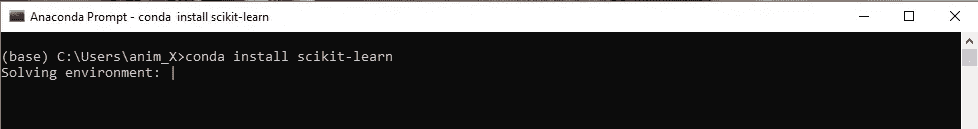
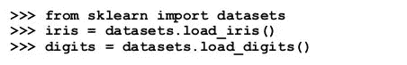
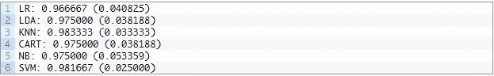
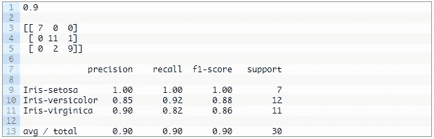

# 逐步 Scikit

> 原文：<https://levelup.gitconnected.com/step-by-step-scikit-a02cbddff13d>

Python 很迷人。有大量的应用领域，就像机器学习一样。

使用 Python 的 ML 的答案是它自己的 ML 库 Scikit-learn。它可以和其他 Python 库一起工作，比如 Numpy、Scipy、Matplotlib。有一个开源的 BSD 许可，有稳定的专家贡献者列表和大多数机器学习任务的可用性或工具，所以这是一个选择。

但是对于一个刚开始使用 Scikit 的人来说，学习变得非常困难，因为没有明确的过程可能是未知的，对吗？

所以这是你解决这个问题的指南，让你第一次击中靶心。因为

“没有解决不了的问题。”

机器学习问题可能不总是线性的。但是你可以坚持一些步骤，并在大多数情况下找到出路。使用 Scikit-learn 时，您可以选择以下步骤

*1。用 Numpy，scipy 和 Matplotlib 平台安装 Scikit-learn。(如果你还没有)*

*2。加载数据集*。

*3。数据集汇总*

*4。数据集可视化*

*5。评估一个问题的多种算法。*

*6。通过分析每个算法的精度，选择最佳的拟合算法。做一些预测*

## 第一步。a)用 Numpy、Scipy 和 Matplotlib 安装 Scikit-learn 库。

您可以使用命令行通过 Pip 安装 Sckit-learn。

或者如果你有 Conda 发行版，那么你可以使用下面给出的。

## 1.b)启动 Python 并检查版本

启动您的 python 环境，并检查版本，它可以是 Python v2、v3 中的任何一个。或者，你可以使用 Jupyter 笔记本。

## 2)加载数据

现在，Scikit 提供了许多功能，因为它已经有了许多来自 Scikit-learn 库的数据集。如果这些数据集分别与您的问题相关，您可以根据您的问题使用这些数据集

Scikit 提供的一些数据集是:-

1.波士顿房价数据集

2.鸢尾植物数据集

3.糖尿病数据集

4.手写数字数据集的光学识别

5.Linnerrud 数据集

6.葡萄酒识别数据集

7.乳腺癌威斯康星州(诊断)数据集

*真实世界数据集

1.Olivetti 人脸数据集

2.20 个新闻组文本数据集

或者用户也可以导入外部数据集。

## 3.汇总数据集

一旦你加载数据集，你应该快速浏览数据集，并根据几个不同的因素进行判断。

1.数据集维度:-

了解 shape 属性包含多少实例(行)和多少属性(列)。

## 代码:-

**#形状**

*打印(数据集。形状)*

1.属性统计摘要:-

观察计数、平均值、最小值和最大值以及一些百分点。

## 代码:-

**#描述**

*print(dataset . describe())*

2.使用类变量对数据进行细分。

查看属于每个类的实例(行)的数量。它可以被视为绝对计数。

**#班级分布**

*print(dataset . group by(' class ')。尺寸())*

您可以添加一个“数据可视化”的步骤，从而通过绘制图表和直方图来直观地检查数据。其可以是变量或单变量图。

## 4.评估算法

这是一个关键的步骤，我们不想搞砸。

因此，为了有效地实现它，我们将选择下面的过程。

1.**分离验证数据集**。–

我们将加载的数据集分成两部分，假设其中的 80%将用于训练我们的模型，而 20%将留作验证数据集。

2.**设置测试线束**

我们将使用交叉验证来估计精确度。假设我们可以将数据集分成 10 个部分，在 9 个部分上进行训练，在 1 个部分上进行测试，并对训练-测试分割的所有组合进行重复。

3.建立不同的模型来获得正确的预测，

为什么？

因此，为了获得相应程度的准确预测，可以使用线性和非线性模型的组合。

逻辑回归

线性判别分析(LDA)

k-最近邻(KNN)。

分类和回归树(CART)。

高斯朴素贝叶斯(NB)。

支持向量机(SVM)

这就是我们要做的 Scikit-learn as

**#抽查算法**

*型号= []*

*models.append(('LR '，LogisticRegression()))*

*models.append(('LDA '，LinearDiscriminantAnalysis()))*

*models.append(('KNN '，KNeighborsClassifier())*

*models.append(('CART '，DecisionTreeClassifier()))*

*models.append(('NB '，GaussianNB())*

*models.append(('SVM '，SVC())*

一旦你完成了这些，你就可以为模型的交叉验证分数编写代码，以获得每个模型的结果和准确度。

## 4.选择最佳型号。

基于精度选择模型(要使用的 ML 算法)

一旦你知道哪种算法最有效，你就可以开始预测了。

根据上面给出的数字，我们可以说 KNN 是创建模型的最准确的算法。

最后，我们将使用单独的算法来验证结果，这就是你如何完成第一个基于 Scikit 的机器学习预测。

应用单个算法的代码(这里是 KNN)

*#对验证数据集进行预测*

*KNN = KNeighborsClassifier()*

*KNN . fit(X _ 火车，Y _ 火车)*

*预测= knn.predict(X_validation)*

*打印(accuracy_score(Y_validation，predictions))*

*打印(混淆 _ 矩阵(Y _ 验证，预测))*

*打印(分类 _ 报告(Y _ 验证，预测))*

这里我们的预测有 90%的准确率。

在享受我们对基于 Scikit 的任务的小小胜利之前。

我们应该谈谈这个叫张量跟随的家伙。

所以“张量流是 Scikit-learn 的一个替代方案。”

**张量流:-**

不要像 Scikit-learn 那样把它称为机器学习库，它可以是

被称为“**一个使用数据流图进行数值计算的开源数学库**

在这些图中，节点表示数学运算，而图边表示它们之间通信的多维数据阵列(张量)。

张量流比 Scikit-learn 有更多的优势，这可以通过使用它进行机器学习应用的人数来观察。这与 Scikit-learn 社区相比是巨大的。

张量流成为更好选择的理由是无穷无尽的，因为它为人工智能开发者提供了完整的环境。我们将在以后的博客中详细讨论。

 [## 学习 Python -最佳 Python 教程(2019) | gitconnected

### 50 大 Python 教程-免费学习 Python。课程由开发人员提交并投票，使您能够…

gitconnected.com](https://gitconnected.com/learn/python)