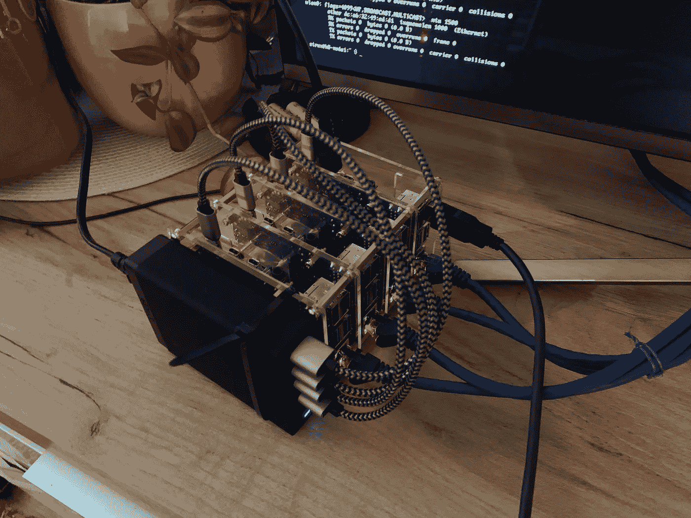
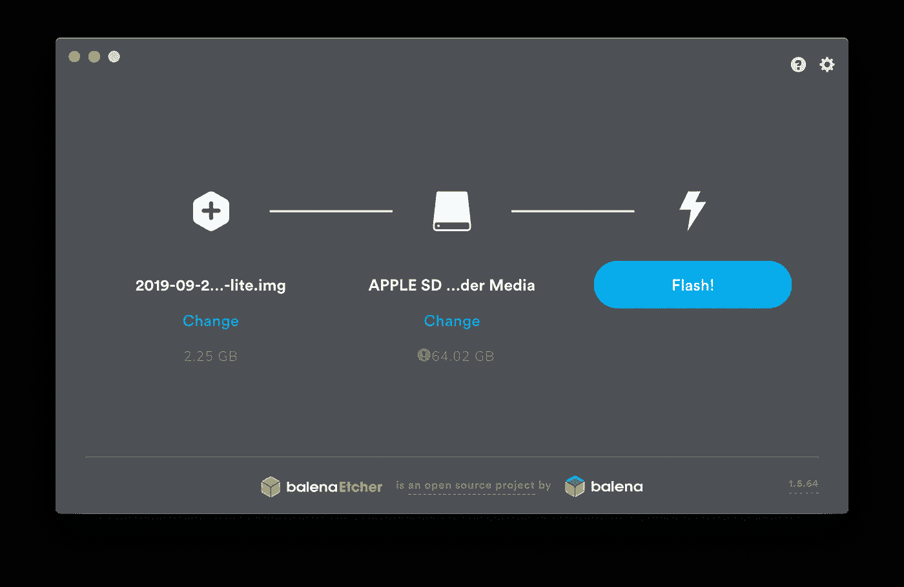

# 循序渐进指南—树莓 Pi 4B 上的 Kubernetes 集群—第 1 部分

> 原文：<https://levelup.gitconnected.com/step-by-step-slow-guide-kubernetes-cluster-on-raspberry-pi-4b-part-1-6e4179c89cbc>



我的基于 RaspberryPi 4B 的 Kubernetes 集群

## 更新

自从我第一次发布这个指南已经一年多了。该是更新的时候了，所以在下面的行中，您将找到关于如何让您的集群启动并运行的最新和最好的(也是经过测试的最重要的)信息。

## 介绍

在思考了一段时间并查看了流行的云提供商的价格后，我决定我的家庭实验室的最佳选择是基于 Raspberry Pi 4B 构建我自己的 Kubernetes 集群。买了 4x4GB 型号，新的网络交换机，开始工作。我不会用硬件细节来打扰你，因为它们非常简单，相反，我将只关注我的软件设置之旅。我将把这篇文章分成多个更容易理解的部分，希望这样更容易理解，并允许人们在他们关心的部分之间跳转。

我决定在我的设置中使用以下内容:

*   操作系统:Ubuntu Server 20.04.1 (Focal Fossa)
*   Kubernetes 1.20.2
*   容器运行时:containerd.io 1.4.3
*   集群网络:Calico 3.17.1
*   负载平衡器:MetalLB 0.9.5

## 操作系统安装

我认为最好的选择是使用 Ubuntu 服务器。我确实先尝试了 Raspbian Buster，但我在使用 containerd 时遇到了问题。某个时候，我放弃了，把所有东西都换成了 Ubuntu。值得注意的是，Raspbian 与 docker 配合得很好。

图片可以从[这里](https://ubuntu.com/download/raspberry-pi)下载。这是一个预装版本，所以我们唯一需要做的就是把它刷新到我们的 SD 卡上。对于闪烁图像，我推荐使用 balenaEtcher，因为它易于使用。在这里你应该能买到[。一旦开始，它就像选择一个图像文件，你的 SD 卡和按下闪光按钮一样简单。](https://www.balena.io/etcher/)



巴林蚀刻机

SSH 在默认情况下是启用的，因此我们可以尝试通过名称登录到主机，如果您有任何问题，您可以检查您的路由器是否有分配给您的 Pi 的 IP 地址，然后登录。默认的用户名和密码是“ubuntu”。首次登录时会要求您更改密码。

```
ssh ubuntu@ubuntu
```

一旦进入，首先要做的就是创建一个新用户。

```
sudo adduser master
```

我们可以通过运行以下命令来查看默认 ubuntu 用户的所有现有组

```
groups
```

我们将把我们的新用户添加到默认用户拥有的所有组中，除了“ubuntu”

```
sudo usermod -a -G adm,dialout,cdrom,floppy,sudo,audio,dip,video,plugdev,netdev,lxd master
```

在删除默认用户之前，让我们用刚刚创建的帐户重新登录，确保一切正常。

```
ssh master@ubuntu
```

我们现在可以使用以下命令安全地删除默认用户:

```
sudo deluser --remove-home ubuntu
```

是时候重命名我们的节点了。我将主节点命名为 k8-m1，类似地，工作节点命名为 k8-w1 到 k8-w3

```
sudo hostnamectl set-hostname k8-m1
```

我们将更新我们的安装，这样我们就可以通过运行

```
sudo apt update
sudo apt upgrade
```

在这之后，我们将重新启动我们的服务器

```
sudo reboot
```

由于 cloud-init 出现在此图像上，我们也将对其进行编辑

```
sudo nano /etc/cloud/cloud.cfg
```

并更改以下行:

```
From:
preserve_hostname: falseTo:
preserve_hostname: true
```

我们可以通过运行和重启来确认一切正常

```
sudo hostnamectl
sudo reboot
```

队列中的下一件事是启用基于 SSH 密钥的认证。应该在我们将用来控制集群的机器上完成以下步骤。我将描述 Mac 的步骤，但同样的事情也适用于 Linux。我们将为集群中的每台计算机创建一个单独的 RSA 密钥。所以我们跑吧

```
ssh-keygen
```

指定将密钥保存为~/的文件的名称。ssh/id_k8-m1。现在，让我们重复这个步骤，为 worker 节点创建键，并将它们命名为 id_k8-w1 到 id_k8-w3。

让我们将密钥复制到主节点

```
ssh-copy-id -i ~/.ssh/id_k8-m1 master@k8-m1
```

注意:一旦创建了 worker 节点，就应该将剩余的键复制到这些节点中。

我们应该确保可以用密钥登录到我们的主节点

```
ssh -i ~/.ssh/id_k8-m1  master@k8-m1
```

最佳实践表明，我们应该禁用 root 用户登录，并通过密码登录。

```
sudo nano /etc/ssh/sshd_config
```

我们将更改以下几行

```
From:
#PermitRootLogin prohibit-password
#PasswordAuthentication yes
#PubkeyAuthentication yesTo:
PermitRootLogin no
PasswordAuthentication no
PubkeyAuthentication yes
```

让我们验证没有错误，然后重启 SSH 守护进程。

```
sudo /usr/sbin/sshd -t
sudo systemctl restart sshd.service
```

回到我们的笔记本电脑上，我们可以配置 ssh 配置文件，因此我们不需要在每次连接到节点时指定密钥文件

```
cd ~/.ssh/
sudo nano config
```

您可以复制下面的行，这将把您的节点绑定到适当的主机名、用户和 RSA 密钥

```
Host k8-m1
HostName k8-m1
User master
IdentityFile ~/.ssh/id_k8-m1Host k8-w1
HostName k8-w1
User master
IdentityFile ~/.ssh/id_k8-w1Host k8-w2
HostName k8-w2
User master
IdentityFile ~/.ssh/id_k8-w2Host k8-w3
HostName k8-w3
User master
IdentityFile ~/.ssh/id_k8-w3
```

一旦一切完成，我们就可以通过键入 *ssh k8-m1 登录到您的主节点。*

设置工作节点很大程度上是清洗和重复前面的步骤。我将把这个问题留给您，在第 2 部分中，我们将最终关注 Kubernetes 的安装。

[](https://medium.com/@astrujic/step-by-step-slow-guide-kubernetes-cluster-on-raspberry-pi-4b-part-2-e1f2ee8f3011) [## 循序渐进指南—树莓 Pi 4B 上的 Kubernetes 集群—第 2 部分

### 在前一部分中，我们准备好了主节点和工作节点。准备就绪后，我们可以继续安装…

medium.com](https://medium.com/@astrujic/step-by-step-slow-guide-kubernetes-cluster-on-raspberry-pi-4b-part-2-e1f2ee8f3011) [](https://medium.com/@astrujic/step-by-step-slow-guide-kubernetes-cluster-on-raspberry-pi-4b-part-3-899fc270600e) [## 循序渐进指南—树莓 Pi 4B 上的 Kubernetes 集群—第 3 部分

### 在之前的 par 中，我们初始化了主节点并添加了工作节点。现在我们需要添加网络——印花布和负载…

medium.com](https://medium.com/@astrujic/step-by-step-slow-guide-kubernetes-cluster-on-raspberry-pi-4b-part-3-899fc270600e)