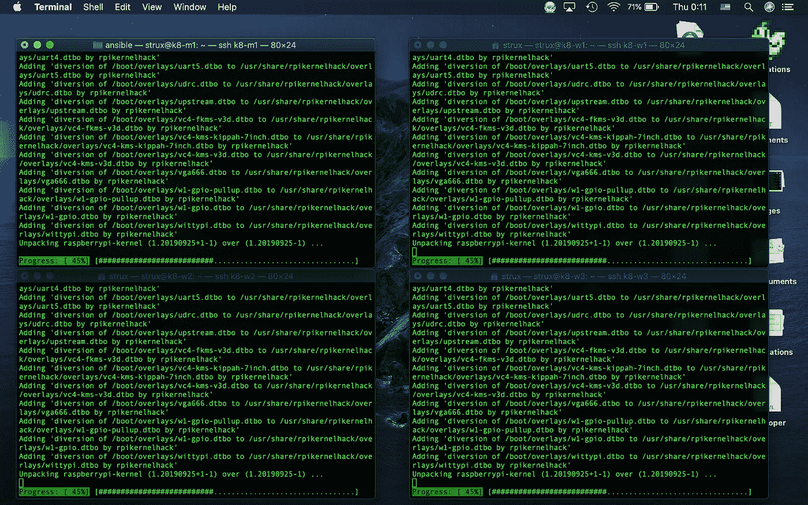
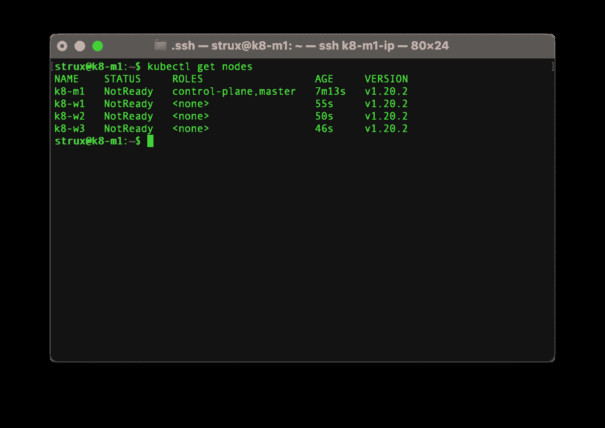

# 循序渐进指南—树莓 Pi 4B 上的 Kubernetes 集群—第 2 部分

> 原文：<https://levelup.gitconnected.com/step-by-step-slow-guide-kubernetes-cluster-on-raspberry-pi-4b-part-2-e1f2ee8f3011>


约瑟夫·巴里恩托斯在 [Unsplash](https://unsplash.com?utm_source=medium&utm_medium=referral) 上拍摄的照片

在前一部分中，我们准备好了主节点和工作节点。有了这些，我们可以继续将 containerd 运行时和 Kubernetes 安装到我们的 Raspberry Pi 集群中。

我们不会处理 Ansible 之类的，因为我们没有太多的节点，做就是学习。因此，我们将打开几个终端窗口，并通过 ssh 进入所有节点。首先，让我们确保所有内容都是最新的，并在所有节点上运行:

```
sudo apt update
sudo apt upgrade
sudo apt dist-upgrade
```



为了让 Kubernetes 工作，我们需要禁用 swap。幸运的是，默认情况下，这个映像上的交换是禁用的，所以我们不需要在那里做任何事情。

我们需要设置用于 Kubernetes 所需的资源监控和隔离的 Linux 控制组。

```
sudo nano /boot/firmware/cmdline.txt
```

并将下面一行添加到该行的末尾

```
cgroup_enable=cpuset cgroup_memory=1 cgroup_enable=memory
```

现在我们可以重新启动我们的节点

```
sudo reboot
```

我们需要向所有节点添加 Kubernetes 存储库

```
sudo apt-get install apt-transport-https
curl -s https://packages.cloud.google.com/apt/doc/apt-key.gpg | sudo apt-key add -
echo "deb https://apt.kubernetes.io/ kubernetes-xenial main" | sudo tee -a /etc/apt/sources.list.d/kubernetes.list
```

接下来，我们将更新 repo 并在所有节点上安装 kubeadm

```
sudo apt-get update
sudo apt-get install kubeadm
```

对于容器运行时，我们将使用 containerd，它在 CPU、内存和启动时间方面应该比 Docker 更高效。这似乎也是像 GKE 和 AWS 这样的云提供商正在使用的。我们将使用 Kubernetes 文档中稍加修改的步骤，您可以在这里找到。

首先，我们将处理所有节点上的先决条件:

```
echo 'overlay
br_netfilter' | sudo tee -a /etc/modules-load.d/containerd.conf
sudo modprobe overlay
sudo modprobe br_netfilter
echo 'net.bridge.bridge-nf-call-iptables  = 1
net.ipv4.ip_forward                 = 1
net.bridge.bridge-nf-call-ip6tables = 1' | sudo tee -a /etc/sysctl.d/99-kubernetes-cri.conf
sudo sysctl --system
```

现在我们可以添加存储库并将 containerd 安装到所有节点上

```
*# Install containerd*
*## Set up the repository*
*### Install packages to allow apt to use a repository over HTTPS*
sudo apt-get install \
    apt-transport-https \
    ca-certificates \
    curl \
    gnupg-agent \
    software-properties-common

*### Add Docker’s official GPG key*
curl -fsSL https://download.docker.com/linux/ubuntu/gpg | sudo apt-key add -

*### Add Docker apt repository.*
sudo add-apt-repository \
   "deb https://download.docker.com/linux/ubuntu \
   focal \
   stable"*## Install containerd*
sudo apt-get update
sudo apt-get install containerd.io

*# Configure containerd*
sudo containerd config default | sudo tee /etc/containerd/config.toml

*# Restart containerd*
sudo systemctl restart containerd
```

现在我们需要配置 kubelet 代理来使用 containerd，所以让我们编辑

```
sudo nano /etc/systemd/system/kubelet.service.d/10-kubeadm.conf
```

并在其他环境设置下添加下面一行

```
Environment="KUBELET_EXTRA_ARGS=--cgroup-driver=systemd --container-runtime=remote --runtime-request-timeout=15m --container-runtime-endpoint=unix:///run/containerd/containerd.sock"
```

重载和重启守护进程是我们接下来要做的

```
sudo systemctl daemon-reload
sudo systemctl restart kubelet.service
```

我们将为 crictl 配置端点，它基本上可以用来代替 docker 与容器进行交互

```
sudo nano /etc/crictl.yaml
```

加上这一行

```
runtime-endpoint: unix:///run/containerd/containerd.sock
```

接下来，我们将预取 kubernetes 系统映像并初始化我们的主节点

```
sudo kubeadm config images pull
sudo kubeadm init --cri-socket /run/containerd/containerd.sock
```

让我们为我们的用户配置 kubectl

```
mkdir -p $HOME/.kube
sudo cp -i /etc/kubernetes/admin.conf $HOME/.kube/config
sudo chown $(id -u):$(id -g) $HOME/.kube/config
```

请注意，init 命令的打印输出将包含将节点加入集群所需的密钥。您应该在所有工作节点上运行该命令。例如

```
# DO NOT COPY THIS COMMAND. USE ONE YOU GOT AS RESULT IN INIT
sudo kubeadm join 192.168.1.80:6443 --token o92ntx.6lkn88kb3m7f7     --discovery-token-ca-cert-hash sha256:1dee61cf705803f6284573a987e82654e639b3948b6cab7ffdb793b762
```

我们现在可以从主节点检查我们的集群

```
sudo kubectl get nodes
```

你应该能看到这样的东西:



Kubernetes 集群中的节点

暂时就这样了。请注意，节点被标记为未运行，这是因为它们之间还没有联网。这就是我们下一部分要做事情。

[](https://medium.com/@astrujic/step-by-step-slow-guide-kubernetes-cluster-on-raspberry-pi-4b-part-3-899fc270600e) [## 循序渐进指南—树莓 Pi 4B 上的 Kubernetes 集群—第 3 部分

### 在之前的 par 中，我们初始化了主节点并添加了工作节点。现在我们需要添加网络——印花布和负载…

medium.com](https://medium.com/@astrujic/step-by-step-slow-guide-kubernetes-cluster-on-raspberry-pi-4b-part-3-899fc270600e) [](https://medium.com/@astrujic/step-by-step-slow-guide-kubernetes-cluster-on-raspberry-pi-4b-part-1-6e4179c89cbc) [## 循序渐进指南—树莓 Pi 4B 上的 Kubernetes 集群—第 1 部分

### 基于 RaspberryPi 4B、Containerd、Project Calico、MetalLB 和 Ubuntu Server 的 Kubernetes 集群

medium.com](https://medium.com/@astrujic/step-by-step-slow-guide-kubernetes-cluster-on-raspberry-pi-4b-part-1-6e4179c89cbc)