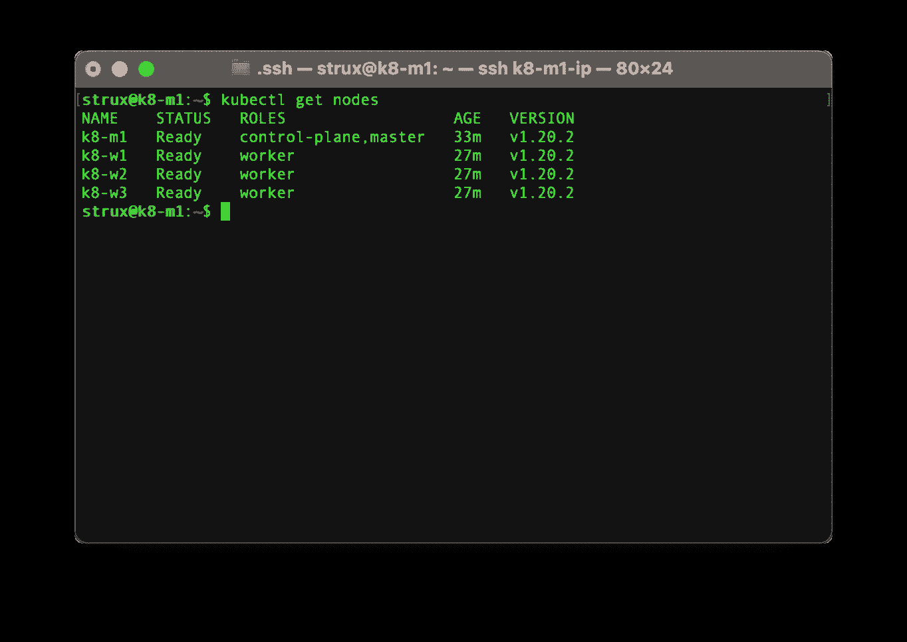
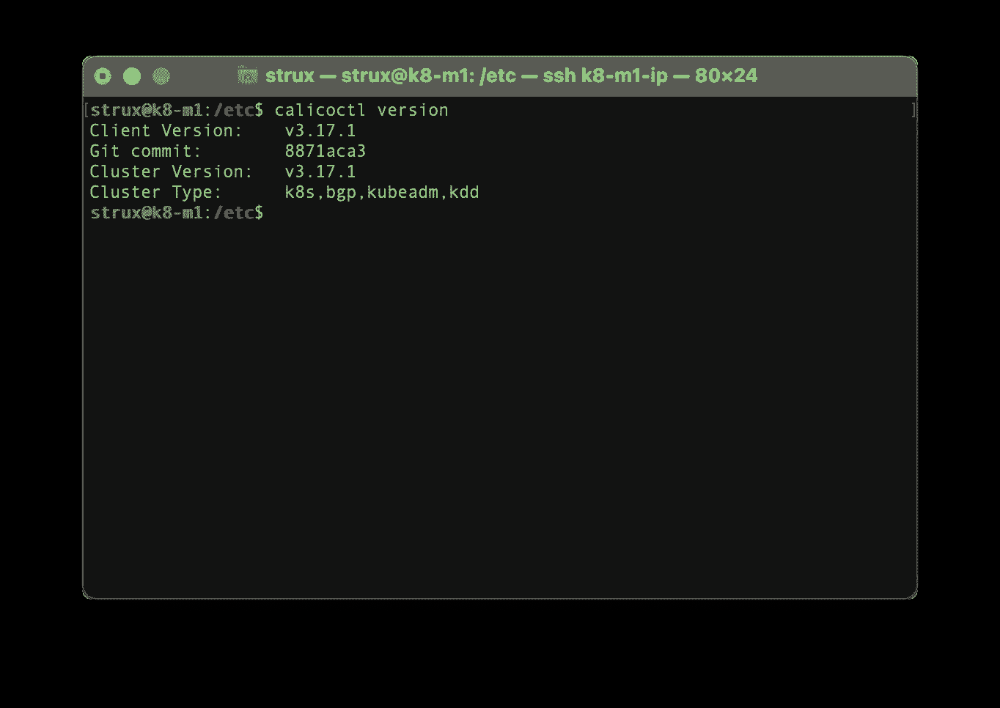
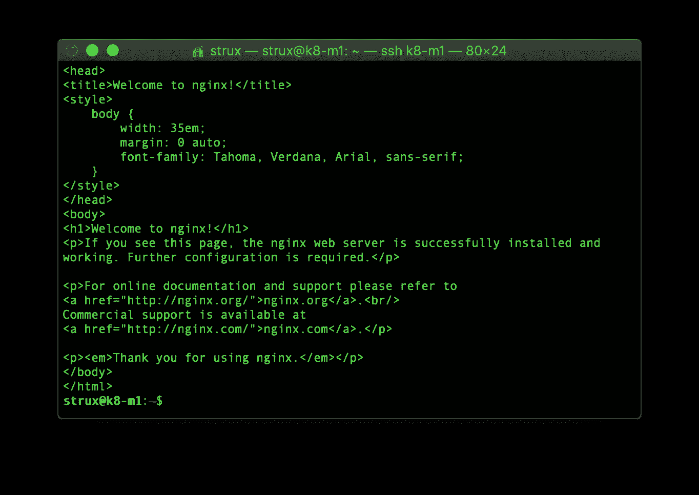

# 循序渐进指南—树莓 Pi 4B 上的 Kubernetes 集群—第 3 部分

> 原文：<https://levelup.gitconnected.com/step-by-step-slow-guide-kubernetes-cluster-on-raspberry-pi-4b-part-3-899fc270600e>


尼古拉斯·皮卡德在 [Unsplash](https://unsplash.com?utm_source=medium&utm_medium=referral) 上拍摄的照片

在前一部分中，我们初始化了主节点并添加了工作节点。现在，我们需要向我们的群集添加网络。我们这里有很多选择，但我们将使用印花棉布，因为这是在 AWS 和 GKE 上使用的。

## 印花布项目——安装

首先，我们需要下载 calico 配置文件

```
curl https://docs.projectcalico.org/manifests/calico.yaml -O
```

将自动检测 CIDR IP 块，因此我们可以将 yaml 应用到我们的集群

```
kubectl apply -f calico.yaml
```

这将需要一两分钟的时间，因此我们可以使用

```
kubectl get pods --all-namespaces
```

一旦所有 pod 都在运行，我们就可以通过运行以下命令来确认所有节点现在都处于就绪状态

```
kubectl get nodes
```

让我们也把标签<none>改名为“工人”</none>

```
kubectl label node k8-w1 node-role.kubernetes.io/worker=worker
kubectl label node k8-w2 node-role.kubernetes.io/worker=worker
kubectl label node k8-w3 node-role.kubernetes.io/worker=worker
```



运行 Kubernetes 集群

恭喜您，您的 Kubernetes 集群现在正在运行！

我们还将安装 calicoctl，它将允许我们操作 calico 对象

```
cd /usr/local/bin/
sudo curl -o calicoctl -O -L https://github.com/projectcalico/calicoctl/releases/download/v3.17.1/calicoctl-linux-arm64
sudo chmod +x calicoctl
```

让我们确认它工作正常

```
calicoctl version
```



calicoctl 成功运行

我们的 calico 客户端现在工作正常。然而，我们还没有完成(毕竟它被称为慢指南)。

## MetalLB 负载平衡器安装

由于我们没有外部负载平衡器，我们将需要一个软件解决方案，metalLB 看起来是一个不错的选择。Calico 和 metaLB 存在一些兼容性问题，您可以在这里[阅读更多内容](https://metallb.universe.tf/configuration/calico/)。然而，它们对于我们要做的事情并不重要。

在我们的主节点上，让我们安装负载平衡器。

```
kubectl apply -f [https://raw.githubusercontent.com/metallb/metallb/v0.9.5/manifests/namespace.yaml](https://raw.githubusercontent.com/metallb/metallb/v0.9.5/manifests/namespace.yaml)
kubectl apply -f [https://raw.githubusercontent.com/metallb/metallb/v0.9.5/manifests/metallb.yaml](https://raw.githubusercontent.com/metallb/metallb/v0.9.5/manifests/metallb.yaml)
# On first install only
kubectl create secret generic -n metallb-system memberlist --from-literal=secretkey="$(openssl rand -base64 128)"
```

现在我们需要配置我们的 IP 池。确保它超出了本地 DHCP 的地址范围，但在路由器本地网络的范围内。让我们将下面的配置图保存为 metalLB-config.yaml

```
apiVersion: v1
kind: ConfigMap
metadata:
  namespace: metallb-system
  name: config
data:
  config: |
    address-pools:
    - name: default
      protocol: layer2
      addresses:
      - 192.168.1.200-192.168.254.254
```

我们可以将其安装到集群中

```
kubectl apply -f metalLB-config.yaml
```

就这样，我们都准备好了！

是时候做一些测试，确保一切正常。我们将为 nginx 创建一个包含 4 个副本的部署，并通过一个从负载均衡器获取外部地址的服务来公开它。我们将把文件保存为 nginx-deployment.yaml

```
apiVersion: apps/v1
kind: Deployment
metadata:
  name: nginx-deployment
spec:
  selector:
    matchLabels:
      app: nginx
  replicas: 4
  template:
    metadata:
      labels:
        app: nginx
    spec:
      containers:
      - name: nginx
        image: nginx:latest
        ports:
        - containerPort: 80
---
apiVersion: v1
kind: Service
metadata:
  name: nginx-service
spec:
  selector:
    app: nginx
  ports:
    - protocol: TCP
      port: 80
      targetPort: 80
  externalTrafficPolicy: Local
  type: LoadBalancer
```

让我们应用它

```
kubectl apply -f nginx-deployment.yaml
```

我们可以确认我们的豆荚是通过跑步产生的

```
kubectl get pods
```

现在我们需要从服务中检索一个外部 IP 地址

```
kubectl get svc nginx-service
```

我们可以使用 curl 来检查一切是否正常

```
#change IP address to one that you got by running previous command
curl 192.168.200.1
```



在我们的 Kubernetes 集群中运行的 nginx 的响应

呜哇！我们得到了回应。看起来一切正常！

在我们离开之前，让我们做一些清理并删除我们的 nginx 测试部署。

```
kubectl delete -f nginx-deployment.yaml
```

就这些了，希望这个指南对你有用。它现在更新了所有内容的最新版本，这将有助于解决您可能遇到的任何问题。期待大家的提问和评论！

[](https://medium.com/@astrujic/step-by-step-slow-guide-kubernetes-cluster-on-raspberry-pi-4b-part-2-e1f2ee8f3011) [## 循序渐进指南—树莓 Pi 4B 上的 Kubernetes 集群—第 2 部分

### 在前一部分中，我们准备好了主节点和工作节点。准备就绪后，我们可以继续安装…

medium.com](https://medium.com/@astrujic/step-by-step-slow-guide-kubernetes-cluster-on-raspberry-pi-4b-part-2-e1f2ee8f3011) [](https://medium.com/@astrujic/step-by-step-slow-guide-kubernetes-cluster-on-raspberry-pi-4b-part-1-6e4179c89cbc) [## 循序渐进指南—树莓 Pi 4B 上的 Kubernetes 集群—第 1 部分

### 基于 RaspberryPi 4B、Containerd、Project Calico、MetalLB 和 Ubuntu Server 的 Kubernetes 集群

medium.com](https://medium.com/@astrujic/step-by-step-slow-guide-kubernetes-cluster-on-raspberry-pi-4b-part-1-6e4179c89cbc)