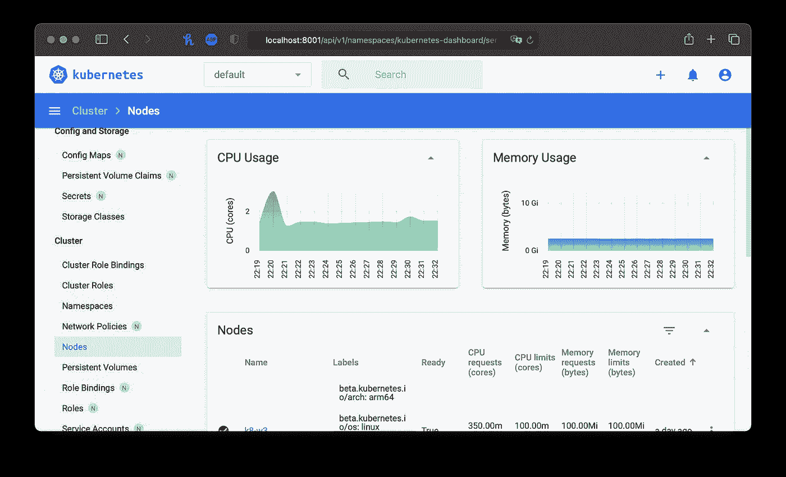

# 循序渐进指南:树莓 Pi 集群上的 Kubernetes 仪表盘(第 1 部分)

> 原文：<https://levelup.gitconnected.com/step-by-step-slow-guide-kubernetes-dashboard-on-raspberry-pi-cluster-part-1-308456b69dba>

如何安装和配置 Kubernetes 仪表板


弗朗茨·哈文·阿西图纳在 [Unsplash](https://unsplash.com?utm_source=medium&utm_medium=referral) 拍摄的照片

距离我写关于在 Raspberry Pi 集群上设置 Kubernetes 的 guid 已经有一段时间了:

[](/step-by-step-slow-guide-kubernetes-cluster-on-raspberry-pi-4b-part-1-6e4179c89cbc) [## 循序渐进指南—树莓 Pi 4B 上的 Kubernetes 集群—第 1 部分

### 基于 RaspberryPi 4B、Containerd、Project Calico、MetalLB 和 Ubuntu Server 的 Kubernetes 集群

levelup.gitconnected.com](/step-by-step-slow-guide-kubernetes-cluster-on-raspberry-pi-4b-part-1-6e4179c89cbc) 

因此，现在是谈论监测的时候了。这次我们将讨论设置和配置 Kubernetes Dashboard。

在开始之前，为了能够看到集群指标和图形，我们首先需要安装第一个 MetricsServer。我已经写了一个关于它的安装的指南，所以在回来继续之前，让我们先浏览一下这个指南。

[](/setting-up-and-using-metrics-server-for-raspberrypi-kubernetes-cluster-de2e10bb9459) [## 为 RaspberryPi Kubernetes 集群设置和使用度量服务器

### 如何安装和使用 MetricsServer 来获得 Kubernetes 集群的快速统计数据

levelup.gitconnected.com](/setting-up-and-using-metrics-server-for-raspberrypi-kubernetes-cluster-de2e10bb9459) 

现在，当这些完成后，让我们得到仪表板 yaml 文件。

```
wget https://raw.githubusercontent.com/kubernetes/dashboard/v2.1.0/aio/deploy/recommended.yaml
```

并通过运行以下命令将其安装到我们的集群中:

```
kubectl apply -f recommended.yaml
```

让我们通过运行以下命令来确保我们的仪表板部署正确:

```
kubectl proxy
```

这将打开一个到我们控制面板的通道，通过在浏览器中打开:

```
[http://localhost:8001/api/v1/namespaces/kubernetes-dashboard/services/https:kubernetes-dashboard:/proxy/](http://localhost:8001/api/v1/namespaces/kubernetes-dashboard/services/https:kubernetes-dashboard:/proxy/)
```

您应该会看到类似这样的内容:


Kubernetes 仪表板运行

我们现在还不能访问它，我们需要首先创建适当的服务帐户。我们将创建一个名为 kd-user-service.yaml 的新文件，其内容如下:

```
apiVersion: v1
kind: ServiceAccount
metadata:
  name: kd-user
  namespace: kubernetes-dashboard
```

现在，我们可以将它应用于:

```
kubectl apply -f kd-user-service.yaml
```

接下来，我们需要授予我们的用户一些权限，因此我们将创建 ClusterRoleBinding 并将我们的用户绑定到现有的集群管理角色。我们将创建一个名为 cluster-role-binding.yaml 的新文件，其内容如下:

```
apiVersion: rbac.authorization.k8s.io/v1
kind: ClusterRoleBinding
metadata:
  name: kd-user
roleRef:
  apiGroup: rbac.authorization.k8s.io
  kind: ClusterRole
  name: cluster-admin
subjects:
- kind: ServiceAccount
  name: kd-user
  namespace: kubernetes-dashboard
```

我们将把它应用到我们的集群:

```
kubectl apply -f cluster-role-binding.yaml
```

既然已经创建了用户，我们需要获取该用户的秘密令牌。我们将通过以下方式获取用户信息:

```
kubectl describe -n kubernetes-dashboard sa/kd-user
```

这将为我们提供关于那个用户的秘密的信息:


关于我们的 Kubernetes 服务帐户的信息

接下来，我们将通过运行以下命令来获取令牌:

```
# Please note that your secret name will be different, so you will
# need to replace it in command belowkubectl -n kubernetes-dashboard describe secret **kd-user-token-46zl5**
```

仅供参考…在 Kubernetes 文档中，获取令牌的方法是:

```
kubectl -n kubernetes-dashboard get secret $(kubectl -n kubernetes-dashboard get sa/kd-user -o jsonpath="{.secrets[0].name}") -o go-template="{{.data.token | base64decode}}"
```

但这不是我想记住的事情。以前的方法很容易记住，并且很清楚到底发生了什么。

现在，我们可以使用收到的令牌，瞧！我们进去了。



工作 Kubernetes 仪表板

这将很好地工作，但是最好通过负载均衡器公开我们的 Kubernetes 仪表板，并避免使用`kubectl proxy`。我们接下来会谈到这一点。

[](https://astrujic.medium.com/step-by-step-slow-guide-kubernetes-dashboard-on-raspberry-pi-cluster-part-2-acdc8f9b5b99) [## 分步慢速指南—树莓 Pi 集群上的 Kubernetes 仪表盘—第 2 部分

### 如何为 Kubernetes Dashboard 设置自签名证书并通过负载平衡器公开它

astrujic.medium.com](https://astrujic.medium.com/step-by-step-slow-guide-kubernetes-dashboard-on-raspberry-pi-cluster-part-2-acdc8f9b5b99)