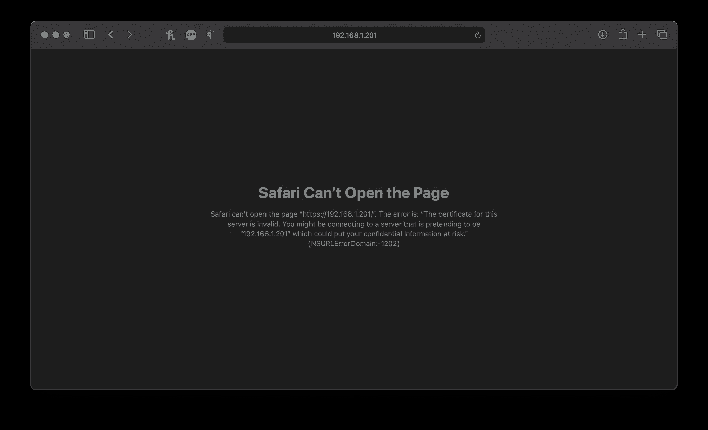

# 循序渐进指南:树莓 Pi 集群上的 Kubernetes 仪表盘(第 2 部分)

> 原文：<https://levelup.gitconnected.com/step-by-step-slow-guide-kubernetes-dashboard-on-raspberry-pi-cluster-part-2-acdc8f9b5b99>

如何为 Kubernetes Dashboard 设置自签名证书并通过负载平衡器公开它


罗伯特·阿纳奇在 [Unsplash](https://unsplash.com?utm_source=medium&utm_medium=referral) 拍摄的照片

在上一部分中，我们讨论了如何设置 Kubernetes Dashboard，现在我们将重点关注如何设置 Dashboard 证书并在我们的集群之外公开它。

首先，我们将通过负载平衡器公开我们的 Kubernetes 仪表板。我们将使用 MetalLB。我以前写过如何在树莓 Pi Kubernetes 集群上设置它，如果你还没有这样做，请点击下面的链接

[](/step-by-step-slow-guide-kubernetes-cluster-on-raspberry-pi-4b-part-3-899fc270600e) [## 循序渐进指南—树莓 Pi 4B 上的 Kubernetes 集群—第 3 部分

### 在之前的 par 中，我们初始化了主节点并添加了工作节点。现在我们需要添加网络——印花布和负载…

levelup.gitconnected.com](/step-by-step-slow-guide-kubernetes-cluster-on-raspberry-pi-4b-part-3-899fc270600e) 

让我们创建新的负载平衡器服务，它将公开我们的仪表板。创建名为 kd-loadbalancer.yaml 的新文件，并复制以下内容:

```
apiVersion: v1
kind: Service
metadata:
  name: kd-loadbalancer
  namespace: kubernetes-dashboard
spec:
  type: LoadBalancer
  ports:
    - port: 443
      protocol: TCP
      targetPort: 8443
  selector:
    k8s-app: kubernetes-dashboard
```

并通过运行以下命令来应用它:

```
kubectl apply -f kd-loadbalancer.yaml
```

因为我们没有指定 IP，所以让我们看看通过运行

```
kubectl get service -n kubernetes-dashboard
```


Kubernetes 负载平衡器的 IP 地址

让我们尝试通过输入浏览器 IP 地址来打开仪表板，该地址是我们通过 HTTPS 协议从负载平衡器处获得的`https://192.168.1.201`



证书错误 Safari

Chrome 和 Safari 会拒绝这个证书，但是它可以在 FireFox 上运行，但是为了解决这个问题，我们将创建自己的自签名证书。因为我们的仪表板可能永远不会暴露在我们的内部网络之外，所以这样做很好。

为了使下面的工作更容易，让我们在主目录`mkdir ~/certs`中创建 certs 文件夹，并在那里创建我们的证书文件。

```
openssl req -newkey rsa:4096 -x509 -sha256 -nodes -out ~/certs/dashboard.crt -keyout ~/certs/dashboard.key
```

Kubernetes Dashboard 希望我们将证书存储在名为`kubernetes-dashboard-certs`的秘密中，但由于默认证书是在我们初始部署时创建的，我们将首先删除它。

```
kubectl delete secret kubernetes-dashboard-certs -n kubernetes-dashboard
kubectl create secret generic kubernetes-dashboard-certs --from-file=$HOME/certs -n kubernetes-dashboard
```

现在，我们需要编辑原始仪表板 yaml 文件:

```
nano recommended.yaml
```

让我们更改下面几行:

```
# Change from:
      containers:
        - name: kubernetes-dashboard
          image: kubernetesui/dashboard:v2.1.0
          imagePullPolicy: Always
          ports:
            - containerPort: 8443
              protocol: TCP
          args:
            - --auto-generate-certificates
            - --namespace=kubernetes-dashboard# To:
#Change from:
      containers:
        - name: kubernetes-dashboard
          image: kubernetesui/dashboard:v2.1.0
          imagePullPolicy: Always
          ports:
            - containerPort: 8443
              protocol: TCP
          args:
**#            - --auto-generate-certificates
            - --tls-cert-file=/dashboard.crt
            - --tls-key-file=/dashboard.key**
            - --namespace=kubernetes-dashboard
```

我们将使用以下代码将这个 yaml 文件重新应用到我们的服务器:

```
kubectl apply -f recommended.yaml
```

现在让我们尝试访问 https://192.168.1.201


Safari 中的自签名证书警告

我们可以确认我们愿意继续并接受此证书。


使用 SSL 运行 Kubernetes 仪表板

我们有工作 Kubernetes 仪表板安全与我们的自签名 SSL 证书。

我希望你喜欢这个指南。如往常一样，如果有任何问题或意见，请随时告诉我。我在尽我所能回复大家。下次见！

[](https://astrujic.medium.com/step-by-step-slow-guide-kubernetes-dashboard-on-raspberry-pi-cluster-part-1-308456b69dba) [## 分步慢速指南—树莓 Pi 集群上的 Kubernetes 仪表盘—第 1 部分

### 如何安装和配置 Kubernetes 仪表板

astrujic.medium.com](https://astrujic.medium.com/step-by-step-slow-guide-kubernetes-dashboard-on-raspberry-pi-cluster-part-1-308456b69dba)