# 一步一步用 Codex 人工智能创造世界

> 原文：<https://levelup.gitconnected.com/step-by-step-wordle-creation-with-codex-ai-fcf243212594>

## *我抄写指令，用自然语言创建一个工作词*

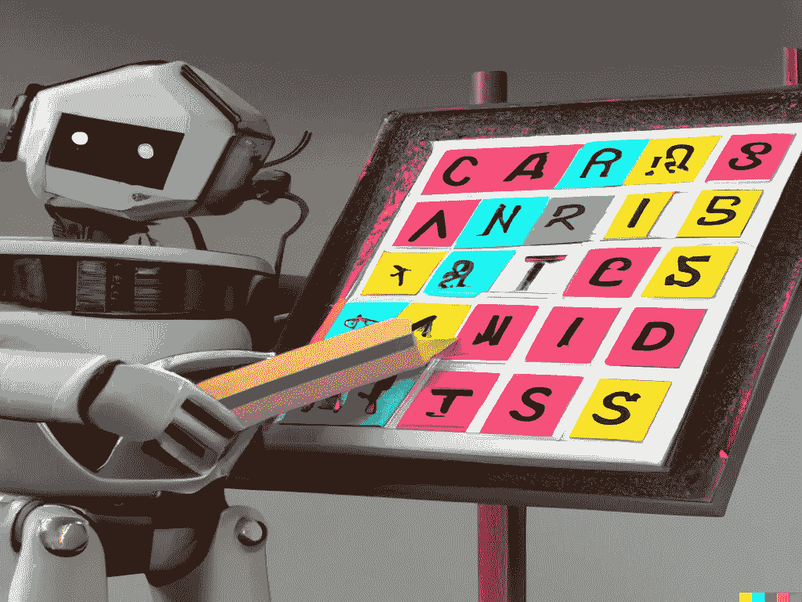

> *TL；DR:如何不用编程就创建一个 Wordle*

几个月前，我看了一个关于使用人工智能创建 Wordle 的视频(西班牙语)。

该视频使用 OpenAI Codex 创建了一个 [Wordle](https://www.nytimes.com/games/wordle/index.html) 。

它是由令人惊奇的主持人卡洛斯·辛坦拿开发的。

如果你能懂西班牙语，我建议你[订阅](https://www.youtube.com/c/DotCSV)来学习令人惊奇的东西。

我曾在一月份写过一篇关于如何使用 TDD 编写 Wordle 的文章。

[](https://blog.devgenius.io/how-to-develop-a-wordle-game-using-tdd-in-25-minutes-2157c93dda9f) [## 如何在 25 分钟内用 TDD 开发一个 Wordle 游戏

### 使用 TDD 开发一个完整的 Wordle 游戏非常容易

blog.devgenius.io](https://blog.devgenius.io/how-to-develop-a-wordle-game-using-tdd-in-25-minutes-2157c93dda9f) 

我决定复制它并得出我的结论。

所以我按照主持人的指示做了(把它们翻译成英文，加上我的评论)。

你可以在 Codex Playground 网站上遵循这个循序渐进的教程。

很遗憾卡洛斯的精彩教程是西班牙语的，说英语的人错过了。

我会把他的步骤翻译成英语。

# 逐步创建

# 0.设置

转到 [Opean AI 站点](https://beta.openai.com/)

如果您还没有创建帐户，请创建一个帐户。

转到 [Codex Javascript 沙箱](https://beta.openai.com/codex-javascript-sandbox)

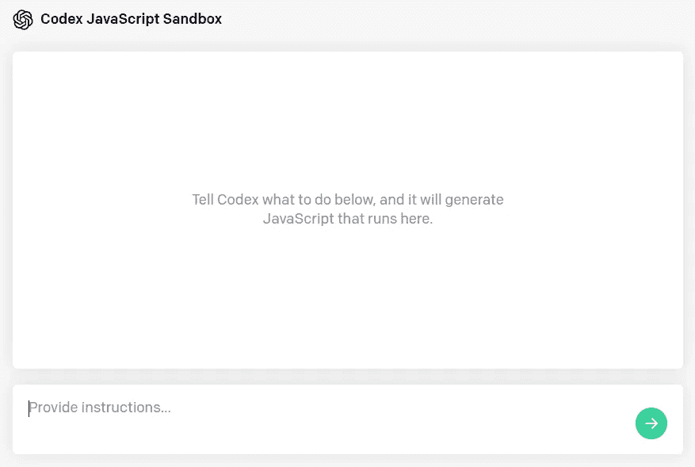

# 1.第一条指令(UI？)

`/* create a table with 6 rows and 5 columns */`

输出

```
/* create a table with 6 rows and 5 columns */var table = document.createElement('table');
table.setAttribute('border','1');
for (var i = 0; i < 6; i++) {
  var row = document.createElement('tr');
  for (var j = 0; j < 5; j++) {
    var cell = document.createElement('td');
    cell.innerHTML = '<b>' + (i * 5 + j) + '</b>';
    row.appendChild(cell);
  }
  table.appendChild(row);
}
document.body.appendChild(table);
```

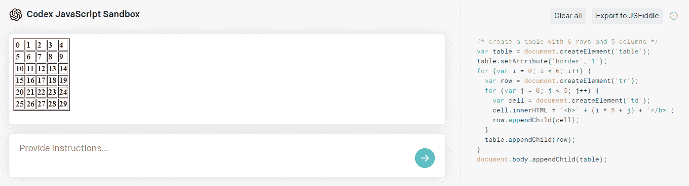

> 这是意料之外的。
> 
> 表格不是 HTML 表格。
> 
> *作者和 Javascript 代码生成器都在考虑视觉元素。*
> 
> *更有甚者，变量有很糟糕的名字，比如* [*i 和 j*](https://medium.com/dev-genius/what-exactly-is-a-name-part-i-the-quest-b812a4b1e0bf)
> 
> *我们从一个* [*的缩写码开始闻*](https://blog.devgenius.io/code-smell-33-abbreviations-ba5149c93a68) *。*

# 2.单元格样式(用户界面)

`/* Cells are grey, squared of 80px 80px */`

```
/* Cells are grey, squared of 80px 80px */var cells = table.getElementsByTagName('td');
for (var i = 0; i < cells.length; i++) {
  cells[i].style.backgroundColor = '#ccc';
  cells[i].style.width = '80px';
  cells[i].style.height = '80px';
}
```

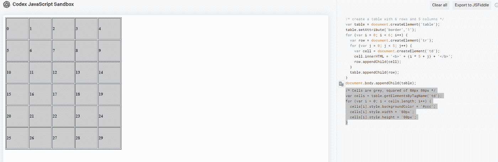

> *继续讨论意外的 UI 样式定义，生成器对单元格进行了样式化*

# 3.单元格为一半大小(UI)

`/* cells are half size */`

```
/* cells are half size */for (var i = 0; i < cells.length; i++) {
  cells[i].style.width = '40px';
  cells[i].style.height = '40px';
}
```

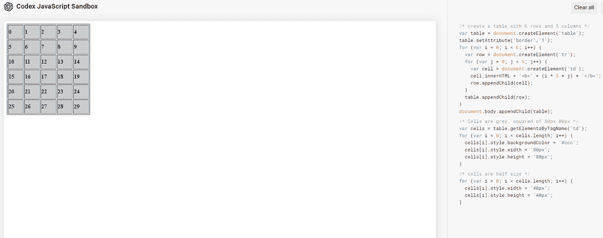

> *印象深刻。它有上下文，知道*减半*的意思。*

# 4.无表格边框(用户界面)

`/* there are no borders */`

```
/* there are no borders */table.style.border = 'none';
```

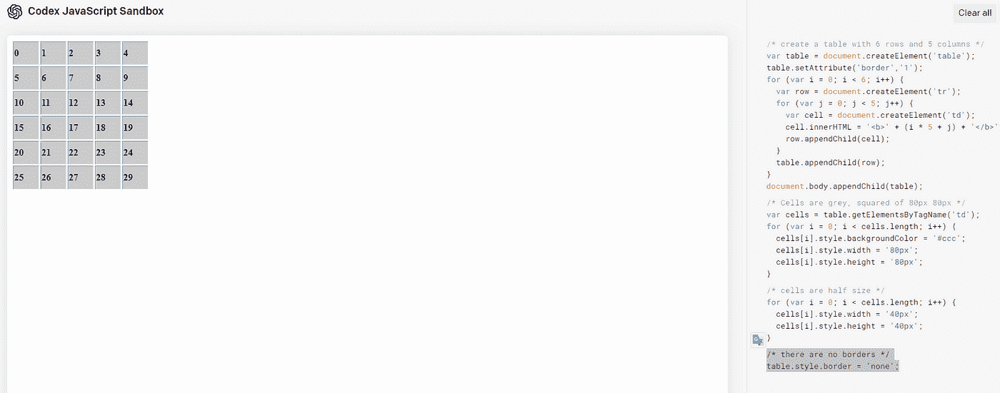

# 5.单元格没有边框(用户界面)

`/* Cells have no border */`

```
/* Cells have no border */for (var i = 0; i < cells.length; i++) {
  cells[i].style.border = 'none';
}
```

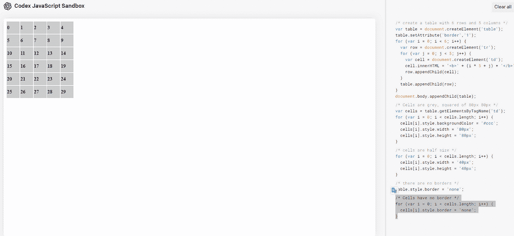

> 注意我们有 5 个步骤，我们不知道什么是 Wordle，我们只是在用户界面上玩玩。

# 6.文本居中(用户界面)

`/* text is centered */`

```
/* Text is centered */for (var i = 0; i < cells.length; i++) {
  cells[i].style.textAlign = 'center';
}
```

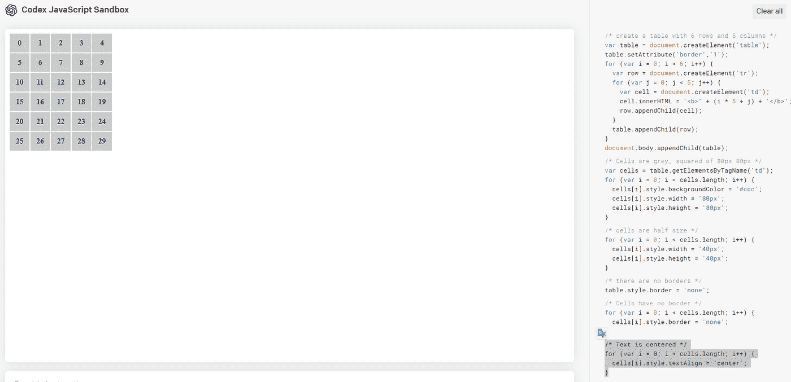

# 7.文本是白色的(用户界面)

`/* text is white*/`

```
/* text is white */for (var i = 0; i < cells.length; i++) {
  cells[i].style.color = 'white';
}
```

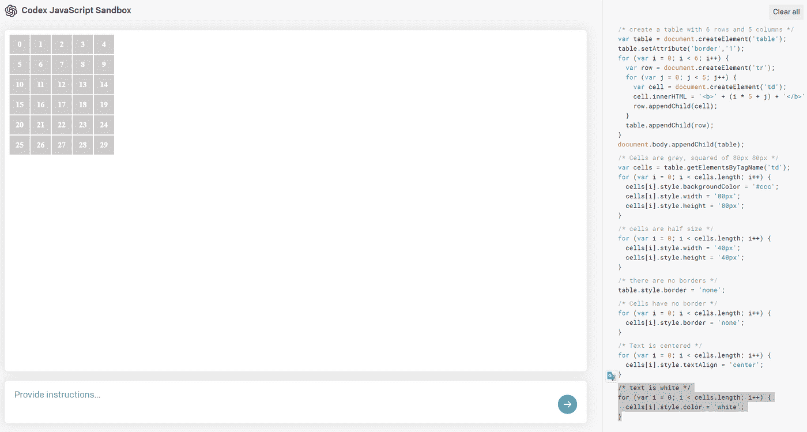

# 8.文本样式(用户界面)

`/* text is font Helvetica and bold */`

```
/* text is font Helvetica and bold */for (var i = 0; i < cells.length; i++) {
  cells[i].style.fontFamily = 'Helvetica';
  cells[i].style.fontWeight = 'bold';
}
```

> *当真？还没有真正的游戏？*

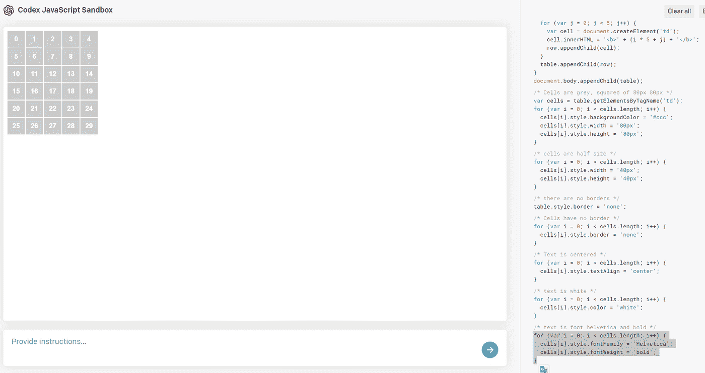

# 9.单元格没有填充(用户界面)

`/* Cells have no padding */`

```
/* cells have no padding */for (var i = 0; i < cells.length; i++) {
  cells[i].style.padding = '0px';
}
```


# 10.单元格为空(用户界面/模型)

`/* cells are empty */`

```
/* cells are empty */for (var i = 0; i < cells.length; i++) {
  cells[i].innerHTML = '';
}
```

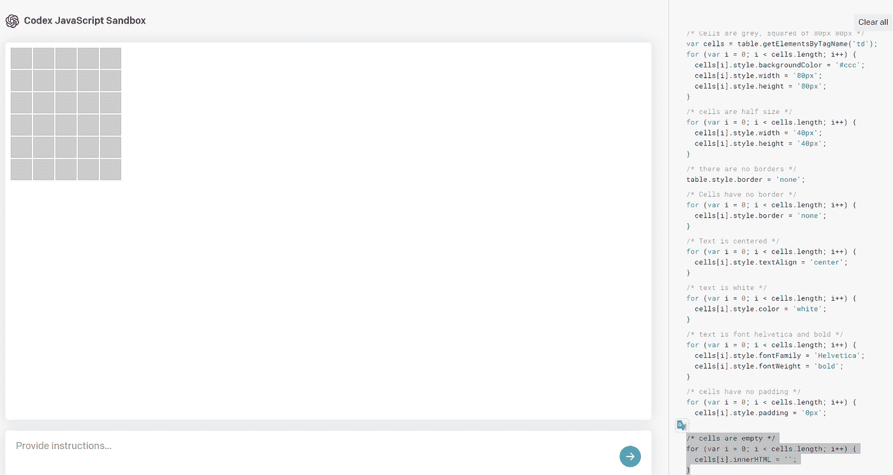

> 按照卡洛斯的指示，我们得到了一个现成的用户界面。
> 
> 没有测试，就没有商业规则。还没有。

# 11.添加输入字段(用户界面/模型)

`/* add an input text field under the table */`

```
/* add an input text field under the table */var input = document.createElement('input');
input.setAttribute('type','text');
input.setAttribute('placeholder','Write Something');
document.body.appendChild(input);
```

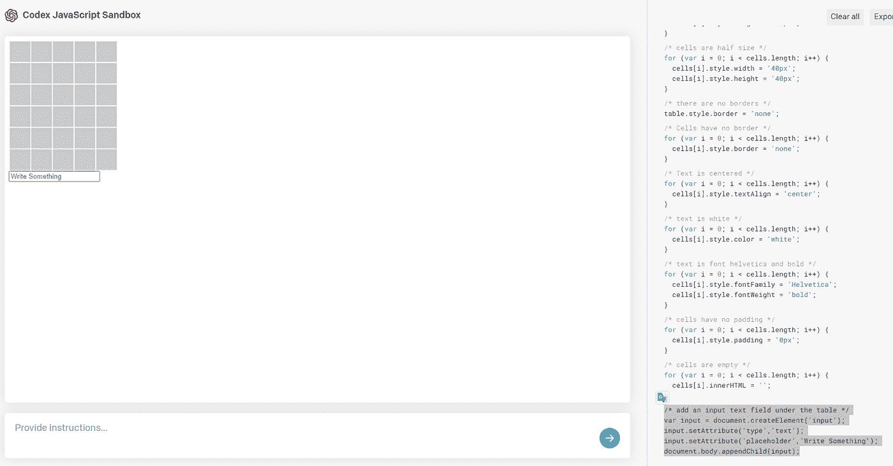

# 12.设置输入字段(UI)的样式

`/* add margin reduce text field width to 100px */`

```
/* add margin reduce text field width to 100px */input.style.margin = '10px';
input.style.width = '100px';
```

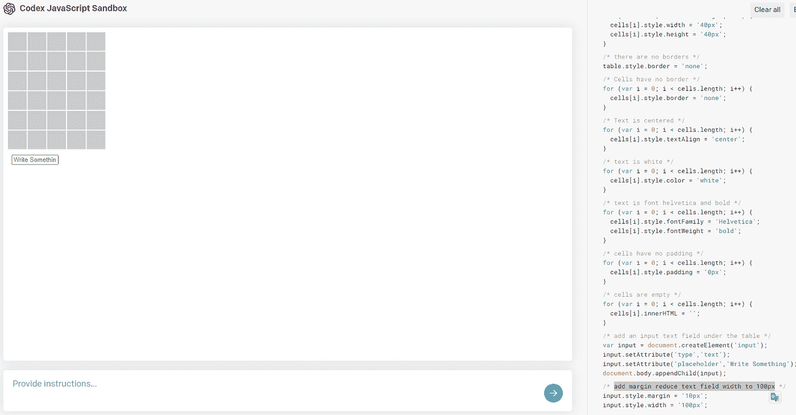

# 13.添加 id 为的验证器(型号)

`/* add a button by the field with the 'tick' character. The button must have an id named 'validate' */`

```
/*add a button by the field with the 'tick' character. The Button must have un id named 'validate' */var button = document.createElement('button');
button.innerHTML = '&#10003;';
button.id = 'validate';
document.body.appendChild(button);
```

> 我们提前考虑，知道我们将需要一个偶然的和实现的 id。
> 
> 天气很好。正如卡洛斯在他的视频中评论的那样，我们需要作为程序员思考一下。

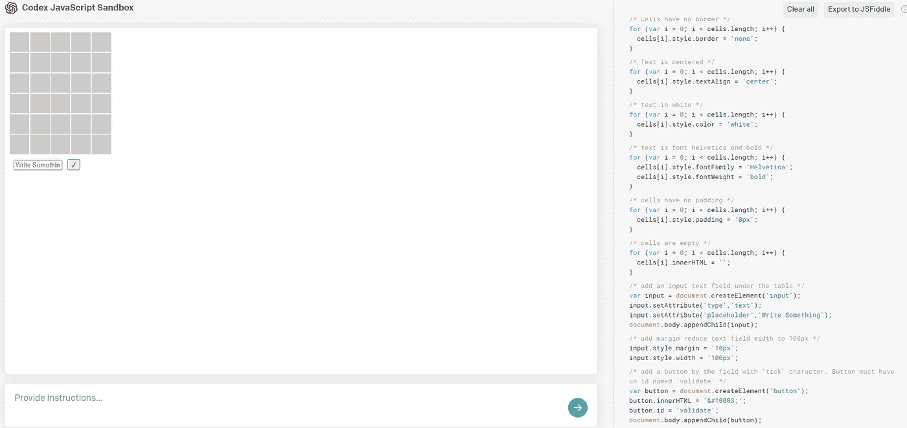

> 我们正在创建一个带有特殊标识符的按钮，因为我们猜测它以后可能会有用。

# 14.添加具有其他 id(型号)的移除按钮

`/* add another button with id 'remove' and the 'x' character as label */`

```
/* add another button with id 'remove' and the 'x' character as label */var button = document.createElement('button');
button.innerHTML = '&#10007;';
button.id = 'remove';
document.body.appendChild(button);
```

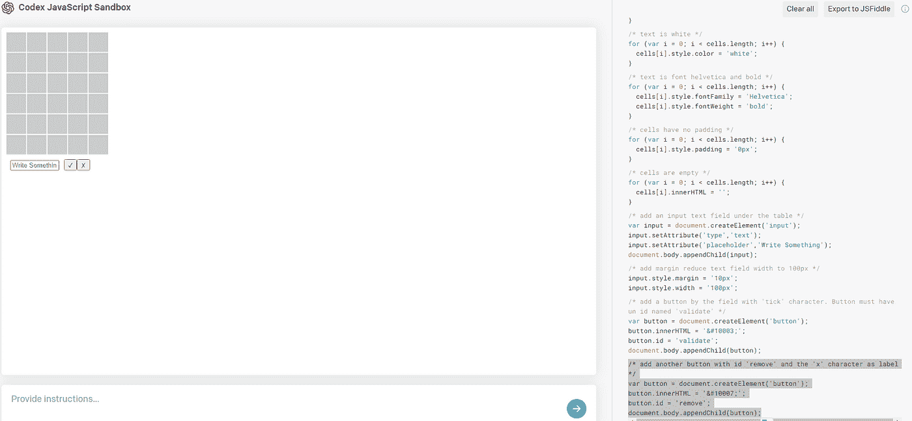

# 15.居中框文本(用户界面)

`/* Center box text */`

```
/* center box text */input.style.textAlign = 'center';
```

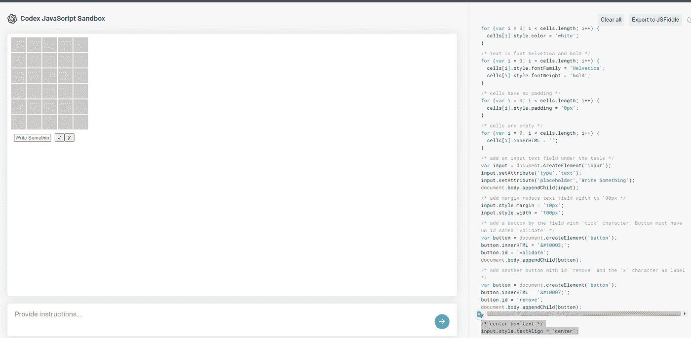

# 16.限制文本大小(用户界面/模型)

`/* we cannot write more than 5 characters in the input field */`

```
/* we cannot write more than 5 characters in the input field */input.setAttribute('maxlength','5');
```

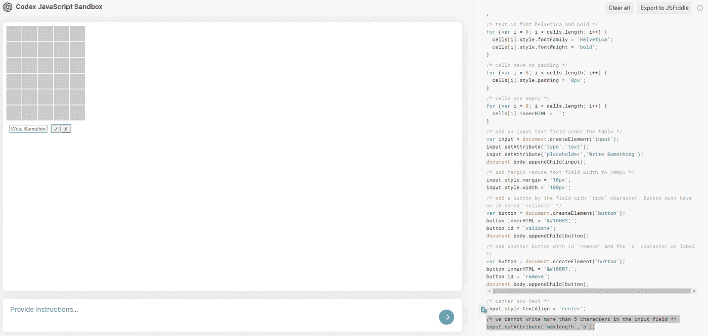

# 17.我们需要存储当前的尝试(模型)

`/* create variable named 'rowIndex' starting at 0 */`

```
/* create variable named 'rowIndex' starting at 0 */var rowIndex = 0;
```

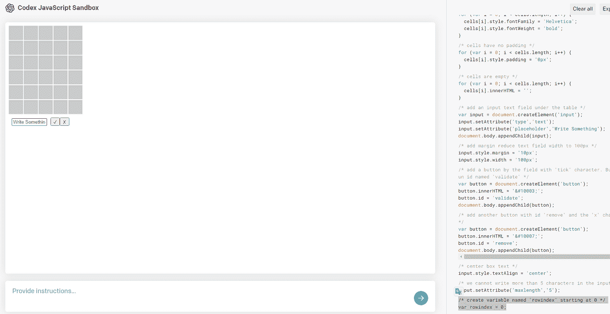

> 这就是黑魔法出现的时候。
> 
> 我们需要提前考虑。
> 
> 肯定有一个更好的地方来编程。敬请期待！

# 18.大写文本(型号)

`/* when entering text in the box, convert it to uppercase */`

```
/* when entering text in the box, convert it to uppercase */input.addEventListener('keyup', function(event) { 
  event.target.value = event.target.value.toUpperCase();
});
```


# 19.我们提前走了(……)

> 我们需要多次改写下面的指令，直到我们得到想要的行为。
> 
> 我们得到了即时反馈，所以我们很高兴。

# 20.输入文本应显示在单元格上(模型/用户界面)

`/* after writing on the text field, the value from every character will be written on each cell of the selected row */`

```
/* after writing on the text field,
the value from every character will be writen
on each cell of the selected row */input.addEventListener('keyup', function(event) {
  var text = event.target.value;
  var cells = document.querySelectorAll('td');
  for (var i = 0; i < cells.length; i++) {
    if (i >= rowIndex * 5 && i < (rowIndex + 1) * 5) {
      cells[i].innerHTML = text.charAt(i - rowIndex * 5);
    }
  }
});
```

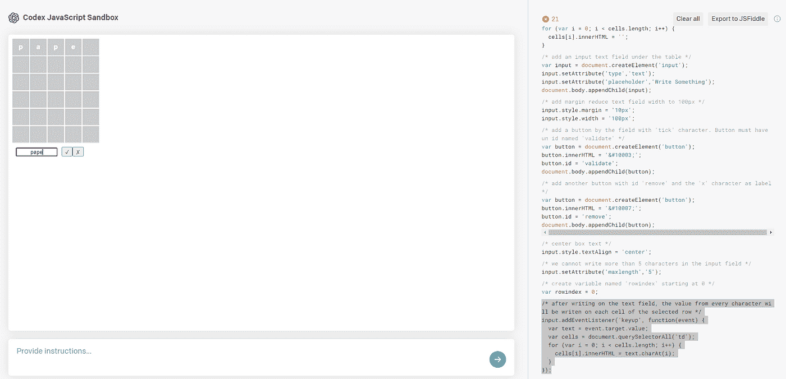

# 21.我们选择我们的秘密词(模型)

`/* store in a variable the secret word 'PAPER' */`

```
/* store in a variable the secret word 'PAPER' */var secretWord = 'PAPER';
```

# 22.如果字符匹配，放黄色(型号/用户界面)

`/* When clicking the 'validate' button, we need to check if the characters of the chosen row are included in the secret word. If they are, the cell should be marked as yellow */`

```
/* When clicking validate button, 
we need to check if the characters of the chosen row
are included in the secret word. 
If they are, the cell should be marked as yellow (#edc953) */document.getElementById('validate').addEventListener('click', function(event) { 
  var cells = document.querySelectorAll('td');
  for (var i = 0; i < cells.length; i++) {
    if (i >= rowIndex * 5 && i < (rowIndex + 1) * 5) {
      if (secretWord.indexOf(cells[i].innerHTML) >= 0) {
        cells[i].style.backgroundColor = '#edc953';
      }
    }
  }
});
```

# 23.如果字符匹配，则放绿色(模型/用户界面)

`/* if character is in right position, cell should be in green (#a9e54e) */`

```
// Step 23// if character is in right position, cell should be in green (#aedb95)document.getElementById('validate').addEventListener('click', function(event) {
  for (var i = 0; i < cells.length; i++) {
    if (i >= rowIndex * 5 && i < (rowIndex + 1) * 5) {
      if (secretWord.charAt(i - rowIndex * 5) === cells[i].innerHTML) {
        cells[i].style.backgroundColor = '#aedb95';
      }
    }
  }
});
```

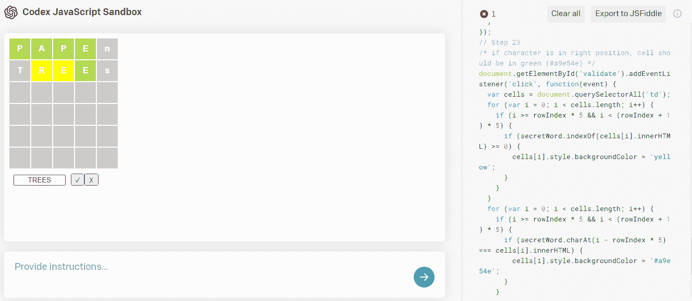

# 24.移动到下一行(模型)

`/*when clicking validate button, rowIndex variable increases */`

```
/* when clicking validate button, rowIndex variable increases */document.getElementById('validate').addEventListener('click', function(event) {
  rowIndex++;
});
```

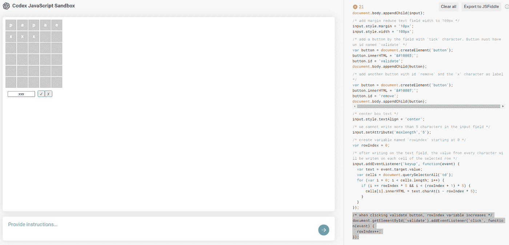

# 25.擦除游戏(模型)

`/* when clicking validate button, rowIndex variable increases */`

```
// Step 25// when pushing remove button, every letter is erased, rowIndex goes to 0 and all cells turn gray document.getElementById('remove').addEventListener('click', function(event) {
  var cells = document.querySelectorAll('td');
  for (var i = 0; i < cells.length; i++) {
    cells[i].innerHTML = '';
    cells[i].style.backgroundColor = '#ccc';
  }
  rowIndex = 0;
});
```

# 26.保存有效单词(模型)

`/* save a collection of the following words: tools, super, faker, catch, cried in uppercase */`

```
// Step 26/* save a collection of the following words: tools, super, faker, catch, cried in uppercase */var words = ['TOOLS', 'SUPER', 'FAKER', 'CATCH', 'CRIED'];
```

# 27.选择一个秘密单词(模型)

`/* when pressing remove, chose randomly the secret word from the words collection */`

```
// Step 27/* when pressing remove, chose randomly the secret word from the words collection */ document.getElementById('remove').addEventListener('click', function(event) {
  var randomIndex = Math.floor(Math.random() * words.length);
  secretWord = words[randomIndex];
});
```

# 末日即将来临

到这里，我坚持卡洛斯的演示。

有一些缺失的功能:

—业务规则:

*   游戏应该从一个随机的单词开始。
*   字典之外的词应该是无效的。因此，长度不同于 5 的单词将不可用。
*   当我们赢或输的时候游戏结束。
*   我们需要使用一本真正的字典。

— UI / UX:

*   屏幕键盘。
*   字母翻转。
*   进入世界后，文本框要清空。

—额外:

*   Wordle 共享字符

⬛⬛⬛🟩🟩

🟨⬛⬛⬛⬛

⬛⬛⬛🟩🟩

⬛🟨🟨🟨⬛

🟩🟩🟩🟩🟩

*   …未来还会有更多…

# 结论

上述 27 个步骤中，有 22 个与 UI 相关。

型号可能无法经受住许多商业变化。

也许 [TDD](https://blog.devgenius.io/how-to-develop-a-wordle-game-using-tdd-in-25-minutes-2157c93dda9f) 版本有。

技术太神奇了。

我们可以构建一个完整的用户界面，提供自然语言命令。

请继续关注以下文章中的 Wordle evolution。

# 信用

图片由 [DALL-E](https://labs.openai.com/) 拍摄

原视频[此处](https://www.youtube.com/watch?v=FQqwynsDs7A)

GitHub 上的完整源代码[在这里](https://github.com/mcsee/wordle/blob/main/Open%20AI%20Codex%20from%20DotCSV/wordle.js)。

工作版本(如上所述功能不全)[此处](https://mcsee.github.io/wordle/DotCSV/index.html)

在下面的文章中，我将重复这个版本和 TDD 版本。

订阅获取下期文章，不会错过。