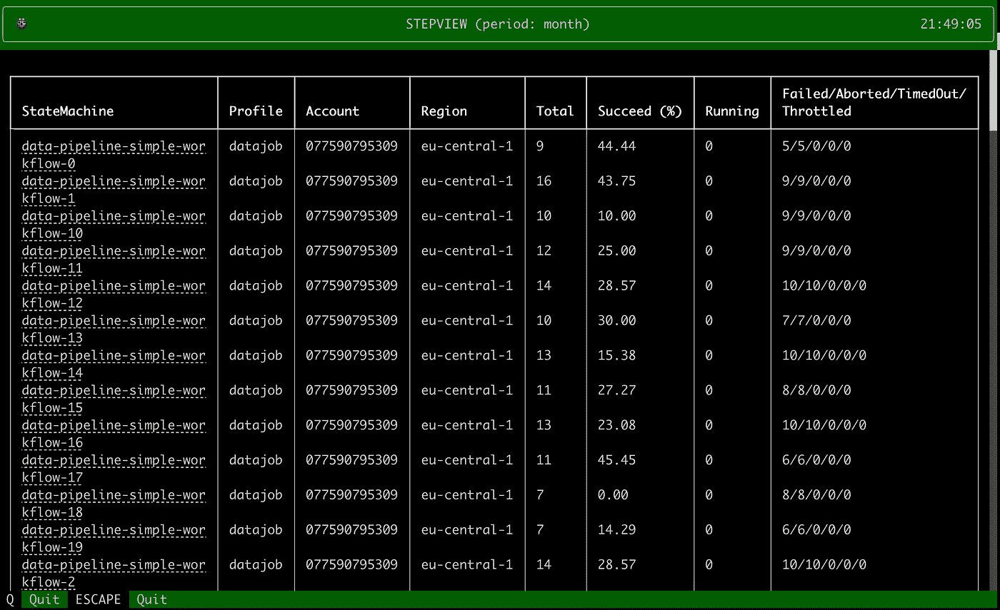
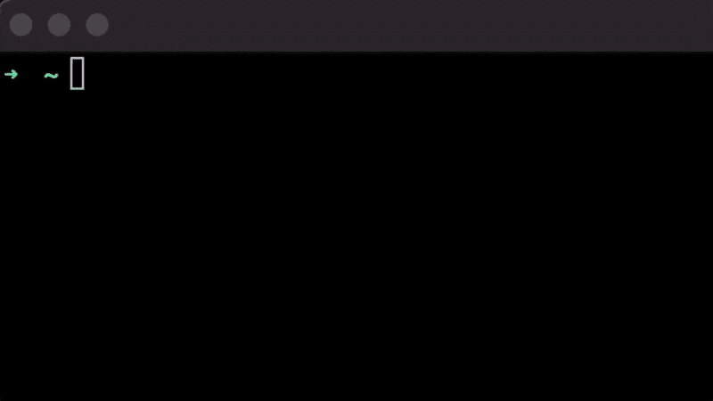

# Stepview —所有 AWS 步骤功能一览无余！

> 原文：<https://levelup.gitconnected.com/stepview-all-your-aws-stepfunctions-at-a-glance-efeefe456f20>

## 从终端开始，通过不同的 AWS 帐户、不同的区域，密切关注您的所有数据和 ML 管道。



[https://github.com/vincentclaes/stepview](https://github.com/vincentclaes/stepview)

Stepfunctions 是一个无服务器的工作流程编排器。这是一个在 AWS 上自动执行数据和 ML 管道的流行工具。

*您是否有一些生产工作负载通过 AWS Stepfunctions 运行？*

然后，您希望密切关注您的所有执行，并在出现问题时采取行动。当您在不同的地区对不同的帐户运行几十到几百次执行时，管理就变得很困难。

到目前为止，还没有一种工具可以在一个视图中包含所有 AWS 步骤功能！

使用 **Stepview，**您可以在终端中跟踪给定时间段内所有 AWS Stepfunctions 的执行情况！

## **安装**

```
pip install stepview
```

## 使用

*   [设置一个名为概要文件](https://docs.aws.amazon.com/cli/latest/userguide/cli-configure-profiles.html#cli-configure-profiles-create)的 AWS。
*   选择时间段:分钟、小时、今天、日、周、月、年。

```
stepview --profile foo,bar --period year
```



*   查看总执行数。
*   查看成功执行的百分比。
*   查看正在运行的执行次数。
*   查看失败/中止/超时/节流执行的数量。
*   单击状态机导航到 Stepfunctions 状态机。

## 根据标签过滤

选择性地指定您想要过滤 stepfunctions 状态机的标签。以逗号分隔的关键字形式提供您的标签:

```
stepview --tags foo=bar,baz=qux
```

**Github**

[](https://github.com/vincentclaes/stepview) [## GitHub - vincentclaes/stepview:您所有的 AWS 功能在终端中一览无余！🧐

### 您所有的 AWS 步骤功能在终端一目了然！🧐 - GitHub - vincentclaes/stepview:您所有的 aws 函数…

github.com](https://github.com/vincentclaes/stepview) 

喜欢就给它一个⭐️吧！

*   你觉得少了什么吗？
*   有什么令人兴奋的功能吗？
*   一句话或反馈？

➡️提供评论！🙏

## 技术堆栈

*   对于视觉效果，我使用了文本的[和丰富的](https://github.com/Textualize/textual)。
*   对于 CLI，我使用了 [typer](https://github.com/tiangolo/typer) 。
*   为了操作日期时间，我使用了[钟摆](https://github.com/sdispater/pendulum)。
*   为了在测试中模仿 AWS 服务，我使用了 [moto](https://github.com/spulec/moto) 。

# 文森特·克拉斯

👋在 [Medium](https://medium.com/@vincentclaes_43752) 、 [Linkedin](https://www.linkedin.com/in/vincent-claes-0b346337/) 和 [Twitter](https://twitter.com/VincentClaes1) 上关注我，阅读更多关于 ML 工程和 ML 管道的内容。