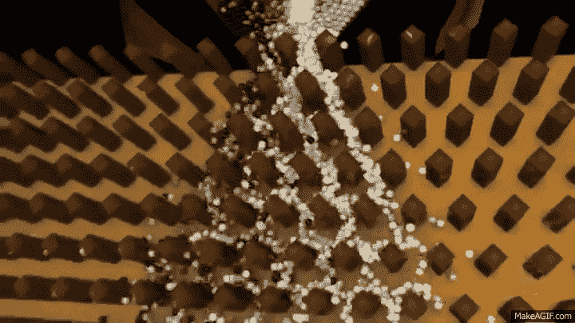
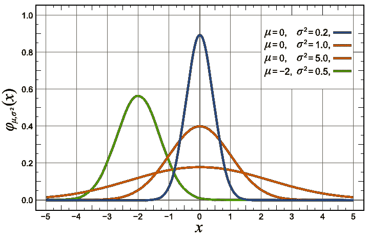
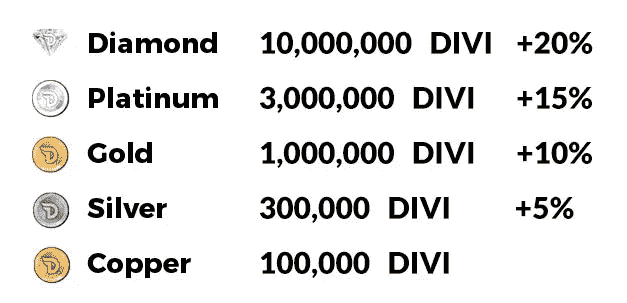
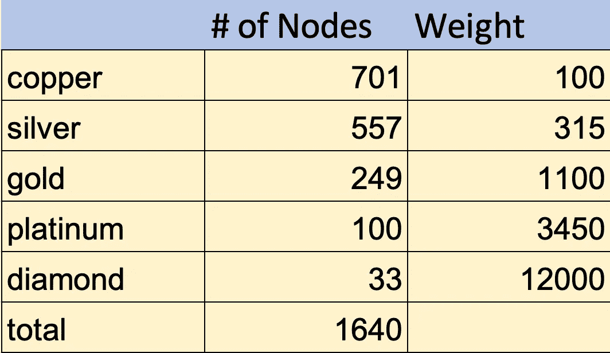
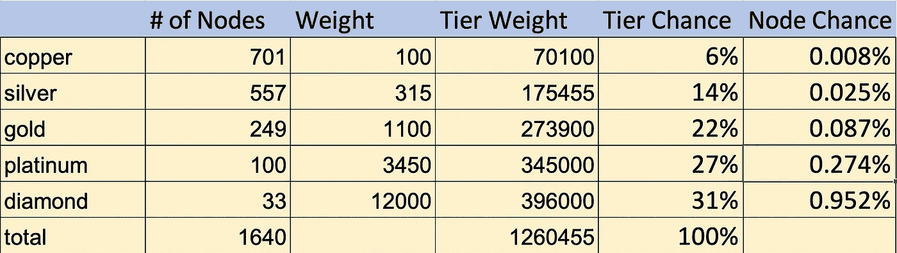
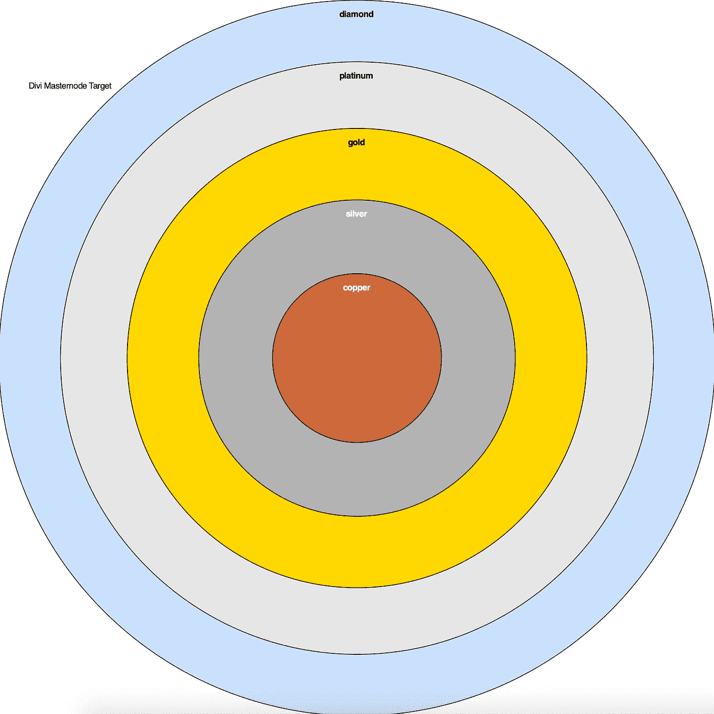
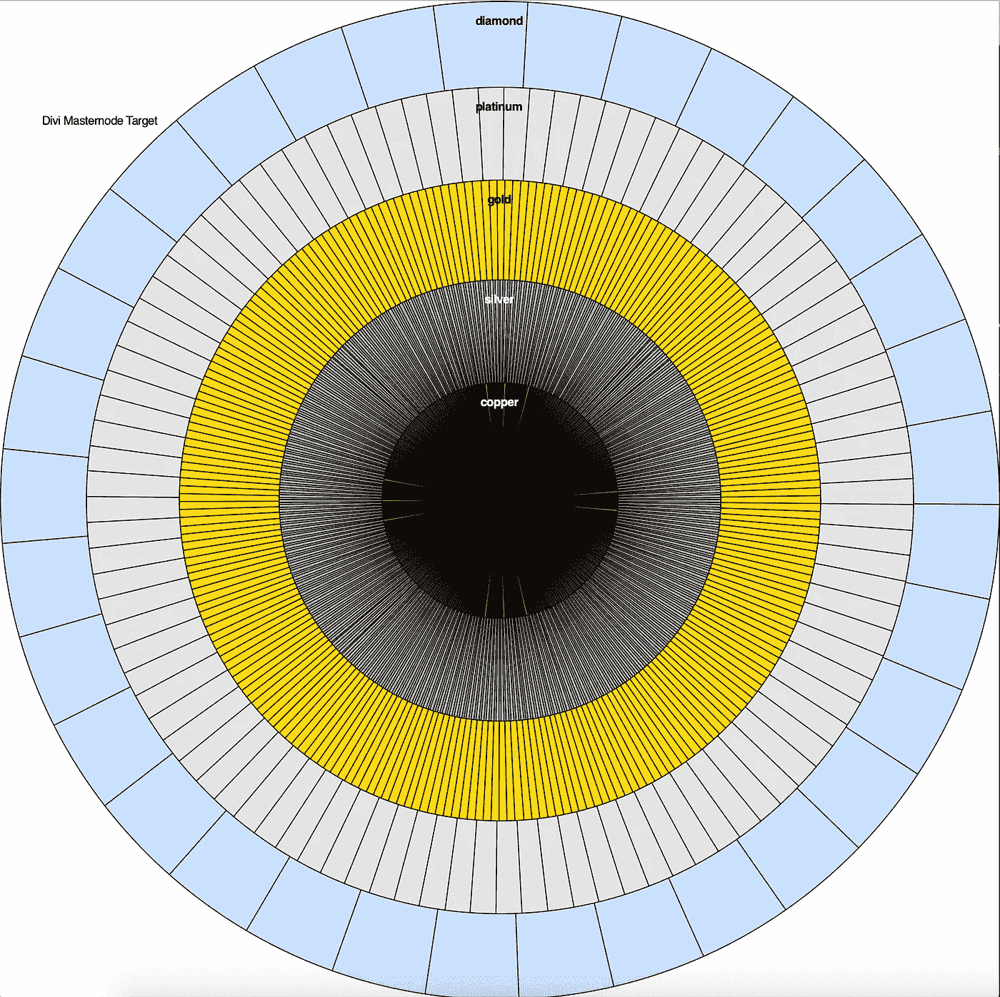
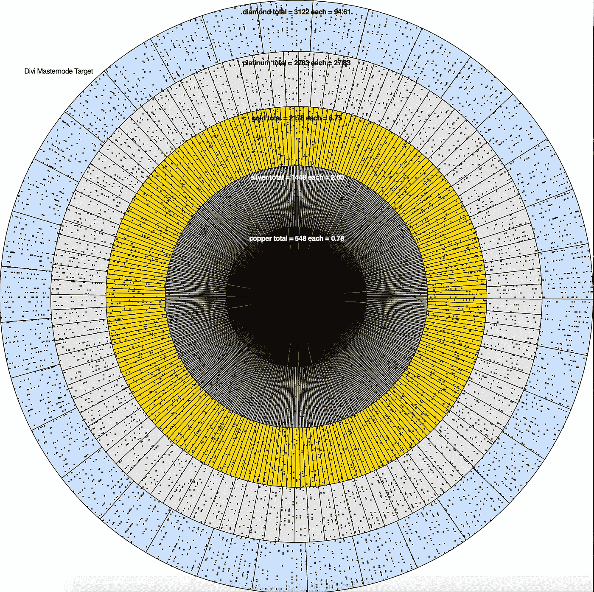
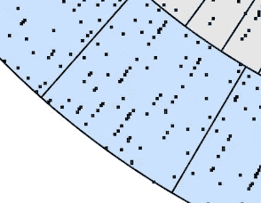
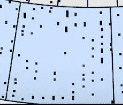

# 随机:初级读本

> 原文：<https://levelup.gitconnected.com/stochastics-a-primer-b2babada550b>

我们如何预测随机输入系统的输出？

如果你以前没有听说过“随机”这个词，你是大多数，可以完全被原谅。但令人惊奇的是，几乎生活的每个方面都是由随机过程驱动的。让我们看看它是什么，以及它与区块链有什么关系。

所有随机的意思就是某物以一种随机的方式运行。更重要的是，随机系统基于一组随机的输入(这些输入本身可能是随机的，但仍然不是均匀分布的，稍后会详细介绍)，具有统计上可预测的输出范围。

快速浏览一下[维基百科给出了一个引人注目的列表](https://en.wikipedia.org/wiki/Stochastic),列出了经济、科学和社会领域，这些领域都是由随机过程驱动的，并且可以被建模为随机过程。但是让我们试一个简单的例子，试着理解随机理论。

## 抛硬币

好吧，当讨论随机性和随机性时，很难不从这里开始。[随机性](https://en.wikipedia.org/wiki/Randomness)决定每枚硬币的结果。随机性描述了基于随机输入的一组结果。所以，举个例子，在这种情况下，我们会说，“对于 1000 次抛硬币，其中 50%是正面，50%是反面”。单次抛硬币的结果是随机的，多次抛硬币 50:50 的结果是随机的。

我知道，这不是一个大脑爆炸的启示，让我们继续下去，看看我们如何利用这一点。

## 普林科

高尔顿板(【https://makeagif.com/i/oAKjj0】T4)

普林科和它的堂兄高尔顿董事会，在行动中展示了随机性。在上面的视频中，你可以看到每个弹球在进入棋盘之前都有一些随机的初始条件(初始位置，进入时的速度，击中其他珠子后的旋转，等等)，当击中一个木栓时，这个弹球会以随机的方向移动。不管你把高尔顿板翻转多少次，最终的结果都是相同的珠子分布:末端的珠子很少，中间的珠子很多。这叫正态分布，每次都会发生。

> 随机性是弹球进入棋盘并沿着棋盘向下运动的条件。随机性是所有球最终所处的正态分布。

如果您想以编程方式更深入地了解这个主题，[这里有一个关于 plinko 板编程的绝佳资源](https://www.tylermw.com/plinko-statistics-insights-from-the-bean-machine/)。这里的是 plinko 编程模拟赌博结果的应用程序，所以模拟 plinko，信不信由你，在现实世界中是有用的！

## 蒙特 卡罗模拟

当我们编写随机系统的模拟程序时，我们可以通过执行所谓的蒙特卡罗模拟来实现。首先，你用程序设置输入，用软件设置系统，这样你就可以看到一次试验的结果。所以对于普林科来说，你可以简单地在每次球击中木栓时随机选择“左”或“右”，或者你可以建立一个物理模型，随机模拟球的初始条件。无论哪种方式，您都可以模拟每个球沿 plinko 板下落的路径。

有了这个模型，你可以运行它数千次来查看输出的分布。对于普林科来说，这是一个正态分布。

有一款优秀的软件叫做[水晶球](https://www.oracle.com/middleware/technologies/crystalball.html)，用于微软 Excel，可以让你通过蒙特卡洛模拟进行多输入多输出的随机分析。它被用在每个行业，因为“这个值是什么？”通常是一系列数字，并且通常呈正态分布。因此，模型的输出也是一系列数字。如果您可以确定输出数字的范围，那么您就可以预测，例如，在输入具有随机分布范围的过程中，您将得到多少坏零件。

## 加权输入

在我们看到它在区块链的实际应用之前，还有一个话题。重要的是要理解，输入也可以加权。例如，这三条曲线可以描述四个不同制造商生产的活塞的直径。

均值和方差有差异的正态分布

如果我们将活塞直径的红色分布作为我们当前的供应商，我们可以检查其他供应商的零件分布。绿色供应商提供的零件几乎总是太小。所以我们会拒绝该供应商。但是蓝色供应商不仅提供了与我们目前使用的目标相同的零件，而且还提供了更少的偏离目标尺寸的零件。我们应该换供应商！

但是等等！也许不是！发动机是个复杂的东西，可能这个维度的*重要性*没有其他零件高。也许火花塞输出能量的范围更重要，也许进气的范围更重要(显然我对发动机一无所知)，这些事情联系在一起就产生了输出扭矩。因此，我们可以将这些输入乘以一个权重，以提高或降低它们对整个系统的影响。

## 区块链中的随机性

让我们花些时间在区块链应用它。验证过程、块链接过程、钱包创建过程等等都是通过结合随机性来创建的。安全性完全依赖于极大数字的随机性。

区块链的随机部分是完全可以预测的，这很好！我们来看一个。比特币很无聊，让我们看看一个崭露头角的区块链项目， [Divi](https://diviproject.org) ！

Divi 是比特币、Dash 和 PIVX 的后裔，和许多其他类似的后裔链(例如，Phore、Rapids 和 Particl)一样具有经济机制。经济有两个部分，主节点网络和赌注节点。有一些关于经济的知识:

1.  平均阻塞时间大约是一分钟，这意味着一周大约有 10080 个阻塞
2.  主节点的数量总是已知的，并且每层的数量也总是已知的。
3.  masternodes 中保存的硬币数量总是已知的，硬币的总数也总是已知的

还有其他重要的方面可以从区块链中得到，但这些都是我们真正需要的。社区里的某个人(我，但是来自其他社区成员的工作)把[变成了一个工具](https://slater.bubbleapps.io)，可以从 10000 英尺的高度来观察生态系统。

那里有很多信息，但它是用来传达“我们做得怎么样？”。但是，如果区块链和迪维运行在随机进程上，我们怎么能确定一个铜主节点每个季度会得到 5190 个迪维呢？答案是: ***我们不能*** ，因为生态系统是随机的。它不仅是随机的，而且是活的，因为这些数字是不断变化的，这只是一个快照。如果你现在去这个工具的网站，你会发现一个稍微不同的答案。

此外，虽然这张图显示了整个 Divi 经济的平均结果，但它并没有告诉你任何关于你的具体钱包或本周你将获得多少收入的信息。你的钱包只是普林科棋盘底部成千上万列中的一列，你的铜币在边上，你的钻石更靠近中间。没有人能精确地告诉你这一分钟、这一周、甚至这一个月它会怎样，但是我们可以对所有的钱包进行蒙特卡洛模拟，看看我们在看什么样的范围。

## 设置 Divi 主节点蒙特卡罗模拟

要做到这一点，我们需要建立 plinko 董事会，但对于 Divi 生态系统。我们知道每一个街区，一个主节点都会得到奖励。我们还知道主节点是加权的。来自他们的[白皮书](https://wiki.diviproject.org/#whitepaper):

主节点层及其加权效果

他们在这里说的是，向上移动层级提高了你的收入，而不仅仅是增加了你持有的红利数量(赌注节点没有这种优势，你在生态系统中的权重仅由你拥有的硬币数量决定)。

假设一个铜主节点的权重为 100(因为我喜欢在编程时尽可能远离浮点数)。一个银的重量将是 300(因为它有 3 倍多的硬币)加上 5%的奖金，所以银的重量是 315。因此我们得到的权重如下:

我们如何使用这些信息来执行蒙特卡罗？我们想找到系统的总重量，各个节点的重量，以及节点的数量。

Wt =总和(((层中的节点数)*(层权重))

wt =(701 * 100)+(557 * 315)+(249 * 1100)+(100 * 3450)+(33 * 12000)

Wt = 1,260,455

由此，我们可以确定任何层获得奖励的机会，然后确定任何节点获得奖励的机会。

所以，用最右边的一栏，你可以算出你在一个层级的平均收入。但是你不能决定什么时候，或者一周内你会得到多少回报。为此，我们需要转向蒙特卡罗分析。

我们可以把机会层看作一个区域。如果我们创建一个系统，在这个系统中，我们向一个目标发射一个随机瞄准的箭，并确保目标被击中，那么层机会将代表目标上每个带的区域。

目标上的区域所代表的等级机会

我注意到在这个图像中面积似乎相等，但是钻石区域的面积比铜区域的面积大 5.65 倍。你可以像[一样自己构建它，代码可以在 githu](https://github.com/hirscr/DiviMonteCarlo) b 上找到

所以，让我们把主节点放在那里，开始模拟。如果我们将每一层分解成节点，我们会看到:

是的，节点需求已经覆盖了铜和银区域，这是图形，而不是数学。

这里可以更好的看到你的节点获得奖励的几率。如果你有一个菱形，你在目标的最大面积上有大量的空间。如果你有一枚铜币，你在目标的最小区域上有最细的空间。

好了，我们向这个目标投掷 10080 个飞镖，代表一周的奖励，随机给所有 masternodes 奖励。

分割主节点经济的蒙特卡罗模拟

你可以看到，如果你有一个 Divi 钻石主节点，平均每周可以得到 94 个奖励(每个 495 分)。但是你可以看到一些钻石得到的奖励很少，而另一些却很丰富。

下方的菱形节点在这一周的模拟中只获得了 76 份奖励，而上方的菱形节点获得了 91 份。我没有全部检查，但显然还有其他人得了 100 多分。

那些警察呢。让我们放大。

每个小长条代表一个铜节点。你可以看到，在黄线饼状图之间的整个星期里，有 10 个铜币在这个模拟的星期里没有得到任何奖励，还有更多。同时，如果你看看另一个突出显示的铜，*它本周获得了 5 个奖励*。如果我再次运行 sim 卡，查看确切的铜币部分，我可能会发现它没有获得任何奖励，但因为这都是随机的，所以在下一个模拟周完全有可能获得另外 5 个奖励。

## 什么时候奖励？

我希望这篇文章对随机系统有所启发。如果你投资了 Divi 项目，并问“我的铜 3 周收不到回报正常吗？”那么我希望这能帮助你理解，简短的奖励和大量的奖励都是完全正常的，也是意料之中的。如果你有一个更高层次的节点，那么你可以期待每天的回报，并且更容易知道是否有问题。较低层级需要等待至少一个月，甚至可能 90 天才能知道一切是否正常。[旁注:您的 masternode 会向您报告事情是否正常，拥有一个 master node 并不妨碍您偶尔检查一下它的健康状况]。

如果你对 Divi 生态系统的 staking node 方面感兴趣，我以前也写过一些东西。

 [## 什么时候奖励？

### 你听说过来自赌注硬币和主节点硬币的被动收入。你设置了一个钱包。你设置你的电脑…

shandor.medium.com](https://shandor.medium.com/when-rewards-e96540519ab2)