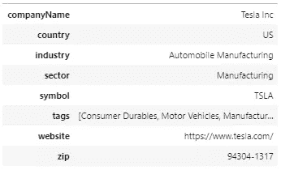
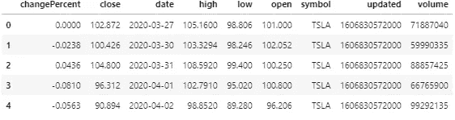
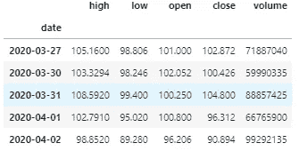
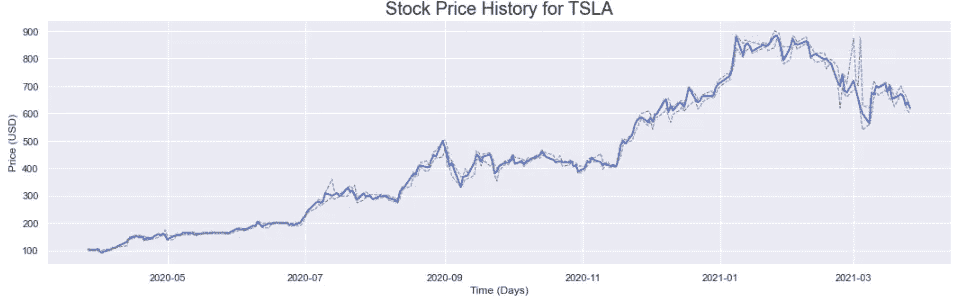
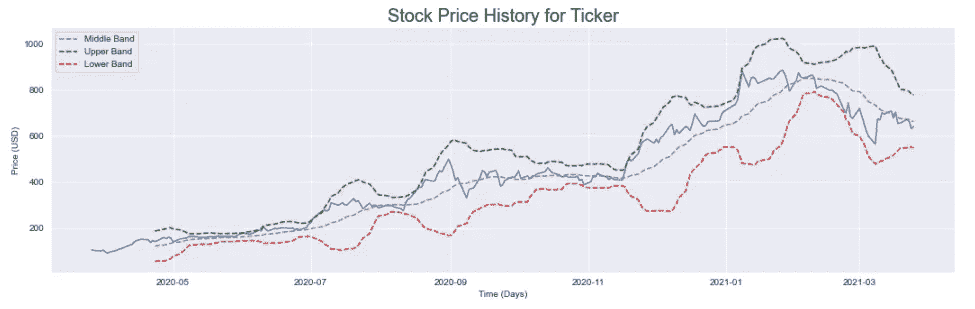
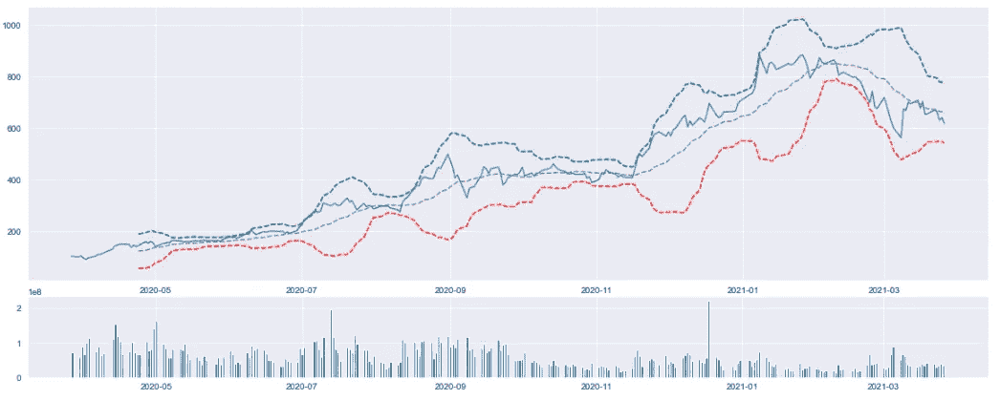
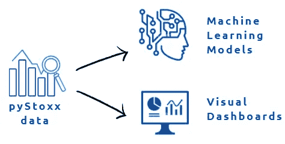

# 使用 PyStoxx 进行股票数据分析和可视化

> 原文：<https://levelup.gitconnected.com/stock-data-analysis-and-visualization-using-pystoxx-ca764d9fe8cc>

使用 PyStoxx 库检索上市公司的当前数据和历史信息。


作者创造的形象。

数据科学领域最常见的应用之一是信息的检索、可视化和分析，尤其是股票市场的信息。鉴于最近发生的一些重大事件，如亚马逊(Amazon)的指数增长、Game Stop (GME)股票的做空，甚至是科技行业的整体趋势，密切关注战略收购随时间的变化从未像现在这样重要。

为了监控这些趋势，我们在 2021 年 3 月开发并发布了一个新的 Python 库，名为 [PyStoxx](https://pypi.org/project/pystoxx/) 。使用 [PyStoxx](https://pypi.org/project/pystoxx/) ，用户能够检索数据，例如:

*   当前和**历史定价**数据(高、低、...)
*   当前和**历史新闻** **情绪**数据(正面、负面、…)
*   一般公司**信息**(名称、地点、网站……)
*   定价**报价**(开盘、收盘……)
*   已知公司**竞争**(阿姆津、MSFT……)

## 快速入门指南:

1.  使用 Pip 安装 PyStoxx 库:

```
pip install pystoxx
```

2.导入 PyStoxx 库:

```
from pystoxx import Stoxx
```

3.创建一个 stoxx 对象，并使用 RapidAPI 扩展添加您的 API 令牌。通过访问 RapidAPI 主办的 Recursiv 的 [Stoxx，注册一个没有信用卡的**免费计划。**](https://rapidapi.com/recursivllc/api/stoxx-by-recursiv)

```
stoxx = Stoxx()
stoxx.RapidAPI("add-your-token-here")
```

4.开始查询历史价格等数据:

```
stoxx.get_historical_prices(ticker="msft", months=2)
```

请参考我们关于 Pip 的[文档，了解您可以查询的所有可用数据的详细信息。](https://pypi.org/project/pystoxx/)

## 检索和可视化股票数据:

使用 PyStoxx 既快速又简单。我们将从导入本教程所需的库开始。

```
from pystoxx import Stoxximport pandas as pd
from datetime import datetime
import matplotlib.pyplot as plt
import seaborn as sns
```

接下来，我们将检索一些关于感兴趣的股票的一般公司数据。我们可以通过从 *stoxx* 对象中调用 *get_company_data()* 函数来实现。

```
stoxx = Stoxx()
stoxx.RapidAPI("add-your-token-here")ticker = "tsla"
company_Data = stoxx.get_company_data(ticker)
pd.DataFrame.from_dict(company_Data, orient='index')
```



作者创造的形象。

我们现在将通过从 stoxx 对象调用*get _ historical _ prices()*函数来检索给定股票的历史价格。让我们看看这些数据是什么样的:

```
msft_prices = stoxx.get_historical_prices(ticker=ticker, months=12)
msft_prices = pd.DataFrame(msft_prices)
msft_prices.head()
```



作者创造的形象。

为了使我们的数据更容易图形化，我们可以隔离我们感兴趣的列，并将日期设置为数据帧的索引。

```
msft_prices["date"] = pd.to_datetime(msft_prices['date'], utc=True).dt.date
msft_prices = msft_prices[["high", "low", "open", "close", "volume", "date"]]
msft_prices = msft_prices.set_index('date')
msft_prices.head()
```



作者创造的形象。

现在让我们继续绘制最高价、最低价和收盘价的图表。我们可以将收盘价作为我们的主要定位点，并通过绘制相对于该点的最高价和最低价来了解变化。

```
plt.figure(figsize=(18,5))
sns.set_style("darkgrid")
# sns.set(rc={'axes.facecolor':'navy', 'figure.facecolor':'white'})plt.xlabel("Time (Days)")
plt.ylabel("Price (USD)")
plt.title(f"Stock Price History for Ticker", fontsize=20)plt.plot(msft_prices["close"], "royalblue", linewidth=2)
plt.plot(msft_prices["high"], linestyle="--", color="grey", linewidth=1)
plt.plot(msft_prices["low"], linestyle="--", color="grey", linewidth=1)
```



作者创造的形象。

我们可以很好地了解过去几个月的价格和公司业绩。然而，高点和低点并不像我们想象的那样有用。也许创建一些布林线可能证明对这个数据集更有用。

```
msft_prices['middle_band'] = msft_prices['close'].rolling(window=20).mean()
msft_prices['upper_band'] = msft_prices['close'].rolling(window=20).mean() + msft_prices['close'].rolling(window=20).std()*3
msft_prices['lower_band'] = msft_prices['close'].rolling(window=20).mean() - msft_prices['close'].rolling(window=20).std()*3plt.figure(figsize=(18,5))
sns.set_style("darkgrid")
plt.xlabel("Time (Days)")
plt.ylabel("Price (USD)")
plt.title(f"Stock Price History for Ticker", fontsize=20)plt.plot(msft_prices["close"], "royalblue")
plt.plot(msft_prices["middle_band"], linestyle="--", color="grey", label="Middle Band")
plt.plot(msft_prices["upper_band"], linestyle="--", color="green", label="Upper Band")
plt.plot(msft_prices["lower_band"], linestyle="--", color="red", label="Lower Band")
plt.legend()
```



作者创造的形象。

我们的图表看起来更好更有用了。波段使用两个参数:窗口和标准差，让我们更好地了解价格范围水平。监控价格时，将交易量作为分析的一部分也很重要。让我们继续绘制图表。

```
plt.figure(figsize=(20,10))
top_plt = plt.subplot2grid((5,4), (0, 0), rowspan=3, colspan=4)
top_plt.plot(msft_prices["close"], "royalblue")
top_plt.plot(msft_prices["middle_band"], linestyle="--", color="grey", label="Middle Band")
top_plt.plot(msft_prices["upper_band"], linestyle="--", color="green", label="Upper Band")
top_plt.plot(msft_prices["lower_band"], linestyle="--", color="red", label="Lower Band")bottom_plt = plt.subplot2grid((5,4), (3,0), rowspan=1, colspan=4)
bottom_plt.bar(msft_prices.index, msft_prices['volume'])
```



作者创造的形象。

## 后续步骤:

系统化和程序化地监控感兴趣的股票数据的能力从未像现在这样迫切。然而，知道别人对某个股票行情的想法的能力同样重要，甚至更重要。为此，我们开发了一种叫做 *get_historical_news()* 的方法，允许用户**检索当前和历史新闻文章的情感数据**。



作者创造的形象。

使用这些数据，用户能够开发仪表板来监控当前价格和他们各自的情绪，或者使用历史数据开发预测模型。我们希望在未来的文章中涵盖这些功能以及更多内容！

**披露方&免责声明:**

投资包含很大的风险。Recursiv LLC、作者或其各自的任何关联公司对使用 Stoxx 服务或 pyStoxx 图书馆提供的信息可能获得的任何结果不作任何保证或其他承诺。虽然可以使用 Stoxx 服务分析过去的性能，但过去的性能不应被视为未来性能的指示。在没有咨询个人财务顾问和仔细研究发行人的招股说明书和其他公开文件的情况下，不应做出投资决定。在法律允许的最大范围内，如果本服务提供的任何信息、评论、分析、意见、建议和/或推荐被证明是不准确、不完整或不可靠的，或导致任何投资或其他损失，作者及其各自的关联公司概不负责。本服务提供的任何和所有数据应被视为评论和意见，并可能随时更改。服务中提供的信息来自 Recursiv LLC 认为可靠的来源。然而，Recursiv LLC 和提交人都没有独立核实或调查所有这些信息。Recursiv LLC、作者或其各自的附属公司均不保证任何此类信息的准确性或完整性。Recursiv LLC、作者或其各自的任何关联公司对所提供的任何信息中的任何错误或遗漏负责。