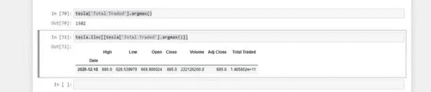
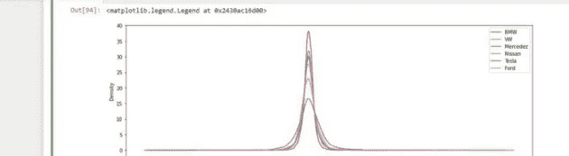

# 使用 Python 熊猫进行股票市场分析

> 原文：<https://levelup.gitconnected.com/stock-market-analysis-using-python-pandas-ec278f76e217>

Python pandas 是数据科学家工具箱中最重要的工具之一。

来源:尼古拉斯·卡佩罗，Unsplash.com

我们指的是用于表格分析的框架。该名称源自“面板数据”，这是一个与多维结构化数据集密切相关的术语。

我为熊猫想到了一个有趣的用例，那就是股票市场分析。

我们想分析我最喜欢的 5 家汽车制造商的股票价格，看看我们能用熊猫做些什么有趣又酷的事情。

# 设置我们的环境

在开始任何项目之前，准备好我们的工具箱是很重要的，这主要是设置环境。

我们将创建一个文件夹，命名为“analyzing _ Stock _ Prices ”,作为管理员打开 Anaconda 提示符，将 cd 放入文件夹“analyzing _ Stock _ Prices ”,然后打开 Jupyter 笔记本。

选择 New 和 Python 3 (Ipykernel)并准备好你的 Jupyter 笔记本。

# 从雅虎财经获取实时数据

我们将使用[熊猫数据阅读器](https://pandas-datareader.readthedocs.io/en/latest/remote_data.html)，获取实时数据供我们使用和分析。

我们将从导入 pandas 数据读取器和日期时间模块开始，我们将使用数据读取器进行远程数据访问，使用日期时间模块指定开始和结束日期时间。

然后，我们需要向 DataReader 指定我们想要的数据，即开始和结束日期。

我们将使用宝马作为试金石，来测试熊猫阅读器和日期时间模块。

上面我们有我们的变量宝马，我们通过调用 web 将它设置为熊猫数据阅读器。DataReader 并传入“宝马。DE“作为宝马的股票名称，我们的来源是雅虎，我们输入我们的开始和结束日期。然后我们打电话给宝马，检查我们的数据。

上面我们有 2015 年到 2021 年的重要数据汇总。我们需要第一组结果，我们将使用。head()方法，对于最后一点结果，我们可以使用。tail()方法。

现在我们想要宝马股票收盘时的数据，也就是 2015 年到 2021 年的数据，我们也想把这个数据标绘出来。我们将首先导入 matplotlib 作为别名 plt。

然后我们需要读取收盘股票并使用 matplotlib 绘制它们。

让我们的数据看起来更有趣，我们知道财务人员希望看到颜色、标签、更大的形状和交互式数据。

我们确信我们的环境已经完全设置好了，让我们开始吧。

# 特斯拉 Vs 大众 Vs 宝马 Vs 戴姆勒 Vs 福特 Vs 丰田 Vs 日产

德国汽车制造商对美国同行对日本汽车制造商。

在开始之前，我们还需要一个名为 NumPy 的 Python 库，我们在处理数组和矩阵时会用到它。

然后我们需要告诉数据阅读器获取我们不同的库存

我们还可以将股票保存在 CSV 文件中，以补充我们的 Jupyter 笔记本。

我们为不同的汽车制造商命名变量，然后使用。to_csv()方法，并在括号中传递 csv 文件的标题。然后，我们可以查看名为 Analysing _ Stock _ Prices 的文件夹。

# 分析开始数据

为了检查起始数据，我们使用。头法，现在给所有我们拉进来的车厂做。

还有。tail()方法，用于查看底部分段数据，这是最新的数据。

我们希望绘制出汽车制造商在开盘和收盘时的所有数据。

我们将从“关闭”开始。

然后继续“打开”并画出结果。

正如我们从 2020 年中期的“开放”和“关闭”中看到的那样，特斯拉一直在主导其他汽车制造商，我们可以从蓝色浪潮中看到这一点。让我们继续玩我们的数据，看看特斯拉是否真的占优。

我想看看所有这些股票的交易量。

我们来分析一下上面的情节，我们看到特斯拉在 2020 年中期开始见顶，是什么原因导致了特斯拉股票的暴涨？为此，我们将使用 iloc 方法。当我们想要使用 Pandas 在某一点进行索引时，使用 iloc 方法。

因此，我们希望从 2020 年年中开始看到特斯拉的“开放”库存，我们只是通过指定图片大小来放大我们的图表。

但是我们只想要 2020 年的更清晰的图像。

成交量增加，股价下跌。公司股票下跌，交易量增加。

# 分析市值

我们想看看哪家汽车制造商比另一家更有价值。我们不想简单地依赖时间序列数据。

我们目前的数据不能帮助我们分析这一点，但这不会阻止我们使用数学中的技巧来获得这些数据。我们将使用一些基本的数学来得到股票的总单位。

我们将使用开盘价和交易量，我们的最终目标是得到交易的总金额。

因此，我们想为每个汽车制造商的总交易量添加一列。

让我们检查一下日产，特斯拉和大众，如果我们有列增加。

现在让我们画出所有汽车制造商的“总交易量”。

时间序列图向我们展示了 2021 年特斯拉的交易总量。所以我们需要那个尖峰的位置。

我们得到位置 1502，并希望 iloc 位于 1502 上。

正如我之前说过的，我们不能依赖时间序列表示法，因为它有时会误导人。高峰发生在 2020 年 12 月 18 日，非常有趣。

# 移动平均数

我们想单独阅读每个制造商，因为此时此刻特斯拉似乎正在获胜，但我们需要分析一切，以便做出明智的决定。我们现在只做收尾工作。

既然我们已经分别画出了每一个，我们想要去掉噪声，使我们的图平滑一点。

我们将开始创建另一个新的柱，我们将它称为移动平均线 60。60 代表我们将要分析的样本，60 个日期，两个月的分析是相当公平的。我们可以使用大众作为我们的样本，但在笔记本上，我已经为你们做了所有的汽车制造商。

噪声已经变得平滑了一些，我们可以将移动平均值提高到大约 300。

当窗口太大时，我们会错过趋势，最好是将大数据分成小块使用。

# 相关和散布矩阵

pandas 中有一个框架，允许我们轻松地处理散布矩阵。所以我们会导入它，导入熊猫作为我们的别名 pd。

我们想综合所有汽车制造商的收盘价。

现在我们要命名我们的列。

我们需要绘制散布矩阵。

股票价格可以被视为随机变量，现在分散矩阵可以确定是否有一个或多个变量的线性相关性。因此，它只是向我们展示了不同类型的数据之间的相关性和关系。

在某种程度上，宝马和日产是相关的，福特和日产也是。线性，直方图，曲线等，我们在某一点寻找类似的图表。

当一个图看起来像一条线时，我们说可能有一些相关性，在一条直线上聚集的点越多，我们说有完美的相关性。

当我们有奇怪的曲线和较少的直线时，我们说变量之间的相关性较小(在我们的例子中是汽车制造商)。

# 蜡烛棒图

我们现在想变得有点花哨，并绘制蜡烛图，有了这些迷人的图表，我们可以在一个图表中看到开盘价、收盘价、最高价和最低价。

我们将从引入 mpl_finance 库和引入烛台库开始。

会有一个警告，只要忽略它并再次运行导入，然后一切都会正常。

从 matplotlib 我们将需要以下模块；

DateFormatter、date2num、WeekdayLocator、dayLocator 和 lastly Monday。

我们现在将使用丰田作为我们的样本，您可以在我提供的笔记本上完成其余的工作。

我们只对 12 月的信息感兴趣，从 2021 年 12 月 1 日到现在。

然后，我们将创建一个新列，并将其命名为 date access(date _ ACC ),我们将应用一个 lambda 函数将日期转换为数字。我们也会取开盘价的值；

“访问日期”、“开盘价”、“最高价”、“最低价”、“收盘价”。

绿色表示获得，红色表示损失。

# 每日百分比变化

每日百分比变化可由以下公式表示:

rt =Pt/Pt-1 -1

rt 是 t 时刻的收益

Pt 是 T 时刻的价格

Pt-1 是 t-1 时刻的价格

rt 值报告的是百分比增益或损失。假设你在 t-1 日买入股票，在 t 日卖出，如果你获利了，那么 Pt 应该比 Pt-1 大。所以比值应该大于 1，所以 rt 应该是正的。

rt 的值越大，t 的价格越好，但如果你在 t-1 日买入一只股票，然后以更低的价格卖出，那么我们的比率将小于 1，rt 将为负。rt 值越小，我们经历的损失越多。

这主要用于分析股票的波动性，如果日收益率分布较宽，则股票波动性较大。我们将计算百分比回报，并将它们绘制在柱状图上。

这些直方图将帮助我们了解哪个更稳定，哪个更不稳定。大多数投资者害怕波动，他们想要稳定。

我们将公式表示为代码，使用；

第一项有 NAN，因为它前面没有任何东西，因此它不能被任何东西整除。让我们为其他人做同样的事情，并在直方图上绘制一切。

所以我们用。hist 方法，我们指定想要的箱数。我们的柱状图越厚，股票波动越大。

直方图形状的宽度与分布的标准偏差有关。它越高，我们的变量就越多，某个分布的变量与标准差直接相关。它实际上是标准差的平方值，标准差越高，方差越高。股票分析的波动性越大。

让我们对其他汽车制造商做同样的事情，甚至更好的是，在同一张图上分析他们。

一个直方图覆盖了另一个直方图，所以我们可以设置称为 alpha 的透明度并放大该图。

放大的图表显示特斯拉、福特和大众的曲线更宽，因此我们可以看到这些股票比其他股票波动更大。为了平滑这一点，我们将使用 KDE(核密度估计)。

KDE 接受一个直方图，并试图拟合某个内核。

在图中，有些公司比较矮，比如特斯拉，它在柱状图上比较高，但是在 KDE 上比较矮。我们用的是一个核，它告诉我们一个概率函数。

直方图没有归一化，而 KDE 是归一化的，每个密度的面积是恒定的，因此这两种方法可以用于比较。我们仍然看到特斯拉，福特和大众仍然更胖，这肯定证实了股票是不稳定的。

# 箱线图

也是另一个有用的工具，你可以用它来表达信息。我们称之为熊猫盒子法。

特斯拉、丰田和梅赛德斯的每日百分比变化高于其他公司，这意味着这些股票更不稳定。

# 累积回报

其公式如下:it = (1 + rt)it-1，这是一个递归公式，因此我们称之为累积回报。

我们将“it-1”乘以因子“1+rt”，rt 是之前使用的，它被称为每日百分比变化。累积回报是所有投资者都会问的问题的答案。

在你的时间序列开始时，你向一家汽车制造商投资 100 美元。这里最重要的问题是它今天值多少钱。所以在 2015 年，我向宝马投资了 100 美元，从那时到现在，这一美元让我赚了多少钱？

我们的公式只计算每日回报，不考虑有股息的股票。累计回报是在投资当天计算的，如果累计回报高于 1，那么你就在盈利。我们可以使用以下公式来计算:

第一个条目始终是 1 美元，正如您在表格中看到的，这些值接近 1，因此累积回报始终与 1 美元进行比较。那么，哪只股票的 1 美元投资回报最高呢？显然，图表显示，对于一些公司来说，2015 年的 1 美元在 2021 年价值 25 美元。

# 附加阅读

 [## 谷歌联合实验室

### 编辑描述

colab.research.google.com](https://colab.research.google.com/drive/1gSih6aUzJLG39tHh6EZRvDg7FqfJnUc5?usp=sharing)