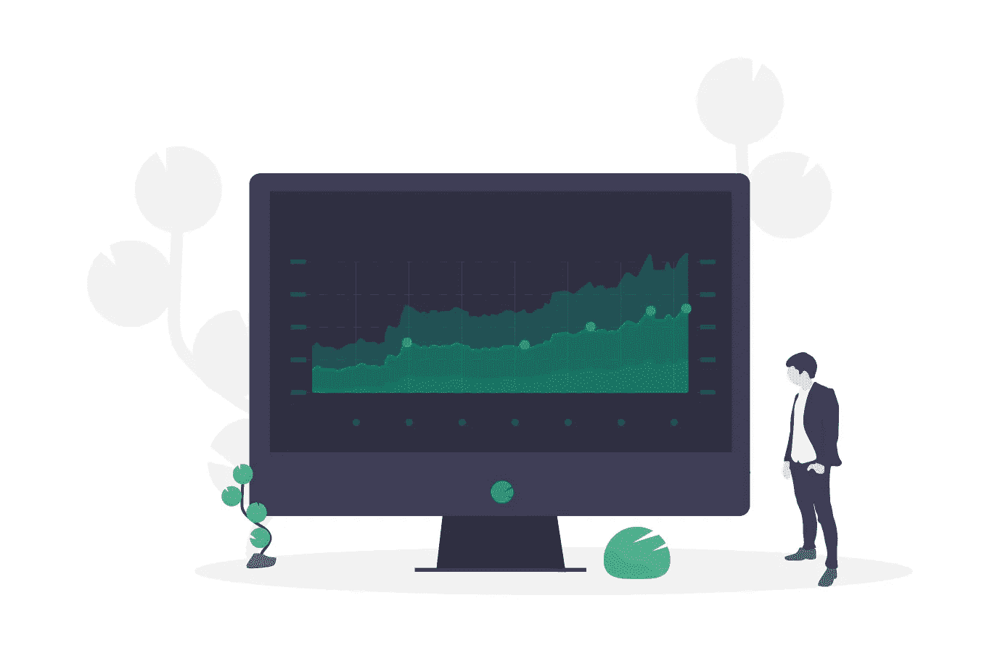
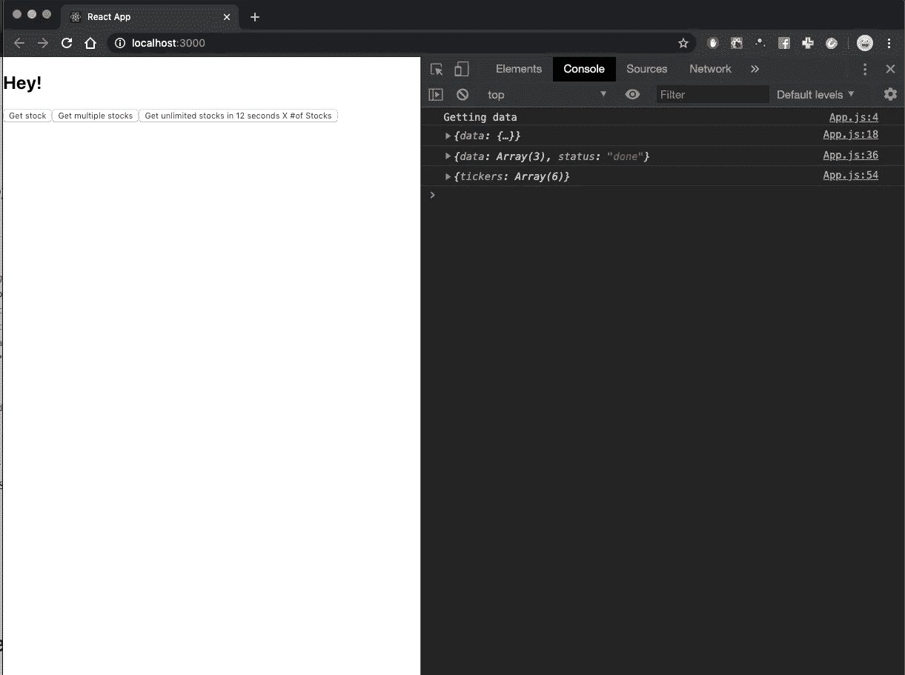

# 带 Javascript 的股票 API 教程

> 原文：<https://levelup.gitconnected.com/stocks-api-tutorial-with-javascript-40f24320128c>



带有 Node.js 和客户端调用示例的简单股票获取后端。

我从很小的时候就对股票市场着迷。一旦我学会了如何编码，我对金融的共同兴趣促使我创建了一家名为雪球金融教育的在线金融教育公司。我使用了许多工具来教授金融，我想分享一下我是如何创建一个股票抓取工具来在我的游戏中使用真实的金融数据的。

你可以在 www.snowballfinances.com 找到我的游戏

我将使用 AlphaVantage API，它提供准确的股票数据。

请**在这里获得你的免费 API 密匙**:[https://www.alphavantage.co/support/#api-key](https://www.alphavantage.co/support/#api-key)

为什么要从一个 API 中创建一个 API？就个人而言，要处理多个报价器的呼叫，并绕过 Alpha Vantage 免费版的限制。

# 第一部分:想法

我想创建一个 Node.js 后端来完成以下任务:

*   接收一个或多个股票代码(即 AAPL，或['AAPL '，' MSFT '，'谷歌'])。
*   接收时间间隔(每天、每月、每年)。
*   根据您的需要，返回任意多个报价机的数据

# 第 2 部分:节点服务器设置

通过键入以下命令在终端中设置您的项目:

`mkdir your-stocks-api`

`cd your-stocks-api`

`npm init -y`

`touch index.js`

`touch constants.js`

`touch .env`

您已经创建了 Node.js 项目，现在让我们安装所有的依赖项:

`npm i express body-parser node-fetch dotenv cors`

干得好！

# 第 3 部分:服务器代码

在编码获取请求之前，Alpha Vantage 有一些参数需要填充。这就是为什么我创建了一个常量文件来存储时间段参数:

现在配置您的**。包含以下代码的 env** 文件:

```
ALPHA_VANTAGE_API_KEY=YOUR_API_KEY_HERE
```

太好了！

现在将下面的代码复制到 **index.js**

我将在代码之后解释每一步。有些人(包括我自己)喜欢先看到解决方案，再看到解释。

你可以在这里找到回购协议:

[https://github.com/Ignacio1996/stocks-simple-api](https://github.com/Ignacio1996/stocks-simple-api)

## 服务器代码解释

首先我设置 express 服务器，然后配置 bodyParser 从客户机接收信息，最后配置 cors()以避免跨源资源共享问题(它们总是存在)。现在让我们来看看实际的 API 路由和调用。

## 邮政/股票

在这里，我设置了一个路由来获取关于 ticker 的信息。然后，我用常量中的 timePeriod 函数向 Alpha Vantage API 发出一个异步获取请求，指定 ticker，并在末尾添加 API 键。非常简单。

最后，我用我得到的股票数据发送一个响应。

## 邮政/股票

获得多个报价机有点棘手。我映射了一个 ticker 数组，并为每个 ticker 返回了多个承诺。

我使用 Promise.all 来解决所有的承诺，并最终返回该承诺数组中所有股票的数据。

## 邮政/股票-无限制

这是迄今为止最棘手的。同样，我映射了从前端接收的每个 ticker(接下来是客户端调用示例)，但是我在每个 API 调用之间设置了一个持续 12 秒的超时。我将返回的数据存储在 stocksArray 属性中，只有当它充满了长度等于来自客户端的 tickers 数量的数据时，我才返回数据。一定有更好的方法，但它确实有效！

# 从客户端示例调用 API

你可以随意设置。我制作了一个简单的 React 应用程序来处理调用(如果您想显示股票数据)。您还可以使用函数(getStock、getMultipleStocks、getUnlimitedStocks)从普通的 HTML/CSS/Javascript 应用程序中运行代码。

`npm i -g create-react-app`

`create-react-app stocks-client`

`cd stocks-client`

`npm start`

然后在 App.js 中，只需替换这段代码就可以快速设置和运行。

如果你点击按钮，你会看到 API 在控制台上返回每个按钮的数据，除了第三个按钮，它将花费 **12 秒每次 API 调用。**



App.js 在按下所有 3 个按钮后获取数据。

之所以需要 12s x 数量的报价器，是因为我设法克服了 Alpha Vantage 的免费限制。他们每分钟有 5 个请求的限制。这意味着你永远有 12 秒的时间间隔来提出请求。如果你等待足够长的时间，你可以免费获得尽可能多的 tickers，这也是我决定做这个简单 API 的原因之一。

## 我希望你喜欢这个教程，并发现它很有用。如果你对代码有任何问题或有任何建议，一定要让我知道！

如果你想了解更多关于 Javascript Async/Await 函数的知识，看看我的另一个教程:

**将 API 调用与 Javascript Async/Await 结合:**
[https://medium . com/@ inaguirre/Combining-API-Calls-with-Javascript-try-catch-ba 1b 7 b 9303 a 5](https://medium.com/@inaguirre/combining-api-calls-with-javascript-try-catch-ba1b7b9303a5)

# 编码快乐！