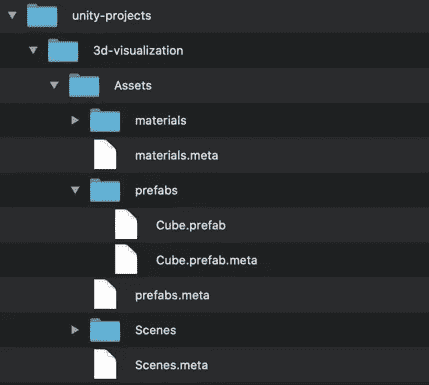
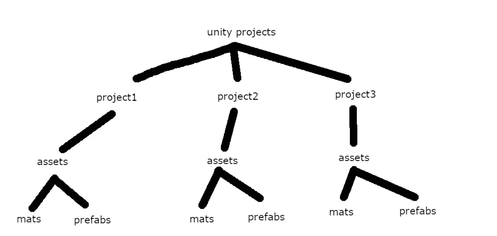
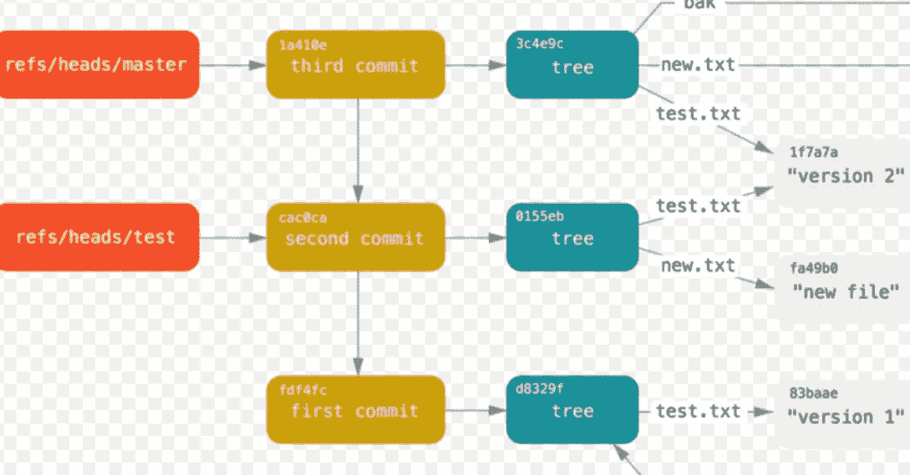
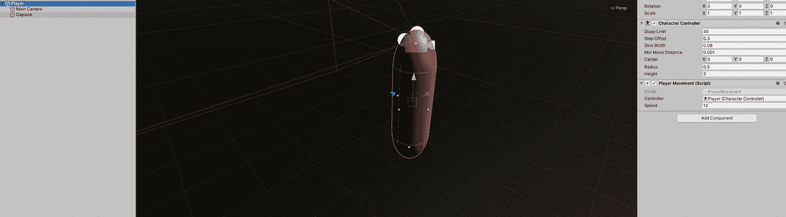

# 停止抱怨低级的面试问题

> 原文：<https://levelup.gitconnected.com/stop-complaining-about-low-level-interview-questions-2fdd39c09332>

## 以及为什么基本面应该被重视

这是怎么回事

如果你是一名软件工程师，或者即使你有任何一种温和的技术职业，毫无疑问你听说过臭名昭著的编码面试问题。

全国各地的技术团队(尤其是大公司)会问各种古怪的面试问题，其中一些问题非常难。你可能被要求在 30 分钟内用伪代码写出一个规则立方体，或者被交给一个有一串数字的大矩阵，并被要求分别标出所有的山(用数字 3 表示)和湖、山和海洋。

常见的引语和谚语是这样展开的:

> 那些算法与我交付优秀作品的能力无关
> 
> —匿名
> 
> 这不是对我能力的良好评估
> 
> —匿名
> 
> 我永远不会每天和这些东西打交道
> 
> —匿名

# 如果你在这里，我会尽我所能解除这些眼罩

这些算法直接关系到你交付优秀作品的能力。

*他们存在的目的就是评估你的工程能力，他们做得很好。*

*如果你认识它们，你会在日常生活中用到它们中的大部分。事实上，绝大多数工程师每天都在使用它们，而他们中的许多人甚至不知道。*

*大公司对仅仅“交付工作”的员工不感兴趣*

# 绝大多数基本面也是如此。

## —视角

我从事改变思想的工作，这个过程的第一步是改变我们的视角。

你能为你的观点做的最好的事情是信任、相信、倾听、学习和欣赏。

你对这个世界、一个行业或其中的人的默认假设应该是，人们大多说真话，他们的建议几乎总是正确的，他们大多数时候出于一个好的理由致力于他们的行动。

此外，这个星球上的大多数人都有很多好的建议，他们随意地四处散布，希望每个人都能认真对待。我真诚地相信，一个人的倾听能力是他们全面成功的黄金标准。

如果你学会真正倾听，你会从每天见到的每个人和事物中发现智慧的金块。

如果你和某个在他们的领域很有成就的人交谈，并且他们正在谈论他们的领域，这是三分之一正确的。

但即便如此，这也几乎是必然的，因为那些在各自领域取得成就的人已经让自己完全饱和了，以至于他们最终会花大部分时间谈论自己的领域。

## 导师制度

如果我们以我上面提到的观点前进，道路是清晰的。倾听他人，寻找良师益友，尤其是倾听你的良师益友。处于游戏顶端的人并不保守秘密，事实上，他们通常像其他人一样(如果不是更多的话)彻底地喷涌他们的知识，他们渴望那些认真对待他们的福音的人。

我个人认识几家顶级公司(微软、谷歌、脸书、亚马逊)的几位高级工程师，他们在多个不同领域工作，但他们都是拥有非凡知识的非凡软件工程师。

在听了他们所有人一年多的演讲，并不断地甚至粗鲁地鞭策他们之后，我对软件工程这个领域有了一些认识。

1.  顶级工程师和新工程师之间的差别是巨大的
2.  大多数在顶级公司呆了几个月以上的工程师都应该呆在那里
3.  一个更有经验的工程师可以轻松快速地识别一个经验不足的人。
4.  顶级公司是他们行业中的佼佼者，他们解决的问题需要对计算机科学有充分的理解，因此如果你在那里工作，你将会用到你的计算机科学知识。

我在谷歌的导师是我在这里提出的所有哲学的最好例子。他会在不经意的交谈中提到为什么大多数工程师面试失败，以及如果这些工程师想得到他们梦想中的工作，他们应该做些什么。他用来描述这一点的术语是完全确定的，然而仍然很容易忽略它。

此外，他还致力于计算机科学概念的研究，这是世界上 99%的人从未听说过的，但却是当今硅谷发展最快的创业公司之一的核心产品。

我的其他导师或多或少属于相同的类别。

虽然保持相对匿名，但我的导师都是密码学、数学证明、类型理论、机器学习等领域的领导者。

可以肯定地说，他们的工作远不止像许多工程师认为的那样改变一些 html 文件的背景颜色，这一事实在与他们的 5 分钟对话中得到了揭示。

对于那些好奇的人，我的一位导师能够用一句简短的话来总结。

> 如果你从头到尾读完了唐纳德·克努特的一本书，并实现了其中的所有内容，谷歌会很乐意给你买一个 200 美元的包。

对于那些不知道的人，谷歌给他们所有的员工一个漂亮的背包，所以他说他们会雇用你。

# 是的，但是，具体来说，数据结构和算法在哪里发挥作用呢？

如果我列出每一种数据结构和算法以及所有的用例，我会在这里呆上一千年，但是在这篇简短的博客中，我可以很容易地展示几种数据结构是多么普遍，以及它们如何跨越许多不同的工具和行业。

# **一棵等级树**

如果我告诉你，一个层次树是现存所有编码的 90%的组成部分，并且可能在未来 30 年保持不变，会怎么样？你会相信我吗？这是真的。

层次树是 NOSQL、SQL、操作系统、存储库、git、OOP、操作系统、三元语句、任何有组件的东西的基础，还有很多！

任何可以通过一系列父系统和后继系统访问或导航的系统实际上都是一个层次树。我列出的大多数系统都是从树开始的，通过添加一些额外的属性和特性，系统就诞生了，但是树结构仍然是构建的核心结构。

请允许我展示几个例子。

# 操作系统

这是我的 mac OS 操作系统中的一个文件结构。看到树形结构了吗？现在怎么样:

简化视图

# 结构

来点更专业的怎么样？ **React.js** 也许？

任何有组件的东西都有树。

# 开源代码库

版本控制

我认为我们可以明显地看到 **git** 中的树，许多分支要么从主分支继承，要么从开发分支继承。那些遥控器通常具有特征分支。主分支或开发分支有时会推进部署。

# **3D 建模虽然？**

让我们看看 unity，世界上使用最广泛的 3D 渲染引擎。

这很难看到，但在我的 unity 项目中，不仅我的胶囊有几个子游戏对象，而且游戏对象本身在屏幕右侧都有子组件。我的整个球员预制厂只是一个小树与儿童重视在一个层次的时尚。

# 我想我们已经看够了

因此，这里的结论是，如果你称自己为软件工程师，了解低级数据结构和算法以及如何操作它们不仅是一个好建议，而且这些知识与你做一切涉及代码的事情的能力直接相关。

如果您已经对树结构了如指掌，那么您可以比以前更容易地移植到任何新的框架或技术中，或者您可以自己继续开发新的技术。创建 react.js 的 facebook 工程师正是这么做的。

下次你进行编码面试时，高级工程师让你在二叉查找树中插入或丢弃物品，你能为自己做的最好的事情就是准备好回答这类问题。

如果面试失败，你很可能需要继续学习。抱怨对你没有任何帮助，也不会获得多少同情。

我甚至会说，作为软件工程师，我们有责任尽可能彻底地寻找和理解这些东西，以便我们能够用我们的创造积极地为这个世界做出贡献。

如果你现在确信，但不确定如何进行或从哪里开始。我为你准备了一份特别的礼物。

# 普林斯顿大学免费提供在线书籍

 [## 算法，第四版

### 每个严肃的程序员都需要知道的关于算法和数据结构的基本信息

algs4.cs.princeton.edu](https://algs4.cs.princeton.edu/home/) 

该链接将带您进入当今市场上评价最高的数据结构和算法书籍之一。它在网上是完全免费的，有一个令人愉快的 GUI。

如果你从头到尾读完这本书，并实现了其中的所有内容，谷歌会很乐意给你买一个 200 美元的包包

 [## 编写面试问题

### 一个完整的平台，在这里我会教你找到下一份工作所需的一切，以及…

技术开发](https://skilled.dev)