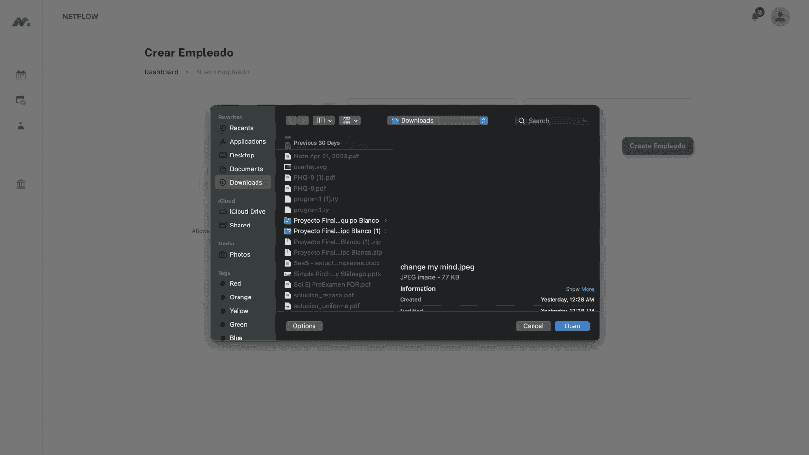
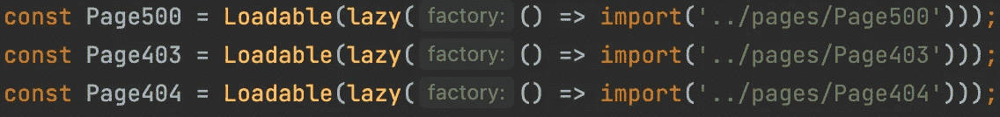
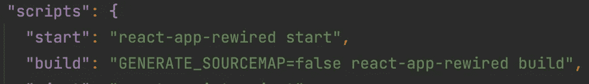
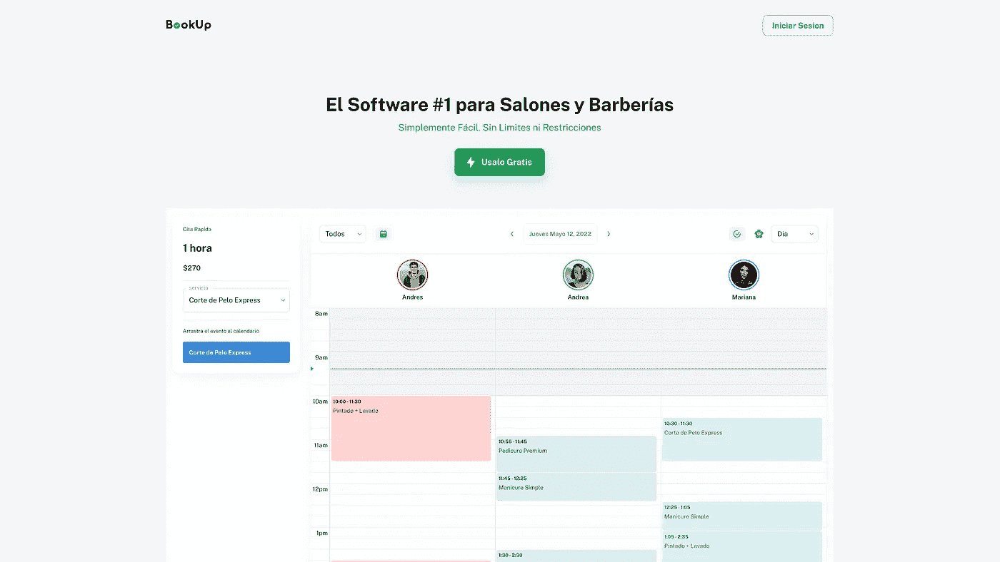

# 停止从头开始创建 UI 组件

> 原文：<https://levelup.gitconnected.com/stop-creating-ui-components-from-scratch-927764ff6e03>

## 我们在前人知识的基础上建立了我们的世界。

兰迪·法特在 [Unsplash](https://unsplash.com?utm_source=medium&utm_medium=referral) 上的照片

# 学习在他人工作的基础上进行构建

在整个大学期间，我脑子里一直有这样一个想法，那就是我必须是实施所有事情的人。

从后端到 UI 设计，我想重新发明世界上所有该死的轮子。

你不会相信我花了多少时间来设计、编辑和更改我的 react UI。

**剧透预警:可能超过 500(多年)**

似乎无论我做什么；我的设计看起来总是不怎么样。幸运的是，我的课程包括了一门由我国一位著名界面设计师教授的课程。这门课程很有挑战性，但不是以传统的方式。

我可以很快感觉到设计是否好，但我不能清楚地说明问题或如何修复它。

一个界面应该在不牺牲整体可用性的情况下美观。

然而，知道什么看起来好和如何从零开始构建是完全不同的。

虽然我很高兴，但我花了这么多时间来提高我的设计和 UX 技能；如果我不得不回到过去，如果我只是建立在现有的解决方案上，而不是重新发明轮子，我的项目会更有成效。

我们可以忘记那些小细节，专注于大局。

**它以一种美观、用户友好和直观的方式将所有这些组件集合在一起。**

照片由 [Quino Al](https://unsplash.com/@quinoal?utm_source=medium&utm_medium=referral) 在 [Unsplash](https://unsplash.com?utm_source=medium&utm_medium=referral) 上拍摄

# 动手体验呢？

虽然比较慢，但我不否认，如果你不知道自己在做什么，动手经验会提高你的技能。

我是一个实践经验学习者，但我意识到我花了数百个小时尝试新事物，没有任何方向或理解来帮助我改进我的设计，直到我参加了那个课程。

如果你想学习，我建议你在设计和编码的时候参加一个课程或者读一本书，否则你可能会浪费宝贵的时间去追赶你的尾巴而不是前进。

照片由[你好我是 Nik](https://unsplash.com/es/@helloimnik?utm_source=medium&utm_medium=referral) 在 [Unsplash](https://unsplash.com?utm_source=medium&utm_medium=referral)

# 何时从零开始

当然，软件开发没有灵丹妙药；总有例外。

在你去评论区叫嚣异端邪说之前，这里有一些场景，你可以推出自己的场景。

*   你是一名用户界面/UX 设计师。
*   **建造设计师发给你的东西是你的工作**
*   **你需要完全控制**。 ***即微小的束尺寸等。***
*   **你是学生，你有时间学习**
*   **项目没有时间限制**
*   **您尝试构建的组件不存在，或者您无法从现有组件中构建它。**

除此之外，我强烈建议不要从头开始推出你的 UI。

克里斯·利维拉尼在 [Unsplash](https://unsplash.com?utm_source=medium&utm_medium=referral) 上拍摄的照片

# 我从哪里来

我目前正在构建一个初创 Saas 项目，尽管我知道如何从头开始构建 UI，但我意识到这样做会耗费大量时间。

以下是一些不推出自己产品的理由:

*   你可能不是专业设计师
*   你的项目可能有时间限制。在我的例子中，它正在尽可能快地部署一个最小可行产品(MVP)。
*   **你正在创建一家初创公司，或者只是一个有期限的副业项目**
*   你只有很少的时间或有限的资源。(在你的团队中你必须身兼数职)

我希望每个人都能分享他们在这一点上的经验。

尽管如此，根据以前的项目，我计算出从头构建一个项目，设计 UI，编码，让它看起来可以接受，修复 CSS 的小毛病，增加响应能力，实际上花费了项目时间的 50%以上。

我可以在一两个星期内完成整个后端，剩下的时间用来创建和调整 UI。

我用定制的 CSS MUI 在三周内创建了一个初始 MPV

# 选择正确的库

照片由[凯勒·琼斯](https://unsplash.com/@gcalebjones?utm_source=medium&utm_medium=referral)在 [Unsplash](https://unsplash.com?utm_source=medium&utm_medium=referral) 上拍摄

为您的需求选择正确的库对于确保您的项目蓬勃发展并达到成功所需的目标至关重要。

## 图书馆的目标和质量

正如伊曼纽尔·阿桑指出的，确保这个库制作精良，适合你的用例。

实现不佳或优化不佳的库会导致 javascript 包变得很大。此外，一个糟糕的库会严重影响页面的初始加载时间。

React 的建议包大小约为 200KB。

导入太多的库或导入未使用的组件会导致包变得很大。

## 图书馆的未来与代码频率

如果你计划在一个或多个项目中无限期地使用一个库，那么检查它未来的特性和可维护性是非常必要的。

正如[指出的，选择错误的库会带来一系列新的问题，包括许可证问题、无人维护的库、安全问题等。](https://medium.com/u/79d24c3d4ea?source=post_page-----927764ff6e03--------------------------------)

# 减小束尺寸

照片由[乔安娜·科辛斯卡](https://unsplash.com/@joannakosinska?utm_source=medium&utm_medium=referral)在 [Unsplas](https://unsplash.com?utm_source=medium&utm_medium=referral) h 上拍摄

在线部署您的网站时，捆绑包的大小可能会成为一个问题。

如果你正在使用 react，我将在这里提供一些提示。

## 延迟加载组件

使用 react 的新版本，可以延迟加载组件。

惰性加载的工作原理是将组件分成更小的包，只有在需要的时候浏览器才能加载这些包。

这种策略可以极大地减少初始包的大小，因为您的登录页面(或初始主页)将只需要一些组件和图像。

## 从生产版本中移除源地图

部署前端(react)时要考虑的另一件事是移除源地图。

源代码映射有助于将运行的小型 javascript 包与您编写的代码联系起来。

源代码地图对开发非常有用，因为当出现问题时，您可以在代码编辑器中准确地看到发生了什么以及在哪里。

然而，在部署应用程序时，您可能已经有了一个正在工作并经过测试的包，所以包含源地图(默认情况下完成)会增加您的包的很大一部分。一如既往，多少取决于项目规模。

**例如，我的项目中的源映射产生了一个 15 MB 的包。虽然我的项目是中等规模的，并且包括许多库，但是它太多了。与建议的 200kb 大小相差甚远。**

## 将项目分成子域

我的项目由登录、仪表板和登录页面组成。

我的登录页面被称为“单页”登录，因此不能利用延迟加载。

然而，通过将我的登录页面从我的仪表板分离到不同的项目中，我将最初的包大小减少到大约 570kb。

增加 react-router，把登陆页拆分成多个页面，是我以后考虑的事情。当构建一个登陆页面时，它**可以大大减少初始包的大小，所以要记住这一点。**

# 我现在在做什么

[戴恩·托普金](https://unsplash.com/@dtopkin1?utm_source=medium&utm_medium=referral)在 [Unsplash](https://unsplash.com?utm_source=medium&utm_medium=referral) 上的照片

最后，我决定用 [MUI](https://mui.com/) (React)来创业。这个组件库包含了如此多的现成的东西，以至于我不需要强调如何使某些东西工作或代码的可重用性。

需要一个日期选择器吗？内置自动完成功能的搜索栏？使用 react 组件中的钩子和条件来快速响应的网格系统？

这些都是我问过自己的问题。此外，您仍然可以修改基本 CSS 来构建您独特的外观和感觉，但是我现在认为这是快速迭代或创建 MVP 的最佳方式。

当然，我可以自己从头开始实现其中的大部分。然而，这将花费的时间和精力会延迟我的 MVP 的开发，并且不会为未来的客户提供任何有价值的东西。

照片由 [Kahl Orr](https://unsplash.com/@kahlorr?utm_source=medium&utm_medium=referral) 在 [Unsplash](https://unsplash.com?utm_source=medium&utm_medium=referral) 上拍摄

# 为什么它是我的最佳选择

如果你还在犹豫该不该这么做，那就看情况了。

对于我的项目，我是目前唯一从事这项工作的开发人员。虽然我知道并从零开始开发了许多组件，但我需要一些产品，以便在需要时使用，并关注大局。

我现在什么都在做。

从设计到后端开发和基础设施，我需要优化我的时间，以尽可能少的时间和精力创造尽可能多的价值。

毕竟，这才是 MVP 应该有的样子。

我的 [MVP](http://bookup.mx) 登陆页面的图片，我希望很快就能发布。是的，它是西班牙语的

即使对您来说情况并非如此，我也希望这篇文章能为您提供一种选择，如果您不是全职的前端开发人员，并且需要有一个初步的想法的话。

对于这些类型的场景，从头开始构建您的生产就绪型 UI 将会极大地延迟进度，或者从一开始就阻止这个想法的出现。

# 分享你的经验

凯利·西克玛在 [Unsplash](https://unsplash.com?utm_source=medium&utm_medium=referral) 上的照片

这篇文章可能对每个场景都没有意义，但根据我的经验，它节省了我很多时间和精力，所以我想和大家分享。

现在，我可以快速组装一个看起来不错的界面，剩下的时间用来实现和连接后端。

我很想听听您使用其他组件库或从头开始推出您的解决方案的经验！

一定要留下评论！**我们在前人的基础上建立了我们的世界。**