# 停止循环熊猫数据帧&改为这样做

> 原文：<https://levelup.gitconnected.com/stop-looping-through-pandas-dataframes-do-this-instead-ddcb6009cbc1>

处理 Pandas 数据帧可能是一项乏味且耗时的任务，尤其是在循环遍历它们的时候。如果您像大多数 Python 开发人员一样，您可能已经花了大量时间试图找出最有效的方法来遍历数据帧。但是如果有更简单的方法呢？在本文中，我们将向您展示不需要循环的处理 Pandas 数据帧的更好方法。我们将讨论这些方法的优点，并提供一些实际例子来帮助您开始。所以，如果你已经准备好停止遍历熊猫数据帧，去做一些更好的事情，请继续读下去！


由[何塞·阿拉贡内塞斯](https://unsplash.com/@jodaarba?utm_source=medium&utm_medium=referral)在 [Unsplash](https://unsplash.com?utm_source=medium&utm_medium=referral) 上拍摄的照片

## 目录:

1.  为什么我们需要高效的编码？
2.  使用有效地循环。iterrows()
3.  使用有效循环。应用()
4.  使用矢量化有效循环
5.  最佳实践总结

## 您可以在 GitHub 知识库中找到本文中使用的代码和数据集:

[](https://github.com/youssefHosni/Efficient-Python-for-Data-Scientists) [## GitHub-youssefHosni/面向数据科学家的高效 Python

### 作为数据科学家学习如何编写高效的 python 代码如何编写 Python 干净的代码[文章]编写高效…

github.com](https://github.com/youssefHosni/Efficient-Python-for-Data-Scientists) 

**如果你想免费学习数据科学和机器学习，看看这些资源:**

*   免费互动路线图，自学数据科学和机器学习。从这里开始:[https://aigents.co/learn/roadmaps/intro](https://aigents.co/learn/roadmaps/intro)
*   数据科学学习资源搜索引擎(免费)。将你最喜欢的资源加入书签，将文章标记为完整，并添加学习笔记。[https://aigents.co/learn](https://aigents.co/learn)
*   想要在导师和学习社区的支持下从头开始学习数据科学吗？免费加入这个学习圈:[https://community.aigents.co/spaces/9010170/](https://community.aigents.co/spaces/9010170/)

如果你想在数据科学&人工智能领域开始职业生涯，但不知道如何开始。我提供数据科学指导课程和长期职业指导:

*   长期指导:[https://lnkd.in/dtdUYBrM](https://lnkd.in/dtdUYBrM)
*   辅导课程:[https://lnkd.in/dXeg3KPW](https://lnkd.in/dXeg3KPW)

***加入*** [***中等会员***](https://youssefraafat57.medium.com/membership) ***计划继续无限制学习。如果你使用下面的链接，我会收到一小部分会员费，不需要你额外付费。***

[](https://youssefraafat57.medium.com/membership) [## 加入我的介绍链接媒体-优素福胡斯尼

### 阅读 Youssef Hosni(以及媒体上成千上万的其他作家)的每一个故事。您的会员费直接支持…

youssefraafat57.medium.com](https://youssefraafat57.medium.com/membership) 

贯穿本文，我们将使用 [**扑克牌游戏数据集**](https://github.com/youssefHosni/Advanced-Python-for-Data-Scientists/blob/main/Datasets/poker_hand.csv) **。**首先，让我们加载并浏览数据:

```
 poker_data = pd.read_csv('poker_hand.csv')
poker_data.head()
```

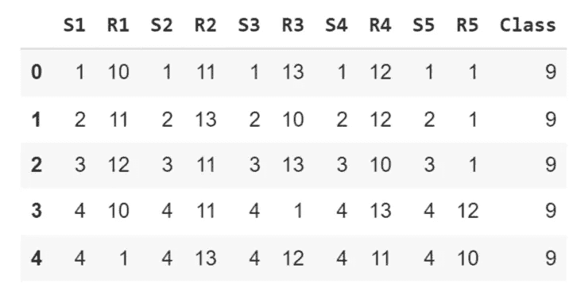

在每一轮扑克游戏中，每个玩家手里都有五张牌，每张牌都有其符号和等级，符号可以是红心、方块、梅花或黑桃，等级从 1 到 13 不等。该数据集由一个人可能拥有的五张卡的所有可能组合组成。

*   Sn:第 n 张牌的符号，其中:1(红心)，2(方块)，3(梅花)，4(黑桃)
*   Rn:第 n 张牌的等级，其中:1(王牌)，2–10，11(杰克)，12(王后)，13(国王)

# 1.为什么我们需要高效的编码？

高效代码是指执行速度更快、计算内存更少的代码。在本文中，我们将使用 **time()** 函数来测量计算时间。这个函数测量当前时间，所以我们将在代码执行前和执行后把它赋给一个变量，然后计算差值，就知道代码的计算时间。下面的代码显示了一个简单的例子:

```
import time
# record time before execution
start_time = time.time()
# execute operation
result = 5 + 2
# record time after execution
end_time = time.time()
print("Result calculated in {} sec".format(end_time - start_time))
```

让我们看一些应用高效代码方法将如何提高代码运行时间和降低计算时间复杂性的例子:我们将计算从零到一百万的每个数字的平方。首先，我们将使用 list comprehension 来执行这个操作，然后使用 for 循环重复相同的过程。

第一次使用列表理解:

```
#using List comprehension 

list_comp_start_time = time.time()
result = [i*i for i in range(0,1000000)]
list_comp_end_time = time.time()
print("Time using the list_comprehension: {} sec".format(list_comp_end_time -
list_comp_start_time))
```


现在我们将使用 for 循环来执行相同的操作:

```
# Using For loop

for_loop_start_time= time.time()
result=[]
for i in range(0,1000000):
  result.append(i*i)
for_loop_end_time= time.time()
print("Time using the for loop: {} sec".format(for_loop_end_time - for_loop_start_time))
```


我们可以看到它们之间有很大的差异，我们可以用百分比来计算它们之间的差异:

```
list_comp_time = list_comp_end_time - list_comp_start_time
for_loop_time = for_loop_end_time - for_loop_start_time
print("Difference in time: {} %".format((for_loop_time - list_comp_time)/
list_comp_time*100))
```

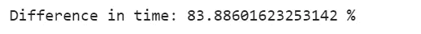

这里有另一个例子来展示编写高效代码的效果。我们想计算从 1 到 100 万的所有连续数字的总和。有两种方法第一种是使用蛮力，我们将一个接一个地增加到一百万。

```
def sum_brute_force(N):
  res = 0
  for i in range(1,N+1):
    res+=i
  return res

# Using brute force
bf_start_time = time.time()
bf_result = sum_brute_force(1000000)
bf_end_time = time.time()

print("Time using brute force: {} sec".format(bf_end_time - bf_start_time))
```

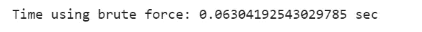

另一个更有效的方法是用公式来计算。当我们想计算从 1 到一个数的所有整数的和时，比如说 N，我们可以把 N 乘以 N+1，然后除以 2，这样就会得到我们想要的结果。这个问题实际上在 19 世纪就交给了德国的一些学生，一个名叫卡尔-弗里德里希·高斯的聪明学生设计了这个公式来在几秒钟内解决这个问题。

```
def sum_formula(N):
  return N*(N+1)/2

# Using the formula
formula_start_time = time.time()
formula_result = sum_formula(1000000)
formula_end_time = time.time()

print("Time using the formula: {} sec".format(formula_end_time - formula_start_time))
```

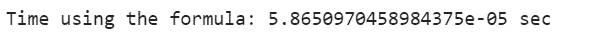

运行这两种方法后，我们实现了超过 160，000%的巨大改进，这清楚地表明了为什么我们需要高效和优化的代码，即使对于简单的任务也是如此。

编写 python 代码的最低效的方法之一是在代码中有许多循环，尤其是当您有大量数据时。由于作为一名数据科学家，您将需要广泛地迭代您的数据框架，尤其是在数据准备和探索阶段，因此能够高效地完成这项工作非常重要，因为这将为您节省大量时间，并为更重要的工作留出空间。我们将通过三种方法让您的循环更快、更有效:

*   使用**循环。iterrows()** 函数
*   使用**循环。apply()** 函数
*   …向量化…

# 2.使用有效循环。iterrows()

在我们谈论如何使用**之前。iterrows()** 函数为了改进循环过程，让我们刷新一下生成器函数的概念。

生成器是一个创建迭代器的简单工具。在生成器主体内部，您将发现只有 **yield()** 语句，而不是 return 语句。可以只有一个或几个 **yield()** 语句。这里，我们可以看到一个生成器， **city_name_generator()** ，它生成四个城市名。为简单起见，我们将生成器分配给变量 **city_names** 。

```
def city_name_generator():
  yield('New York')
  yield('London')
  yield('Tokyo')
  yield('Sao Paolo')

city_names = city_name_generator()
```

为了访问生成器生成的元素，我们可以使用 Python 的 **next()** 函数。每次使用 **next()** 命令时，生成器将生成下一个要生成的值，直到不再有要生成的值。我们这里有 4 个城市。让我们运行下一个命令四次，看看它会返回什么:

```
next(city_names)
```


```
next(city_names)
```


```
next(city_names)
```


正如我们可以看到的，每次我们运行 **next()** 函数，它都会打印一个新的城市名。

让我们回到。 **iterrows()** 函数。**。iterrows()** 函数是每个熊猫 DataFrame 的属性。当被调用时，它产生一个包含两个元素的列表。我们将使用这个生成器来遍历我们的**扑克**数据帧的每一行。第一个元素是该行的索引，而第二个元素包含该行每个特征的熊猫系列:五张卡片中每张卡片的符号和等级。它非常类似于 **enumerate()** 函数的概念，当应用于列表时，返回每个元素及其索引。

遍历 Pandas 数据帧最直观的方法是使用 **range()** 函数，这通常被称为粗循环。下面的代码显示了这一点:

```
start_time = time.time()
for index in range(poker_data.shape[0]):
  next
print("Time using range(): {} sec".format(time.time() - start_time))
```

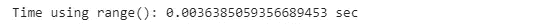

迭代熊猫数据框架的一个更聪明的方法是使用**。iterrows()** 函数，该函数针对此任务进行了优化。我们简单地用两个迭代器定义了“ **for** ”循环，一个用于每行的编号，另一个用于所有的值。

在循环内部， **next()** 命令指示循环移动到迭代器的下一个值，而不实际做任何事情。

```
data_generator = poker_data.iterrows()
start_time = time.time()
for index, values in data_generator:
  next
print("Time using .iterrows(): {} sec".format(time.time() - start_time))
```

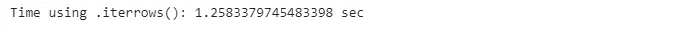

比较这两个计算时间我们还可以注意到**的使用。iterrows()** 没有提高遍历 pandas 数据帧的速度。当我们需要一种更简洁的方式来使用每一行的值时，它是非常有用的。

# 3.使用有效循环。应用()

现在我们将使用**。apply()** 函数能够在遍历熊猫数据帧时执行特定的任务。**。apply()** 函数确实如它所说的那样；它对整个数据帧应用另一个函数。

**的语法。apply()** 函数很简单:我们创建一个映射，在本例中使用 lambda 函数，然后声明我们想要应用于每个单元格的函数。这里，我们将平方根函数应用于数据帧的每个单元格。就速度而言，它与在整个数据帧上只使用 NumPy **sqrt()** 函数的速度相当。

```
data_sqrt = poker_data.apply(lambda x: np.sqrt(x))
data_sqrt.head()
```

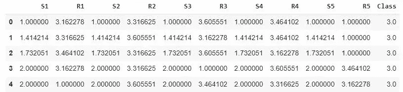

这是一个简单的例子，因为我们想将这个函数应用于数据帧。

但是，当目标函数接受多个单元格作为输入时，会发生什么情况呢？例如，如果我们想计算每手牌中所有牌的排名之和，该怎么办？在这种情况下，我们将使用。apply()函数和我们之前做的一样，但是我们需要在行尾添加 **'axis=1'** 来指定我们将函数应用到每一行。

```
apply_start_time = time.time()
poker_data[['R1', 'R2', 'R3', 'R4', 'R5']].apply(lambda x: sum(x), axis=1)
apply_end_time = time.time()
apply_time = apply_end_time - apply_start_time
print("Time using .apply(): {} sec".format(time.time() - apply_start_time))
```

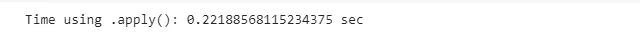

然后，我们将使用**。iterrows()** 函数我们以前见过，并比较它们的效率。

```
for_loop_start_time = time.time()
for ind, value in poker_data.iterrows():
  sum([value[1], value[3], value[5], value[7], value[9]])
for_loop_end_time = time.time()

for_loop_time = for_loop_end_time - for_loop_start_time
print("Time using .iterrows(): {} sec".format(for_loop_time))
```

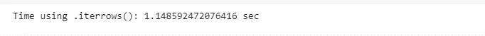

使用**。apply()** 函数明显比**快。iterrows()** 函数，幅度约为 400 %,这是一个巨大的改进！

```
print('The differnce: {} %'.format((for_loop_time - apply_time) / apply_time * 100))
```


正如我们对行所做的那样，我们可以对列做完全相同的事情；对每列应用一个函数。通过将**轴=1** 替换为**轴=0** ，我们可以对每一列应用求和函数。

```
apply_start_time = time.time()
poker_data[['R1', 'R2', 'R3', 'R4', 'R5']].apply(lambda x: sum(x), axis=0)
apply_end_time = time.time()
apply_time = apply_end_time - apply_start_time
print("Time using .apply(): {} sec".format(apply_time))
```

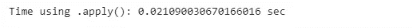

通过比较。 **apply()** 函数用原生熊猫的函数对多行求和，我们可以看到熊猫的原生**。sum()** 函数执行相同操作的速度更快。

```
pandas_start_time = time.time()
poker_data[['R1', 'R1', 'R3', 'R4', 'R5']].sum(axis=0)
pandas_end_time = time.time()
pandas_time = pandas_end_time - pandas_start_time
print("Time using pandas: {} sec".format(pandas_time))
```

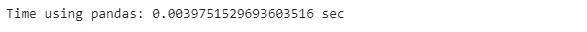

```
print('The differnce: {} %'.format((apply_time - pandas_time) / pandas_time * 100))
```


**总之，我们观察到。当我们想要遍历 pandas 数据帧的所有行时，apply()函数执行得更快，但是当我们通过一列执行相同的操作时，它执行得更慢。**

# 4.使用矢量化有效循环

为了理解如何减少函数执行的迭代次数，回想一下 Pandas 的基本单元 DataFrames 和 Series 都是基于数组的。当对整个数组执行操作时，Pandas 的执行效率比对每个值单独或顺序执行更高。这可以通过**矢量化**来实现。**矢量化**是对整个数组执行操作的过程。

在下面的代码中，我们要计算每手牌中所有牌的等级之和。为此，我们对扑克数据集进行切片，只保留包含每张牌的等级的列。然后，我们称之为内置**。DataFrame 的 sum()** 属性，使用参数 axis = 1 来表示我们需要每行的总和。最后，我们打印前五行数据的总和。

```
start_time_vectorization = time.time()

poker_data[['R1', 'R2', 'R3', 'R4', 'R5']].sum(axis=1)
end_time_vectorization = time.time()

vectorization_time = end_time_vectorization  - start_time_vectorization
print("Time using pandas vectorization: {} sec".format(vectorization_time))
```

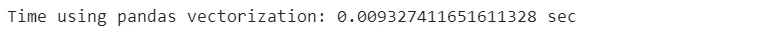

我们之前看到了各种方法，这些方法执行应用于数据帧的函数比简单地遍历数据帧的所有行要快。我们的目标是找到执行这项任务的最有效的方法。

*   使用**。iterrows()** 循环遍历数据帧:

```
data_generator = poker_data.iterrows()

start_time_iterrows = time.time()

for index, value in data_generator:
  sum([value[1], value[3], value[5], value[7]])

end_time_iterrows = time.time()
iterrows_time = end_time_iterrows - start_time_iterrows
print("Time using .iterrows() {} seconds " .format(iterrows_time))
```

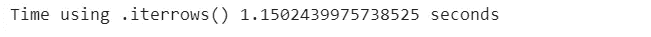

*   使用。apply()方法

```
start_time_apply = time.time()
poker_data[['R1', 'R2', 'R3', 'R4', 'R5']].apply(lambda x: sum(x),axis=1)
end_time_apply = time.time()

apply_time = end_time_apply - start_time_apply

print("Time using apply() {} seconds"  .format(apply_time))
```

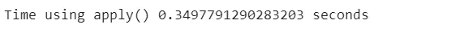

使用**矢量化**和**比较每手牌中所有牌的等级相加所需的时间。iterrows()** 函数，以及**。apply()** 函数，我们可以看到矢量化方法的性能要好得多。

我们还可以使用另一种矢量化方法来有效地遍历数据帧，该方法使用 Numpy 数组对数据帧进行矢量化。

NumPy 库将自己定义为“Python 中科学计算的基础包”，它在优化的预编译 C 代码中执行操作。与 pandas 处理数组类似，NumPy 对名为 **ndarrays** 的数组进行操作。Series 和 ndarrays 之间的一个主要区别是 ndarrays 省略了许多操作，如索引、数据类型检查等。因此，在 NumPy 阵列上的操作比在 pandas 系列上的操作要快得多。当 pandas 系列提供的附加功能不重要时，NumPy 阵列可以用来代替 pandas 系列。

对于我们在本文中探索的问题，我们可以使用 NumPy ndarrays 来代替 pandas 系列。关键的问题是这是否会更有效率。

同样，我们将计算每手牌中所有牌的等级总和。我们简单地通过使用**将我们的 rank 数组从 pandas 系列转换成 NumPy 数组。熊猫系列的 values** 方法，该方法将熊猫系列作为 NumPy **ndarray** 返回。与对序列进行矢量化一样，将 NumPy 数组直接传递给函数将导致 pandas 将函数应用于整个矢量。

```
start_time = time.time()

poker_data[['R1', 'R2', 'R3', 'R4', 'R5']].values.sum(axis=1)

print("Time using NumPy vectorization: {} sec" .format(time.time() - start_time))
```

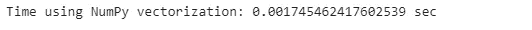

```
start_time = time.time()
poker_data[['R1', 'R2', 'R3', 'R4', 'R5']].sum(axis=1)
print("Results from the above operation calculated in %s seconds" % (time.time() - start_time))
```

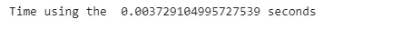

在这一点上，我们可以看到对 pandas 系列的矢量化实现了日常计算的绝大多数优化需求。然而，如果速度是最重要的，我们可以通过 **NumPy** Python 库的形式来寻求帮助。与之前最先进的 panda 优化方法相比，我们仍然在运行时间上有所改进。

# 5.最佳实践总结

*   使用。 **iterrows()** 没有提高遍历数据帧的速度，但效率更高。
*   **。当我们想要遍历熊猫数据帧的所有行时，apply()** 函数执行得更快，但是当我们通过一列执行相同的操作时，执行得更慢。
*   对 pandas 系列进行矢量化处理可以满足日常计算的绝大多数优化需求。然而，如果速度是最重要的，我们可以以 **NumPy** Python 库的形式调用增援。

***感谢阅读！如果你喜欢这篇文章，请务必:***

*   **👏为这个故事鼓掌(50 次)并跟我来👉**
*   **📰查看我的个人资料中的更多内容**
*   **🔔关注我:**[**LinkedIn**](https://www.linkedin.com/in/youssef-hosni-b2960b135/)**|**[**Medium**](https://medium.com/@youssefraafat57)**|**[**Twitter**](https://twitter.com/Youssef70125494)**|**[**GitHub**](https://github.com/youssefHosni)
*   *🚀👉* ***加入*** [***中等会员***](https://youssefraafat57.medium.com/membership) ***计划继续无限制学习。如果你使用下面的链接，我会收到一小部分会员费，不需要你额外付费。***

[](https://youssefraafat57.medium.com/membership) [## 加入我的介绍链接媒体-优素福胡斯尼

### 阅读 Youssef Hosni(以及媒体上成千上万的其他作家)的每一个故事。您的会员费直接支持…

youssefraafat57.medium.com](https://youssefraafat57.medium.com/membership)