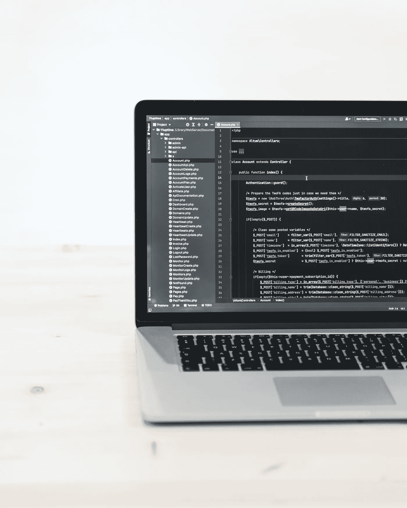

# 不要再纠结于学习哪种编程语言了

> 原文：<https://levelup.gitconnected.com/stop-obsessing-over-which-programming-language-to-learn-7cf049664042>

## 为什么一开始就没有完美的语言

[Unsplash](https://unsplash.com/photos/FoTs3ntRoIs) 上 [AltumCode](https://unsplash.com/@altumcode) 拍摄的照片

不要误解我的意思，一旦你开始学习一门编程语言，并且你知道你每天都会用到它，那么专攻这门语言是非常重要的。然而，如果你的旅程才刚刚开始，或者你正试图学习代码和找工作，痴迷于一门语言不应该真的在你的优先列表上。

## 调查就业市场

所以你决定要学习编码，然后找一份开发人员的工作。如果你不确定从哪种语言开始，一个好主意可能是上 LinkedIn 之类的网站，看看你所在地区的发展工作的要求。此外，你可以调查你想从事的行业的公司，以获得更准确的信息。这会给你一些提示，告诉你哪种语言是受欢迎的，然后你就可以开始学习了。以后你总是可以学习另一种语言，学习另一种语言可能会有好处，但是你选择的第一种语言应该能够让你找到工作，这样你就可以开始你的职业生涯。

## 解决问题需要使用特定的工具

软件开发都是关于解决问题的，不幸的是，所有的问题都不能以同样的方式解决。这就是为什么有几十种编程语言，而且它们都有各自的用途。这也是为什么大型科技公司会使用不止一种技术，所以你不必为选择“正确的”语言而得意忘形。

## 当你选择一个的时候——专攻它

好了，你已经看了一下就业市场，什么能让你找到工作，你已经选择了你想先学的语言。很好，现在不要跳进各种框架，而是留出一些时间来真正学习特定语言的来龙去脉——它是如何工作的，它与其他语言的不同之处，它的优势和劣势。

基础知识是关键，它们会让你从整体上对软件开发有更好的理解。事实上，编程的基础在任何语言中都是一样的，所以当你开始学习新技术时，留出时间学习它们肯定会有回报。

## 如果我必须选择

此时你可能会说‘好吧，聪明的家伙，你能至少给我一些建议吗’答案是，是的，我能。

如果我要从头开始学习，我可能会选择 JavaScript。不管是好是坏，无论你在哪里工作，你可能都无法逃脱 JavaScript，记住这一点，它是首先学习的完美语言，因为它很可能会派上用场。此外，有了 React，Node.js 和 Typescript，你身边有许多基于 JavaScript 的热门技术，它们实际上允许你在 js 中拥有前端和后端(Node.js)。在那里放一个数据库，你就可以立刻构建应用程序，这可能会使它更有趣，因为你会马上看到结果，不像某些语言可能很强大，但编程时间要长得多。

 [## 通过我的推荐链接加入 Medium-Ivan Stoev

### 作为一个媒体会员，你的会员费的一部分会给你阅读的作家，你可以完全接触到每一个故事…

medium.com](https://medium.com/@ivan.zstoev/membership)