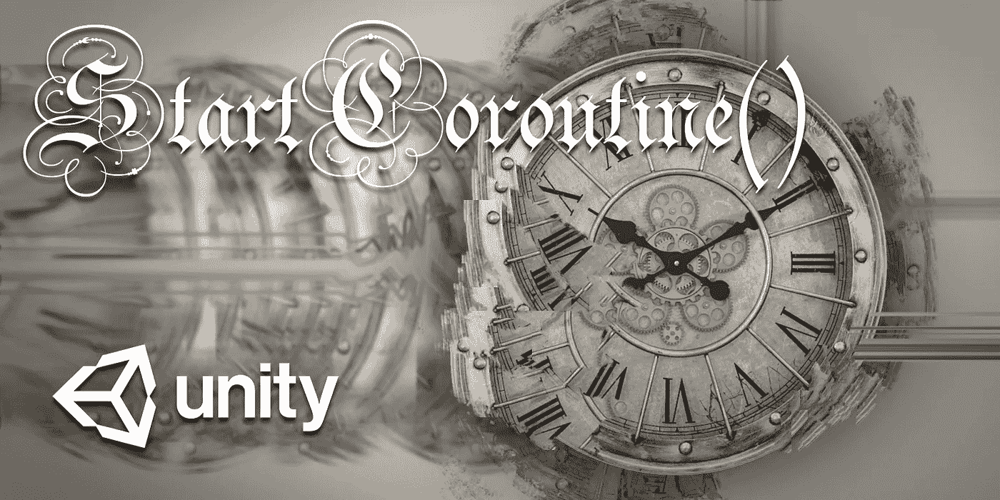
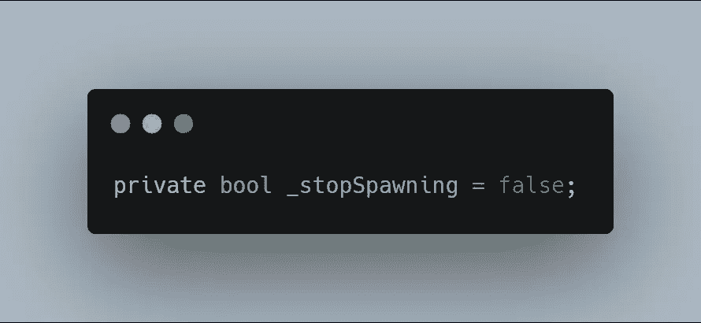
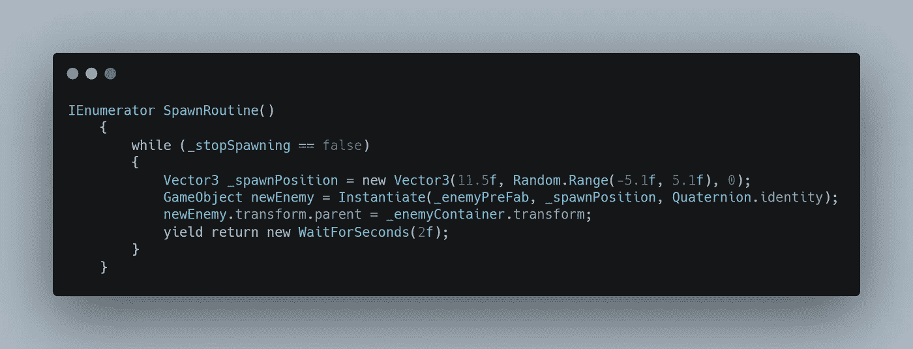
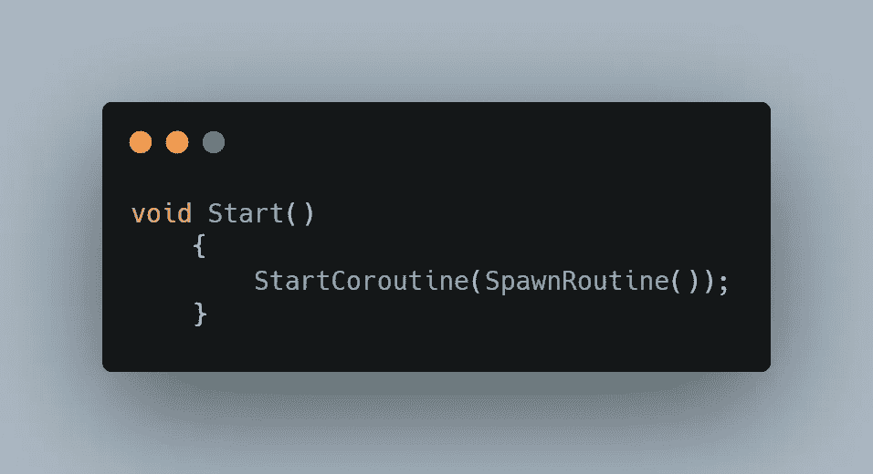

# 在 Unity 中停止使用协程

> 原文：<https://levelup.gitconnected.com/stop-right-there-with-coroutines-in-unity-dacef8b69bc2>

当你需要在执行一个**动作**之前**等待**一定量的**时间**时，Unity 中的协程会前来救援。

下面的信息性描述直接来自 Unity 的文档，表明协程可以**暂停它的执行**，直到给定的**产出指令**完成。基本上，脚本从上到下运行，没有停顿，但是协程能够让**暂停**和**等待**的指令，然后继续运行。

在这个例子中，我将制作一个基本的敌人产卵器，每隔**秒**就会产生新的敌人。我希望敌人在一个 while 循环中产卵，这意味着只要某个条件为真，敌人就会一直产卵，直到那个条件为假。首先是一个变量来容纳我们的条件，以一个 **bool** (真或假)的形式出现。为了清楚这里的意图，这个名字可以是一个明显的**stoppening**并且应该被设置为 **false** 。现在敌人会产卵，直到停止产卵成为现实。

为了**创建**协程，需要创建 **IEnumerator** 类型的**函数**，然后为该方法指定一个合适的**名称**。在这里我将其命名为 **SpawnRoutine()** 。至于另一个文本， **while 循环**将继续运行，直到那个**stop spacing**变量变为 **true** ，我可以稍后将它赋值，例如当玩家**死亡**时。需要注意的重要部分是代码的最后一行。需要这个 **yield return new** 语句来防止协程抛出**错误**。它还告诉代码让**产生**，然后**返回**新的。新的返回是代码的最后一位，表示**等待秒(2f)** ，它告诉我的代码在**继续**之前**等待**2 秒**。由于这是一个 while 循环，在 2 秒钟过去后，代码将返回到顶部并创建另一个敌人**以此类推，直到玩家死亡。****

最后要介绍的是如何**启动**一个协程。这是非常简单的，关键字 **StartCoroutine** ，后面是括号中**方法**的**名称**。在方法名的末尾需要另一组方法本身的括号，以便像调用任何其他 void 方法一样调用它。在这里，我把它放在 void start 中，所以它会在游戏开始时激活。

就编码技术而言，协程**是强大的**函数**。在项目中有很多需要**暂停**和使用**定时器**的情况，将会是**关键**。对于那些我们需要**让出**…协程来拯救的情况！**