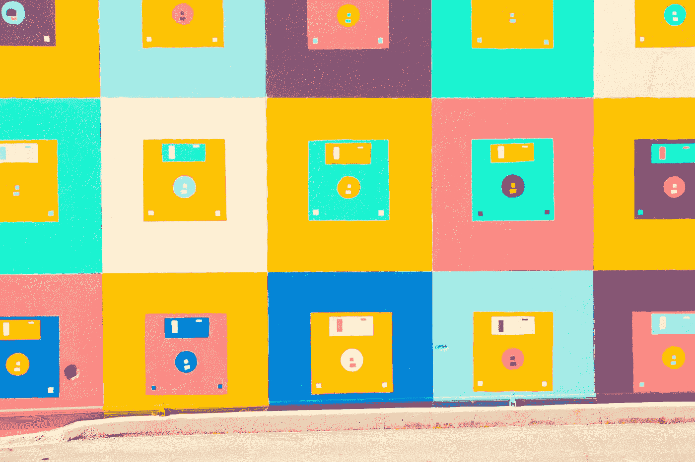
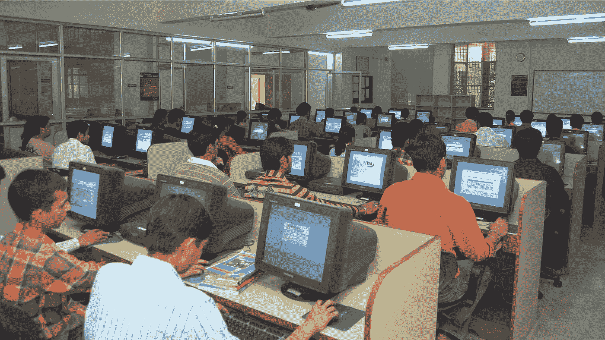
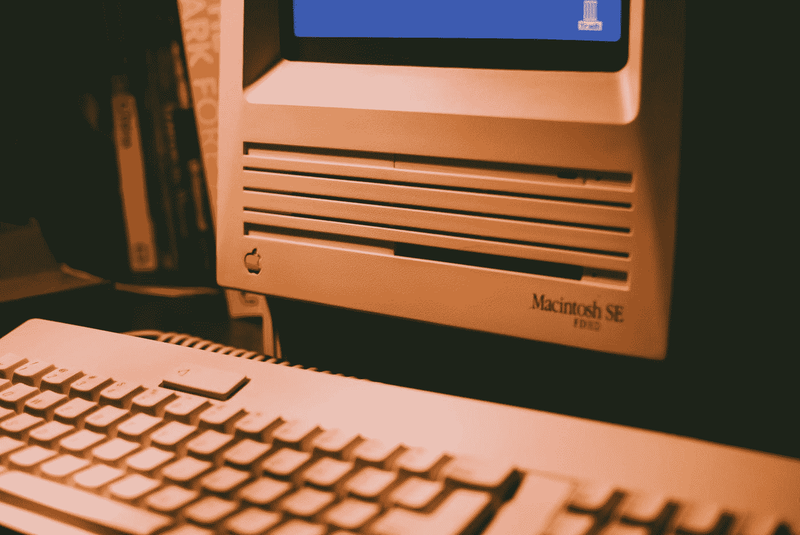

# 停止代码战争！

> 原文：<https://levelup.gitconnected.com/stop-the-code-wars-f22e13caafec>

为什么我们(开发人员)应该停止说“语言 X 比 Y 好”，或者更糟“语言 xyz 死了！”

照片由 [Yomex Owo](https://unsplash.com/@yomex4life?utm_source=medium&utm_medium=referral) 在 [Unsplash](https://unsplash.com?utm_source=medium&utm_medium=referral) 上拍摄

为了证明我的说法，让我从分享我在 *d* ev 世界中的个人历史开始……按编程语言划分。

**HTML**

照片由[布伦特·达灵](https://unsplash.com/@brentdalling?utm_source=medium&utm_medium=referral)在 [Unsplash](https://unsplash.com?utm_source=medium&utm_medium=referral) 上拍摄

我知道，不是真正的编程语言，但无论如何…我的第一次编程经历开始于 90 年代末，那时计算机还在使用软盘，通过 Microsoft Frontpage Express 处理 HTML。是的，那是动画 gif 的光辉岁月，还好，雅虎统治了网络，人们在 Geocities 上发布他们的网站，一切都很简单…而且很慢…而且，以今天的标准来看，非常丑陋。但是没人在乎。

Pascal 后来我上了大学，被介绍给 Pascal，从那以后我再也没有碰过它，但它达到了我的目的。这是达到目的的一种手段——教授基本的编程元素。我想那里的每个人都知道。没有人期望找到一份 Pascal 开发人员的工作(尽管他们确实存在)。另一方面，人们可以在不理解对象、类或函数的情况下创建算法，因此这是一个很好的起点。

由[日出大学](https://unsplash.com/@alwarsunrise?utm_source=medium&utm_medium=referral)在 [Unsplash](https://unsplash.com?utm_source=medium&utm_medium=referral) 上拍摄的照片(其实不是我的大学，而是 PC 的样子)

与此同时，在另一堂课上，另一个软件正在被讲授，它的名字是:超级卡片。它基于苹果的 HyperCard，这是在万维网出现之前第一个成功的超媒体系统。编程语言是 SuperTalk(也基于苹果的 SuperTalk ),所有这些都运行在 Mac OS 8 上。关于这种语言有趣的事情是，它非常类似于写英语句子，一个人真的可以阅读代码并理解它而不需要很大的努力。

这持续了整整一年，也让我们可以玩视频和音乐来制作多媒体光盘…还记得那些吗？是的，他们是一个爆炸。在 21 世纪初，直接从互联网上观看视频或听音乐简直是一个乌托邦，所以我们有了 CD。我们很开心。

[郭开森](https://unsplash.com/@a_jack_g?utm_source=medium&utm_medium=referral)在 [Unsplash](https://unsplash.com?utm_source=medium&utm_medium=referral) 上拍照

**后来被 Adobe 收购的 Macromedia 公司开发了一个叫做 Director 的很酷的程序。它很大程度上基于 HyperCard 和 SuperCard，但在界面和时间轴概念上有很大的改进，以便更容易地创建动画(类似于 Flash)。这种语言也是基于 HyperTalk 的，所以差别不大。但它确实允许通过微软 Access 探索动画和第一次接触数据库。**

**更多 HTML 和… ActionScript 2.0** 到现在为止，我已经在大学里度过了两年，没有接触过任何基于网络的技术。这很正常，那时网络还没那么重要，大多数青少年对 mIRC、ICQ 和后来的 Windows Live Messenger 更感兴趣。网站和 web 应用程序并不真正相关，但它们正在快速增长，所以我们有一个学期使用 Macromedia Dreamweaver 和 Macromedia Flash 上的 Actionscript 2.0 进行 HTML 划分。

所有这些都是使用 Windows 98、2000 和(但愿不会如此)Vista…以及后来的 Windows XP。

马丁·奥斯里克在 [Unsplash](https://unsplash.com?utm_source=medium&utm_medium=referral) 上拍摄的照片

在我大学的最后一年，这是我学的最后一门语言。这是我对服务器端世界的第一次洞察。生成动态页面、数据库连接、查询、记录集等等，这些我好几年都不会再玩了。

**回到 ActionScript** 在我的前两份工作中，我用 ActionScript 2.0 和后来的 3.0 编程。Adobe Flash 是 2004 年到 2008 年间的“热门产品”。矢量动画，完全的布局自由，视频，音乐，应有尽有。似乎一切皆有可能，没有人真正关心插件安装是否必要。至少在史蒂夫·乔布斯说他们做到了之前是这样。我过度简化了，事实是 Flash 并没有很好很快地发展到移动时代。但我仍然怀念它提供的一些自由。

哦，对了，我回去又用了 Mac OS 我想是豹的那个。

本·格里菲斯在 [Unsplash](https://unsplash.com?utm_source=medium&utm_medium=referral) 上拍摄的照片

**PHP** 在 2008 年末成立自己的公司后，我们面临一些后端专业知识的需求。所以我用了一些我从个人项目中学到的知识，继续成为一名 PHP 开发人员，这也让我了解了 MySQL 和 Linux 管理。平常的灯堆。在大多数情况下，最终会使用 Laravel 框架。

由于还要教授游戏开发入门课程，我不得不学习普通的 JavaScript。这并不是一个很大的挑战，因为 ActionScript 与 JavaScript 非常相似。

后来，我也有机会成为 React 和 React 本地项目的一部分，并让我深入了解了 JavaScript 编程的全新水平和范式。

照片由[劳塔罗·安德烈亚尼](https://unsplash.com/@lautaroandreani?utm_source=medium&utm_medium=referral)在 [Unsplash](https://unsplash.com?utm_source=medium&utm_medium=referral) 上拍摄

# 结论

很抱歉有这么长的文字，一想到过去是怎样的，人们总是会怀旧。但是我要带着这个去哪里？

正如你所看到的，在我 20 多年的经历中，我使用过几种语言、软件、操作系统，其中一些已经消失或演变成了别的东西。我一直认为这是很自然的事情，是进化的一部分。

现在我觉得非常奇怪的事情，我很难理解背后的原因，是开发人员将编程语言相互对立的多种出版物，或者对语言的死亡和崛起做出预测。

虽然我可以理解和联系一些论点，如比较性能或跨平台的能力，或编码有多容易，但这些并不能真正决定语言、框架或任何技术的成败。这只是一个方面，可以说，甚至不是最相关的。

> 选择技术栈超越了(或者应该超越)开发者的个人偏好、趋势或者简单的性能比较。

在进入“我们想用什么”之前，有很多方面需要考虑。比如:项目需求、预算、用户目标、外部集成、现有基础设施，以及基本上与项目直接相关而与开发人员或技术本身无关的任何方面。

在某些情况下，最好的选择是使用。NET 而不是 PHP，反之亦然。React Native 或者 Flutter 或者 Swift 或者 Kotlin 或者……Java，C#，Python，GO……真的重要吗？

**焦点必须始终放在什么比特定项目的情况更好。**

因此，在打开基准测试软件并记录算法返回一个值需要多少毫秒之前，问问你自己，**真的与项目**相关吗？如果答案是肯定的，那就去争取吧！但是如果没有，把这些测试放在遗愿清单的底部。

我见过很多项目因为糟糕的技术决策而遭受损失。有时基于开发人员的专业知识，或者什么是趋势。当事情因为结果没有达到预期而开始变糟时，每个人都会受到影响。即使是那些渴望使用某项技术的开发人员，现在也被困在一个有问题的项目中，并且有着糟糕的体验。

我的建议是:作为开发人员，我们必须学会适应并放弃对某些语言的热爱。只有这样，我们才能对技术堆栈的选择给出有价值且公正的意见。

技术多样性是一件**好事情**，最终它帮助开发者实现他们的目标，它为我们提供更多的工具和更多的选择，所以请…让我们保持开放的心态，停止这些“代码战争”，好吗？

感谢阅读和…和平！