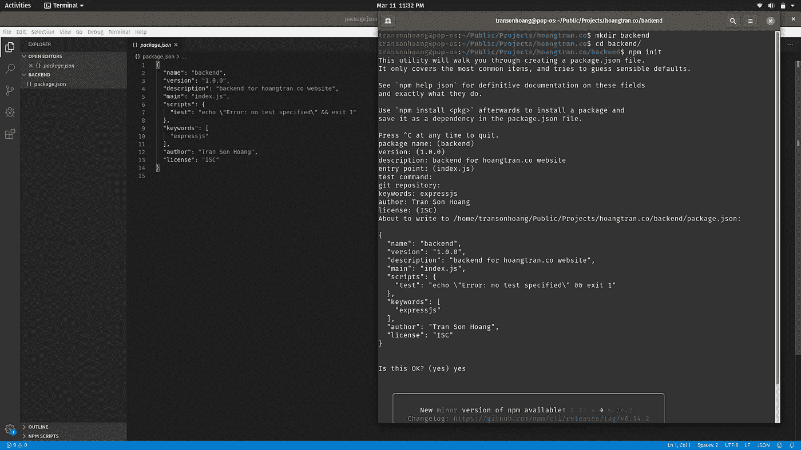
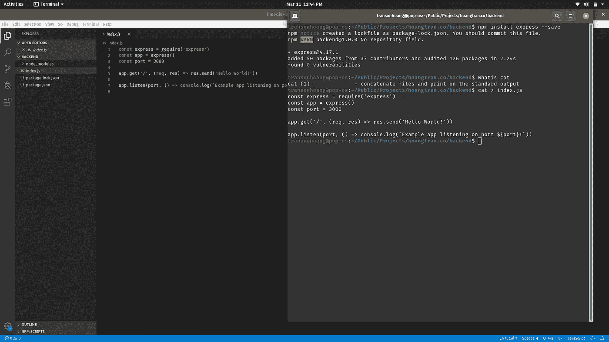
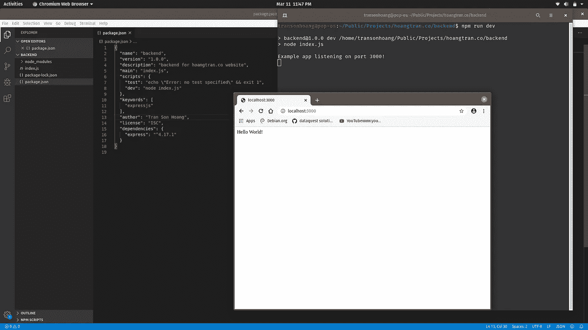
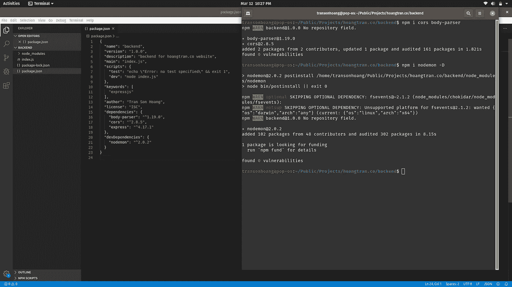
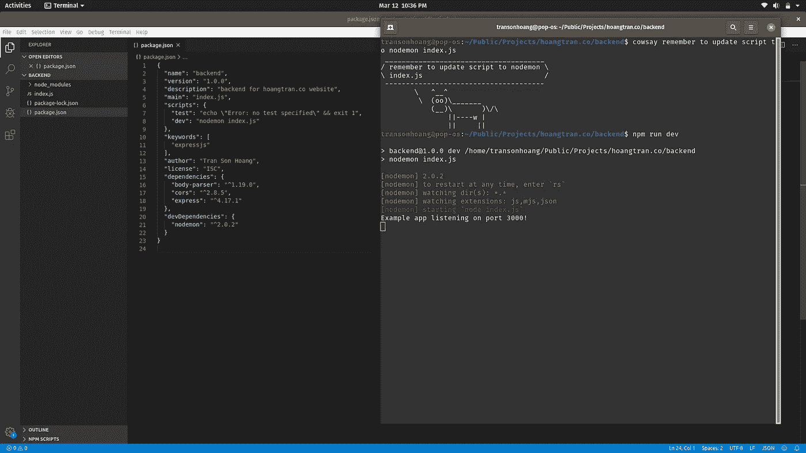
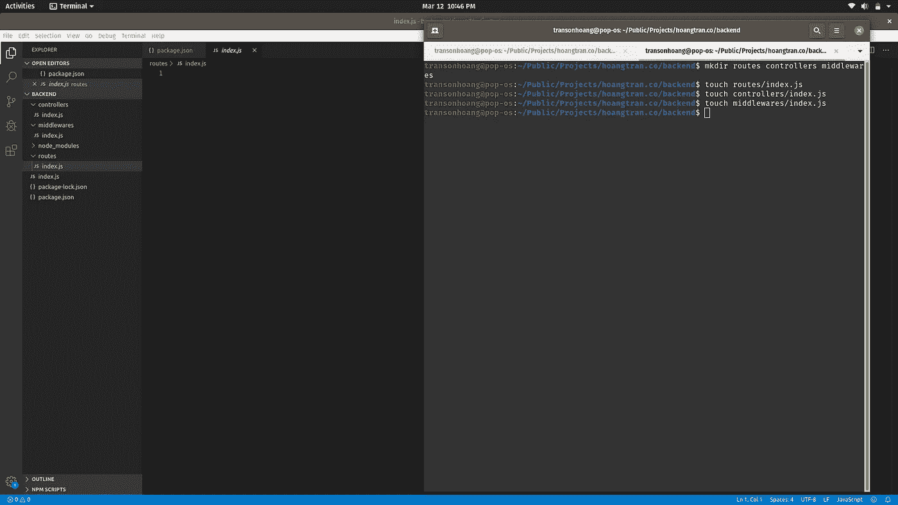

# 停止使用 Starter Node.js 项目，构建自己的项目

> 原文：<https://levelup.gitconnected.com/stop-using-a-starter-node-js-project-and-build-your-own-38a97aa723f9>

## Nodejs

由[思想目录](https://unsplash.com/@thoughtcatalog?utm_source=unsplash&utm_medium=referral&utm_content=creditCopyText)在 [Unsplash](https://unsplash.com/s/photos/coffee?utm_source=unsplash&utm_medium=referral&utm_content=creditCopyText) 上拍摄的照片

这篇文章是基于我如何使用 [expressjs](https://expressjs.com/) 设置我的个人网站后端，因为我想将所有 API 从我的`pages/api`文件夹移到 [nextjs](https://nextjs.org/) 中，以使用 sqlite3 来存储数据。

文章内容:

1.  从头开始安装一切
2.  构建您的项目文件夹
3.  最佳快递服务器编码模式

*如需更多类似内容，请查看 https://betterfullstack.com*[T22](https://betterfullstack.com)

# 从头开始安装一切

构建节点应用程序非常简单。我们从一个`mkdir backend`命令开始，从我们的项目文件夹创建一个名为**后端**的新文件夹。

我建议你先创建一个项目文件夹，然后在里面创建一个**后端**和**前端**文件夹。

现在`cd backend`运行`npm init`创建一个`package.json`文件，基本信息如下:

npm init 初始化 package.json 文件

按照[expressjs.com](https://expressjs.com/)的指导，运行`npm i express`安装 express 并创建`index.js`并将代码从 [hello world 页面](https://expressjs.com/en/starter/hello-world.html)复制到`index.js`。

安装 express 并创建 index.js

第三步是通过添加新脚本`"dev": "node index.js"`来更新`package.json`，并从命令行运行`npm run dev`来启动项目。

通过运行“node index.js”启动项目

你需要安装三个更重要的库，分别是`[body-parser](https://www.npmjs.com/package/body-parser)`、`[cors](https://www.npmjs.com/package/cors)`和`[nodemon](https://www.npmjs.com/package/nodemon)`。

讲解时间。

为什么我们需要`[body-parser](https://www.npmjs.com/package/body-parser)`？这个库将在您的处理程序之前，在中间件中将传入的请求体解析为 JSON，可在`req.body`属性下获得。

我们为什么需要`[cors](https://www.npmjs.com/package/cors)`？这个库将为 CORS 提供多种选择。简单来说，它将帮助您处理跨域问题:)

为什么我需要`[nodemon](https://www.npmjs.com/package/nodemon)`？当检测到目录中的文件更改时，该库将自动重启节点应用程序。没有它，你不得不关闭你的应用程序并再次启动`npm run dev`。相信我，你的手指会累的:)

安装主体解析器、cors 和 nodemon

因为`nodemon`只针对开发。所以我们加到了`devDependencies`。

记得按如下方式更新脚本:

将脚本更新到 nodemon index.js

下一部分，我们开始构建项目。

# 结构项目文件夹

我个人认为需要 4 个主文件夹: **routes** ， **controllers** ，以及[**middleware**](https://expressjs.com/en/guide/writing-middleware.html)， **migrations** (我会在下一篇文章中谈到这一点)。剩下的，你可以根据自己的情况自己创造。

注意:本文不会讨论如何连接数据库和进行 SQL 迁移。我计划以后写一整篇关于这个的文章。

创建 3 个主文件夹路线，控制器，中间件

解释时间:

*   **routes** :这是为您的端点创建路由
*   **控制器**:这是处理端点逻辑跟随的地方。
*   [**中间件**](https://expressjs.com/en/guide/writing-middleware.html) :一个函数可以访问**请求**和**响应**来做一些你想在端点之间共享的逻辑。

现在，我们进入下一部分，向这些文件夹添加一些代码。

# 最佳快递服务器编码模式

这一节是我个人对于实现的想法。如果我做错了什么，请随时在下面添加您的评论来纠正我。

为了演示，我将为用户实现一个原型。

首先，我从`user.controller.js`开始。想法是我将创建一个名为`userController`的函数，它包含所有的方法。

对于`userController`，我将创建一些方法，如:

*   登录:这将处理用户验证等登录事务，生成令牌，并返回用户信息。
*   注销:这将删除用户令牌。
*   getUser:获取一个人的信息
*   updateUser:更新单个用户的信息
*   deleteUser:删除单个用户
*   getAllUser:返回所有现有用户

注意:我不会在这些方法中做更多的描述。我在这里的目的是介绍一种在 Node.js 应用程序中实现事物的好方法。

nodejs 应用程序中的良好控制器模板示例

其次，有些 API 不需要认证，例如登录、注销，这些 API 用于获取所有非登录页面的信息。还有一些是认证后调用的。因此，我将添加一个中间件来检查身份验证。

验证请求的认证中间件

在这个中间件中，我将做 4 件主要的事情:

*   验证标题中的“授权”
*   验证 JSON web 令牌
*   从令牌获取 id，并检查用户是否存在
*   向`req`添加额外信息

接下来，我将定义路由。您可以理解这是为了将端点和控制器映射在一起。

定义节点应用程序的路由

除了`user/login`，我使用认证中间件来验证所有的请求。因为我们不需要验证登录。

因此，我们将拥有:

*   用户/登录:发布
*   用户/注销:发布
*   用户:获取
*   user/:id: GET，PUT，DELETE

最后，我们需要通过以下方式更新`index.js`:

*   应用主体解析器中间件
*   处理跨域
*   添加路由

nodejs 应用程序的基本 index.js

注意:CORS 非常重要。这将为您处理跨域问题。只需将您的前端域添加到列表中，以允许请求进入。

# 结论

在本文中，我重点介绍了如何从头开始建立一个节点应用程序，并限制源代码中不需要的内容。

我希望这篇文章对你有用！你可以在[媒体](https://medium.com/@transonhoang?source=post_page---------------------------)上关注我。我也在[推特](https://twitter.com/transonhoang)上。欢迎在下面的评论中留下任何问题。我很乐意帮忙！

 [## Hoang transon/starter-express-js

### 在 GitHub 上创建一个帐户，为 Hoang transon/starter-express-js 的开发做出贡献。

github.com](https://github.com/hoangtranson/starter-express-js)  [## 故事-更好的全栈

### 关于 JavaScript、Python 和 Wordpress 的有用文章，有助于开发人员减少开发时间并提高…

betterfullstack.com](https://betterfullstack.com/stories/)