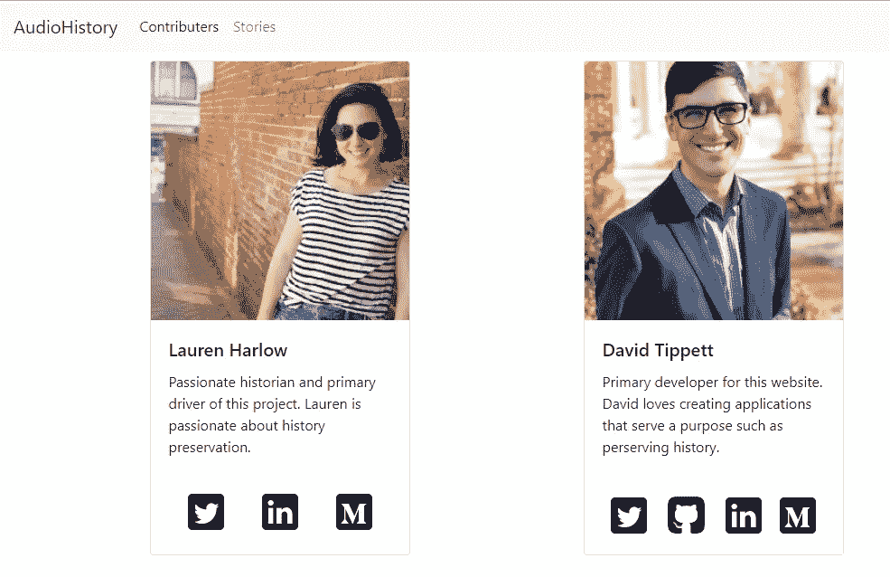
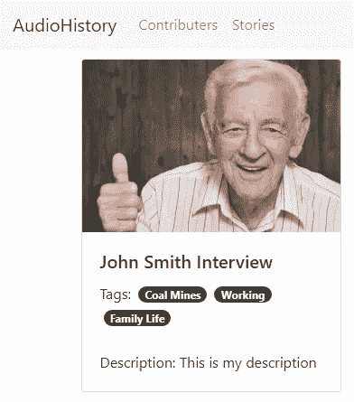
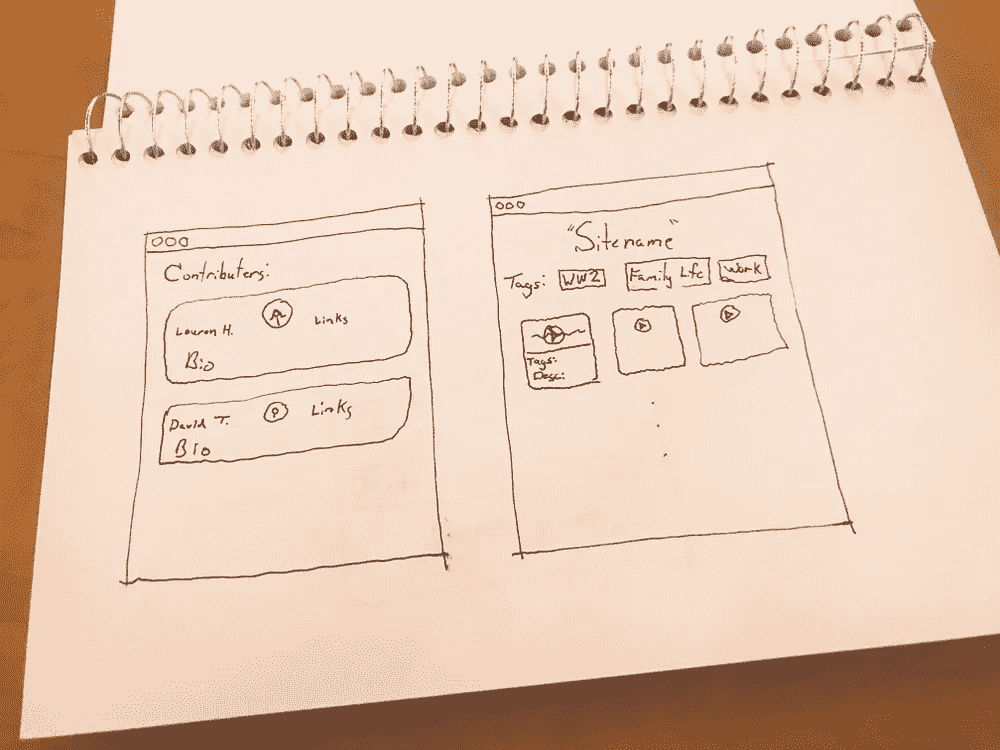
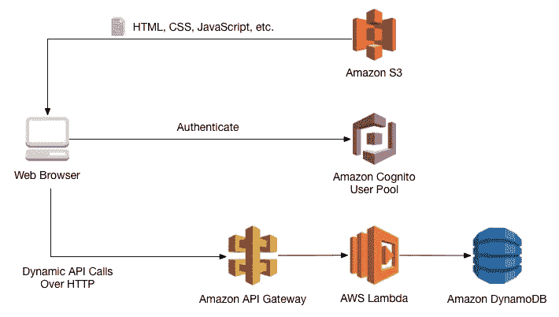

# 如何通过计划你的副业来节省时间

> 原文：<https://levelup.gitconnected.com/stop-wasting-your-time-and-spend-more-time-planning-d97245f6b8da>



在过去的一周里，我开始和姐姐一起做一个兼职项目。没有过多的细节，这是一个音频流网页，旨在记录历史。通常，我会直接进入编程。不过这次我做了一些不同的事情。**策划！**哪一胚根认为对？以下是你如何通过计划你的副业来节省时间。

似乎这不应该需要一整篇文章，但对于像我这样的怀疑者来说，可能需要一整篇文章才能令人信服。谁会拒绝分享那些让他们免受无数小时挫折的东西呢？虽然这个项目是基于 React 的，但是这些概念对于规划任何项目都是通用的。

# 确定项目范围

第一步是尝试并理解范围。在项目的早期规划中，我们需要将范围限制在主要目标上。在和我妹妹谈了一个小时后，我们决定网站的核心将是允许用户根据他们的话题查找和播放音频文件。

理解范围可以让你把每个人的注意力放在最重要的功能上。对我来说，无论是在工作中还是在工作之外，扼杀项目的一个因素就是特性蠕变。功能需求一直阻碍产品很好地完成其主要目标。

# 研究—编程语言

研究阶段在逻辑上遵循范围。因为我已经决定在这个项目中使用 react，所以我首先开始研究如何设置 React 应用程序。在这里，我使用了[“React 应用程序的最佳文件结构”](https://cbn365.sharepoint.com/:x:/s/D365CRMTeam/ESv5c37YJSFJokaEu0yb2UcBttSRYsB9tXhf2d5dB2E8eQ?e=i6vhex)作为组织 React 项目的资源。

阅读上面的指南让我意识到一些重要的事情。我不是 React 开发人员。如果是我自己开始的，我会对我的文件结构做这样的事情:

```
├── src
│   ├── components
│   │   └── x_component
│   │       └── x_component.js
```

虽然这没有错，但它会导致我在 app.js 中使用臃肿的 import 语句，如下所示:

```
import x_component from '../x_component/x_component'
```

这看起来有点傻，因为它是如此多余。我从这篇文章中学到的是:我需要在组件文件夹的根目录中包含一个 index.js 文件。然后，我可以将组件 js 导入 index.js 文件，并将导入语句简化为:

```
import x_component from '../x_component'
```

对于我的视觉型学习者来说，这是文件结构的样子:

```
├── src
│   ├── components
│   │   └── x_component
│   │       ├── index.js
│   │       └── x_component.js
```

这只是我从观察专业人士如何做事中获得的一个小收获的例子。我读了不少类似上面提到的文章，以确保我尽可能以最“反应”的方式做事。

# 研究—核心功能

我还花时间研究了网络音频流是如何工作的。我提前意识到，我不知道如何让音频文件逐步加载。这是用户对网站的期望。他们渴望立即得到反馈。

对于那些对流式音频感兴趣的人来说，它基本上是这样工作的:音频文件被分成几个更小的文件。然后它们被一次一个地发送到浏览器，并简单地一个接一个地播放。这样，即使整个片段还没有准备好，你也可以开始听。

谢天谢地，有一个浏览器 API 可以提供帮助。[网络音频 API](https://developer.mozilla.org/en-US/docs/Web/API/Web_Audio_API) 正是为此而开发的。来帮助像我这样不是音频工程师的开发人员编写音频流应用程序。

# 与研究相关的图书馆

另一个需要花时间研究的地方是其他相关的图书馆。我不是设计师。创建漂亮的网站对我来说很难。谢天谢地，有这样一个库: [react-bootstrap](https://react-bootstrap.github.io/) 。如果我没有做任何研究就开始，就像我对另一个失败的项目所做的那样，我会因为试图解决 React 组件的所有 CSS 而感到沮丧，并放弃这个项目。



以上是我通过利用预制库以最小的努力实现的一小部分。

# 基础架构—设计

我说过我不是设计师吗？哦，对…我做了…这就是为什么对我来说，规划用户界面是至关重要的。以下是该网站应该是什么样子的一些初步草图。它们很简单，但给了我一些东西给我妹妹看，以确保我认为我正在编程的东西是她想象的。这让我免于做出她讨厌的东西。



# 基础架构—托管

主机的规划非常简单。自托管不够可靠，我想保持成本效益。AWS 以 12 美元赢得了一个使用 Route 53 的域名，DynamoDB 将是免费的，S3 的存储和数据传输成本很低。

我也很喜欢和 AWS 一起工作。也许 Azure 可能会更便宜，但没有什么比熟悉的东西更温暖的怀抱。说到熟悉，这里有一个用 S3 制作网站的简单参考架构。这是来自[的一篇文章](https://medium.com/employbl/tutorial-for-building-a-web-application-with-amazon-s3-lambda-dynamodb-and-api-gateway-6d3ddf77f15a)，作者[康纳·里奇](https://medium.com/@connorleech)。参考架构之所以伟大，是因为对于有保证的架构来说，它们需要最少的工作。



参考架构

# 早期发展

计划的一部分是持续的检查。在这里，因为我和我的妹妹在这个项目上合作，所以经常和她一起讨论开发是非常重要的。这是为了确保我开发的东西符合她的期望。

由于我们的检入，我们意识到一个主要组件没有意义。我们最初打算让用户点击一个故事，然后被重定向到一个页面，他们可以在那里听音频。实际上，这很笨重。我们决定允许用户直接从浏览页面收听音频。我甚至不知道这节省了多少时间，但每一个小时都很重要。

在这里，确保我坚持网站的首要目标也非常重要。很多次，我姐姐会带着她想添加的功能来找我。在这里，作为一名开发人员，我有责任让项目保持在正轨上。如果我们没有任何核心功能，没有人会访问这个网站。

过去的早期发展，我相信会有更多的挑战，这意味着更多的文章。要查看到目前为止已经生成的代码，请参见[这个 GitHub 库](https://github.com/dtaivpp/audio-history)。直播产品目前由 https://dev-accel.com 的[主持。](https://dev-accel.com)