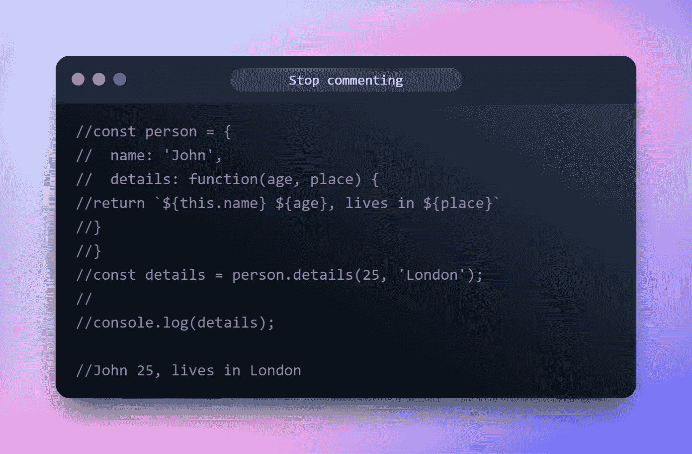

# 停止在你的代码中写不好的注释——干净代码的提示

> 原文：<https://levelup.gitconnected.com/stop-writing-bad-comments-in-your-code-tips-for-clean-code-73f1af5eaf31>



请不要注释掉你的代码

# 介绍

如果放置得当，注释在编程中实际上非常有用。但是大多数时候评论都没有那么“好”。

不好的评论会导致错误的信息、浪费时间、养成坏习惯等等。

在这篇文章中，我将指导你如何避免写不好的评论

# 不好的评论

## 过时的评论

陈旧、过时、不相关或提供错误信息的评论。评论很快就会过时，因为代码库每天都在变化，技术每天都在变化。

如何解决:

*   尽快更新
*   实际上，删除它

## 写得不好的评论

不正确的语法，太多的标记，含糊不清，扑通扑通都是写得不好。按照 clean code 的说法，值得写的评论才值得写好。如果你要写一篇，花点时间润色一下，小心选词。

## 注释掉的代码

这是最糟糕的一种注释，每次我看到被注释掉的代码，它们都会让我发疯。那些代码什么也没做，它们坐在那里烂掉了。但是没有人知道什么时候删除它，因为“也许有人会需要它”

怎么解决？就**删**吧！现在 Git 已经变得非常有价值，如果有人真的需要它，我们可以找到它

## 多余的评论

这些也很糟糕，看看这个:

```
for(let i = 0; i < 10; i++){
  a = b // assign a to b
}
```

或者这个

```
// a function returns sum of a and b
function sum(a, b){ return a + b}
```

那些只是多余的，浪费时间去阅读，那么他们的目的是什么？它们不提供信息，不证明代码的合理性，也不提供意图。他们也没有帮助代码更容易阅读。

只是**删除**他们。

## **嘈杂的评论**

有些评论就是吵。你见过这样的评论吗？

```
// the name
private String name
// the version
private String version
// the constructor
constructor()
```

和

```
//The 123213 License
//
//Copyright (c)123213213213213, and Contributors
//
//Permission to use, copy, modify, and/or distribute this software for any
//purpose with or without fee is hereby granted, provided that the above
//copyright notice and this permission notice appear in all copies.
//
//THE SOFTWARE IS PROVIDED "AS IS" AND THE AUTHOR DISCLAIMS ALL WARRANTIES
//WITH REGARD TO THIS SOFTWARE INCLUDING ALL IMPLIED WARRANTIES OF
//MERCHANTABILITY AND FITNESS. IN NO EVENT SHALL THE AUTHOR BE LIABLE FOR
//ANY SPECIAL, DIRECT, INDIRECT, OR CONSEQUENTIAL DAMAGES OR ANY DAMAGES
//WHATSOEVER RESULTING FROM LOSS OF USE, DATA OR PROFITS, WHETHER IN AN
//ACTION OF CONTRACT, NEGLIGENCE OR OTHER TORTIOUS ACTION, ARISING OUT OF OR
//IN CONNECTION WITH THE USE OR PERFORMANCE OF THIS SOFTWARE.
```

他们有太多的信息，我们不是在写一本历史书，只是放了一个 API 文档作为进一步的信息。

## HTML 注释

这个没什么好说的，我觉得 HTML 注释一点用都没有。我们有 ID、类名、标签名和数千种方法来说明代码的含义。为什么要为他们写评论呢？

# 结论

虽然有些评论实际上是必要的和有益的，但大多数评论并非如此。我知道这篇文章可能不太正面，但我只想证明:

> 如果你的代码不好，不要评论它，清理它就行了

在下一篇文章中，我将会讲述如何写好评论，请点击关注按钮查看。

感谢阅读

# 遗言

虽然我的内容对每个人都是免费的，但是如果你觉得这篇文章有帮助，[你可以在这里给我买杯咖啡](https://www.buymeacoffee.com/kylele19)