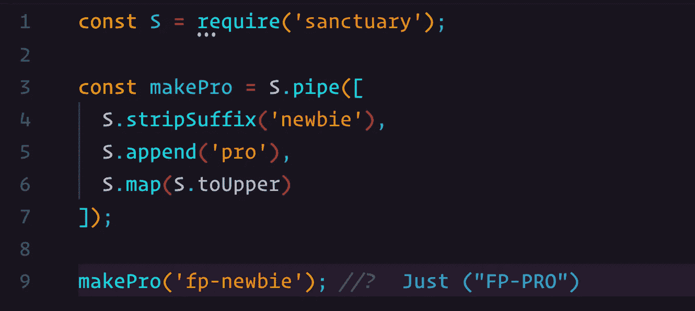
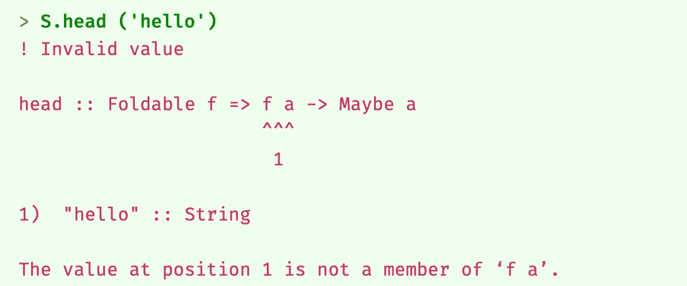

# 停止编写不安全的 JavaScript——面向 JavaScript 开发者的函数式编程

> 原文：<https://levelup.gitconnected.com/stop-writing-unsafe-javascript-functional-programming-for-javascript-developers-9c5f19ab9e4>



当我们谈论 JavaScript 中的函数式编程时，有许多途径可供选择。一方面，我们有这样一个版本，你只需要关注不变性和纯函数，同时仍然在你的架构中使用更加面向对象(OO)的方法。另一方面，我们有完全严格类型的函数式编程风格，它根本不允许任何 OO 概念。本系列文章更倾向于后者。从头开始用这种风格写作可能是一项艰巨的任务。我们可以通过在我们的项目中使用像 [Sanctuary](https://sanctuary.js.org) 这样的库来极大地简化这个过程。

欢迎来到面向 JavaScript 开发人员的函数式编程的第 8 部分。今天我们将通过向你介绍主要由[大卫·钱伯斯](https://medium.com/u/b968ff13a010?source=post_page-----9c5f19ab9e4--------------------------------)撰写的[避难所](https://sanctuary.js.org)来关注你在现实生活中的发展。

# 什么是避难所？

Sanctuary 是一个 JavaScript 库，强调函数式编程的严格类型版本。它通过使用 JavaScript 中已经存在的特性来做到这一点。所以不需要 Webpack 或者其他编译器。您只需将库添加到项目中，就可以开始了。

圣域符合[幻想世界](https://github.com/fantasyland/fantasy-land/tree/v4.0.1)的规格。所以你可以确定它遵循代数结构的所有定律。

图书馆分成几个部分。让我们分别看一下每一件作品。

## 圣殿主图书馆

开始时，这是你需要的唯一部分。简而言之，Sanctuary 主库(从现在开始称为“Sanctuary ”)是一个用于处理数据的实用程序库。

如果你曾经玩过 Ramda，那么当涉及到类型安全时，请考虑像 Ramda 这样的避难所。如果你提供了一个错误类型的函数，将会抛出一个友好的错误，告诉你错误发生在哪里。这里有一个例子:



这里，函数`S.head`期望一个任意类型的`Foldable` ( [代数结构](/introduction-to-algebraic-structures-functional-programming-for-javascript-developers-cdd627943a4d) ) `f`(例如`Array Integer`)。相反，它得到了一个`String`。这种方法的好处是，您可以在开发过程中发现错误，而不是在部署到生产环境之后。

此外，Sanctuary 提供了三种内置的数据类型[；`Maybe a`、`Either a`和`Pair a b`。所以如果你看一下`S.head`的签名，它看起来是这样的:](/safe-containers-in-javascript-functional-programming-for-javascript-developers-67a32838e9d9)

```
head :: Foldable f => f a -> Maybe a
```

仔细看看返回值。为什么会返回一个`Maybe a`？如果您读过本系列的前几篇文章，您可能已经猜到了。但是如果我们为函数提供一个实际的有效类型，比如一个空数组，从这个数组中不可能得到第一个元素，会发生什么呢？其他像 Ramda 这样的库会返回一个`undefined`。但是因为 Sanctuary 返回了一个`Maybe`，所以我们可以通过`map`安全地对返回值运行操作。总的来说，我建议避开`undefined`和`null`。避难所在这方面有所帮助。

除了拥有所有这些优秀的效用函数，知道它们都是[简化的](/functional-programming-for-javascript-developers-currying-2d16766909e9)，当然还有[纯](/functional-programming-for-javascript-developers-669c3db705f0)也是很有帮助的。

## 避难所-def

那么，Sanctuary 如何进行类型检查呢？毕竟，我们没有使用打字稿或类似的东西。嗯，这就是*避难所防御*的用武之地；JavaScript 的运行时类型系统。所以，它不仅仅被圣域使用。您还可以使用它来验证您编写的函数。

我建议只在开发期间使用 sanctuary-def。因为，正如您可能已经猜到的，执行运行时类型检查会带来性能上的损失。所以生产时建议关闭。幸运的是，这很容易做到。

## 避难所类型类

我们再回到`S.head`函数。这里我们提到了`Foldable`，它是一个[代数结构](/introduction-to-algebraic-structures-functional-programming-for-javascript-developers-cdd627943a4d)。避难所类型的职业为使用它们搭建了舞台。Sanctuary 使用这个库来验证您是否提供了正确的类型类。

此外，我们可以使用这个库来定义定制的数据类型。假设您想要创建一个遵循`Functor`法则的数据类型。这就是庇护所类型类出现的原因。

## 其他部分

该库还有一些其他部分。但是我觉得我们已经讨论了最重要的问题。如果你好奇，我建议你去看看它的 GitHub。

# 我们为什么要使用避难所？

JavaScript 是一种动态语言。不弄乱类型是你的责任。在使用 JavaScript 多年之后，我还没有看到一个项目解决了这个问题。当然，有办法变得更加类型安全，例如，切换到 TypeScript。我很高兴地说，它解决了许多挑战。但是对我来说，作为一个 JavaScript 纯粹主义者，没有什么比 Sanctuary 做得更好了。

Sanctuary 迫使你以一种易于测试的风格来编写，因为它以纯函数的形式将每个问题分成小块。由于这个库附带了一个实用程序库来进行类型检查，我认为没有理由增加改变 JavaScript 语言本身的复杂性。

由于 Sanctuary 迫使我们编写函数式代码，重构代码就成了一项相对简单的任务。这是编写纯代码的巨大好处之一。

总的来说，我们想用 Sanctuary 的主要原因是因为安全。随着项目的增长和开发人员数量的增加，将会实现更多的 bug。不幸的是，这是严酷的现实。但是，由于上述原因，我们有办法显著提高代码的安全性。

# 不使用避难所的理由

作为函数式编程的鼓吹者，我经常以围绕这个主题的大量辩论而告终。我想和你们分享一些反对使用避难所的观点。老实说，引起争论的并不是避难所本身。更多的是关于功能风格的争论。我也将提出我反对这些论点的观点。

## 很难写出函数式的

我同意学习函数式编程可能很难。但如果我们从更大的角度来看，这是不使用它的借口吗？首先，学起来并没有看起来那么难。当我学会了，你也可以。只需要一点努力。我宁愿花时间去学习一种更好的做事方法，而不是去解决像 JavaScript 这样的语言中不可避免的愚蠢错误。

## 很难找到编写函数式风格的开发人员

很难找到这些开发人员的原因是因为面向对象的风格已经领先很长时间了。我也同意，对一些公司来说，这可能是一个痛苦的变化。但是，与其关注眼前的问题，为什么不着眼于长远利益呢？

所以，这里有一个问题要问雇主:你更想要什么？一个迫使你的开发人员花费大部分时间来解决问题的代码库，从长远来看，这将会产生巨大的成本并导致疲劳。或者你会投资增加知识，这将使你的开发人员的生产力跃升到屋顶？一旦你开始掌握这种风格，编写函数式程序就是一种享受。我想我可以有把握地说，快乐的开发人员比疲惫的开发人员表现得更好。

## 当我们可以自己解决问题时，为什么还要使用图书馆呢？

如果你已经成功地创建了一个大型的 JavaScript 代码库，这是很容易管理的，没有任何空指针或未定义的引用。你很可能是一个超人。对于所有其他人，让我们走出自我，相信寻求他人的帮助是一件好事。我真诚地相信，当我们一起工作时，我们会更强大。

# 避难所社区

我希望最后一部分没有让你处于消极状态。如果是的话，我很抱歉。总结一下，让我们以一些积极的态度来结束。如果积极是你所追求的，我强烈推荐你加入避难所社区。有一个 [Gitter 频道](https://gitter.im/sanctuary-js/sanctuary)专门帮助人们解决关于图书馆的疑问和问题。《避难所》的创作者大卫花了很多时间回答你可能有的问题。围绕函数式编程的一般问题也会出现。我还没有看到负面评论。

许多人，包括我自己，都害怕提问。要么是因为害怕去打扰别人，要么是显得愚蠢。避难所聊天总是以礼待人。你会发现其他人也高度关注这个话题。对于我得到的所有帮助，我简直感激不尽。因此，如果你正在寻找最后的银弹来消除你最后的怀疑，请访问聊天室，并开始与那边的一些人交谈，你会明白我的意思。

我希望这篇文章能引起您对查看 Sanctuary 的兴趣。在下一部分中，计划是开始查看一些真实世界的例子。这样，您就可以感受到我们构建的所有东西在代码中可能是什么样子。我非常激动地把它呈现给你。如果您对本文有任何疑问，请随时联系我们。我很乐意帮助你。

下次见，编码快乐！