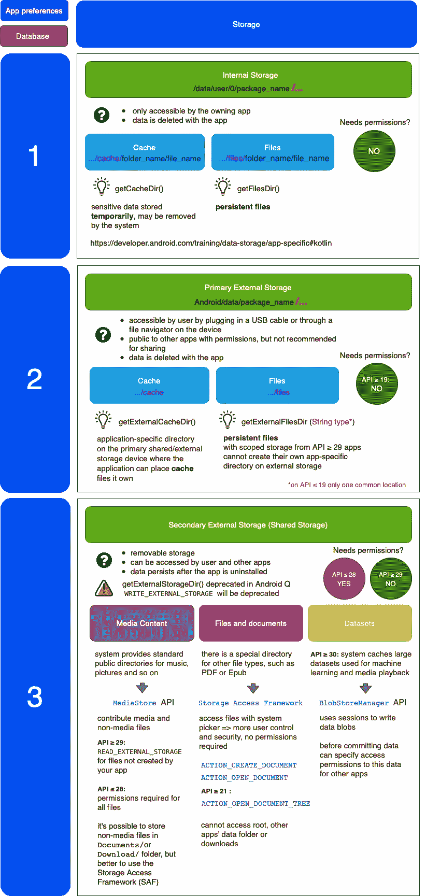

# 存储路线图:瞄准 Android 30

> 原文：<https://levelup.gitconnected.com/storage-roadmap-targeting-android-30-73927be58804>

## 献给所有拖延的 Android 开发人员，他们在瞄准 SDK 30 之前几乎没有时间迁移存储

我一直觉得 Android 上众多的存储选项非常复杂。随着 Android Q 上 getExternalStorageDir()的最新弃用，它只会变得更加混乱。这就是为什么我想从 Android Q 开始为 Android 开发者提供一个可视的存储位置概览。

为你的应用选择合适的存储位置。[安德里亚·利昂](https://unsplash.com/@reskual?utm_source=unsplash&utm_medium=referral&utm_content=creditCopyText)在 [Unsplash](https://unsplash.com/s/photos/species?utm_source=unsplash&utm_medium=referral&utm_content=creditCopyText) 上拍照

通常，存储数据有三种选择:

*   应用偏好
*   数据库(SQLite、房间、领域)
*   储存；储备

最后一个是我们最感兴趣的。可以从以下方面来看:

1.  内存储器
2.  主外部存储器
3.  辅助外部存储器

随着 Android target SDK 30 的临近，你必须决定你的应用程序的目的是什么，以及哪种存储最适合你的需求。**下面的信息图将帮助你做出决定。**

大多数不得不处理遗留代码的 Android 开发人员可能都遇到过*getexternalstreatirectory()*请求，这些请求需要直接访问外部设备存储。一旦你的应用程序开始针对 Android SDK 30，修改后的用户隐私将不再允许这一点。如果您的目标是较低的 SDK，您仍然可以在清单中使用*requestlegacyexternalstarge*标志，但随着 Android 12 将于夏末发布，这种解决方法很快就会到期。

因此，您必须决定:是否可以将所有内容都移到主外部存储，并用 *getExternalFilesDir()替换所有的*getexternalstrauredirectory()*调用。*也许是时候对您的存储给予更多考虑，并决定哪些文件和图像需要保留在用户的设备上，哪些可以缓存？或者，用户根本不需要访问你的应用程序的文件，你可以将所有内容存储在内部应用程序的存储中，而不被任何人看到？

虽然所有这些都是可能的选择，如果选择正确，将使你的应用程序更可持续，但更合理的情况是，你仍然必须使用共享存储，以便数据在你的应用程序卸载后仍然存在，并且还可以被其他应用程序访问。然后你将需要使用更复杂的替代方案，比如 **MediaStore、存储访问框架(SAF)** 或者，如果你对机器学习感兴趣的话——**BlobStorageManager**。这些选项将要求您处理比简单选项多一点的权限，但也会让您在处理数据时更加灵活。

现在，记住所有这些信息，选择最适合您的目的的存储选项，并在为时已晚之前重构所有这些*getexternalstrauredirectory()*调用！