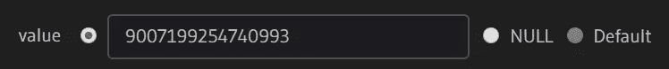
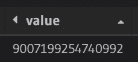

# 在 Postgres 和 Hasura 中存储和查询货币值

> 原文：<https://levelup.gitconnected.com/storing-and-querying-monetary-data-in-postgres-and-hasura-c0d2cdc2a560>

## PostgreSQL 中财务信息应该使用和不应该使用的数据类型，以及 JavaScript 和 Hasura 特有的风险。

无论你在做什么，将来你都有一个很好的机会将这个项目货币化。

随着货币化，存储和操纵金融数据的许多挑战也随之而来。

下面，我将讨论 Postgres 中货币信息应该使用和不应该使用的数据类型。然后我将讨论在 JavaScript 和 [Hasura](https://hasura.io/) 中使用这些类型时的额外考虑。

# PostgreSQL 中的货币类型

## ⚠实数/双精度(浮点)

*用于存储可变精度的近似值。*

许多初级开发人员无意中选择的存储金融交易的类型是浮点型。

毕竟，在包括 JavaScript 在内的普通语言中，Float 是数字的默认类型，对于 4.99 美元的商品，键入 *const price = 4.99* 具有直观的意义。

问题是，[浮点运算并不是 100%准确](https://0.30000000000000004.com/)。

例如，尝试运行下面的 JavaScript 代码:

或者 Postgres 中类似的脚本:

这种不精确会导致大规模的财务损失。因此，**货币数据永远不应该存储为 Float** ，一般应该避免使用类型。

## 数字/小数

*用于存储精确值，实际上没有限制，用户特定的精度(小数点前最多 131072 位；小数点后最多 16383 位)。*

为了解决浮点精度问题，Postgres 提供了数字类型及其别名 Decimal。这些类型可以存储非常多位数的数字，并且还可以精确地执行计算。

让我们重新运行前面的 SQL 循环，用 Numeric 类型代替 Float 类型:

如果您只处理美元和小于 10 亿美元的金额，Numeric(12，2)应该可以提供足够的精度。

如果您要在多种货币之间进行转换，或者处理以分数计价的商品(如汽油)，请使用较大的数字(18，8)。

## 金钱

*用于存储固定小数精度的货币金额。*

与 MySQL 不同，Postgres 还提供了一种专用的货币类型，以固定的小数精度存储货币金额。

输入可以采用多种形式，包括整数、浮点数，甚至是字符串，如“$20.00”。输出也会自动格式化为货币值:

小数精度和货币符号都由数据库或环境 *LC_MONETARY* 设置决定。

这意味着您不能同时操作$和，如果您处理多种货币，那么不鼓励使用货币类型。

注意，货币值除以整数是通过将小数部分向零截断来执行的。

为了得到一个舍入的结果，在除法之前将货币值转换成数字，然后再转换回货币。

> 如果高性能对您的用例很重要，那么对货币类型值的操作要比对数字或整数的操作慢。

## 整数/整数

*用于存储不含小数的值，在* -2147483648 和+2147483647 *之间。*

为了避免浮点精度问题，处理货币值的一种常见方法，特别是在 JavaScript 中，是使用正整数值来表示以最小货币单位收费的金额。

整数的除法和小数的乘法仍然可能导致不精确的值，但是比较和基本的整数加法、减法和乘法将是精确的。

如果您曾经使用过 Stripe，那么您应该已经熟悉了这种模式。Stripe API 返回$1.00 作为 100(美分)，100 作为 100(因为日元是零十进制货币)。

请注意，Postgres 中的最大安全整数是 2，147，483，647。

这意味着您只能使用整数来存储大约 20 亿美分，或 2000 万美元。

如果您需要处理一美分的小数部分，例如货币兑换、汽油价格、广告展示或 API 费用，您将需要使用整数微美元($0.000001)来代替。

这使我们的最大储值仅为 2147 美元。

> 如果高性能对您的用例很重要，那么对整数的操作要比对货币、数字和字符串的操作快。

## BigInt

*用于存储不含小数的值，在* -9223372036854775808 和+9223372036854775807 之间

如果一个整数的最大值刚好超过 2000 万美元，Stripe 每天怎么处理几十亿？

输入 BigInt，这是一种可以存储高达千万亿分或千万亿美元的值的类型！

即使您决定将值存储为微美元，BigInt 也能为您提供超过一万亿美元的数据。

注意，直到最近，JavaScript 还不支持 [BigInt](https://developer.mozilla.org/en-US/docs/Web/JavaScript/Reference/Global_Objects/BigInt) ，ECMA-262 引入的新类型仍然需要 polyfill 才能在 Safari 浏览器(包括 iOS)中工作。

还要注意，在 BigInt 除法中，小数结果被截断，而不是四舍五入:

最后，如果在分组数据中仅超过最大整数值，请记住，在调用聚合函数之前，您总是可以将单个值转换为 BigInt:

> 如果高性能对您的用例很重要，请注意 BigInt 上的操作比 Integer 慢，但比 Money 和 Numeric 快。

# 在哈苏拉处理金钱

通读以上内容，或者 StackOverflow 和其他地方的无数争论之后，你可能已经决定用一种或另一种类型来存储你的财务数据。

也许是为了格式和易用性，或者是为了直观的精确性。

但是等等，如果你最终打算用 Hasura 和 JavaScript 来使用数据，还有几个问题要考虑！

## 对 JS 使用数字类型的风险

Numeric 可能是 Postgres 社区中最流行的货币值类型。

它足够直观，足够高效，舍入也没有问题。

然而，这意味着一旦查询数据，您将有效地在 JavaScript 中获得一个浮点。您必须记住在任何操作之前将该值乘以 100(如果处理分数美分，则乘以更多)，然后在存储最终结果之前除以 100。

对于货币类型也存在同样的问题。

## 对 JS 使用整数类型的风险

整数是 JavaScript 社区中存储货币值的最流行的选项，使用起来相当简单，但是需要记住一个主要问题。

JavaScript 中的 *MAX_SAFE_INTEGER* 是 9，007，199，254，740，991，而 Postgres 中的最大整数值只有 2，147，483，647(与 JS 中位运算的最大安全整数大小相同)。

如果您正在处理非常大或非常小的货币金额，那么您将面临超出 Postgres 中最大值的风险，而不会在 JS 代码中遇到任何错误。

为了避免这个问题，考虑使用你自己的整数极限常数，而不是依赖于*数。MAX_SAFE_INTEGER* 。

## 用 Hasura 变异和查询 BigInt 值

如果您需要在系统中处理非常大(或非常小)的值，BigInt 可能是最健壮和性能最好的解决方案。

然而，重要的是要记住，JSON 不支持这种类型，当在查询中返回时，大整数将被限制为 *MAX_SAFE_INTEGER* ！

要解决这个问题，可以使用 *- stringify-numeric-types* 标志或*HASURA _ graph QL _ STRINGIFY _ NUMERIC _ TYPES = true*环境变量来启用 Postgres 数值类型的字符串化。

启用此选项后，Hasura 将表示 BigInt(以及数字、小数等。)作为字符串，并在突变中接受相同的格式:

在 Node.js 中，你必须记住用 ES6 *BigInt()* 函数将字符串转换成安全值，如果你需要在 Safari 客户端上进行操作，使用 [BigInteger polyfill](https://github.com/peterolson/BigInteger.js) 。

最后但同样重要的是，您应该避免使用 Hasura 控制台 UI 来插入或更新任何这样大的值，因为这些值最终也会被 JavaScript 的 *MAX_SAFE_INTEGER* 所限制。

😱

## 喜欢这篇文章吗？跟我来🐦推特 [@seifip](https://twitter.com/seifip)