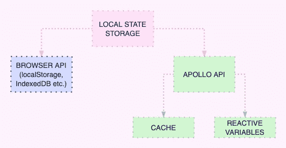
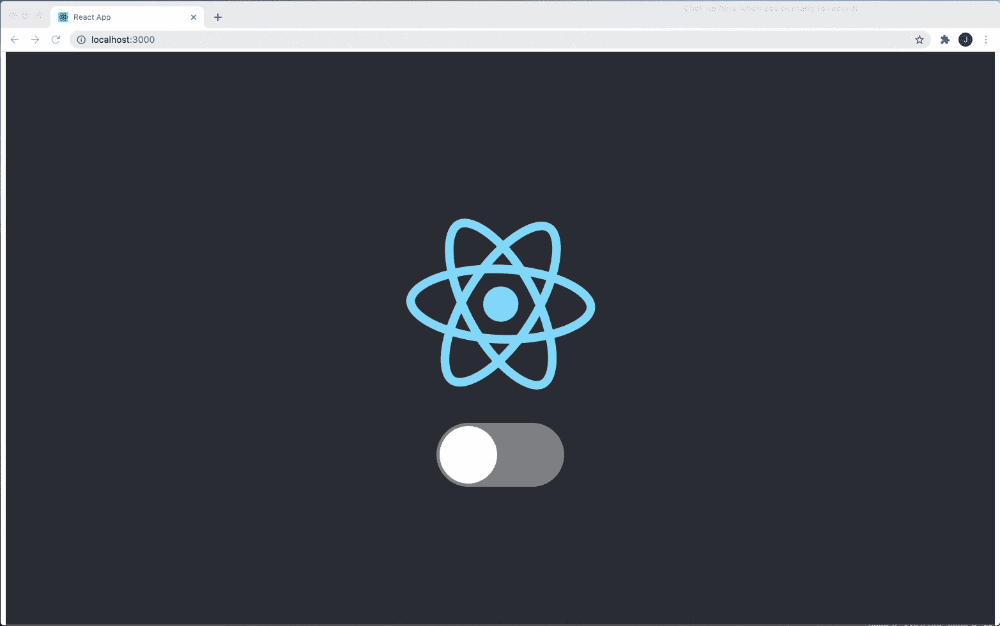
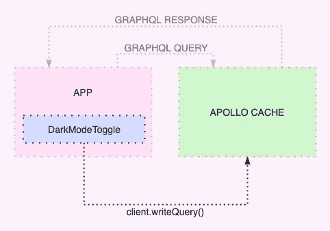
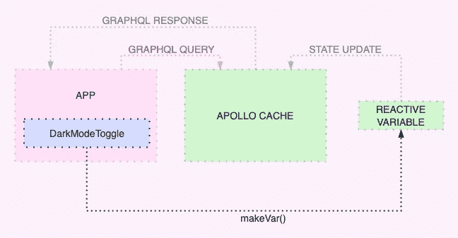

# 使用阿波罗客户端存储本地数据

> 原文：<https://levelup.gitconnected.com/storing-local-data-with-apollo-client-dffc304efdfc>


我已经使用 [Apollo Client](https://www.apollographql.com/docs/react/) 几年了，但从未尝试过将其作为一种本地状态管理工具。我喜欢这种方法，因为:

*   如果您已经使用了 GraphQL 和 Apollo Client，您就可以避免使用像 Redux 这样的额外的状态管理工具。这减少了 JavaScript 包的大小和样板代码的数量。
*   使用相同的方法来查询数据，无论它来自后端还是本地状态。

最近，我决定试一试，但对它是如何工作的知之甚少，并提出了这样的问题:

*   使用阿波罗时，当地的州具体存放在哪里？
*   为什么它和阿波罗缓存混淆了？
*   为什么查询语法用于获取数据，而不是变异语法用于更改数据？

开始时，我发现许多文章使用不推荐使用的本地解析器 API 来解释这个主题，这只会增加我的困惑。这篇文章是在我试图以正确的方式将地方政府管理工作整合起来的几天后发表的。

# 阿波罗当地状态及其存储方式

Apollo Client 是一个状态管理库，使您能够管理本地和服务器数据。谈到本地数据，它并不能使您与存储数据的方式联系起来。您可以决定是使用`localStorage`、`indexedDB`还是阿波罗提供的存储。唯一明确定义的是如何查询数据:本地和服务器数据都应该使用单一的 GraphQL API。换句话说，要获得当地的州数据，你需要使用`[Query](https://www.apollographql.com/docs/react/data/queries/)`。



阿波罗为您提供了内置的存储机制，如阿波罗`InMemoryCache`和反应变量。
我们将查看并试用两种型号。

我们将构建一个由`DarkModeToggle`控制明暗模式的应用程序。



关于暗模式的数据将由阿波罗客户端管理。在实施本地状态管理(即查询和变更本地状态)之前，我们应该:

1.  使用[创建-反应-应用](https://reactjs.org/docs/create-a-new-react-app.html)创建反应项目，
2.  安装 [graphql 和@apollo/client](https://www.apollographql.com/docs/react/get-started/) 软件包，
3.  初始化`ApolloClient`并将`App`包裹在`[ApolloProvider](https://www.apollographql.com/docs/react/api/react/hooks/#apolloprovider)`内。

```
// index.jsconst client = new ApolloClient({ cache: new InMemoryCache(),});render( <ApolloProvider client={client}> <App /> </ApolloProvider>, document.getElementById("root"));
```

# 阿波罗缓存中的本地状态

内存缓存是 Apollo 客户机的主要特性之一。它允许您将查询的数据存储在内存中，以避免在多次需要数据时不必要的网络调用。`InMemoryCache`是一个全局对象，可以在浏览器中从`window.__APOLLO_CLIENT__`开始检查。

如果 Apollo [获取策略](https://www.apollographql.com/docs/react/api/core/ApolloClient/#FetchPolicy)允许缓存，那么将服务器请求的数据存储在缓存中是秘密进行的。而像黑暗模式这样的本地数据只存在于客户端，应该从客户端在缓存中进行初始化。因此，我们需要自己将它写入缓存。



`App`组件将使用 GraphQL 查询读取状态，而`DarkModeToggle`组件——Apollo 客户端实例将写入新数据。

## 设置它:

**1。查询数据。**为了获得本地状态值，我们将使用一个简单的 GraphQL 查询，它只需要一个字段`isDarkMode`。我们使用`@client`标志告诉 Apollo 应该搜索本地数据，而不需要发出网络请求。

```
const QUERY = gql` query getDarkMode { **isDarkMode @client** }`;
```

令人惊讶的是，如果我们运行它，它并没有抛出错误，然而，返回值是`undefined`,因为在缓存对象中没有定义这样的字段。

**2。为了在本地设置初始数据**，我们需要将它写入缓存。借助于`writeQuery`方法，在缓存对象上设置初始值。`QUERY`在这种情况下与上面写的相同。

```
**cache.writeQuery**({ query: QUERY, data: { isDarkMode: true, },});
```

**3。在 GraphQL 突变的帮助下改变本地状态**不再是一件事了。它在本地解析器 API 中可用，但不推荐使用，并被认为是一个不必要的复杂层。新的 API 提供了使用客户端或缓存实例直接访问和更新本地数据的方法。为了从组件中写入数据，我们使用`client.writeQuery`。在下面的代码中，我们使用一个查询从本地状态获取`currentData`并将其更改为相反的值。

```
const { data: currentData } = useQuery(QUERY);client.writeQuery({ query: QUERY, data: { isDarkMode: !currentData.isDarkMode, },});
```

# 使用反应变量的局部状态

…还有阿波罗缓存。



反应变量是保存、检索和修改数据的容器。就数据存储位置而言，它们不依赖于 Apollo 缓存。但是，它们没有为您提供查询数据的 GraphQL API。因此，反应变量的使用与`InMemoryCache`公开的 GraphQL 接口相耦合。
“为什么不能用全局对象来代替？”你可能会问。当然可以。然而，当反应变量自动触发更新时，我们需要重新获取正在使用的 GraphQL 查询。

## 设置它:

**1。查询数据**的方式与前面场景中的[完全相同。](#c0dc)

**2。设置初始数据。**为了让 Graphql 查询工作，Apollo 缓存需要公开它。要将本地状态字段设置到缓存，应使用`typePolicies`。这个 API 允许我们定制字段，无论它们是本地的还是来自后端的。对于每个字段，您可以定义 2 个功能:`read()`和`merge()`。第一个在读取缓存时截取数据，即查询数据。第二种是写入数据时，即发生突变时。换句话说，它使我们能够控制当我们请求数据时从缓存返回的数据，以及当我们更改数据时保存到缓存的数据。在我们的场景中，我们需要指定在读取时返回哪个值。首先，它可以是静态的，如下例所示。

```
// ./cache.jsexport const cache = new InMemoryCache({
  typePolicies: {
    Query: {
      fields: {
        isDarkMode: {
          **read() {
            return false;
          },**
        },
      },
    },
  },
});
```

经过这些变化，当我们查询数据时，它不再是`undefined`。我们得到值`false`，然而，它将一直是相同的，但是它需要是“反应性的”。
使用`makeVar`方法创建一个反应变量。下面我们用初始值`false`创建了`isDarkModeVar`。

```
// ./localStorage.jsimport { makeVar } from "@apollo/client"; **export const isDarkModeVar = makeVar(true);**
```

通过从`read()`函数返回`isDarkModeVar`，我们定义了当这个字段被查询时，从`isDarkModeVar`中获取它的值。

```
// ./cache.js**import { isDarkModeVar } from "./localStorage";**export const cache = new InMemoryCache({
  typePolicies: {
    Query: {
      fields: {
        isDarkMode: {
          read() {
            **return isDarkModeVar();**
          },
        },
      },
    },
  },
});
```

**3。变异数据。** `isDarkModeVar`可用于 app 的任何组件。我们通过调用并传递一个新值给`isDarkModeVar`方法来改变本地状态数据。这些变化会自动触发缓存更新，并且`useQuery`会返回新数据，导致组件使用新的本地状态重新呈现。

```
import { isDarkModeVar } from "./localStorage";const toggleDarkMode = () => { const current = isDarkModeVar(); **isDarkModeVar(!current);** };// ...<input type="checkbox" onChange={toggleDarkMode} />
```

在这两种情况下，重新加载页面都会导致数据丢失，因为缓存只保存在当前窗口范围内。Apollo 为我们提供了 [apollo-cache-persist](https://github.com/apollographql/apollo-cache-persist) 库，它通过将数据保存到`window.localStorage`来处理这个问题。

# 总结

关键的经验是:

*   如果您已经使用了 Graphql 和 Apollo Client，那么无论数据是来自后端还是本地状态，您都可以从单一的数据查询方法中受益。
*   使用 Apollo 客户机可以在很多地方存储本地状态。[反应变量 API](https://www.apollographql.com/docs/react/local-state/reactive-variables/) 是一个需要最少代码的选项，更容易学习、使用和调试。
*   您不需要在客户端实现用于改变本地状态的解析器，因为您需要在服务器端解决改变。不推荐使用解析器 API，而应使用 Apollo InMemoryCache 和/或反应变量。

我还没有在大规模的网络应用程序上尝试过，但是如果你有，请分享你的经验🙏

另外，你可以在这里找到一个带有反应变量实现[的示例项目。](https://github.com/imeugenia/local-state-mngmt-with-apollo)