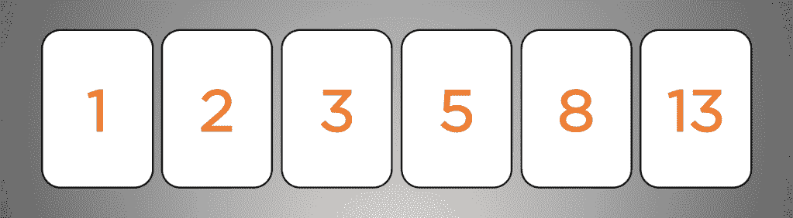

# 故事估计:另一种尺度

> 原文：<https://levelup.gitconnected.com/story-estimation-an-alternative-scale-bb63145b82bb>

如果你在你的公司从事敏捷开发，那么你可能会遇到对故事使用什么评估尺度的争论。我用过几种不同的秤，有一种是我最喜欢的。

无论它被称为冲刺计划、迭代计划还是仅仅是我们用手指数的会议，在敏捷仪式中都有一些会议被用来评估和同意要做的工作。这些估计通常基于**风险**、**复杂性**和**时间**。如果你的团队中有各种各样的人才，时间可能会变得棘手，你可能会问这样的问题:“如果杰西接了这个故事，那么它将在一天内完成。但是如果我把它捡起来，那就要花我一个星期的时间”。这就是为什么您需要使用*相对时间*进行估计，并与您之前完成的工作进行比较。如果一个简单的故事花了我大约半个星期，但是这个故事花了我一个星期，那么它大概是两倍大。

以下是我个人用来评估的尺度。

# **不同尺度**

**t 恤尺码(0，1，2，3)**

在这个比例中，你有 4 个桶，每个都比第一个稍大一些。零通常是一个配置变化或 CSS 的小调整，产品所有者或产品经理仍然会审查，但不是非常耗时或有风险的事情。一个是你的典型故事，如果它是一个 web 应用程序，你可能会做一个完整的垂直切片。因此，前端发生了变化，新的或更新的后端 API 端点，可能还有一些与持久层(如数据库或缓存)的交互。二是两倍的风险、复杂性和时间，并且通常有一些未知因素。然后三是一个大的努力或工作，应该乐观地分解成更小的故事。有时，三点故事不能被分解，尤其是当它是一个绿色领域应用程序的第一个故事，并且您也想要设置 CI/CD 管道时。

**不利方面**

一个两三点的故事听起来并不庞大，但在现实中，你谈论的是几周或更长时间的差异来传递这个故事。我见过一些开发人员，他们在评估时屈从于大多数人的投票，而不讨论为什么他们认为这个故事需要更多的努力或者更复杂。进行这些对话是规划会议最重要的方面之一，它将从团队的不同角度揭示复杂性或未知因素。不要让你的产品经理或其他团队成员跳过或匆忙进行这些对话，找到复杂性的根源，但如果可能的话，不要太深入技术细节。

**斐波纳契大小(0，1，2，3，5，8，13)**

许多 scrum 团队立刻使用斐波纳契标度，或者这是一些积压管理工具的默认配置。这从同样的 t 恤尺码开始，但是增加了 2 或 3 个号码。一些团队停在 8，但其他人一直到 13。我还没有看到一个真正的 13 点故事存在，所以在实践中，这似乎是一个理论上的最大值。拥有更多的数字意味着允许团队在他们的评估中更加细化，而不是在一个 3 点的故事中限制一切。

**不利方面**

在斐波纳契数列中有许多*和*数字需要记忆，对于新团队成员来说，记住符合不同规模的故事可能会令人困惑。拥有*如此*多的选择意味着允许团队有能力进行适当的评估，但在我看来，这忽略了评估和试图将工作分解成更小的可交付价值或实验的要点。估计一个故事 5 或 8，并期待一个月或两个月的工作没有太多的反馈感觉太长了，但我肯定是有偏见的。工作量越大，就越难准确估计，额外的工作量也就越多。

> 这个故事已经是一个 8，还不如现在就做那个大的重构

对大故事保持警惕，尽可能地将它们分解。

**我的首选音阶**

**0，1，3，7**

多年前，我在 Pivotal 工作时，从另一个团队那里第一次了解到这种规模。当我有机会向一个正在组建的新团队提出这个建议时，我表示支持，这样我们就可以一起试验了。结果比我预期的还要好。围绕故事拆分的积极讨论经常发生，故事规模是推动更多此类对话的不可或缺的因素。

*   0

就像我上面提到的，这是最低估计值，在交付生产之前，需要 QA 或产品负责人审查或接受。属于这一类别的典型案例是 CSS 更新或配置更改。大多数情况下，这项工作最多在几个小时内完成，如果一个零点的故事需要一天以上的时间，你应该向那个人汇报。

*   1

这是您的默认故事大小，包括您的应用程序的标准工作单元。开发 API？也许这是更新一个端点，添加集成测试，更新对数据库的 SQL 查询以获取数据。一般来说，如果工作通常是这样组织的，那么就要尽可能接近应用程序的完整垂直部分。

*   3

这是该量表与其他量表不同的地方，在我看来，它比其他量表更有助于推动对话。三是 ***两倍于*** 一，这个拐点是团队成员在评估工作时考虑的(有时是无意识的)。我曾不止一次地让有经验的团队成员大声说“我认为这应该是两个，但我不能这样估计”。猜猜你怎么得到一个两点的故事？将故事分解成*两个*一点的故事。这项活动锻炼了分解故事的肌肉，以获得更快的反馈，并让团队参与寻找功能垂直切片的接缝。

*   7

然而，7 比 3 多一倍，这也引发了关于故事分割和分解工作的讨论。偶尔你会得到一个 7 分，尤其是在建立一个全新的应用程序时，但总是想办法把工作分解。当一个队员掷出一个 7 时，你肯定能看到，并且不会弄错两只手的估计和一只三指朝上的手。

**不利方面**

这种规模有较少的选项，可以被视为一个缺点，尤其是那些在斐波纳契规模的世界舒适。如果你正在寻找更精细的估计，我个人认为你没有抓住重点，但这也是这个规模的一个缺点。

由 [Maayan Nemanov](https://unsplash.com/@poleznova?utm_source=medium&utm_medium=referral) 在 [Unsplash](https://unsplash.com?utm_source=medium&utm_medium=referral) 上拍摄的照片

**结论**

真正的目标不是使用一种或另一种尺度，而是推动对话，发现未知，并就要完成的工作达成一致。评估只能做到如此精确，如果有办法在发现复杂性后将大的故事分解或分解成可以稍后完成的工作，那么就尽早并经常这样做。希望这能为你提供另一种尺度，帮助你更有效地推动这些对话和讨论。如果你对另一种尺度或我提到的尺度有不同的体验，我很乐意在评论中听到它们！

如果你喜欢这篇文章，考虑[订阅 Medium](https://medium.com/@ascourter/membership) ！

如果你或你的公司有兴趣找人进行技术面试，那么请在 Twitter ( [@Exosyphon](http://twitter.com/Exosyphon) )上给我发 DM，或者访问我的[网站](https://andrewcourter.com/)。如果你喜欢这样的话题，那么你可能也会喜欢我的 [Youtube 频道](https://www.youtube.com/channel/UCx3Vist13GWLzRPvhUxQ3Jg)。如果你想支持更多像这样的内容 [buymeacoffee](https://www.buymeacoffee.com/andrewcourter) 。祝您愉快！

# 分级编码

感谢您成为我们社区的一员！更多内容见[升级编码出版物](https://levelup.gitconnected.com/)。
跟随:[推特](https://twitter.com/gitconnected)，[领英](https://www.linkedin.com/company/gitconnected)，[通迅](https://newsletter.levelup.dev/)
**升一级正在改造理工大招聘➡️** [**加入我们的人才集体**](https://jobs.levelup.dev/talent/welcome?referral=true)