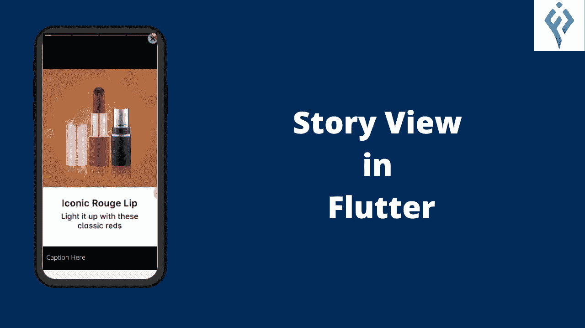
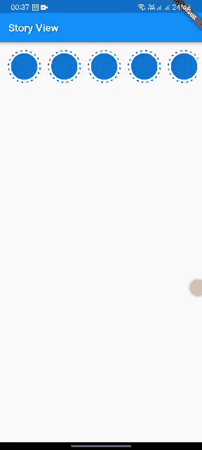

# 颤振中的故事观

> 原文：<https://levelup.gitconnected.com/story-view-in-flutter-d828c2ca9ee8>

故事视图是当今脸书、Instagram、Snapchat 等社交媒体的显著特征之一。这篇文章将教我们如何在未来建立故事视图。



颤振中的故事观

我们的最终应用程序将如下工作:



正如我们所看到的，我们将有故事的列表，当点击项目时，我们有我们的故事视图。

## 文章视图的属性:

*   **控制器**:用于控制故事的回放。
*   **storyItems** :显示的是页面或项目。此属性不能为空。
*   **progressPosition** :该属性用于对齐故事的进度指示器。
*   **onComplete:** 当故事的完整循环展现时调用。每次将`repeat`属性设置为 true 时都会调用它。
*   **onStoryShow** :用于在故事播放时回调流程。
*   **onVerticalSwipeComplete**:用于检测到滑动手势时回调。不想听手势可以忽略。

## **故事视图的特点:**

*   每个故事项目的标题
*   支持 gif、图像和视频
*   上一个、下一个和暂停的手势。
*   每个故事项目的动画进度指示器。

# 让我们开始吧

为了在 Flutter 中实现故事视图，我们需要两个依赖项。首先，在`pubsec.yaml`文件中添加这些依赖关系 [story_view](https://pub.dev/packages/story_view') 和[虚线 _circle](https://pub.dev/packages/dashed_circle) 。

```
dependencies:
  story_view: ^0.13.2
  dashed_circle: ^0.0.2
```

现在，在`lib`文件夹中创建一个`homepage.dart`文件。我们将使用动画控制器，所以我们需要调用`TickerProviderStateMixin`。

我们在主页上创建变量。

```
 late Animation<double> gap; //gap between the dashed
  late Animation<double> base; //the point of anima
  late Animation<double> reverse; //to reverse the animation
  late AnimationController controller; // the controller
```

我们需要在主页的`initState` 中初始化动画控制器。

```
[@override](http://twitter.com/override)
  initState() {
    super.initState();controller =
        AnimationController(vsync: this, duration: const Duration(seconds: 10));base = CurvedAnimation(parent: controller, curve: Curves.easeOut);reverse = Tween<double>(begin: 0.0, end: -1.0).animate(base);gap = Tween<double>(begin: 15.0, end: 0.0).animate(base)
      ..addListener(() {
        setState(() {});
      });controller.forward();
  }
```

> vsync: this :我们将它传递给动画控制器，在使用这个 mixin 的类中创建一个动画控制器
> 
> 如果我们不需要线性动画，我们就使用它。它为动物提供了曲线。当我们需要在动画向前和向后移动时有不同的曲线时，它是专门使用的。
> 
> **补间**:提供起始值和结束值之间的线性插值。
> 
> **..addListener():** 这两点 syantx 定义了使用来自`animate`的返回值调用`addListener()`方法。

我们根据这些变量的值制作虚线动画。为了制作窗口小部件的动画，我们使用了窗口小部件`RotationTransition`。它负责制作小部件旋转的动画。

当点击项目时，我们从主页传递一些值，这些值是**索引**和**图片数组**到 **StoryViewPage** 。

```
Navigator.push(context, MaterialPageRoute(builder: (_) {
  return StoryViewPage(index: index, model: model); }));
```

然后点击以上项目的列表，我们显示故事视图。为此，创建名为`story_view_page.dart`的新文件。

在这里，我们将故事视图创建为:

# 让我们连接起来

我们可以成为朋友。在[脸书](https://www.facebook.com/nabin.dhakal.714/)、 [Linkedin](https://www.linkedin.com/in/nabindhakal/) 、 [Github](https://github.com/nbnD) 、 [Youtube](https://www.youtube.com/channel/UCW6oYt_3QSl7J2HSHNqwXWw) 和 [Instagram](https://www.instagram.com/nbn_d_/) 上查找。

# 结论

希望这篇文章对你有所帮助，让你学到新的东西。我在这篇文章中使用了一些对你们中的一些人来说可能是新的东西。

如果你学到了新的东西或者想提出一些建议，请在评论中告诉我。

如果你喜欢这篇文章，请点击👏图标，它为您提供了传递所有新事物的动力。

此外，关注令人兴奋的文章和项目的更新。

通过分享学习对学习过程产生了巨大的影响，并使社区越来越大。

分享是吸引其他爱好者的磁石。

因此，让我们朝着扩大我们的学习社区迈出一小步。

与你的朋友分享这篇文章，或者如果你喜欢这篇文章，就在推特上发表评论。

[](https://www.buymeacoffee.com/nabindhakal)

颤振中的故事观

# 完整代码:

[](https://github.com/nbnD/story_view_futter) [## GitHub - nbnD/story_view_futter:颤振中的故事视图

### 一个新的颤振项目。这个项目是颤振应用的起点。一些帮助您入门的资源…

github.com](https://github.com/nbnD/story_view_futter) 

# 分级编码

感谢您成为我们社区的一员！在你离开之前:

*   👏为故事鼓掌，跟着作者走👉
*   📰查看[升级编码出版物](https://levelup.gitconnected.com/?utm_source=pub&utm_medium=post)中的更多内容
*   🔔关注我们:[Twitter](https://twitter.com/gitconnected)|[LinkedIn](https://www.linkedin.com/company/gitconnected)|[时事通讯](https://newsletter.levelup.dev)

🚀👉 [**加入升级人才集体，找到一份神奇的工作**](https://jobs.levelup.dev/talent/welcome?referral=true)