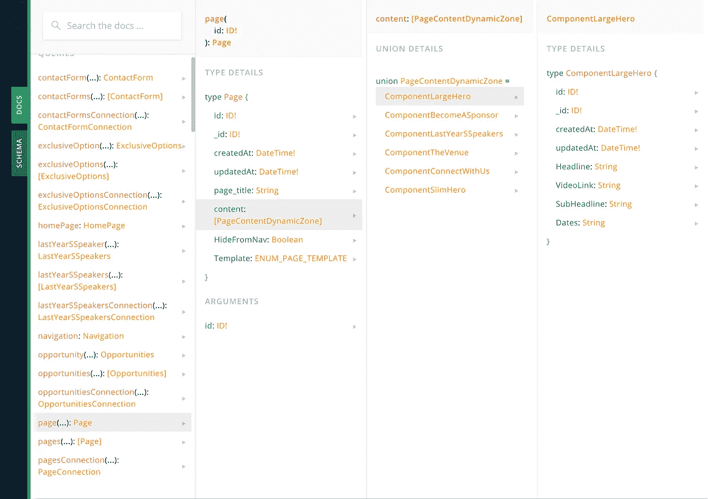
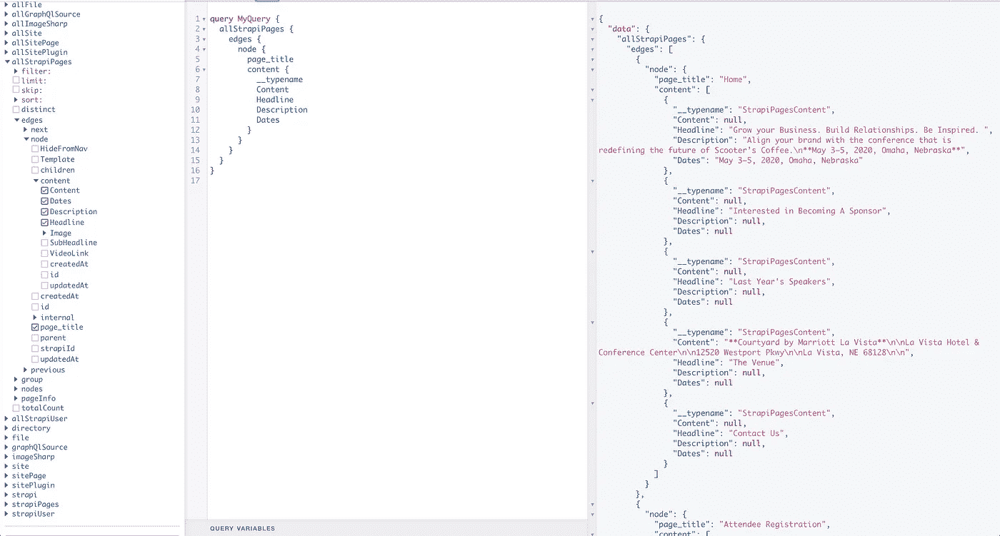
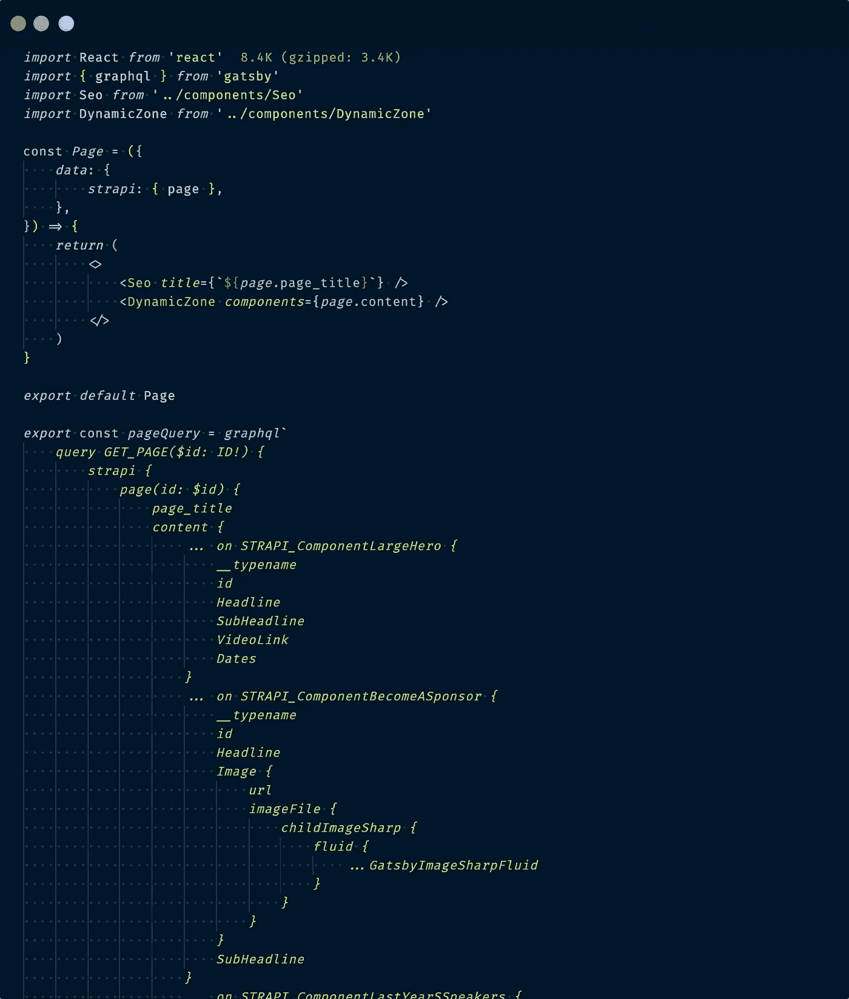
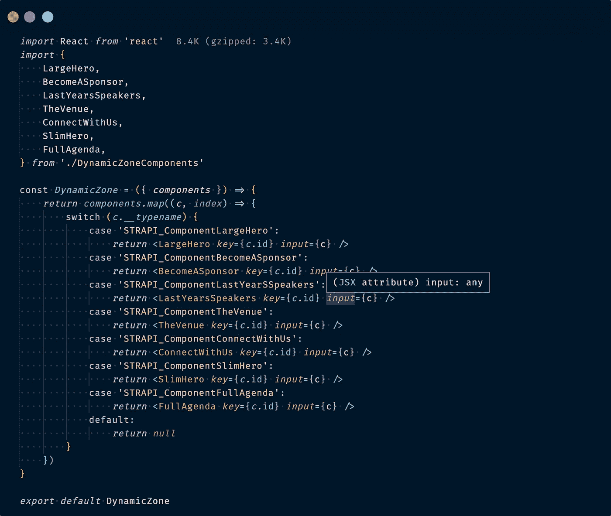

# Strapi 动态区域和 Gatbsy-Image

> 原文：<https://levelup.gitconnected.com/strapi-dynamic-zone-and-gatbsy-image-6f29b6bb0f0>

## 运用盖茨比形象时利用斯特拉皮的动态范围

# 设置

我最近在做一个项目，在这个项目中，我使用 Strapi 为 CMS 和 Gatsby 构建前端。如果你不知道，Strapi 是一个开源的无头 CMS，具有完全可定制的 api。它真的很容易使用，虽然我认为有一些功能需要实现/工作，我会向任何人推荐它。Strapi 团队似乎正朝着正确的方向前进。

在 Strapi Admin 中构建了一些内容类型和组件后，我使用 Strapi 的 GraphQL playground 检查文档，发现“动态区域”是一个联合，每个组件都有自己的类型，其中包含可用的数据。这正是我所希望的。

这将允许我使用 GraphQL 片段作为查询的一部分，这样，如果组件被添加到页面中，我就可以有条件地呈现它们。以下是我在斯特拉皮游乐场看到的:

有一点需要注意——也是我写这篇文章的部分原因——我完全计划将 Strapi 媒体文件变成我的 Gatsby 应用程序中的静态文件，这样我就可以使用`[gatsby-image](https://www.gatsbyjs.org/packages/gatsby-image/)`插件进行转换和优化。

# 第一次尝试:

我首先想到的是使用`gatsby-source-strapi`插件，因为这是 Strapi 团队的官方插件。虽然这个插件允许我利用转换后的图像，并按照我的意愿使用`gatsby-image`，但它没有以我可以使用的方式返回动态区域中的组件。看一看:

如您所见，组件不是片段，每个组件的每个字段都显示在所有组件中。这不是一个真正干净的处理数据的方法，所以继续尝试第二种方法。

# 第二次尝试:

对于我的第二次尝试，我决定使用`gatsby-source-graphql`插件来获取数据。乍一看，这是我需要的。数据正如我所料被返回了——和它在 Strapi GraphQL 操场上的样子一样——但是图像没有被转换，所以我没有办法在`gatsby-image`中使用它们。在我看来是个真正的失败者。

那现在怎么办？！

经过一些搜索和阅读，我决定看看是否可以修改一些我在 Henrik Wirth 这里找到的代码。在`gatsby-node.js`文件中:

[createRemoteFileNode](https://www.gatsbyjs.org/packages/gatsby-source-filesystem/#createremotefilenode) 让您能够获取远程文件并自动将它们添加到您的模式中。

正在发生的事情的明细:

*   这将取决于你如何设置你的`gatsby-source-graphql`配置。它从你定义的`typeName`开始，在我这里是`STRAPI`。`UploadFile`是 Strapi 用于媒体文件的`type`
*   `imageFile`:将是您可以查询的类型
*   `type: ‘File’`:这将添加媒体项作为文件，这将允许我们使用`gatsby-image`

# 终于！

有了这些，我终于可以完成我想做的事情了。如果你感兴趣，我的设置如下。下面是我的`Page.js`模板和部分页面查询:

> 需要注意的一点是，在你的查询中一定要包含 url，否则就没用了，因为解析器会错过这些数据。

在我的页面模板中，我将内容传递给了`DynamicZone`组件。该组件接受页面上使用的所有组件，并根据`__typename`有条件地呈现正确的组件。它看起来是这样的:

就是这样！现在我可以在查询中使用片段，并利用`gatsby-image`。我希望这能帮助其他遇到同样问题的人。

我希望在不久的将来写更多关于这个项目的内容。具体来说，我们如何使用 Gatsby 为大多数页面创建预生成的站点，但实现了 Apollo 客户端的动态功能，如:

*   允许用户创建帐户并注册参加会议
*   允许赞助商创建一个帐户，选择他们的赞助商级别和其他细节，并上传他们的徽标等
*   检查用户之前是否已经登录，如果已经登录，获取用户资料并用特定信息更新应用程序