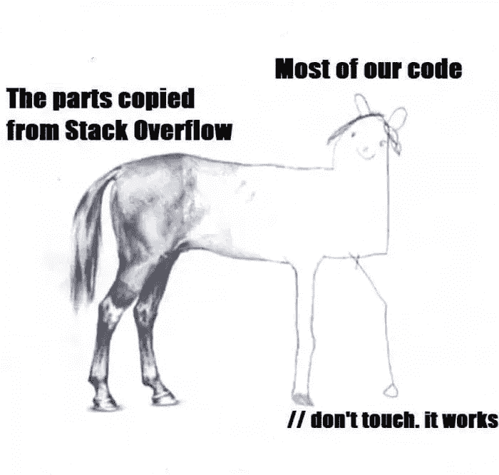

# 战略编程和战术编程哪个更好

> 原文：<https://levelup.gitconnected.com/strategic-vs-tactical-programming-and-which-is-better-b89934504822>

## 深入研究这些编程思维模式，并将其应用到软件开发过程中

在 [Unsplash](https://unsplash.com?utm_source=medium&utm_medium=referral) 上由 [Max Duzij](https://unsplash.com/@max_duz?utm_source=medium&utm_medium=referral) 拍照

最近在阅读约翰·奥特的《T4 软件设计哲学》时，我偶然发现了战略和战术编程的想法。两者都可谓是在接近和编写代码时的一种心态。

这篇文章中描述的观点 100%归功于约翰·奥斯特胡特和他的书，但我只是想分享我的想法并详细阐述他的观点。我认为这真的可以帮助很多人，尤其是那些在软件工程领域开始职业生涯的人。

战术思维专注于开发速度，而战略方法更耗时，但从长远来看会产生更好的结果，甚至可能比战术方法花费更少。让我们详细看看每一个。

## 战术规划

你是否专注于构建一个需要在下个月投入生产的特性？你正在处理需要尽快解决的关键错误吗？或者，也许你正在优化或自动化某些任务，可以节省您公司的时间和金钱。

当做以上任何一件事时，你的主要焦点是完成它，并确保它满足所有的用户需求，并通过所有的测试用例。你不想成为给其他团队成员制造障碍或者拖他们后腿的人。

这是战术规划，这是我们大多数人日常运作的方式。

没毛病。这种思维方式很有效，并且长期以来一直在提供结果。但这里的问题是，我们的目标是有时间限制的。我们正在争分夺秒地尽快完成任务，没有留出思考大局的余地。

很少考虑设计模式、代码的整体结构或当前实现对未来的影响，尤其是当其他人试图进行改进时。

[https://devrant . com/rants/2341310/always-works-on-my-machine](https://devrant.com/rants/2341310/always-works-on-my-machine)

一个没有正确命名的变量，硬编码一些值或者从一个模块中调用另一个函数看起来没问题。这确实增加了一点复杂性，但是你总是可以添加一个注释来解释你为什么以某种方式做某事。最重要的是，你的代码似乎工作，所以没什么大不了的。

但是每个人都是这么想的。每个人都在给代码库增加一点复杂性。在你知道之前，你开始有问题和矛盾。

> 复杂性化合物。

但是当问题开始出现的时候，你已经继续前进，并忙于下一个功能。为了解决当前的问题，你选择了一条捷径。你只想让它工作并关闭 bug。这在短期内看起来很小，但随着时间的推移，它会越积越多。

你可以看到这是如何慢慢导致恶性循环的，并且很难改变。

在书中，作者还描述了一个被他称为*战术旋风*的开发人员。这是团队中最快的人，他似乎能够不断地写出代码。但是他们留下了破坏的痕迹，其他工程师将来可能不得不去清理。

既然您已经对编程的战术风格有了一个概念，让我们来探讨一下战略风格。

## 战略规划

与战术编程相反，战略编程的主要目标不是尽快写出可以工作的代码。在战略规划中，重点更多地放在系统的长期结构和促进未来的增强。

这种编程方式更加面向设计。这个想法是产生可持续的代码，即使它需要更多的时间。这可能意味着主动思考所有可能发生的边缘情况，更清楚地命名变量，创建更多的抽象，遵循 DRY 原则，添加纯函数，编写大量的测试案例和文档，遵循类型规则，遵循一致的设计模式，考虑替代解决方案等…

这需要更多的努力，更多的时间，而且你肯定会发现与你手头的任务相关或无关的其他问题。因此，战略规划需要一种投资心态。你在短期内付出的额外努力将在长期内得到回报。

主动寻找代码味道并修复问题，而不是修补它们，随着时间的推移，就像糟糕的决策一样。所有这些都将导致更健壮、设计更好的系统，这些系统可以用一个代码库来扩展或缩放，使未来的开发人员的编程体验更加愉快。

https://www.testbytes.net/blog/programming-memes/

开始一个新项目并写出代码要比通读代码并进行维护容易得多。战略性编程方式也有助于减少阅读和理解代码所需的认知努力。好的代码应该自我解释。

## 所以总是用战略思维来编程吗？

号码

对一些人来说，战略性编程可能是生产力杀手，几乎类似于拖延症——你花了大部分时间试图找到完美的设计或结构，结果完成得很少。没有什么是完美的。此外，公司会给员工设定最后期限，因为他们需要完成工作，甚至可能鼓励战术风格。

如果你总是有策略地编程，你完成工作的速度可能会快 20%,但是随着时间的推移，你的开发速度会因为糟糕的设计和引入的复杂性而变慢。

如果你总是战略性地编程，你将不能按时完成任何事情。在创业公司这样速度至关重要的环境中，这绝对不是一个选项。

这里的关键是找到一个平衡，这并不容易。这个想法是在编程时遵循战术和战略思维，并以一种提高整体生产力和确保良好设计的方式应用它们——两全其美。

这本书的作者建议把我们的时间分成两种心态。

## 两全其美

80-20 法则也适用于此——80%战术规划，20%战略规划。

所以现在即使你比做战略规划前慢了 20%,从长远来看，一切都会复合，你会很快收回最初花费的所有时间。一直进行战术编程会导致问题复杂化，最终会导致公司花费更多的开发时间和成本。

花 20%的时间在战略规划上，结合良好的优先排序技巧，可以在几个月内产生显著的效果。将战略时间花在更关键的事情上，这些事情有更高的机会被延长或在未来需要优化。

[https://ahseeit.com/?QA = 10777/parts-copy-from-stack overflow-meme](https://ahseeit.com/?qa=10777/the-parts-copied-from-stackoverflow-meme)

脸书是鼓励战术规划的公司的一个例子。他们的座右铭是“快速移动，打破东西”。这帮助脸书迅速扩大规模，比竞争对手更快地推出新功能。但是随着时间的推移，他们的代码库受到了影响，以至于修复以前产生的错误减缓了他们当前的开发。

因此，脸书更新了他们的座右铭“以稳定的基础设施快速行动”，从而鼓励他们的工程师更多地关注良好的设计原则，并建立一个稳定的基础。

> 因为当你建立了一个不需要修复 10 次的东西，你可以在你已经建立的基础上继续前进——马克·扎克伯格

 [## 扎克伯格:“快速行动，打破常规”不再是脸书的经营方式

### 旧金山——如果你去年去参观脸书位于加州门洛帕克的庞大校园，你会…

www.cnet.com](https://www.cnet.com/news/zuckerberg-move-fast-and-break-things-isnt-how-we-operate-anymore) 

我对战术编程感到内疚，我一直在做这件事，直到我有了这个想法。我的重点是把事情做好。与做战术编程的时间相比，我花在考虑更大的画面和系统整体结构上的时间是微不足道的。

但我逐渐意识到，需要相信复利法则，最初投入战略规划的努力最终会得到回报。与此同时，在战略规划中不要忘乎所以是至关重要的。

我认为战术和战略编程的想法可以被认为是软件工程师的一种工具，他们可以在需要时应用。最终目标是解决问题并为公司创造价值。这些想法只是帮助优化这样做。

如果你是一名对软件架构和设计感兴趣的软件工程师，我强烈推荐你阅读约翰·奥特的《软件设计哲学》。

欢迎留下任何意见或建议，或通过电子邮件发送至 hello@adarshmenon.in。在 [Twitter](https://twitter.com/adarsh_menon_) 、 [LinkedIn](https://www.linkedin.com/in/adarsh-menon-/) 上与我联系，并查看我的 [YouTube 频道](https://youtube.com/adarshmenon)。