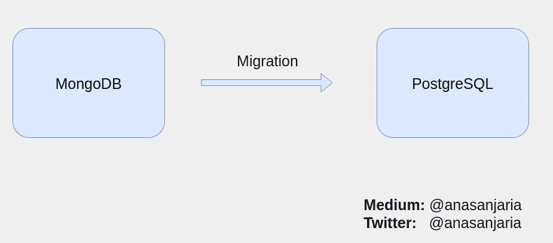
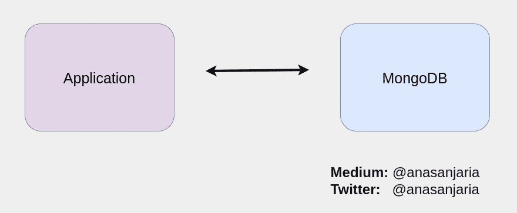
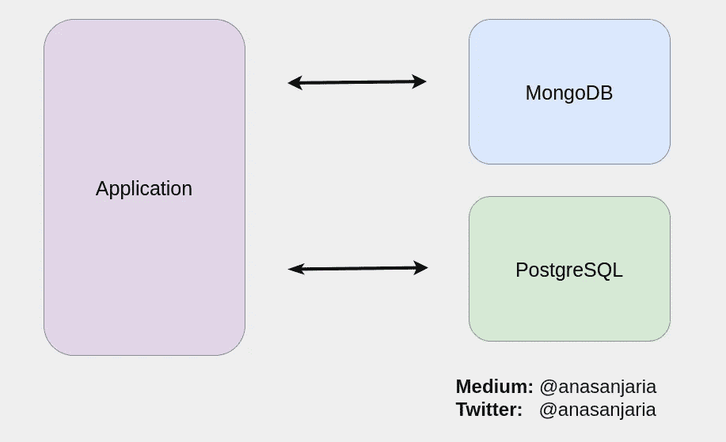
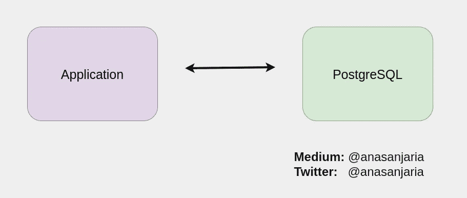
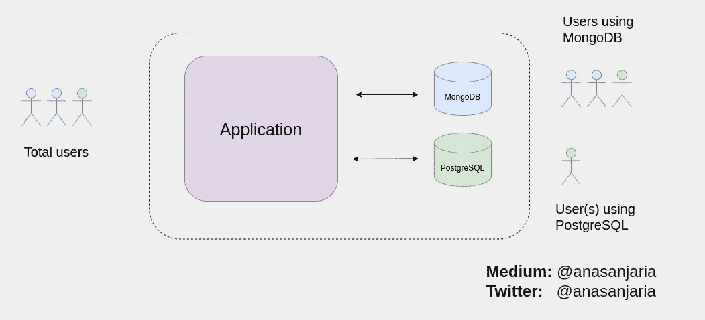
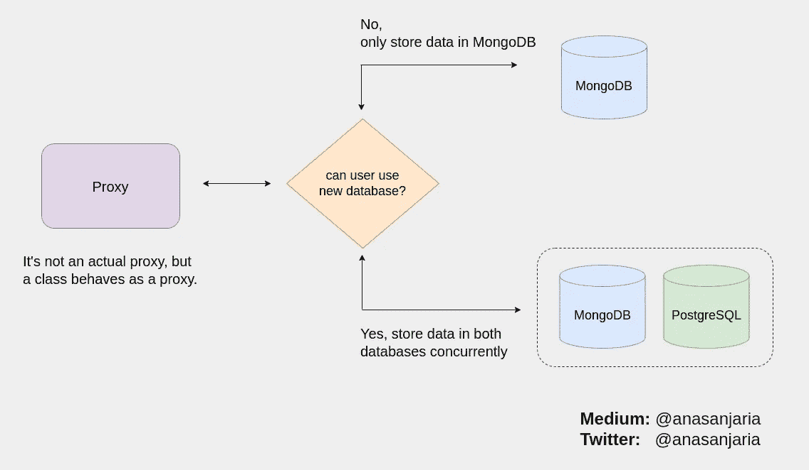
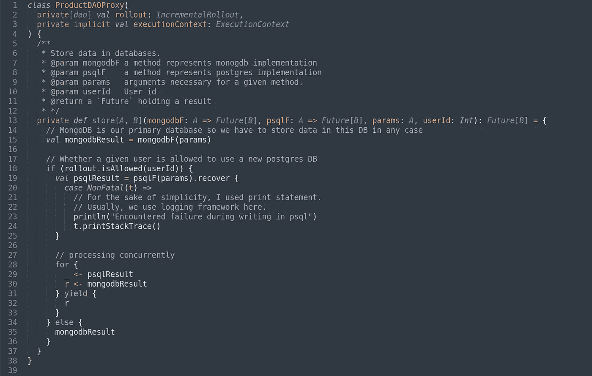
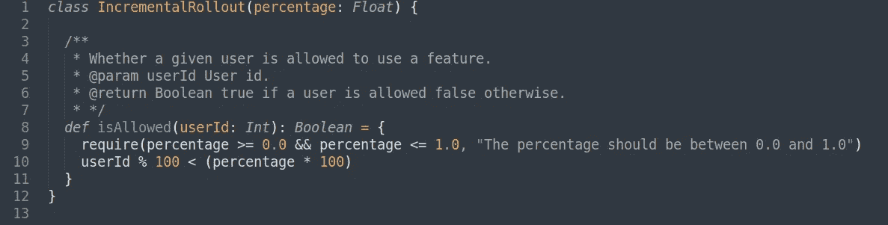
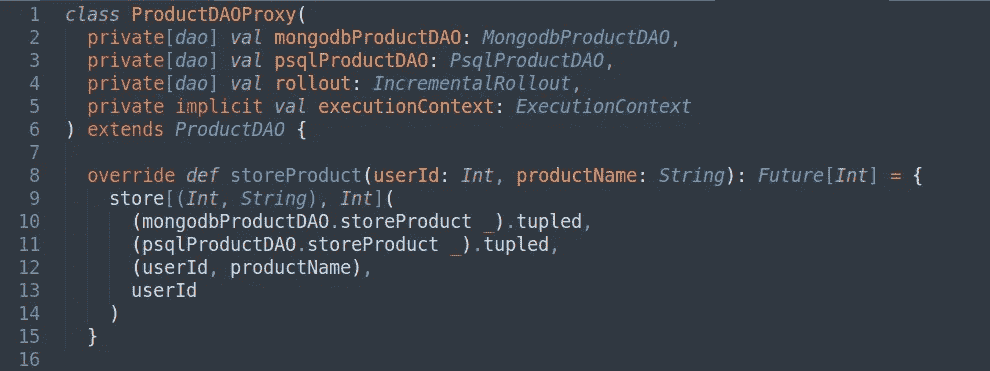

# 从一个数据库增量迁移到另一个数据库的策略

> 原文：<https://levelup.gitconnected.com/strategy-to-migrate-from-one-database-to-another-incrementally-21c3a1bcb0ff>

## [数据库](https://medium.com/@anasanjaria/list/databases-7ea27ca82ce1)

## 从 MongoDB 到 PostgreSQL 的增量部署迁移

从一个数据库迁移到另一个数据库可能有各种原因，例如，降低成本、维护开销、性能优化等。

迁移一个平稳运行的生产数据库总是具有挑战性。挑战可能包括但不限于以下内容:

*   使新数据库能够在相同的生产负载下工作。
*   具有比当前运行的生产数据库更好的性能，或者至少具有与当前运行的生产数据库一样的性能。

这篇文章旨在解释在我们的生产系统中促进迁移的策略和过程。

# 高级概述

假设我们想从`MongoDB`迁移到`PostgreSQL`。



从 MongoDB 迁移到 PostgreSQL —由作者使用 diagrams.net 创建

这意味着`MongoDB`是我们当前的主要数据库，我们的应用程序正在使用它。因此，当前的设置如下所示。



使用 MongoDB 作为主数据库的应用程序—由作者使用 diagrams.net 创建

我们将修改当前的设置，并添加 PostgreSQL 作为辅助数据库。



使用 PostgreSQL 作为辅助数据库的应用程序—由作者使用 diagrams.net 创建

一旦我们的应用程序与 PostgreSQL 兼容，我们将删除 MongoDB 数据库。



使用 PostgreSQL 作为主数据库的应用程序—由作者使用 diagrams.net 创建

# 战略和方法

策略是:

> 增量迁移数据库

这意味着我们开始为一小部分用户使用`PostgresSQL`，并观察我们系统的性能&资源利用率。



增量转出数据库使用—由作者使用 diagrams.net 创建

当它看起来不错，并按预期工作，我们将逐步增加用户的`PostgreSQL`数据库的百分比。否则，我们需要对原因进行故障诊断(将在本文的`Troubleshooting`部分讨论)。

您可能已经注意到，使用`PostgreSQL`的用户也在使用`MongoDB`。

> 这种冗余是一种设计决策。在完成迁移之前，我们不能完全依赖我们的新数据库系统。

因此，迁移过程分为三个部分:

## 1.稳定写入操作

这使我们能够在两个数据库中拥有相同的数据。

1.  逐步增加使用新数据库的用户百分比。
2.  在`PostgreSQL`方面有失败是可以的。但是不要让整个传入的 HTTP 请求和/或流程因为这个失败而失败。
3.  专注于稳定写操作。
4.  一旦写入操作稳定下来，两个数据库上的数据都将可用。
5.  现在，当任何数据库出现故障时，使整个传入的 HTTP 请求和/或流程失败。这使我们能够在失败时采取相应的行动。

## 2.稳定读数

由于现在两个数据库上都有数据，我们将允许一小部分用户从`PostgreSQL`开始读取。

我们将遵循上面`Stabilize writing operation first`部分提到的相同方法，但现在它适用于阅读。

## 3.打扫

由于读写现在已经稳定，我们将删除旧的数据库，并将 PostgreSQL 作为我们的主数据库。

# 概念证明

源代码用 Scala 写:[https://github . com/anasanjaria/incremental-d B- service-migration](https://github.com/anasanjaria/incremental-db-service-migration)



(增量)数据库迁移的高级概念—由作者使用 diagrams.net 创建

我们将使用代理来实现这个概念。然而，它不是一个实际的代理，而是一个类作为代理，如下面的代码所示。



代理类实现——用 Scala 编写

代理中的`rollout`参数决定是否允许用户使用新的数据库。



用 Scala 编写的一个示例，展示了如何逐步做出部署决策

```
Please note that it's just a very simple and basic implementation. You can adjust it as per your need.
```

因为我们总是使用`DAO`与我们的数据库通信，因此代理需要`DAOs`与各自的数据库通信。



在各自的数据库中存储产品——用 Scala 编写

```
**MongodbProductDAO** & **PsqlProductDAO** manage products CRUD operations for mongodb & postgesql respectively.**storeProduct** stores a product name in respective databases.
```

## 单元测试

我已经写了单元测试来解释这篇文章前面提到的高级概念。看一下代理测试[这里](https://github.com/anasanjaria/incremental-db-service-migration/blob/main/src/test/scala/dao/ProductDAOProxySpec.scala)

```
**ProductDAOProxy** should fail whole product saving such that user can use both databases
  - when it fails to store product in a mongodb
should not fail whole product saving such that user can use both databases
  - when it fails to store product in a postgres
should only store products in monogdb when user is not allowed to use postgres
```

如果主数据库出现故障，我们希望整个操作失败，但是辅助数据库不应该出现故障。

类似地，增量展示概念的单元测试可以在[这里](https://github.com/anasanjaria/incremental-db-service-migration/blob/main/src/test/scala/utils/IncrementalRolloutSpec.scala)找到。

```
**IncrementalRollout**
should allow a user to use a feature
- when a feature is enabled completely for all users
- when a feature is enabled 50%
should not allow a user to use a feature
- when a feature is disabled completely for all users
- when a feature is enabled 50%
```

# 解决纷争

我们新的生产数据库很可能不会像预期的那样工作。也许它会有很高的资源消耗(内存或 CPU)或者一个查询需要很长时间来响应。

这两个问题都是查询优化的表现。也许我们需要通过添加索引来调整我们的新数据库。

出于确切的原因，我们需要为慢速查询启用日志记录。这可以通过调整 Postgres 配置来实现。这里有一个关于这个主题的很好的教程—[POSTGRESQL](https://www.cybertec-postgresql.com/en/3-ways-to-detect-slow-queries-in-postgresql/)中检测慢速查询的 3 种方法。

一旦您确定了您的慢速查询，您可以检查[查询执行计划](https://thoughtbot.com/blog/reading-an-explain-analyze-query-plan)并相应地改进它。

感谢阅读。

如果你有任何问题，请随时问我。

如果你喜欢这篇文章，你可能也会喜欢下面这篇文章。

[](https://medium.com/@anasanjaria/3-game-changing-software-development-tools-for-me-68ffb13e5076) [## 3 个改变游戏规则的软件开发工具

### 无论一个人是木匠还是软件工程师，工具在我们的生产力中起着至关重要的作用。

medium.com](https://medium.com/@anasanjaria/3-game-changing-software-development-tools-for-me-68ffb13e5076) [](https://medium.com/@anasanjaria/monitor-postgres-performance-using-custom-queries-1c06a766969b) [## 使用自定义查询监控 Postgres 性能

### 我在网上看到几篇文章，建议使用自定义查询来监控 Postgres 的性能。

medium.com](https://medium.com/@anasanjaria/monitor-postgres-performance-using-custom-queries-1c06a766969b) 

```
**Want to connect?** [Facebook](https://www.facebook.com/anas.anjaria.kh) | [LinkedIn](https://www.linkedin.com/in/anasanjaria/) | [Twitter](https://twitter.com/anasanjaria)**Subscribe to get my work directly into your inbox.** [https://medium.com/subscribe/@anasanjaria](https://medium.com/subscribe/@anasanjaria)
```