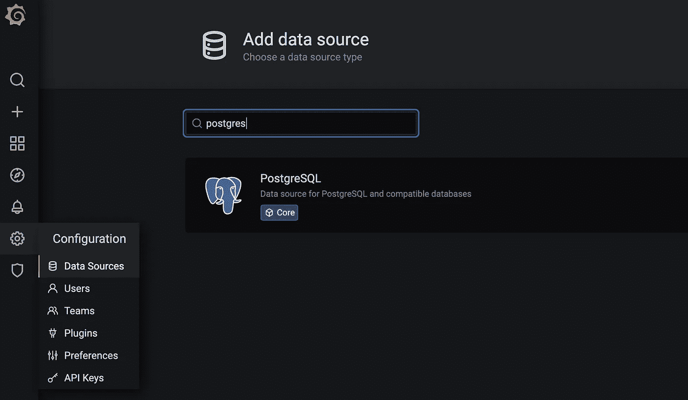
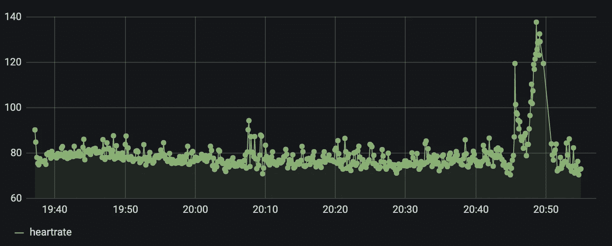

# 利用物联网核心和 QuestDB 传输心率数据

> 原文：<https://levelup.gitconnected.com/streaming-heart-rate-data-with-iot-core-and-questdb-84304069592e>

一个简单物联网系统的端到端演示，用于传输和可视化心率数据。


在 [Unsplash](https://unsplash.com?utm_source=medium&utm_medium=referral) 上由[路易斯·里德](https://unsplash.com/@_louisreed?utm_source=medium&utm_medium=referral)拍摄的照片

由于健身追踪器和智能手表越来越受欢迎，越来越多的人正在密切跟踪他们的生物识别数据，并将物联网融入他们的日常生活。在我搜索 DIY 心率追踪器时，我发现了 Brandon Freitag 和[谷歌代码实验室](https://medium.com/u/87b2115d4438#0)

虽然 Cloud Dataflow 支持对 BigQuery 的流插入，但我想借此机会尝试一下我遇到的一个新的时序数据库，名为 [QuestDB](https://questdb.io/) 。QuestDB 是一个具有 Postgres 兼容性的快速开源时序数据库。网站上的[现场演示](http://try.questdb.io:9000/)在毫秒内查询了超过 16 亿行的 NYC taxi rides 数据集，因此我很高兴尝试一下这个数据库。为了完成端到端的演示，我使用 Grafana 从 QuestDB 中提取数据并将其可视化。


数据管道

# 先决条件

*   NodeJS v14+
*   码头工人
*   [谷歌云账户](https://console.developers.google.com/billing/freetrial?hl=en&pli=1)
*   [gcloud sdk](https://cloud.google.com/sdk/docs/install)
*   *可选* : [*树莓派套装*](https://www.arrow.com/en/research-and-events/articles/codelabs-using-iot-core-to-stream-heart-rate-data)

在本教程中，我们将使用一个 Debian 映像通过 IoT Core 运行模拟心率数据。如果您希望从 Raspberry Pi 发送真实的传感器数据，请购买上面列出的可选套件，并遵循[安装说明](https://codelabs.developers.google.com/codelabs/iotcore-heartrate#6)。

# Google 云设置

为了使用 Cloud IoT Core 和 Cloud Pub/Sub，你需要先创建一个 Google 云平台账号和一个新项目(我的叫做`questdb-iot-demo`)。然后，在 API&服务- >启用 API 和服务- >搜索 API&服务下启用物联网核心、计算引擎和发布/订阅 API:


## 物联网核心设置

物联网核心是谷歌全面管理的物联网服务，有助于安全连接和管理物联网设备。在这个演示中，我们将创建一个名为`heartrate`的注册中心，并发送 MQTT 数据。点击“创建注册表”，根据离你最近的地理区域设置注册表 ID 和区域(对我来说是`us-central1`):


接下来，我们需要配置一个发布/订阅主题来发布设备数据。在“选择一个云发布/订阅主题”下，单击“创建一个主题”，并为其指定主题 ID `heartratedata`:


配置“注册表属性”和“云发布/订阅主题”后，单击“创建”。

## 计算引擎设置

现在是时候添加我们的模拟设备了。为了让我们的设备与物联网核心通信，我们需要添加一个公钥。前往计算引擎->创建。


默认选项(e2-medium、Debian 10 image、us-central1)将适用于我们的模拟器(*注意:如果您选择了* `*us-central1*` 以外的区域，请确保该区域与物联网核心注册表区域相匹配)。一旦虚拟机准备就绪，单击“Connect”下的 SSH 按钮并安装项目代码:

```
# Install git
sudo apt-get update
sudo apt-get install git# Clone project code
git clone [https://github.com/googlecodelabs/iotcore-heartrate](https://github.com/googlecodelabs/iotcore-heartrate)
cd iotcore-heartrate# Install all the core packages
chmod +x initialsoftware.sh
./initialsoftware.sh# Generate the keys
chmod +x generate_keys.sh
./generate_keys.sh# View the keys (highlighting will copy the contents)
cat ../.ssh/ec_public.pem
```

## 物联网设备设置

一旦你有了`ec_public.pem`键，回到物联网核心注册表。在“设备”下，单击“创建设备”。对于设备 ID，输入`raspberryHeartRate`并展开“通信、云日志、认证”下拉菜单:


在身份验证下，将“公钥格式”更改为`ES256`，并从我们的虚拟机或 Raspberry Pi 中粘贴密钥，然后单击“创建”:


## 发布/订阅设置

最后，我们需要为我们的发布/订阅主题创建一个订阅，以提取消息并插入到 QuestDB 中。前往“发布/订阅”并点击我们的`heartratedata`主题。将订阅命名为`questdb`并单击 create。


# QuestDB 设置

此时，我们在 Google Cloud 上拥有了向我们的发布/订阅主题发送数据的一切。现在我们需要编写一些代码来获取这些消息，并将它们插入到 QuestDB 中。让我们从通过 Docker 启动 QuestDB 开始。

```
docker run -p 9000:9000 -p 8812:8812 questdb/questdb
```

上面的命令提取最新的 QuestDB 映像(v5.0.6)并映射控制台 UI 的端口`9000`和 Postgres 操作的端口`8812`。在( [http://127.0.0.1:9000/](http://127.0.0.1:9000/) )打开 QuestDB 控制台，并创建我们的`heart_rate`表:

```
CREATE TABLE heart_rate(sensorID STRING, uniqueID STRING, timecollected TIMESTAMP, heartrate DOUBLE);
```


(*注意:UI 不会自动刷新，因此如果您在 tables 面板上没有看到填充的* `*heart_rate*` *表，请单击表上方的刷新图标。*)

## 发布/订阅到 QuestDB

由于没有针对发布/订阅的本地集成，我们将需要编写一个简单的程序来侦听新的发布/订阅消息，并将数据插入到 QuestDB 中。我使用的是 NodeJS v14.15.4，但是您可以为 Pub/Sub 和 Postgres 使用类似的客户端库来实现相同的目的。

首先，将 gcloud sdk 配置为使用您的 GCP 项目进行身份验证，而无需下载服务帐户(有关更多详细信息，请参见[使用服务帐户的简单 GCP 身份验证](https://medium.com/dev-genius/simple-gcp-authentication-with-service-accounts-6b877c2e2649))。

```
# Set default profile
$ gcloud auth application-default login
```

接下来，创建一个新的 NodeJS 工作区，并安装`@google-cloud/pubsub`和`pg`库。您可以使用下面的代码来侦听 Pub/Sub 并流式传输到 QuestDB。

## 发送数据

最后，我们准备发送模拟数据。切换回计算引擎，并再次 ssh 到虚拟机。发出以下命令，将数据发送到我们的物联网核心设备:

```
$ python heartrateSimulator.py --project_id=questdb-iot-demo --registry_id=heartrate --device_id=raspberryHeartRate --private_key_file=../.ssh/ec_private.pem
```

如果成功，您应该会看到如下日志:

```
...
Publishing message #544: '{"sensorID": "heartrate.raspZero", "heartrate": 72.56881801680139, "uniqueID": "c1ca9656-671f-4fa7-8c03-12fdfb4f422f-heartrate.raspZero", "timecollected": "2018-07-07 20:54:50"}'Publishing message #545: '{"sensorID": "heartrate.raspZero", "heartrate": 72.8324264524384, "uniqueID": "8d6337b7-204f-4209-88c0-46a79d1911bb-heartrate.raspZero", "timecollected": "2018-07-07 20:54:59"}'
Finished.
```

现在运行我们的 NodeJS 代码，我们应该看到 QuestDB 中填充了数据:


# 用 Grafana 可视化数据

虽然 QuestDB 控制台提供了一些现成的默认可视化，但为了模拟将所有指标组合到 Grafana 的更真实的场景，我们将设置一个 Postgres 数据源并可视化我们的心率数据。

下载 Grafana 并使用 admin/admin 登录到[http://localhost:3000/log in](http://localhost:3000/login)

```
$ docker run -p 3000:3000 grafana/grafana
```

在“配置”->“数据源”下，搜索 PostgreSQL。



对于 PostgreSQL 连接，输入以下内容(密码:quest)并保存


最后，让我们创建一个仪表板。创建仪表板并添加以下 SQL 查询:

```
SELECT
  timecollected AS "time",
  heartrate
FROM heart_rate 
ORDER BY time;
```

现在我们来看看心率数据样本:



顺便提一下，可以在 QuestDB 控制台上绘制相同的图表:


此时，我们有了一个设备的端到端系统，可以通过物联网核心安全地发送数据，并将数据传输到 QuestDB。我们可以将这个示例扩展到多个设备，方法是将它们添加到 IoT Core 下，并扩展我们的服务器以使用池化连接来更有效地将数据添加到 QuestDB。在标度上，我们还可以查看平均心率，而不是原始数据点(例如`avg(heartrate) as average_heartrate from heart_rate`)。