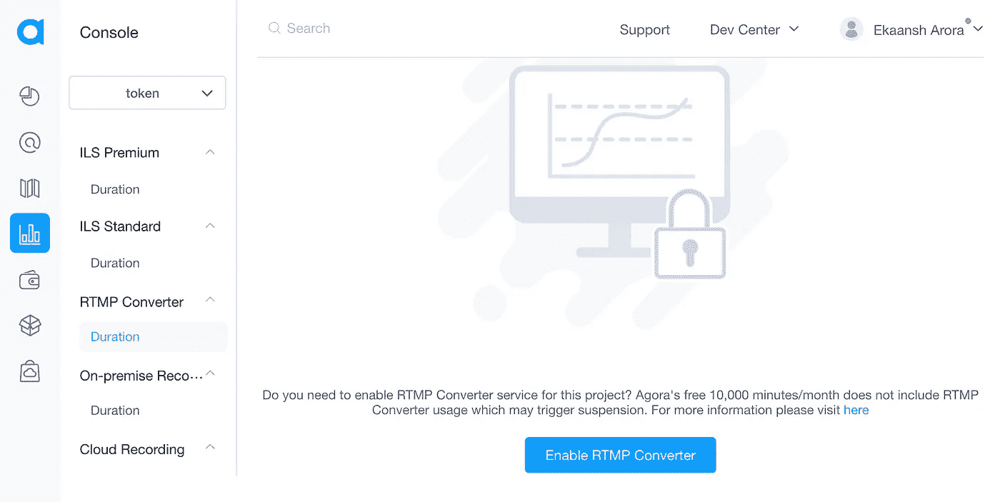

# 使用 Agora 云播放器在您的直播流中播放视频

> 原文：<https://levelup.gitconnected.com/streaming-videos-in-your-livestream-using-the-agora-cloud-player-179199301eec>


在之前的一篇博客文章中，我们讨论了如何使用 Agora 媒体推送服务将我们的直播发布到第三方服务，如 YouTube、脸书或 Twitch。在这篇博文中，我们将在该项目的基础上，使用 Agora Cloud Player 服务在视频通话或直播中向所有用户传输云视频。

# 先决条件

*   一个 Agora 开发者账户(免费，[在这里注册！](https://sso.agora.io/en/signup?utm_source=medium&utm_medium=blog&utm_campaign=streaming-videos-in-your-videocall-or-livestream-using-agora-cloud-player))
*   Node.js LTS 版本
*   对 React 和 Node/Express 的高级理解

# 设置

可以在 [cloudplayer 分支](https://github.com/EkaanshArora/Agora-Web-UIKit-RTMP/tree/cloudplayer)上找到完成的项目。我们将从我们在上一篇博文中构建的项目开始。如果你正在编码，你可以从 GitHub 中克隆我们目前拥有的东西。

```
git clone [https://github.com/EkaanshArora/Agora-Web-UIKit-RTMP.git](https://github.com/EkaanshArora/Agora-Web-UIKit-RTMP.git)
cd Agora-Web-UIKit-RTMP
```

安装依赖项:`npm i`

## 1.启用 RTMP 转换器

在 [Agora 控制台](https://console.agora.io/)中，转到使用选项卡并从下拉菜单中选择您的项目。单击 RTMP 转换器子菜单，并通过单击按钮启用:



## 2.获取客户凭据

转到 [RESTful API 页面](https://console.agora.io/restfulApi)并点击 Add Secret 按钮。将客户 ID 和客户机密复制到文本文件中。我们将使用这些凭证从后端服务调用 Agora Cloud Player 端点。在控制台中，您可以从项目管理选项卡中获取应用 ID。

后端将侦听来自 React 前端的请求。让我们从添加一个按钮向网站发出这个请求开始。

## 3.启用 Agora 云播放器服务

要为您的项目启用 Agora Cloud Player 服务，您需要提供您的应用 ID，通过 [Agora Support](https://agora-ticket.agora.io/) 提出请求。

# 我们目前所拥有的

您可以执行`npm start`来启动本地主机上的 web 服务器。我们将从`./src/App.tsx`文件开始。我们将替换`<RTMP>`组件，添加一个名为`CloudPlayer`的新组件。

我们将通过创建一个新文件来定义`CloudPlayer`组件。

这是一个简单的组件，它呈现一个按钮来从云中传输视频。我们定义了将在下一步构建的`serverUrl`。我们还将定义使用`requestBody`向后端端点发送请求的`playVideo`函数，在这里我们可以定义频道名称、Agora Cloud Player 服务的 UID、RTC 令牌以及我们想要播放的视频的 URL。

> *注意:*视频网址应该是公开可访问的。

# 让我们构建后端服务

我们将使用 Express 构建一个后端服务，该服务将侦听来自网站前端的请求，并使用所需的凭据调用 Agora Cloud Player 端点。你可以在 [GitHub](https://github.com/EkaanshArora/Agora-Cloud-Player-Backend) 上找到代码，带有一个按钮，可以在 readme 中快速部署到 Heroku。

我们将导入库。`Fetch`用于发出 HTTP 请求，`Express`管理服务器，`dotenv`让您使用。env 文件来存储您的凭证，`bodyParser`解析来自传入请求的 JSON 有效负载，`cors`是一个中间件来处理。。。好吧，科尔斯。

我们将定义 Express app 对象并使用所需的中间件。我们将初始化 dotenv 并定义我们的常数。您将需要`.env`文件设置中的客户凭证。我们将对凭证进行编码，以生成一个基本的 auth 头。您可以重命名`.env.example`文件并添加您的详细信息。

```
APP_ID=30a6bc899.............
REST_KEY=58cb3034............
REST_SECRET=93803f1..........
PORT=8080
```

我们将定义一个接受请求和响应的`play`函数。我们将把 access-control-allow-origin 头添加到响应对象中。我们将从请求中获得`channelName`、`uid`、`url`和`token`。如果请求中缺少它们，我们会发送一个`500`错误响应。

然后，我们将为请求定义`headers`和`data`，我们将向 Agora Cloud Player 端点发出请求，如这里的[所述](https://documenter.getpostman.com/view/6319646/SVSLr9AM#66a79ef6-5286-49de-86e2-13400aa744c4)。我们将使用`fetch`等待响应，并将其记录到控制台。并将其返回到前端。

我们将定义一个`ping`函数来确保后端服务器配置正确。接下来，我们将为我们的服务定义路由。我们将对`/play`发送路线使用`play`函数，对`/ping`获取路线使用`ping`函数。我们将使用`listen`方法在定义的端口上监听请求。

这就是我们需要的所有代码。您可以通过执行`node index.js`在本地运行服务。或者你可以使用[这个链接](https://heroku.com/deploy)把它放在 Heroku 上。

# 结论

如果您认为有一些特性可以添加到后端服务中，请随意派生存储库并添加一个拉请求。感谢所有的贡献！

如果您在使用该项目时有任何问题，我邀请您加入 [Agora 开发者 Slack 社区](https://agora.io/en/join-slack)，您可以在`#web-help-me`频道中提问。请随意打开功能请求问题或报告关于 [UIKit Repo](https://github.com/AgoraIO-Community/Web-React-UIKit/issues) 、[项目 repo](https://github.com/EkaanshArora/Agora-Web-UIKit-RTMP) 或[后端 repo](https://github.com/EkaanshArora/Agora-Cloud-Player-Backend) 的错误。