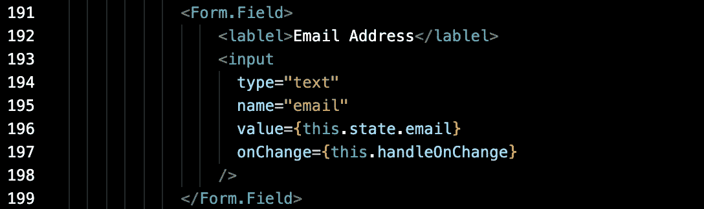
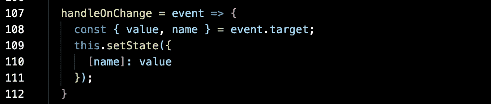

# 在 JavaScript 中处理变更事件时，简化并干燥您的代码

> 原文：<https://levelup.gitconnected.com/streamline-and-dry-your-code-when-handling-change-events-in-javascript-826571c1a849>

我们都遇到过这样的情况:出于某种原因，我们需要在网页上提供大量的输入字段，但却害怕编写代码，因为我们需要跟踪所有的状态变化。在 React 中，状态使我们能够在元素的值发生变化时跟踪它们，并且它允许有效地呈现这些值，而不必一次又一次地从后端检索它们。

在输入或编辑页面的简单情况下，我们使用状态来跟踪用户在数据字段中输入了什么值。例如，如果我们有一个电子邮件地址的输入字段，我们通常定义一个函数来处理 onChange 事件。

在 handleOnChange 函数中，我们通常会这样做:

this . setstate({ email:event . target . value })

当然，假设我们已经在组件中定义并初始化了状态 email。如果有三个输入字段中的两个，我们需要通过状态跟踪输入值，这通常是非常简单的。编写几个不同的 handleOnChange 函数来处理每个输入字段并不太麻烦。然而，如果我们在组件中需要 10、15 甚至 20 个字段呢？编写 15 个 handleOnChange 函数不仅重复，而且很容易出错，因为复制和粘贴无疑会导致一些遗漏的代码更改。即使我们编写的所有代码都没有错误，我们的代码也会被一堆基本上做同样事情的函数弄得臃肿不堪——为输入字段设置状态。

仅仅对它们进行编码似乎是微不足道的，但是作为优秀的开发人员，我们也应该考虑可读性和清晰性。这是我们应该做的。

不管我们有多少个输入字段，一个函数就可以处理所有的输入字段！

有两个关键项目使上面的代码工作。首先，它是元素中的名称定义。在我们的例子中，我们有一个名为“email”的输入字段。如果我们有其他字段，它们可能是“fieldA”、“fieldX”、“fooBar”或其他任何名称。其次，我们需要用相同的名称定义状态。

State = {email:' '，fieldA:' '，fieldB:' '，fooBar: ''}

现在让我们来看看当有人在每个字段中键入一些内容时，该函数是如何工作的。如果用户在 fieldX 中键入“a ”,就会触发 handleOnChange 函数。事件目标将包含字段的名称和输入的值。const 定义只是将目标解构为我们关心的两个东西——名称和值。“名称”将包含“字段 x”，而“值”将包含“a”。所以在执行 setState 时，由[name]设置的对象键是“fieldX”，对象值是“a”。如果我们用自己的 onChange 函数对所有字段进行编码，我们将会对 this . setstate({ fieldX:event . target . value })进行编码。相反，我们现在有了一个动态模板，我们根据用户输入的字段使用不同的状态对象键来执行这个模板。

瞧啊。一个函数来统治他们所有人！